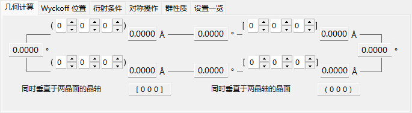
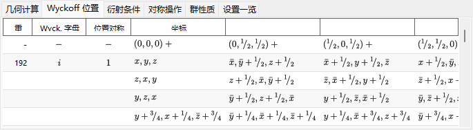
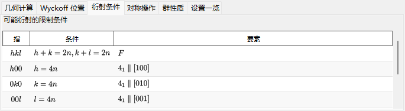
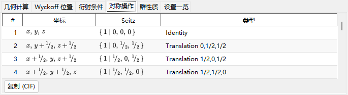
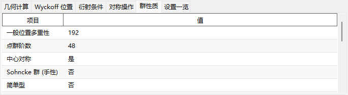
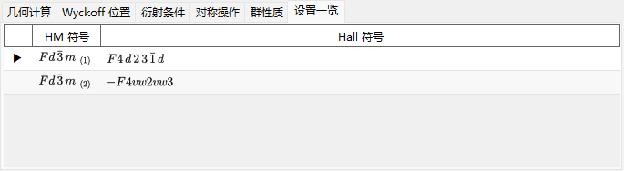

# 对称性信息

**对称性信息**（Symmetry Information）显示所选晶体空间群对称性的详细信息，并按照 *International Tables for Crystallography* Vol. A 的样式，额外绘制对称元素与一般位置的示意图。

该窗口分为空间群标识区（左上）、带选项卡的计算/表格区（右上）以及两幅示意图（底部）。

!!! tip "对称性理论（附录 A4）"
    Hermann–Mauguin/Hall/Schoenflies 符号究竟编码了什么、**群性质** 选项卡上的群论分类（中心对称、Sohncke、简单型、极性、…）、下方对称元素/一般位置示意图的含义，以及 **群关系...** 所展示的群-子群关系，都在 **[附录 A4. 对称性与空间群](appendix/a4-symmetry-space-groups/index.md)** 中有详细说明。

---

## 键盘与鼠标快捷键

此窗口没有特殊的按键或鼠标组合。<kbd>F1</kbd> 打开本手册页面，两个 **复制** 按钮将对称元素示意图和一般位置示意图放入剪贴板（矢量 **emf** 或位图 **bmp**，由 **复制格式** 选择）。

→ 参见 **[21. 键盘与鼠标快捷键](21-shortcuts.md)**，一览各窗口的快捷键。

---

## 空间群标识

左上面板会列出当前空间群的以下信息：

- **序号**（1–230）以及设置索引
- **晶系**
- **点群** : Hermann–Mauguin（HM）与 Schoenflies（SF）符号
- **空间群** : HM 短符号、HM 全符号、SF 符号以及 **Hall 符号**

---

## 几何计算

输入两个晶面 \((h_1, k_1, l_1)\)、\((h_2, k_2, l_2)\) 或两个方向指数 \([u_1, v_1, w_1]\)、\([u_2, v_2, w_2]\)，即可得到：

- 每个晶面的面间距 / 每个晶轴的长度，
- 两个晶面之间（或两个晶轴之间）的夹角，
- **同时垂直于两晶面的方向指数** 以及 **同时垂直于两晶轴的晶面指数**。

这些计算均基于当前晶胞的度量。

---

## Wyckoff 位置

列出每一个 Wyckoff 位置及其多重度、Wyckoff 字母、位置对称性，以及它是一般位置还是特殊位置。对于带心点阵，点阵平移矢量会显示在表头行中。

---

## 衍射条件

由点阵带心以及滑移/螺旋对称操作产生的反射条件。

---

## 对称操作

以坐标三元组、Seitz 符号和通俗的几何类型（如 *"3-fold rotation"*、*"c-glide plane"*、*"screw axis"*）列出一般位置的全部对称操作（点阵带心平移已展开计入）。**复制 (CIF)** 把完整列表作为 CIF 的 `_space_group_symop_operation_xyz` 循环复制到剪贴板。

→ 这三种记法的读法参见 **[附录 A4.1](appendix/a4-symmetry-space-groups/symbols-and-diagrams.md#对称操作对称操作选项卡)**。

---

## 群性质

报告当前空间群的群论分类（一般位置多重性、点群阶数、中心对称、Sohncke、简单型、极性方向、对映体伙伴、晶族/格子系/布拉维型、算术晶类、Patterson 对称），以及哪些宏观物性（热电/铁电、压电、二次谐波发生、旋光性）为该对称性所允许。

→ 各术语的含义参见 **[附录 A4.1](appendix/a4-symmetry-space-groups/symbols-and-diagrams.md#群论分类群性质选项卡)**。

---

## 设置一览

参考性地列出与当前空间群共享同一 IT 编号的所有收录原点/轴设置选择，各附其 HM 与 Hall 符号；当前显示的设置会被标记。选中某行不会改变晶体。

---

## 对称元素与一般位置示意图

底部的两个面板按照 *International Tables for Crystallography* Vol. A 的记号，重现该空间群的对称示意图。

- **对称元素（左）**：旋转/螺旋轴、镜面/滑移面以及反演中心/旋转反演点均以惯用的图形符号绘制。
  - 对于立方晶系的 \(F\) 点阵，仅显示晶胞的八分之一（仅左上象限）。
  - 这些对称元素也可以直接绘制到[结构查看器](5-structure-viewer.md)的三维模型上。
- **一般位置（右）**：一般等效位置以圆圈绘制（逗号表示镜像），并标注其分数坐标。
  - 仅对立方晶系，辅助线会连接由三重旋转轴相互关联的三个圆圈。

示意图下方的控件：

- **方向**（`a` / `b` / `c`） : 选择用于投影的晶轴。
- **复制** : 将每幅示意图按 **复制格式** 所选的格式（矢量 **emf** / 位图 **bmp**）复制到剪贴板；emf 可在 PowerPoint 中取消组合并编辑。
- **群关系...**（Group Relations...）打开浏览当前空间群极大子群/极小超群关系的浏览器。其读法参见[附录 A4.2](appendix/a4-symmetry-space-groups/group-subgroup-relations.md)。

---

## 另请参阅

- [晶体数据库](1-crystal-database.md)
- [结构查看器](5-structure-viewer.md)
- [极射赤平投影](6-stereonet.md)
- [旋转几何](4-rotation-geometry.md)
- [主窗口](0-main-window.md)
- [附录 A4. 对称性与空间群](appendix/a4-symmetry-space-groups/index.md) — 本页每个选项卡与示意图背后的晶体学与群论背景。
