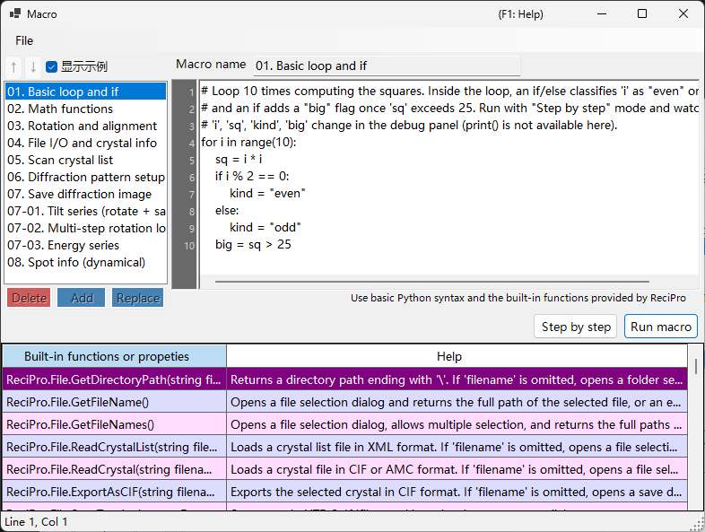

# 宏

ReciPro 内置了一个基于 **IronPython** 的宏系统，可通过脚本自动执行晶体操作、衍射模拟和图像模拟。



上面的截图开启了 **显示示例**，因此显示出内置的示例宏。宏列表位于左侧，代码编辑器位于右侧，底部是内置函数帮助表。

---

## 键盘与鼠标快捷键

| 快捷键 | 操作 |
|----------|--------|
| <kbd>F1</kbd> | 打开在线手册的此页面 |
| <kbd>CTRL</kbd>+<kbd>S</kbd> | 将编辑器中的文本保存回所选的宏列表条目 |
| <kbd>F10</kbd> | 前进一步（单步执行期间） |
| 双击函数帮助列表中的某一行 | 在光标处插入该函数的签名 |
| 将 `.mcr` 文件拖放到窗口上 | 将其加载到编辑器中 |

**Run**、**Step** 和 **Stop** 都是按钮（没有键盘加速键）。

→ 请参阅 **[21. 键盘与鼠标快捷键](../21-shortcuts.md)**，一览所有窗口的快捷键。

---

## 概述

宏使用 Python 语法编写。借助 ReciPro 的内置类和函数，你可以通过编程方式执行与 GUI 相同的各种操作。

- **语言**：Python 3（IronPython 3.4）
- **存储**：以压缩二进制形式保存在 Windows 注册表中（在多次会话间保持）
- **访问方式**：单击主窗口上的宏按钮即可打开宏编辑器

---

## 编辑器窗口

宏编辑器有四个主要区域：

| 区域 | 用途 |
|------|---------|
| **宏列表**（左侧） | 已存储的宏。`Add` 追加一个新宏，`Replace` 覆盖所选的宏，`Delete` 将其删除。Up/Down 用于重新排序。 |
| **名称字段**（顶部） | 正在编辑的宏的标识符。 |
| **代码区域**（右侧） | Python 代码编辑器，带有行号栏、自动缩进和语法帮助弹出框。 |
| **内置函数表**（底部） | ReciPro 提供的内置函数/属性列表，每项都附有帮助说明。编写代码时的参考。 |
| **状态栏**（最底部） | 以 `Line N, Col M` 的形式显示当前光标位置。 |
| **调试面板**（单步执行期间可见） | 列出当前行的局部变量。 |

当存在未保存的修改时，标题栏会显示 **`Macro*`**（带星号），在执行 Add / Replace / <kbd>CTRL</kbd>+<kbd>S</kbd> 之后则恢复为 **`Macro`**。

### 示例宏

开启 **显示示例**（左上角）会用内置的示例宏临时替换你的宏列表（基本循环与条件判断、数学函数、旋转/取向对齐、遍历晶体列表、衍射/图像模拟、倾斜/能量系列、衍射点信息等）。这些示例为只读，并以当前 UI 语言显示；可用于学习，或作为复制的起点。关闭后会恢复你自己的宏。

---

## 编辑功能

- **自动缩进**：当你按下 <kbd>ENTER</kbd> 时，下一行会继承当前行的前导空白。如果该行以 `:` 结尾（位于 `def`/`if`/`for`/等之后），则会自动添加一级额外缩进（4 个空格）。
- **智能退格**：在前导空白内，<kbd>BACKSPACE</kbd> 会删除一整级缩进（4 个空格），而不是单个字符。
- **<kbd>TAB</kbd> / <kbd>SHIFT</kbd>+<kbd>TAB</kbd>**：
  - 无选中内容时：在光标处插入 / 删除一级缩进。
  - 多行选中时：一次性对所有选中行进行缩进 / 取消缩进。
- **自动补全**：在输入时，会弹出列出匹配的函数名和语言关键字。方向键用于导航，<kbd>ENTER</kbd> 或 <kbd>TAB</kbd> 确认，<kbd>ESC</kbd> 取消。
- **工具提示帮助**：将鼠标悬停在选中的自动补全条目上，会显示其文档说明。

### 键盘快捷键

| 快捷键 | 操作 |
|----------|--------|
| <kbd>CTRL</kbd>+<kbd>S</kbd> | 将当前代码就地保存到所选的宏条目中 |
| <kbd>F10</kbd> | 单步执行到下一行（单步执行期间） |
| <kbd>ENTER</kbd> | 插入换行并自动缩进 |
| <kbd>TAB</kbd> / <kbd>SHIFT</kbd>+<kbd>TAB</kbd> | 缩进 / 取消缩进 |
| <kbd>BACKSPACE</kbd> | 若位于前导空白内，则删除一级缩进 |
| <kbd>CTRL</kbd>+<kbd>↑</kbd> / <kbd>CTRL</kbd>+<kbd>↓</kbd> | 不适用 —— 请使用 Up/Down 按钮来重新排序宏 |

---

## 运行宏

两种运行模式：

- **Run macro**：将代码执行到结束。出错时会弹出一个对话框显示 Python 回溯，并在编辑器中高亮出错的行。
- **Step by step**：在每一行之前暂停。调试面板会显示局部变量。使用 <kbd>F10</kbd>（或 **Next step (F10)** 按钮）前进，或使用 **Stop** 中止。

**Stop** 仅在 Step 模式下有效（标准的 Run macro 执行无法中断，因为 IronPython 不遵循 `CancellationToken`，并且所有操作都在 UI 线程上运行）。

---

## Python 语言支持

此宏环境为 **IronPython 3.4**。并非所有 Python 特性在这里都有意义。

### 预先导入

- **`math`** 在启动时即被导入。可直接使用 `math.sqrt(x)`、`math.sin(x)`、`math.pi`、`math.radians(deg)` 等。

### 可用

- 控制流：`if`/`elif`/`else`、`for`、`while`、`def`、`class`、`return`、`try`/`except`/`finally`、`pass`、`break`、`continue`、`lambda`
- 字面量：`True`、`False`、`None`
- 内置函数：`len`、`range`、`abs`、`min`、`max`、`sum`、`sorted`、`enumerate`、`zip`、`int`、`float`、`str`、`list`、`dict`、`tuple`、`type`、`isinstance`
- 纯 Python 实现的标准库模块：`random`、`datetime`、`time`、`re`、`json`、`itertools`、`functools`、`collections`

这些基础内容已预先注册到自动补全弹出框中，因此你只需输入前几个字母即可发现它们。

### 不可用

- **`print()`**：没有控制台窗口；输出无处可去。请使用 **Step by step** 并查看调试面板来检查取值。
- **`input()`**：没有 stdin。
- **文件 I/O**（`open`、`with open`）：不适用于宏。请改用 `ReciPro.File.*` 辅助函数。
- **C 扩展包**：`numpy`、`scipy`、`pandas`、`matplotlib` —— 与 IronPython 不兼容。

---

## API 访问

ReciPro 宏 API 在顶层名称 **`ReciPro`** 下公开。每个内置类都是 `ReciPro` 的一个字段：

```python
ReciPro.File.*         # File I/O helpers
ReciPro.Crystal.*      # Currently selected crystal
ReciPro.CrystalList.*  # Manage the crystal list
ReciPro.Dir.*          # Crystal orientation (Euler, zone-axis, rotation)
ReciPro.DifSim.*       # Diffraction simulator
ReciPro.HRTEM.*        # HRTEM simulation
ReciPro.STEM.*         # STEM simulation
ReciPro.Potential.*    # Potential simulation
ReciPro.Sleep(ms)      # Pause execution (milliseconds)
```

自动补全弹出框始终显示完整的 `ReciPro.Class.Member` 形式并按原样插入，因此你很少需要手动输入前缀。

完整的 API 参考请参阅 [20.1. 内置函数](1-built-in-functions.md)。

---

## 错误消息

当宏执行失败时，对话框会以标准格式显示 Python 回溯：

```
Traceback (most recent call last):
  File "<string>", line 5, in <module>
NameError: name 'abc' is not defined
```

编辑器会自动选中回溯中报告的行（最内层的栈帧），以便你立即修复问题。语法错误也会在执行开始之前报告，并附带行号。

---

## 另请参阅

- [20.1. 内置函数](1-built-in-functions.md)
- [20.2. 示例](2-examples.md)
