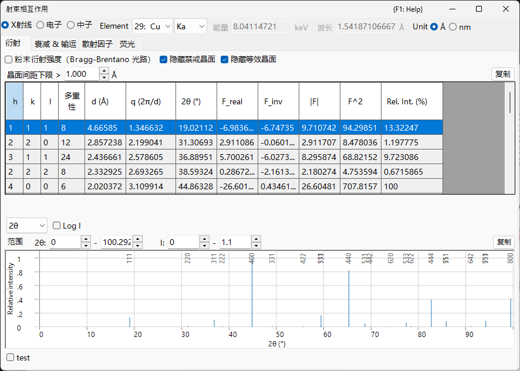

# 射束相互作用

**射束相互作用** 描述所选晶体如何与 **X 射线、电子或中子** 入射束发生相互作用。对于一种选定的辐射，它计算允许的反射及其结构因子、射束在材料中的衰减与输运、各元素的原子散射因子，以及（对于 X 射线）特征荧光线。在顶部切换辐射类型会重新计算所有内容，因此可以将同一晶体跨衍射与光谱技术进行比较。

入射束在窗口顶部的横栏中选择；其下方的四个选项卡 — **Reflections**、**Attenuations & Transport**、**Scattering factors** 和 **Fluorescence** — 显示相互作用的不同方面。下面每个选项卡小节都展示该选项卡在 **X-ray / Electron / Neutron** 各射束下的情形（请使用每幅图中的选项卡）；其内容随射束而显著变化。

!!! tip "固体物理背景（附录 A2）"
    这四个选项卡背后的散射与固体物理 — 原子散射因子、结构因子、射束的衰减与输运以及荧光 — 在 **[附录 A2. 射束相互作用（固体物理背景）](appendix/a2-beam-interaction/index.md)** 中进行了说明。

!!! note "X 射线数据与捆绑的 xraylib 库"
    许多 X 射线量（反常色散 $f'/f''$、$F(q)+S(q)$ 散射分解、质量衰减的 光电 / Rayleigh / Compton 分解、吸收边跳跃以及荧光产额）是用捆绑的 **[xraylib](https://github.com/tschoonj/xraylib)** 库计算的。如果 xraylib 不可用，ReciPro 会回退到其内部表（仅光电吸收衰减、仅特征线能量），受影响的单元格显示 **N/A**。每个表的 **source** 行说明使用了哪个数据集。

---

## 键盘与鼠标快捷键

此窗口没有特殊的组合键。<kbd>F1</kbd> 打开本手册页。在 **Scattering factors** 选项卡上，可以 **拖动** 垂直光标线以读出该位置处每个元素的散射因子，并且每个选项卡都有一个 **Copy** 按钮，可将其表格导出为可粘贴到电子表格的文本。

→ 请参阅 **[21. 键盘与鼠标快捷键](21-shortcuts.md)** 以一览所有窗口。

---

## 射束与波长 {#reflections-tab}

顶部横栏是与其他模拟器共享的 **Wave Length Control**。

- **X-ray / Electron / Neutron** : 原子散射因子与相互作用物理因入射束类型而异，因此在此切换。
- 对于 **X-ray**，选择 **Element**（阳极材料）和特征线（Kα 等）会自动设定该特征 X 射线的波长。
- **Energy (keV)** 与 **Wavelength (Å)** 相互关联；设定其一会更新另一个，二者都决定 **Reflections** 表中使用的 2θ。
- **Unit (Å / nm)** 切换用于面间距及类似量的长度单位。

所选射束还决定哪些选项卡和曲线有意义：

| 射束 | Reflections | Attenuations & Transport | Scattering factors | Fluorescence |
|------|------|------|------|------|
| **X-ray** | 含反常色散的结构因子 | µ/ρ、µ、透射 + 吸收边（随能量） | $f(s)$ 或 $F(q)+S(q)$ | 特征线 + EDX 谱线棒 |
| **Electron** | 电子结构因子 | σ、MFP、\|dE/ds\|、IMFP、射程（随能量） | Peng / Kirkland / 8-Gaussians | —（隐藏） |
| **Neutron** | 核结构因子 | 散射长度与截面（无能量曲线） | 散射长度（无 *s* 依赖） | —（隐藏） |

**Fluorescence** 选项卡仅适用于 X 射线，在电子和中子射束下会消失。对于中子，**Attenuations & Transport** 和 **Scattering factors** 中随能量变化的图被元素表所取代，因为核散射长度不依赖于散射角或能量。

---

## Reflections 选项卡

列出晶体允许的晶面（反射）以及每个反射的 **结构因子** 和衍射强度。对于 X 射线，结构因子现在包含当前能量下的 **反常色散** 项 $f'/f''$，因此在吸收边附近 `F_inv`（虚部）通常不为零。每种射束的布局相同；只有结构因子值和每个反射的 2θ 会变化。

=== "X-ray"
    

=== "Electron"
    

=== "Neutron"
    

**Options**

- **Powder Diffraction Intensities (Bragg-Brentano Optics)** : 将相对强度计算为粉末衍射（Bragg–Brentano）强度，包含多重度和 Lorentz–偏振因子。关闭时显示结构因子强度。启用它还会强制开启 *Hide equivalent planes* 和 *Hide prohibited planes*。
- **Hide equivalent planes** : 将晶体学等价的晶面合并为单一条目。
- **Hide prohibited planes** : 排除其强度因消光规则为零的晶面。
- **d-Spacing Cutoff >** : 排除面间距小于此值的反射（长度单位遵循 **Unit** 的选择）。

每一行是一个反射（或一组对称等价晶面）：

| 列 | 含义 |
|------|------|
| **h, k, l** | 米勒指数 |
| **Multi.** | 多重度（对称等价晶面的数量） |
| **d (Å)** | 面间距 |
| **q (2π/d)** | 散射矢量的大小 |
| **2θ (°)** | 所选波长的衍射角 |
| **F_real** | 结构因子的实部 |
| **F_inv** | 结构因子的虚部（在 X 射线反常色散下不为零） |
| **\|F\|** | 结构因子振幅（$= \sqrt{F_\text{real}^2 + F_\text{inv}^2}$） |
| **F^2** | 结构因子强度（$\lvert F\rvert^2$） |
| **Rel. Int. (%)** | 相对强度，以最强反射设为 100 |

**衍射峰图。** 表格下方将相同的反射绘制为谱线棒图，最强的峰以其 *hkl* 标注。

- 横轴选择器在 **2θ**（散射角，单位为度）、**d**（晶面间距）和 **Q**（$= 4\pi\sin\theta/\lambda$，散射矢量 / 动量转移）之间选择。这三个选项描述相同的反射；只有横向标度改变。
- **Log I** 在线性与对数之间切换强度轴。衍射强度跨越多个数量级，因此对数标度会拉伸底部，以揭示线性标度下被压平在基线上的弱峰。
- **Range** 框设定所绘制的横向范围和强度范围。

---

## Attenuations & Transport 选项卡

射束穿透材料的深度以及它如何损失能量。内容取决于射束。

=== "X-ray"
    

=== "Electron"
    

=== "Neutron"
    

### X-ray

单选按钮选择相对于光子能量（1–60 keV，对数轴）所绘制的系数：

- **µ/ρ** — **质量** 衰减系数（cm²/g）：材料每克对 X 射线的去除强度，与堆积密度无关（这是参考表中给出的值）。图中显示 **total** 以及其 **photo**、**Rayleigh** 和 **Compton** 分量。
- **µ** — **线** 衰减系数 $\mu = (\mu/\rho)\cdot\rho$（cm⁻¹）：实际密度下材料每厘米的衰减。透射强度遵循 $I = I_0\,e^{-\mu t}$，而 $1/\mu$ 是强度降至约 37 %（1/e）的距离。
- **T %** — 以百分比表示的 **透射** $T = e^{-\mu t}$，对应于 **Thickness t** 框（µm）中设定的样品厚度 **t**。100 % = 透明，0 % = 完全阻挡；用它来判断在当前能量下合理的样品厚度。

垂直线标记当前能量和每个元素的 **吸收边**。左侧的标量表在当前能量下列出：**µ/ρ (total)**、**µ (linear)**、**Attenuation length**（$1/\mu$）、**HVL**（半值层，$\ln 2/\mu$）、厚度 *t* 下的 **Transmission**、**µ_en/ρ**（质量能量吸收系数）、X 射线折射率减量 **δ** 和 **β**（$n = 1-\delta+i\beta$）、全外反射的 **θc (critical)** 角，以及实部 **X-ray SLD**（散射长度密度）。下方的表列出每个元素的 **K** 和 **L3** 吸收 **edge** 能量及其 **Jump** 比。

### Electron

量选择器选择相对于射束能量（1–30 keV）所绘制的内容：

- **All (normalized)** — 叠加下面三条曲线，每条都按其自身最大值重新缩放，以便在一张图上比较形状（绝对值从表中读取）。
- **σ elastic (nm²)** — 弹性散射截面：单个原子使电子偏转的可能性。
- **Elastic MFP (nm)** — 平均自由程：电子在两次弹性散射事件之间所走的平均距离。
- **|dE/ds| (keV/nm)** — 阻止本领的大小：电子每走一纳米损失的能量。
- **IMFP (nm)** — 非弹性平均自由程：损失能量的碰撞之间的平均距离。
- **Range CSDA (µm)** — 电子停下来之前所走的总路径长度。

标量表列出电子 **wavelength**、**σ elastic**、**Elastic MFP**、**|dE/ds|**、**IMFP**、**Plasma E** 和平均激发能 **J**、两个电子 **range**（Kanaya–Okayama 穿透深度估计和 CSDA 积分路径长度），以及平均 **Z, A**。逐元素表给出每个元素的原子分数和弹性截面 σ。弹性截面使用 **NIST Mott** 数据（50 eV–36 keV），在 36 keV 以上回退到 **screened Rutherford**。

### Neutron {#scattering-factors-tab}

中子相互作用由核截面而非随能量变化的曲线决定，因此此选项卡仅显示表格。标量表列出平均相干散射长度 **b̄**、**Coherent SLD**、平均后的 相干 / 非相干 / 吸收 / 总 截面（**σ̄_coh**、**σ̄_incoh**、**σ̄_abs**、**σ̄_total**）、宏观总截面 **Σ_total** 及相应的 **attenuation length**。吸收截面在当前波长下用 1/v 定律计算；此定律不成立的核素（Cd、Sm、Eu、Gd 共振吸收体）会被标记。逐元素表列出 **b_coh**、**σ_coh** 和原子分数。

---

## Scattering factors 选项卡 {#fluorescence-tab}

每种组成元素的原子散射因子，相对于 $s = \sin\theta/\lambda$（Å⁻¹）绘制。每个元素以其自身的颜色绘制，可以拖动 **垂直光标线** 将该位置处每个元素的散射因子读入左侧的表中。

=== "X-ray"
    

=== "Electron"
    

=== "Neutron"
    

- **X-ray** 提供两种 **Model** 模式：**f(s)** 绘制常规的 X 射线原子散射因子（以电子为单位）；**F(q)+S(q)** 绘制 Rayleigh **相干** 形状因子 $F(q)$ 以及 Compton **非相干** 散射函数 $S(q)$（来自 xraylib）。该表还列出当前能量下的反常色散项 **f'(E)** 和 **f''(E)**。
- **Electron** 提供电子散射因子的三种参数化：**Peng**、**Kirkland** 和 **8-Gaussians**。表中显示 $f_e(s)$（nm）以及产生它的 **model**。
- **Neutron** 散射长度不依赖于 $s$，因此不绘制曲线；表中列出每个元素的相干散射长度 **b_coh** 及其相干 / 非相干截面。
- **Debye-Waller** 使用每个原子的各向同性位移参数，将每个因子乘以热阻尼 $e^{-B s^2}$。

---

## Fluorescence 选项卡

对于 X 射线束，显示样品的特征 **荧光** 发射。（此选项卡在电子和中子射束下隐藏。）

**EDX emission lines** 图将每个元素的特征线（Kα1、Kα2、Kβ1、Lα1、Lα2、Lβ1）绘制为位于其光子能量处的谱线棒，高度正比于 原子分数 × 辐射率 × 荧光产额（一种定性的 EDX 风格预览；未对激发截面和探测器效率建模）。下方的表逐线列出元素、线名、能量 **E keV**、相对强度 **Rel.I** 以及荧光产额 **ω**。标量表报告每个元素的 K 壳层产额 **ω_K** 以及谱中的 **strongest line**。

---

## 复制到剪贴板

每个选项卡都有一个 **Copy** 按钮，将其表格作为文本复制到剪贴板，可粘贴到诸如 Excel 之类的电子表格中。

---

## 另请参阅

- [晶体数据库](1-crystal-database.md) — 定义要计算其相互作用的晶体。
- [衍射模拟器](7-diffraction-simulator/index.md) — 使用结构因子模拟衍射图样。
- [附录 A2. 射束相互作用（固体物理背景）](appendix/a2-beam-interaction/index.md) — 每个选项卡背后的散射与固体物理。
