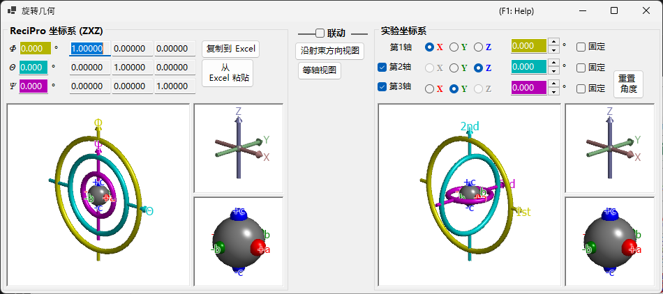

# 旋转几何

此窗口将晶体的旋转状态表示为 3×3 矩阵，并在不同的欧拉坐标系之间进行转换。

ReciPro 使用三个欧拉角 — **Ψ**、**θ** 和 **Φ** — 按 **Z–X–Z** 顺序应用。然而，此约定不一定与您实际仪器的测角仪轴一致。**旋转几何** 窗口允许您将 ReciPro 的欧拉角转换到任意定义的坐标系，从而支持实验室中的测角仪调整。

---

## 键盘和鼠标快捷键

所有六个 3D 视图（ReciPro 与实验测角仪 / 坐标轴 / 对象面板）都是**联动**的 — 旋转其中任意一个，六个视图会一起旋转。它们共享 ReciPro 标准的 [OpenGL 视图导航](21-shortcuts.md)。

| 快捷键 | 操作 |
|----------|--------|
| <kbd>F1</kbd> | 打开在线手册的此页面 |
| 在视图中左键拖动 | 旋转模型（所有六个视图一起旋转） |
| 鼠标滚轮，或右键上下拖动 | 缩放（大型测角仪视图） |
| 中键拖动 | 平移（大型测角仪视图） |
| <kbd>CTRL</kbd> + 右键上下拖动 | 更改相机距离（仅透视模式） |
| <kbd>CTRL</kbd> + 右键双击 | 切换正交 / 透视投影 |

较小的 *Axes* 和 *Objects* 视图禁用了缩放和平移。除 <kbd>F1</kbd> 外没有其他键盘快捷键。

---

## ReciPro 坐标系 (ZXZ)

窗口的上半部分以 "ReciPro 坐标系" 显示旋转状态。

- **Φ, θ, Ψ** 值与主窗口中设置的欧拉角同步。
- **旋转矩阵** 显示对应于当前旋转状态的 3×3 矩阵。

### Φ, θ, Ψ (Z–X–Z 欧拉角)

晶体取向通过按以下顺序应用的三个旋转来参数化：

1. **Φ** — 第一次绕 **Z** 轴旋转。
2. **θ** — 绕一次旋转后参考系的 **X** 轴旋转。
3. **Ψ** — 第二次绕两次旋转后参考系的 **Z** 轴旋转。

每个数值框都可编辑；在此处更改值会更新主窗口以及每个联动的模拟器。

### 旋转矩阵

由当前 (Φ, θ, Ψ) 生成的 3 × 3 矩阵。使用 **复制到 Excel** / **从 Excel 粘贴** 可将矩阵通过电子表格往返传输。

### OpenGL 窗口

3D 视图使用三个彩色圆环（甜甜圈）显示当前旋转：

| 颜色 | 欧拉角 | 测角仪层级 |
|--------|------------|-----------------|
| **黄色** | Φ | 第 1（上）轴 |
| **浅蓝色** | θ | 第 2（中）轴 |
| **粉色** | Ψ | 第 3（下）轴 |

**红色**、**绿色** 和 **蓝色** 箭头表示实空间笛卡尔坐标中的 X、Y、Z 轴。它们与主窗口中显示的晶轴 *不* 相同。

中心的灰色球体表示样品；红 / 绿 / 蓝球体显示对象相对于其初始取向的旋转情况（当 Φ = θ = Ψ = 0 时，它们分别与 +X、+Y、+Z 对齐）。

> **注意**：在 OpenGL 窗口中拖动只会改变此视图的 *投影方向*，而不是晶体取向本身。要旋转晶体，请使用主窗口。

### 按钮

| 按钮 | 操作 |
|--------|--------|
| 复制到 Excel | 以制表符分隔格式复制 3×3 旋转矩阵 |
| 从 Excel 粘贴 | 从剪贴板设置旋转矩阵（制表符分隔的 3×3） |
| 沿射束方向视图 | 匹配主窗口的投影（Z 轴垂直于屏幕） |
| 等轴视图 | 切换到等轴测投影 |

---

## 实验坐标系

下半部分在一组任意的旋转轴上定义欧拉角，并读取 / 设置测角仪状态。这称为 **实验坐标系**。

### 第 1、第 2、第 3 轴

为每个层级（上、中、下）从 **±X**、**±Y** 和 **±Z** 中选择测角仪的旋转轴。图形会相应更新。

每个轴的欧拉角显示在相应的彩色文本框（黄色、浅蓝色、粉色）中。您也可以直接输入数值。

---

## 联动

当勾选 **联动** 时，ReciPro 坐标系与实验坐标系耦合在一起：它们的欧拉角会被调整，使得对象取向在两个系统之间保持一致。

### 示例工作流程

1. 在实验室中，设置测角仪使晶体的 *a* 轴与 X 射线入射方向对齐，*b* 轴水平。
2. 在实验坐标系中输入实验室测角仪的欧拉角。
3. 在主窗口中旋转晶体，使 *a* 轴朝向屏幕法线，*b* 轴朝向水平方向。
4. 勾选 **联动** — 现在，每当您在主窗口中将晶体指向不同取向时，所需的测角仪角度会自动显示。

---

## 另请参阅

- [主窗口](0-main-window.md)
- [极射赤平投影](6-stereonet.md)
- [基本坐标系与晶体取向](appendix/a1-coordinate-system/1-orientation.md)
- [键盘和鼠标快捷键](21-shortcuts.md)
