# 结构查看器

**结构查看器** 使用 OpenGL 将选定晶体的结构绘制为三维图像。

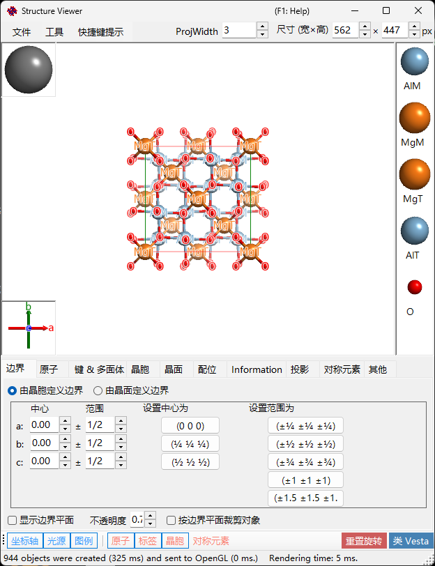

---

## 键盘和鼠标快捷键

该窗口包含一个主三维视图，以及两个小部件——**晶体轴** 框（左下角）和 **光源方向** 框（左上角）——它们对左键拖动的响应各不相同。主视图使用 ReciPro 的标准 [OpenGL 视图导航](21-shortcuts.md)。

| 快捷键 | 操作 |
|----------|--------|
| <kbd>F1</kbd> | 打开本页在线手册 |
| <kbd>CTRL</kbd>+<kbd>SHIFT</kbd>+<kbd>C</kbd> | 将渲染的图像复制到剪贴板 |
| 在主视图中左键拖动 | 旋转模型 |
| 左键双击某个原子 | 显示其坐标、最近邻距离和键角 |
| 右键向上/向下拖动，或滚动鼠标滚轮 | 缩放 |
| 中键拖动 | 平移 |
| <kbd>CTRL</kbd> + 右键向上/向下拖动 | 更改相机距离（仅透视模式） |
| <kbd>CTRL</kbd> + 右键双击 | 在正交/透视投影之间切换 |
| 拖动 **晶体轴** 小部件 | 旋转模型（无平面内自旋） |
| 拖动 **光源** 小部件 | 更改照明方向 |

来自[主窗口](0-main-window.md#keyboard-mouse-shortcuts)的应用程序级 <kbd>CTRL</kbd>+<kbd>SHIFT</kbd> 快捷键在此窗口处于焦点状态时也同样有效。

→ 请参阅 **[21. 键盘和鼠标快捷键](21-shortcuts.md)** 以一览所有窗口。

---

## 主区域

带有光源、晶体轴和原子图例的三维晶体结构。
> 窗口右上角的 **Size (W×H)** 框设置保存或复制渲染图像时所用的像素尺寸。
> 旁边的 **ProjWidth** 框显示投影视图的宽度（单位 nm）。编辑该值即可按数值缩放——它与视图上的右键拖动/滚轮缩放保持同步。

---

## 菜单栏

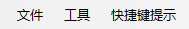

### 文件菜单

保存图像、复制到剪贴板（Ctrl+Shift+C）、保存影片（MP4）。

**保存影片** 会打开下方的影片设置对话框。影片可以旋转视图、平移投影中心，或两者同时进行——请勾选 **Rotation** 和/或 **Translation**：

- **Rotation**：使视图以 **Speed**（°/s；负值反转旋转方向）绕下方选择的轴旋转——**当前投影**（用箭头按钮选择的倾斜方向）、**方向指数** [uvw]，或 **晶面** (hkl) 的法线。
- **Translation**：使投影中心沿方向指数 [uvw] 以 **Speed**（晶格周期/秒）平移。此选项仅在从结构查看器打开该对话框时显示；启用期间，方向模式只能选择 **方向指数**。

设置影片长度（**Duration**）、帧率（**FPS**，1–120）和编码器质量（**Quality**，1–100；数值越大比特率越高，文件也越大），选择编解码器（**H264** / **H265**），然后按 **OK** 生成 MP4 文件。勾选 **Include final frame** 会在 t = Duration 处额外追加一帧，使影片恰好结束于最终的取向/位置。（编码速度列表现在仅用于标注进度显示，不再影响实际编码。）

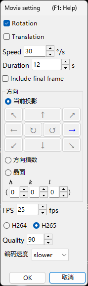

### 工具菜单

---

## 选项卡菜单

### 由晶胞定义的边界

指定晶体的绘制范围。共有两种模式，通过顶部的单选按钮切换。

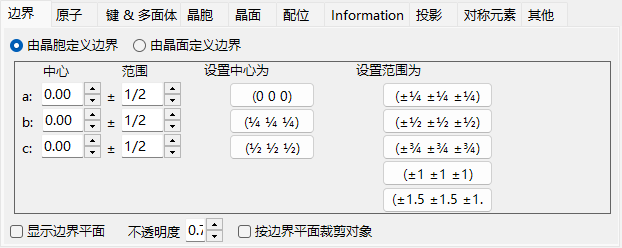

在此模式下，晶胞的 *a*、*b*、*c* 轴是绘制范围的单位。

- **中心**：绘制体积的中心分数坐标。
- **范围**：*a*、*b*、*c* 各轴的上限/下限。
- 右侧的 **预设按钮** 提供常用值（例如 1×1×1 晶胞、2×2×2 晶胞）。

### 由晶面定义的边界

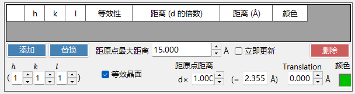

在此模式下，绘制区域由一组晶面界定。如果这些面未能定义出一个空间上封闭的区域，ReciPro 会自动回退为单个晶胞的边界。

#### 边界列表

为当前晶体注册的所有边界面。使用 **添加 / 替换 / 删除** 来操作列表；最左侧的复选框可在不删除某个面的情况下临时禁用它。

> 要永久保存更改，您还必须在 **主窗口** 中按 **添加** 或 **替换**。否则，下次在主晶体列表中更改选择时，更改将丢失。

#### H k l 指数

通过米勒指数设置边界面。该复选框会包含由选定的 (*hkl*) 生成的晶体学等价面。

#### 距原点的距离

从晶体中心到边界面的距离。单位可在 **d** 与 **Å** 之间选择。使用 **d** 时，距离为输入值乘以选定 (*hkl*) 的 *d* 值（晶面间距）。使用 **Å** 时，该值为绝对距离。更改其中之一会自动更新另一个。

#### 显示边界平面 / 不透明度

显示或隐藏边界面本身。显示时，**Opacity** 设置透明度（0 = 透明，1 = 不透明）。

#### 按边界平面裁剪对象

如果勾选，则仅渲染由边界定义的内部区域；与边界相交的原子、化学键和多面体将被裁剪。

#### 隐藏原子

如果勾选，则隐藏所有原子、化学键和多面体——当只需要可视化晶胞或晶面时很有用。

### 原子

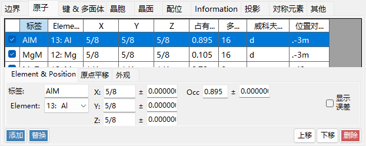

坐标、元素、占有率、半径、颜色、材质。**Apply to same elements**。

#### 原子列表

晶体中的原子列表。使用 **添加 / 替换 / 删除** 来操作列表；最左侧的复选框可临时隐藏某个原子。

> 要永久保存更改，也请在 **主窗口** 中单击 **添加** 或 **替换**。

#### 元素和位置

- **标签**：原子的自由文本标签（用于图例和工具提示）。
- **Element**：化学元素 / 电离状态。
- **X, Y, Z**：分数坐标。0–1 之间的实数，或诸如 `1/2`、`2/3` 之类的分数。
- **Occ**：占有率，0–1 之间的实数。

#### 原点平移

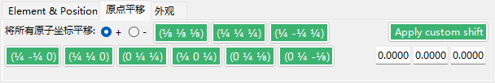

将每个原子平移相同的分数偏移量。按一个预设按钮（例如，为同一空间群在原点选择 1 / 2 之间切换），或输入自定义的 (Δx, Δy, Δz) 并按 **Apply custom shift**。

#### 外观

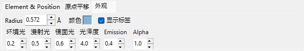

每个原子的半径、颜色和材质。

- **Radius**：绘制的原子半径。
- **Atom color**：表面颜色。
- **Material**：OpenGL 着色器所用的纹理 / 材质属性。
- **应用于相同元素**：将当前的半径和颜色应用于同一元素种类的每个原子。

### 键 & 多面体

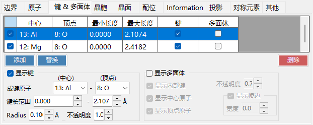

键长阈值、多面体显示、棱边。

#### 化学键列表

为晶体注册的所有化学键/多面体规则。使用 **添加 / 替换 / 删除**；最左侧的复选框可临时禁用某个条目。与原子和边界一样，要使更改永久生效，需在 **主窗口** 中按 **添加** / **替换**。

#### 化学键属性

- **成键原子(中心)**：用作化学键 / 多面体中心原子的元素种类。
- **成键原子(顶点)**：用作顶点（另一端）的元素种类。
- **Length between … and …**：距离的下限和上限阈值。超出此范围的原子对不会被绘制。
- **Bond Radius**：绘制的化学键粗细（圆柱半径）。
- **不透明度**：化学键透明度（0 = 透明，1 = 不透明）。

#### 多面体属性

- **显示多面体**：勾选时，绘制由当前化学键定义的多面体（仅当中心/顶点组合在几何上有效时）。
- **内部键**：显示/隐藏多面体内部的化学键。
- **中心原子**：显示/隐藏中心原子。
- **顶点原子**：显示/隐藏顶点原子。
- **Color** / **Alpha**：面颜色和透明度。
- **显示棱边**：绘制连接各顶点的棱边。
- **Edge Color** / **宽度**：棱边的颜色和线宽。

### 晶胞

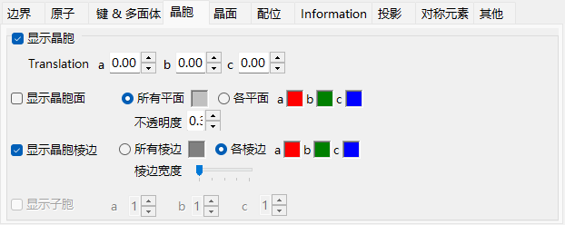

平移、晶胞面、棱边。

#### 平移

每个空间群都有一个默认原点。要将绘制的晶胞中心从该原点移开，请沿 *a*、*b*、*c* 设置平移量。

#### 显示晶胞面

是否绘制界定晶胞的六个面。启用时，您可以设置面颜色和透明度。

#### 显示棱边

是否绘制晶胞的棱边。棱边颜色可配置。

### 晶面

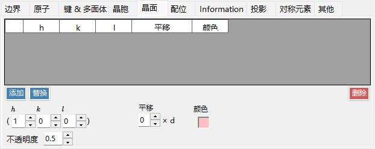

带晶体学等价面的米勒指数指定。

#### H k l 指数

通过米勒指数指定晶面。该复选框可选择性地包含由 (*hkl*) 生成的晶体学等价面。

#### 平移

将绘制的晶面平移其 *d* 值（晶面间距）的整数倍——可用于可视化同一族的连续晶面。

### 配位

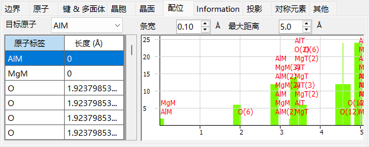

围绕目标原子的配位表和图表。

#### 表格（左侧）

列出哪些原子环绕选定的目标原子以及它们之间的距离。目标原子从表格上方的下拉菜单中选择。

#### 图表（右侧）

由与表格相同的数据导出的邻原子数量与距离的直方图。调整 **Bar width**，直到各柱清晰分离出配位壳层——这可对配位数给出一个直观的估计。

### Information

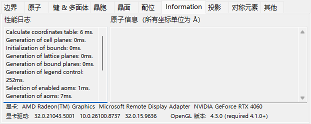

渲染日志（帧时间、GPU 信息）以及选定原子的基本信息。正在建设中——字段可能会随时间增加。

### 投影

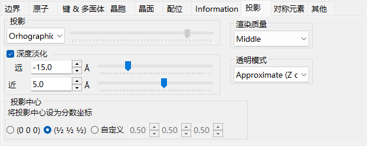

投影模式（正交/透视）、深度淡出、渲染质量、透明度模式。

#### 投影

- **Orthographic**：完美的平行投影（视点位于无穷远处）。
- **Perspective**：从滑块所设视点距离进行的透视投影。

#### 深度淡出

在深度方向上淡出远处的对象。比 **Far** 更远的对象完全透明；比 **Near** 更近的对象完全不透明；介于两者之间的对象进行线性插值。

#### 投影中心

将投影中心设置为指定的坐标。打开 **自定义** 以输入任意坐标。每个坐标都会被折叠到 −0.5 至 +0.5（一个晶格周期）的范围内。**Translation** 影片（见[文件菜单](#文件菜单)）会自动驱动这些值。

#### 渲染质量

绘制质量（网格细分、抗锯齿）。质量越高速度越慢——请选择与您的 GPU 相匹配的设置。

#### 透明度模式

用于半透明原子和多面体的算法。

- **Approximate**：快速，但当许多半透明对象重叠时可能不准确。
- **Perfect**：顺序无关透明度——准确但非常慢，实际上需要独立 GPU。

### 对称元素

**对称元素** 选项卡将空间群的对称操作直接绘制到三维模型上（用工具栏的 **Symmetry Elements** 按钮切换）。每一类元素都可以独立显示/隐藏：

- **旋转轴** 和 **螺旋轴**
- **镜面** 和 **滑移面**
- **对称中心** 和 **旋转反演轴**

对于每一类，您都可以调整符号大小、线宽和颜色。

### 其他

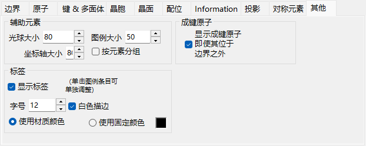

- **Accessory controls**：设置显示大小（光球、轴、图例）。**Group by element** 切换图例显示。
- **Bonded atoms**：**Show bonded atoms even if they are outside the boundaries** 会继续绘制那些与绘制范围内原子成键的原子，即使它们位于范围之外。
- **Label**：设置原子标签的字体大小、颜色及其他属性。

---

## 工具栏

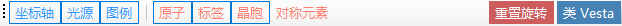

| 按钮 | 说明 |
|--------|-------------|
| 坐标轴 | 显示轴的方向（大小 = 晶格常数） |
| 光照 | 设置光源方向 |
| 图例 | 原子图例 |
| 原子 | 切换原子对象 |
| 标签 | 切换原子标签 |
| 晶胞 | 切换晶胞棱边 |
| 对称元素 | 切换对称元素叠加层（见上文） |
| 重置旋转 | 返回初始取向 |
| 类 Vesta | Vesta 风格的外观 |

---

## 另请参阅

- [主窗口](0-main-window.md)
- [晶体数据库](1-crystal-database.md)
- [对称性信息](2-symmetry-information.md)
- [衍射模拟器](7-diffraction-simulator/index.md)
- [键盘和鼠标快捷键](21-shortcuts.md)
