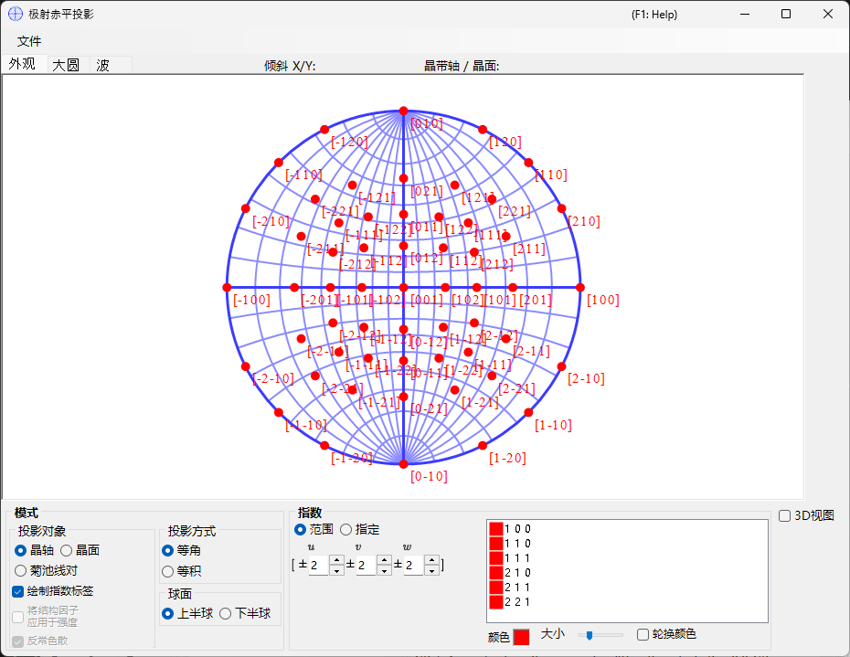
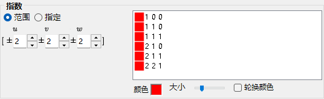
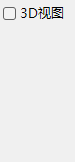
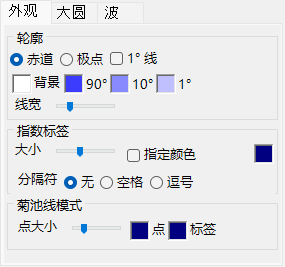
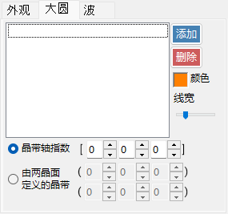
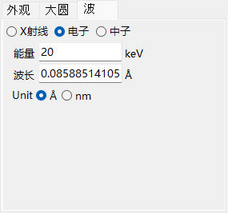

# 极射赤平投影

**极射赤平投影**使用极射赤平投影法显示晶面和轴方向。

---

## 键盘和鼠标快捷键

极射赤平投影本身是二维投影；可通过 **3D display** 显示一个可选的三维球面。

| 快捷键 | 操作 |
|----------|--------|
| <kbd>F1</kbd> | 打开在线手册的本页 |
| 在中心附近左键拖动 | 倾斜晶体 |
| 在外侧区域左键拖动 | 围绕视轴旋转晶体 |
| 左键双击 | 在 **Plane** 和 **Axis** 投影之间切换 |
| 右键单击 | 缩小 |
| 右键拖出一个矩形框 | 放大到所选区域 |
| 中键拖动 | 平移 |
| 移动鼠标（不按任何按键） | 读取光标下的 (hkl)/[uvw]——用于标定测得的衍射斑点 |

在投影网上拖动会旋转**晶体**；旋转状态在所有窗口之间共享。

三维渲染使用 ReciPro 的标准 [OpenGL 视图导航](21-shortcuts.md)（左键拖动旋转，右键拖动 / 滚轮缩放，<kbd>CTRL</kbd> + 右键双击切换投影方式），并且只旋转三维视图，而不旋转晶体本身。

来自[主窗口](0-main-window.md#keyboard-mouse-shortcuts)的应用程序级 <kbd>CTRL</kbd>+<kbd>SHIFT</kbd> 快捷键在本窗口获得焦点时同样有效。

→ 参见 **[21. 键盘和鼠标快捷键](21-shortcuts.md)**，一览所有窗口的快捷键。

---

## 主区域

此处显示所选晶体的晶面、方向指数和菊池线的极射赤平投影。

---

## 文件菜单

以光栅格式或矢量格式保存或复制。矢量格式允许在 PowerPoint 或其他矢量编辑器中编辑字体/线宽。

---

## Mode

### 投影目标

选择要投影到网上的对象。

- **Axes** — 投影方向指数 \([uvw]\)。
- **Planes** — 投影晶面法线 \((hkl)\)。
- **Kikuchi line pairs** — 投影菊池线对。

### 投影方法

| 方法 | 说明 |
|--------|-------------|
| **Wulff**（等角 / 极射赤平投影） | 保持投影特征之间的角度关系，但不保持立体角。经典晶体学家在读取轴间角或面间角时使用。 |
| **Schmidt**（等面积 / 兰伯特投影） | 保持每个区域的立体角（面积），但会扭曲角度。在关注相对密度的统计极图中更受青睐。 |

### 半球

选择**上**（Upper）或**下**（Lower）半球作为投影源——切换可见球面是离观察者最近的一面还是最远的一面。

### 显示选项

- 显示指数标签。
- 当选择 **Planes** 或 **Kikuchi line pairs** 时，按结构因子 \(|F_{hkl}|\) 对每个点或每条线加权（在 [Wave 选项卡](#wave) 中设置波源和波长）。

> 对于三方/六方晶系，可在主窗口中通过 **Option ▸ Use Miller-Bravais (hkil) index** 启用米勒-布拉维（四指数）表示法。

---

## Indices

设置要绘制哪些晶面 / 轴。

### 范围模式

指定 \([uvw]\) 或 \((hkl)\) 指数的范围。ReciPro 会枚举范围内的每个指数并逐一投影。

### 指定模式

逐个指定特定的轴或面。输入一个指数，按 **Add** 进行注册，或按 **Remove** 进行删除。勾选 **include equivalent indices** 后，所有晶体学等价指数也会被绘制出来。

### Colour / Size

设置所绘制点的**颜色**（colour）和**大小**（size）。勾选 **Change colour automatically** 可为每组等价的轴/面分别进行颜色编码——便于在多指数图上区分各个族。

---

## 3D Options

控制三维网（球面）叠加层——球面的不透明度、轴指示器等。

---

## 选项卡菜单

### Appearance

#### Outline

极射赤平投影轮廓的绘制方式——边界圆以及可选的大圆经纬度网格。选择 **Equator** 或 **Pole**，切换 **1° Lines** 和 **Background** 填充，设置 **90° / 10° / 1°** 网格颜色，并用轨道滑块调节 **Line width**。

#### Index labels

- **Size** — 指数标签的大小。
- **Specify color** — 为所有指数标签使用单一固定颜色，而非各斑点的颜色；当点采用颜色编码而你希望所有标签使用同一颜色以便阅读时，此功能很有用。
- **Delimiter** — 每个标签中各指数之间放置的字符：**None**（如 100）、**Space**（1 0 0）或 **Comma**（1,0,0）。

#### Kikuchi line mode

- **Point size** — 所绘制点的大小。
- **Point** / **Label** — 点及其标签的颜色。

### Great and Small Circle

绘制大圆和小圆。可通过 **zone-axis index** \([uvw]\)（由该轴所属晶带形成的大圆）指定，或通过共享同一晶带轴的 **two crystal-plane indices** 指定。圆的线宽同样可通过轨道滑块配置。

### Wave {#wave}

仅当选择 **Planes** 或 **Kikuchi line pairs** 作为投影目标时可用。设置波源（X-ray / electron / neutron）以及计算晶体结构因子所需的波长或能量，这些结构因子用于 [Mode](#mode) 中的 **structure-factor weighting** 选项。

---

## 另请参阅

- [主窗口](0-main-window.md)
- [旋转几何](4-rotation-geometry.md)
- [结构查看器](5-structure-viewer.md)
- [衍射模拟器](7-diffraction-simulator/index.md)
- [基本坐标系与晶体取向](appendix/a1-coordinate-system/1-orientation.md)
