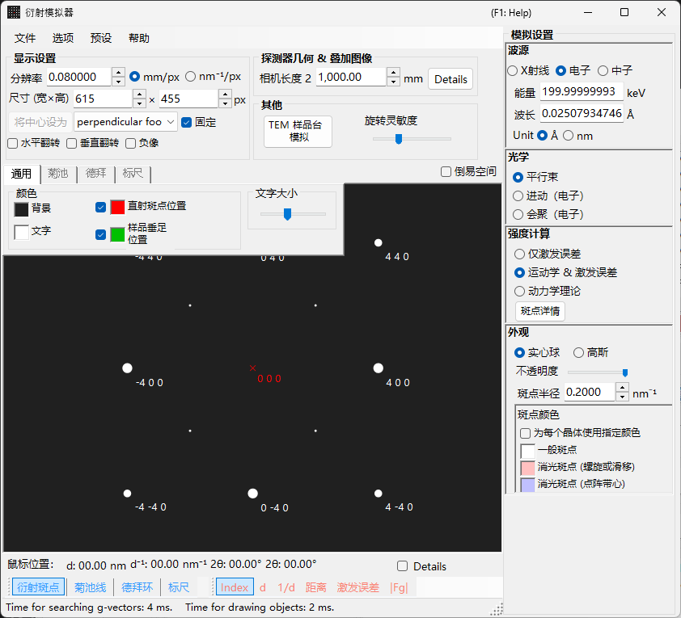
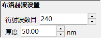

# SAED（选区电子衍射）模拟

**SAED（Selected Area Electron Diffraction，选区电子衍射）** 模拟用于计算平行电子束产生的单晶电子衍射图样。这是[衍射模拟器](index.md)的默认模式。

> 本页列出当您选择 **Wave Length = Electron** 且 **Incident beam mode = Parallel** 时，右侧 **Spot property** 面板中出现的每一项设置。关于绘制和保存等窗口级操作，请参见[概览页](index.md)。

GUI 条件：Wave Length = Electron，Incident beam mode = Parallel，Intensity calculation = Only excitation error / Kinematical / Dynamical。

---

## 概览

模拟平行电子束穿过薄样品时产生的衍射图样。衍射斑点的位置由埃瓦尔德球与倒易点阵点之间的几何关系确定，每个斑点的亮度则按照所选的强度计算模式来计算。

---

## Wave Length

将辐射源设置为 **Electron**。输入能量（keV）或波长（nm），即可计算出经相对论修正的波长。关于 X 射线和中子源，请参见 [X 射线衍射模拟](4-x-ray-neutron-diffraction.md)。

---

## Incident beam mode

将入射束的几何形状设置为 **Parallel**。这是用于 SAED 和 X 射线衍射的标准平面波几何。

> **Note**：对于电子束，您可以选择 **Parallel / Precession (electron = PED) / Convergence (CBED)**。选择 **Precession** 将得到 [PED 模拟](2-ped-simulation.md)，选择 **Convergence** 将得到 [CBED 模拟](3-cbed-simulation.md)；在这两种情况下，强度计算都会自动切换为 Dynamical。

---

## Intensity calculation

选择如何计算斑点强度。

### Only excitation error

强度仅由埃瓦尔德球与倒易点阵点之间的几何距离（偏离矢量 $s_g$）决定。$\lvert s_g \rvert$ 越小，强度越高；在 **Radius** 所设定的值处达到最大，当 $\lvert s_g \rvert$ 超过 Radius 时降为零。由于忽略了晶体结构因子，这是最快的模式，适合检查衍射斑点的位置。

### Kinematical

在偏离矢量之外，还将运动学结构因子 $\lvert F_{hkl} \rvert^2$ 计入强度。消光规则得到正确反映，因此该模式适合薄样品或弱衍射。

### Dynamical（布洛赫波法，仅限电子）

采用布洛赫波法（Bethe 法）进行严格的动力学计算。它再现多重散射以及强度随厚度的变化，对于厚样品或强衍射是必需的。仅当选择 Electron 时可用。关于理论，请参见 [附录 A3. 布洛赫波法](../appendix/a3-bloch-wave/calculation.md)。

> **Note**：当选择 **Dynamical** 时，下方会出现 **Bloch wave settings** 面板。

---

## Bloch wave settings（动力学理论）

仅当 **Intensity calculation = Dynamical** 时才有效。

| 参数 | 说明 |
|-----------|-------------|
| **Number of diffracted waves** | 本征值问题中纳入的布洛赫波数量。值越大，强度越精确，但计算时间按 $O(N^3)$ 增加 |
| **Thickness** | 动力学计算中使用的样品厚度（nm） |

---

## Spot appearance

控制每个衍射斑点的绘制方式。

- **Solid sphere / Gaussian** ：倒易点阵点的几何模型。**Solid sphere** 绘制半径为 $R$ 的球与埃瓦尔德球之间的截面（一个圆），圆的面积对应衍射强度；**Gaussian** 绘制 $\sigma = R$ 的三维高斯函数的截面（二维高斯），其积分对应衍射强度。
- **Opacity** ：斑点的透明度（0 = 透明，1 = 不透明）。
- **Radius (R)** ：倒易点阵点的虚拟半径。斑点大小由 **Appearance** 模式与 **Intensity calculation** 的组合确定（例如 Solid sphere + Dynamical 给出与 $I_\text{dyn}^{1/2}$ 成正比的半径）。
- **Brightness** ：仅在 **Gaussian** 模式下有效。所绘制高斯函数的积分强度。
- **Color scale** ：**Gray scale** 或 **Cold-warm**。
- **Log scale** ：以对数刻度显示强度。对强度对比度大的图样很有用。
- **Spot color** ：未使用颜色刻度时所用的斑点颜色。
- **Use crystal color** ：勾选后，斑点以分配给各晶体的颜色绘制。

---

## Spot labels

叠加在斑点上的标签可从[工具栏](index.md#toolbar)中选择。

| 标签 | 内容 |
|-------|---------|
| **Index** | 米勒指数 $(hkl)$ |
| **d** | 晶面间距 $d$ |
| **Distance** | 探测器上斑点之间的距离 |
| **Excit. Err.** | 偏离矢量 $s_g$ |
| **\|Fg\|** | 结构因子的绝对值 $\lvert F_{hkl} \rvert$ |

---

## 共用操作

探测器信息、翻转、倒易空间显示、菊池线、德拜环、刻度线、颜色设置、保存等操作在所有模式下都是共用的。请参见[概览页](index.md)。从动力学计算获得的各反射的详细信息可在[衍射斑点信息](index.md#diffraction-spot-information)中浏览。

---

## 另请参见

- [衍射模拟器（概览）](index.md)
- [平行束 SAED 计算](../appendix/a3-bloch-wave/calculation.md#parallel-beam-saed)
- [X 射线衍射模拟](4-x-ray-neutron-diffraction.md)
- [进动电子衍射 (PED) 模拟](2-ped-simulation.md)
- [坐标系的定义](../appendix/a1-coordinate-system/1-orientation.md)
