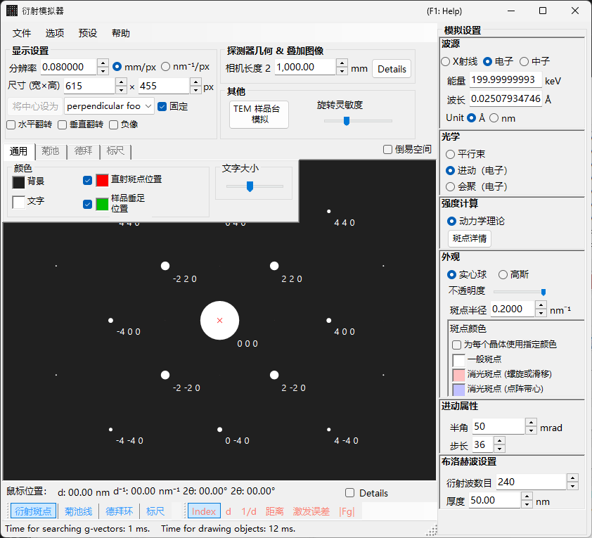
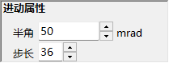

# 进动电子衍射 (PED) 模拟

**PED（进动电子衍射，Precession Electron Diffraction）** 模拟计算的是通过使入射束在绕光轴的锥面上进动而获得的电子衍射图。

> 本页列出当您选择 **Wave = Electron beam, Incident beam = Precession (electron), Intensity = Dynamical (automatic)** 时右侧出现的全部设置项。请注意，**为入射束选择 Precession (electron) 会自动将强度计算切换为 Dynamical**。关于绘制和保存等窗口级操作，请参见[概览页面](index.md)。

GUI 条件：**Wave = Electron beam, Incident beam = Precession (electron), Intensity = Dynamical (automatic)**

---

## 概览

在 PED 中，电子束在绕光轴的锥面上进动，并将进动锥上每个束方向所获得的衍射图加以积分。与传统的 SAED 相比，这具有以下优点：

- 动力学效应被平均掉，从而得到接近运动学强度比的强度数据
- 高阶劳厄区 (HOLZ) 反射观测得更清晰
- 可获得适合于结构分析的强度数据

---

## 波长设置

由于 PED 属于电子衍射，请选择 **Electron beam** 作为波源。输入电子能量 (keV) 或波长 (nm) 即可计算出经相对论修正的波长。

---

## 入射束

对于入射束的几何，请选择 **Precession (electron)**（仅在选择了电子束时可用）。

> **注意** : 选择 **Precession (electron)** 会**自动将强度计算切换为 Dynamical**，并出现布洛赫波法设置面板和进动设置面板。**Only excitation error** / **Kinematical** 将无法再被选择。

---

## 进动设置

设置进动锥的形状和采样。

| 参数 | 说明 | 推荐值 |
|-----------|-------------|-------------|
| **Semi-angle** | 进动锥的半角 (mrad) | 10–40 mrad |
| **Step** | 在进动锥上采样的平行束方向数。值越大积分越平滑，但计算时间线性增加 | 36–72 |

---

## 强度计算与布洛赫波设置

一旦选择 **Precession (electron)**，**Intensity = Dynamical (automatic)** 即被固定。对于每个进动方向上的平行束，用布洛赫波法（动力学计算）计算衍射强度，再对所有方向积分即得到 PED 图。

| 参数 | 说明 | 推荐值 |
|-----------|-------------|-------------|
| **No. of diffracted waves** | 本征值问题中所包含的布洛赫波数。值越大强度越精确，但计算时间按 $O(N^3)$ 增长 | 50–200 |
| **Thickness** | 动力学计算中所用的样品厚度 (nm) | — |

计算开销大致为“步数 × 每个方向的布洛赫波计算”。关于动力学计算的细节，请参见[动力学计算（布洛赫波法）](../appendix/a3-bloch-wave/calculation.md)。

---

## 衍射斑外观

控制每个衍射斑的绘制方式。

- **Solid sphere / Gaussian** : 倒易点阵点的几何模型。**Solid sphere** 绘制半径为 $R$ 的球与埃瓦尔德球的截面，**Gaussian** 绘制 $\sigma = R$ 的三维高斯函数与埃瓦尔德球的截面（一个二维高斯函数）。
- **Opacity** : 衍射斑的透明度（0 = 透明，1 = 不透明）。
- **Radius (R)** : 倒易点阵点的半径。对于动力学强度，高斯积分 $=$ Brightness $\times I_\text{dyn}$，而 Solid sphere 使用半径 $R \times I_\text{dyn}^{1/2}$（使面积正比于动力学强度）。
- **Brightness** : 仅在 **Gaussian** 模式下可用。所绘高斯函数的积分强度。
- **Colour scale** : **Gray scale** 或 **Cold-warm** 配色。
- **Log scale** : 以对数刻度显示强度。
- **Spot colour** : 未应用配色时所用的衍射斑颜色。
- **Use crystal colour** : 以分配给每个晶体的颜色绘制衍射斑。

---

## 与 SAED 的对比

| 特性 | SAED | PED |
|---------|------|-----|
| 束 | 平行、固定 | 进动（锥面扫描） |
| 动力学效应 | 大 | 经平均，较小 |
| HOLZ 反射 | 弱 | 强烈出现 |
| 强度可靠性 | 用于结构分析可能不足 | 适合结构分析 |
| 计算时间 | 短 | 长 |

---

## 另请参见

- [衍射模拟器（概览）](index.md)
- [X 射线衍射模拟](4-x-ray-neutron-diffraction.md)
- [SAED 模拟](1-saed-simulation.md)
- [动力学计算（布洛赫波法）](../appendix/a3-bloch-wave/calculation.md)
