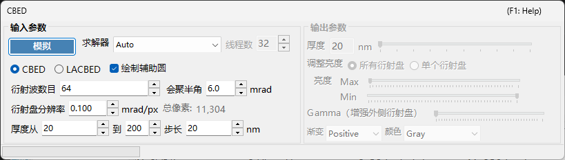
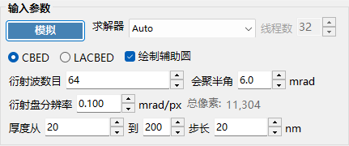
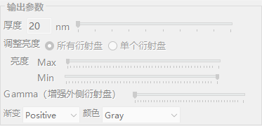

# CBED 模拟

**CBED（会聚束电子衍射，Convergent-Beam Electron Diffraction）模拟** 使用布洛赫波（Bethe）法计算并显示会聚束衍射图样。CBED 图样显示的是衍射盘而非衍射斑点，包含关于晶体对称性、厚度和结构的丰富信息。

> 本页列出在 [衍射模拟器](index.md) 中选择 **Wavelength = Electron** 和 **Incident beam = Convergence (CBED, electron only)** 时打开的专用窗口的所有设置。将入射束切换为会聚束会自动将 **Intensity calculation** 切换为 **Dynamical**，并打开此 CBED 设置窗口。关于绘制和保存衍射图样以及衍射模拟器的其他通用操作，请参阅 [概览页](index.md)。

GUI 条件：Wave Length = Electron · Incident beam = Convergence (CBED, electron only) · Intensity calculation = Dynamical（自动）

---

## 输入参数

| 参数 | 说明 | 默认值 / 典型值 |
|-----------|-------------|-------------------|
| **Mode** | **CBED**：标准会聚束图样，其中每个盘对应一个反射，透射盘（000）位于中心。**LACBED**（Large-Angle CBED，大角度 CBED）：大角度会聚束图样，不同反射的盘相互重叠。适用于观察高阶劳厄带（HOLZ）线和对称性 | CBED |
| **Convergence semi-angle (mrad)** | 会聚束锥的半角。决定每个衍射盘的大小（倒易空间中的盘直径对应 $2\alpha$） | 5–30 mrad |
| **Disk resolution (mrad/px)** | 每个盘内部的角分辨率。值越小分辨率越高，但所计算的束方向（像素）数量随其平方增长，因此计算时间也呈二次方增加。所得到的总像素数（= 束方向总数）显示在右侧 | — |
| **No. of Bloch waves** | 在每个入射束方向上纳入布洛赫波计算的最大束数。束数越多精度越高，但本征值问题的开销随 $O(N^3)$ 增长 | 100–500 |
| **Thickness range** | 样品厚度（nm）的起始值、终止值和步长值。多个厚度一起计算，并通过输出侧的厚度滑块切换 | — |
| **Solver** | 求解本征值问题的计算引擎。**Auto**：自动选择最佳求解器。**Eigenproblem (MKL)**：基于 Intel MKL（最快）。**Eigenproblem (Eigen)**：Eigen C++ 库。**Managed**：纯 .NET 托管（最慢但始终可用） | Auto |
| **Thread count** | 计算所用的并行线程数 | — |
| **Draw disk outlines** | 勾选时，绘制一个圆以指示每个衍射盘的边界 | — |

---

## Run / Stop

- **Start** ：以当前输入参数启动 CBED 模拟。
- **Stop** ：取消正在运行的计算。

---

## 输出参数

计算完成后，输出参数即可用。所有这些参数都只改变显示，而不会重新计算。

| 参数 | 说明 |
|-----------|-------------|
| **Sample thickness** | 通过滑块在输入参数的厚度范围内选择要显示的样品厚度 |
| **Brightness adjustment** | **Common to all disks**：对所有盘使用统一的亮度刻度，以显示完整的 CBED 图样。**Per disk**：以全分辨率显示单个选定的盘，并在该盘内进行归一化 |
| **Brightness (Max / Min)** | 所显示强度的上限和下限。当您想强调微弱特征时进行调整 |
| **γ (emphasis of outer disks)** | 伽马校正。用于使暗淡的外侧大角度盘相对于中心透射盘更易于观察 |
| **Scale** | 从 **Positive** / **Negative**（黑白反转）中选择强度灰度 |
| **Color** | 用于显示的颜色映射。从 **Gray** 等中选择 |

---

## 物理背景

在 CBED 中，入射束被视为由不同方向的平面波组成的锥体。对于每个方向（会聚光阑内的每个点 = 一个部分入射平面波），布洛赫波法求解晶体内部的电子薛定谔方程，并将结果重新排列为衍射盘。HOLZ（高阶劳厄带）线表现为盘内部精细的暗/亮线，由上层劳厄带中的反射产生。它们对沿 $c$ 轴的点阵参数敏感，对三维结构分析很有用。

关于理论细节，请参阅 [CBED 计算](../appendix/a3-bloch-wave/cbed.md)。

---

## 另请参阅

- [衍射模拟器（概览）](index.md)
- [SAED 模拟](1-saed-simulation.md)
- [PED 模拟](2-ped-simulation.md)
- [CBED 计算](../appendix/a3-bloch-wave/cbed.md)
