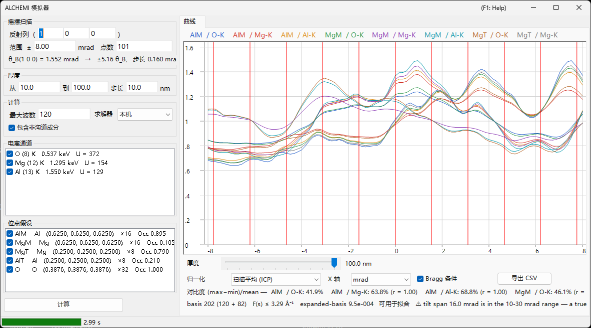

# ALCHEMI 模拟

**ALCHEMI（Atom Location by CHannelling-Enhanced MIcroanalysis，沟道增强微分析定位法）** 通过在沿系统反射列倾转晶体的同时测量特征 X 射线产额，并读取其取向依赖性，来确定**掺杂原子占据哪个位点**。ReciPro 的 ALCHEMI 模拟器由晶体结构与一组位点假设**正向计算摇摆曲线（电离产额随取向的变化）**。

> **这是 Preview 功能。** v1 **仅进行一维正向计算**；对实验数据的拟合与 2D 图（2D-HARECXS）尚未实现（相应选项卡已隐藏）。**据作者所知，目前没有其他公开可用的 ALCHEMI 正向模拟器。** 由于没有可供交叉核对的实现，请先阅读[适用范围与已知限制](#适用范围与已知限制)，再将结果用于定量分析。

打开方式：[衍射模拟器](index.md) 的 **选项** 菜单 → **ALCHEMI 模拟器...**

GUI 条件：Wave Length = Electron（晶体、加速电压与取向取自上级衍射模拟器）



窗口**左侧为设置**（扫描、厚度、计算、电离通道、位点假设），**右侧为结果**（曲线选项卡）。

---

## 计算的内容

对每个入射取向，用布洛赫波法求解晶体内部的波场；对每一对位点 $s$ 与电离通道 $c$，将电离产额解析地积分到厚度 $t$。

$$
Y_\text{dyn} = \mathrm{Re} \sum_{jj'} \alpha_j^{*}\,\bigl(C^{\dagger} \mu_{s,c} C\bigr)_{jj'}\, \alpha_{j'}\, F_{jj'}(t),
\qquad F_{jj'}(t) = \frac{e^{\lambda t} - 1}{\lambda}
$$

电离矩阵 $\mu$ 仅取决于两个反射之差 $G = \mathbf{g}_h - \mathbf{g}_g$。

$$
\mu_{hg} = \sum_a \mathrm{Occ}_a\, e^{-M_a(G)}\, \sigma_c\, F_c(|G|/2)\, e^{-2\pi i\,G \cdot \mathbf{r}_a}
$$

- $\sigma_c$：电离总截面，采用 **Bote–Salvat** 模型
- $F_c(s)$：归一化电离形状因子，来自自建 **DHFS** 表（与[束流相互作用](../3-beam-interaction.md)和 [STEM-EDX](../9-hrtem-stem-simulator/2-stem-simulation.md) 相同的数据基础）
- $e^{-M_a(G)}$：德拜–沃勒因子（支持各向异性 ADP）

这相当于 ICSC（Oxley & Allen 2003）的**局域形状因子近似**。未使用双动量 MDFF。

### 非沟道成分

因热漫散射吸收而脱离相干布洛赫场的电子，会以方向随机化的电子形式走完剩余厚度，并在那里同样产生电离。

$$
Y_\text{dech} = \frac{\mu_{00}}{V_c}\,\bigl(t - L_\text{coh}(t)\bigr),
\qquad L_\text{coh}(t) = \int_0^t \sum_g |\psi_g(z)|^2\,dz
$$

在**计算**框中取消勾选**包含非沟道成分**会去掉该项。在典型厚度下它占总产额的数十个百分点，省略后位点衬度会显得比实际更强。

### 输出量

一次量是**每个入射电子产生的内壳空穴数**。**未应用向 X 射线光子的转换（荧光产额与线分支）、样品内的 X 射线自吸收，以及探测器效率与立体角。**

---

## 左侧面板：设置

### 摇摆扫描

| 项目 | 说明 | 默认值 |
|------|------|--------|
| **反射列 ( h k l )** | 要扫描的系统反射列，用反射指数给出。倾转轴取为同时垂直于束流与该 $\mathbf{g}$，因此扫描会带着该反射列通过其 Bragg 条件 | (1 0 0) |
| **范围 ±** | 倾转扫描的半宽（mrad）。超过约 10 mrad 后固定并集基组不再有保证，超过 30 mrad 则在 v1 的保证范围之外 | 8 mrad |
| **点数** | 扫描点数（3–1001） | 101 |

下一行显示所选反射列的 Bragg 角 $\theta_B$、扫描宽度相当于多少个 $\theta_B$，以及倾转步长——运行前即可知道扫描实际覆盖多远。

### 厚度

给出起点、终点与步长（nm）。**所有厚度在一次运行中一起算出**，结果用曲线下方的滑块切换。

位点衬度在薄样品与厚样品之间变化剧烈，甚至可能反号，因此在下结论前请检查多个厚度。厚度选择器就放在曲线正下方正是出于此因。

### 计算

| 项目 | 说明 | 默认值 |
|------|------|--------|
| **最大波数** | 每个取向的布洛赫波数上限（1–1600）。整个扫描的并集会更大 | 120 |
| **求解器** | 本征值问题的计算引擎：**本机**（Eigen C++）或**托管**（.NET）。在本机求解器不可用的环境中，选择被固定为托管 | 本机 |
| **包含非沟道成分** | 是否加上上述 $Y_\text{dech}$ | 开 |
| **角展宽** | 将曲线与入射束的角展宽做卷积：**无** 或 **Gaussian**（半高全宽，mrad）。这是取向轴上的后处理，在显示归一化**之前**应用 | 无 |

**1600 波的上限与电离形状因子的收录范围 $s \le 16\ \text{Å}^{-1}$ 是配套的。** 实测表明即使 1600 波，基组所需的 $s$ 也只有约 10.5 Å⁻¹，因此只要遵守该上限就不会用尽收录范围。实际达到的数值显示在图下方的[基组诊断](#基组诊断)行。

### 电离通道

待电离的元素与壳层列表。每行读作 `元素 (Z) 壳层   吸收边能量   U = 过电压`，需要注意的情形会在末尾加括号标注。

- **无法激发**（入射能量低于吸收边）或**超出收录范围**的通道会连同原因一起列出，且无法勾选
- 过电压 $U = E_0/E_\text{边}$ 低于 1.2 的通道带有注意标记，因为该处截面的可靠性较低

### 位点假设

分别计算产额的原子位点列表，显示为 `标签 元素 (x, y, z) ×多重度 Occ 占有率`。

⚠ **在示踪近似下，通道与位点的组合是自由的。** 把掺杂元素的电离通道与主体位点的几何（位置、ADP、占有率）配对，正是本功能的预期用法；若仅限元素相同的组合反而是错的。程序会计算所勾选通道与位点的**全部组合**。

### 计算 / 停止

**计算**开始扫描。进度在状态栏分五个阶段显示（正在解析电离数据 → 正在构建并集基组 → 正在构建电离矩阵 → 正在计算取向 → 正在检验扩展基组），**停止**可随时中断。

---

## 右侧面板：曲线选项卡

计算完成后，每个「位点 × 通道」组合绘制一条曲线。图例为 `位点标签 / 通道`。

| 项目 | 说明 |
|------|------|
| **厚度** | 用滑块选择显示的厚度（不会重新计算） |
| **归一化** | **扫描平均 (ICP)** = 除以整个扫描的平均值（ALCHEMI 通常使用的量）/ **最大值 = 1** / **原始值 (每电子)** |
| **X 轴** | 在 **mrad** 与 **θ_B**（以所扫反射列的 Bragg 角为单位）之间切换 |
| **Bragg 条件** | 在 $\theta = n\,\theta_B$ 处画竖线 |
| **导出 CSV** | 将全部取向、厚度、位点与通道的原始曲线写入 CSV 文件（[见下](#csv-导出)） |

⚠ **归一化只是显示上的变换。** 保存的量始终是每个入射电子产生的空穴数，而**最大值 = 1 仅供显示**，不能作为 ICP 的基准。

### 衬度与相关

曲线下方第一行按系列给出**衬度** $(\max-\min)/\text{mean}$ 以及相对于首个系列的**相关系数** $r$。这是一目了然地判断哪个位点起作用的摘要：$r$ 接近 $+1$ 的两个系列取向依赖性相同，也就是说这组数据无法区分这两个位点。

### 基组诊断

第二行给出基组的状态。

```text
basis 347 (184 + 163)   F(s) ≤ 6.20 Å⁻¹   expanded-basis 6.7e-3   ⚠ 拟合适用性未评估   ⚠ Experimental：仅对 beta-AlCo [001] 250 keV 做过定量验证
```

- **basis N（仅中心 + 并集追加）**：扫描全部取向上反射的真实并集的条数
- **F(s) ≤ … Å⁻¹**：基组实际要求的形状因子自变量最大值
- **expanded-basis**：用 1.25 倍基组重解扫描中心与两端时的最大相对差。它是**收敛误差的代理量**
- **拟合适用性**：v1 一律报告**未评估**。该诊断有三个已知缺陷——分母是整个张量的最大值、分子是绝对产额，
  以及当 1.25 倍基组实际上并未增大时会轻易通过——因此把结果判为「可用」会朝着危险的方向出错
- **Experimental**：由于只对 β-AlCo 做过定量核对，每次运行都会带上该标记并注明已验证范围

⚠ **v1 不保证定量的占有率拟合。** 原始诊断值仍会显示，且越小越好，但请把它当作参考而非合格标记。另请注意，它是针对**绝对产额**定义的，因此只看 ICP（除以扫描平均）时它偏保守。

在以下情形还会追加警告。

- **加速电压低于 80 kV**：该电压下形状因子表无法保证 $s$ 到 $16\ \text{Å}^{-1}$。只要基组所需的 $s$ 仍在保证范围内，计算本身依然正确，因此这是**告知而非拒绝**
- **形状因子截断**：当保证范围之外的 $F(s)$ 被截断为零时，**会以数值给出相应的误差上界 $|F| \le \varepsilon$**。不会静默外推

---

## CSV 导出 {#csv-导出}

**导出 CSV** 会写出长格式表格，并在其前面加上 `# key: value` 形式的表头（下面为节选）。表头的设计使得仅凭该文件就能说明重现所需的条件。

```text
# generator: ReciPro ALCHEMI, ver 4.947 (2026-08-09)
# model: LocalFormFactor (local form-factor approximation; NOT the two-momentum MDFF)
# quantity: IonizationVacanciesGenerated (PerIncidentElectron)
# crystal: MgAl2O4 (spinel) / F d -3 m
# cell_nm: a 0.808000 b 0.808000 c 0.808000 alpha 90.0000 beta 90.0000 gamma 90.0000 deg
# accelerating_voltage_kV: 200.000
# scan_row_hkl: 1 0 0
# theta_B_mrad: 1.552030
# thicknesses_nm: 10.0000 20.0000 ... 100.0000
# angular_spread: Gaussian1D FWHM 1.0000 mrad (kernel renormalized at the scan ends)
# processing_order: forward yield -> angular spread convolution -> (display normalization, NOT applied to these columns)
# basis: 202 beams (120 centre-only + 82 added by the union), hash 1F3A...
# expanded_basis_max_rel_diff: 9.500e-004
# fit_eligibility: NotEvaluated (v1 does not certify quantitative occupancy fits; raw diagnostic AcceptedForFit=True at tolerance 3e-3)
# occupancy_coupling: Tracer (dilute limit; site responses may be combined linearly). VCA is not implemented
# verification: Experimental. Quantitatively verified only for beta-AlCo [001] at 250 keV (Al-K / Co-K / Co-L). ...
# not_modelled: X-ray self-absorption, detector efficiency and solid angle, fluorescence yield and line branching, background, specimen thickness distribution, specimen bending
# channel[Al-K]: edge 1.5596 keV, sigma 1.95e-007 nm2, sigma_source ... , F(s)_source ... (tabulated to s = 16.0 A^-1), not truncated
# site[AlM]: atom indices 0, occupancy from the crystal
# conventions: tilt is the signed rotation about the axis perpendicular to both the beam and g(scan_row_hkl), positive toward +g; angles in mrad; lengths in nm; ...
tilt_mrad,thickness_nm,site,channel,dynamic,dechannelled,total,dynamic_conv,dechannelled_conv,total_conv
```

`dynamic` / `dechannelled` / `total` 分开保存，因此**可以事后评估非沟道成分的贡献**。`*_conv` 列仅在启用角展宽时出现，内含卷积后的曲线；这样同一个文件既有可复现的原始结果，也有用于与实验比较的结果。数值为原始值（每入射电子），不经过显示归一化；小数点始终为句点。

---

## 适用范围与已知限制

「可以计算」与「已定量验证」是两回事。本节说明后者。

### 已定量验证的范围

**仅 β-AlCo [001]、250 keV 的 Al-K / Co-K / Co-L 通道。** 与动力学表述完全独立的多层法 + 冻结声子计算（py_multislice）比较：

- **Al 位点（轻原子柱）**：相对于 ICP 调制的 RMS 残差在所有厚度下 ≤3.2 %，$t \ge 10$ nm 时 ≤0.6 %
- **Co 位点（重原子柱）**：$t \le 4$ nm 时 ≤3 %，但 **$t \gtrsim 10$ nm 时为 6–17 %**

其他任何体系、元素、壳层或电压都属于「可以计算」，而非「已定量验证」。

**尚未与实验数据进行比对。** 上述比较是程序之间的比较，厚度范围为 $t$ = 2–30 nm。下一节中 10–19 个百分点这一数值是用于分离差异原因的**诊断量**，并非模拟器所施加的修正；应用该修正后得到的一致性也不作为验证结果。

### 已知系统误差——非沟道项不含位点相关性

v1 的非沟道项是与取向无关的常数，因此它对 ICP 的唯一作用是把曲线拉向 1。实际上，部分热散射电子会重新进入沟道，且由于是强散射体，会**优先返回重原子柱**。在上述比较中，该贡献的有效量在重原子柱上被**低估了 10–19 个百分点**。

→ **对于轻的或弱散射的位点，或 $t \lesssim 5$ nm 的情形，与独立实现的一致性为 1–3 %。对于 $t \gtrsim 10$ nm 的重原子柱，存在相当于 ICP 调制 6–17 % 的系统误差。** 具有位点相关性的再注入模型推迟到 v1.1 之后。

### 正向模型中未包含的内容

**仅靠角展宽卷积并不能重现实验。** 以下各项均未包含。

- 样品的**厚度分布**与**弯曲**
- X 射线**自吸收**
- **探测器效率与立体角**
- **本底**（轫致辐射、重叠谱线）

**入射束的角展宽**（会聚半角、漂移）*已经*建模——见「计算」框中的**角展宽**——但与之卷积并不能替代上述任何一项。

### 模型前提

- **仅限示踪近似**：位点响应的线性叠加只在掺杂原子不扰动弹性波场的稀薄极限下成立。有限浓度的 VCA 不在 v1 范围内
- **局域形状因子近似**：$\mu$ 仅是 $G = \mathbf{g}_h - \mathbf{g}_g$ 的函数，而非双动量 MDFF（OAR 1999 的 Model A）。对轻元素 K 壳层与低能吸收边，该近似会失效
- **是空穴而非 X 射线光子**：未乘以荧光产额与线分支
- **加速电压下限为 80 kV**：这是能保证 $s = 16\ \text{Å}^{-1}$ 的最低电压，并非拒绝阈值

---

## 另请参阅

- [衍射模拟器（概述）](index.md)
- [CBED 模拟](3-cbed-simulation.md)
- [动力学计算（共用内核）](../appendix/a3-bloch-wave/calculation.md)
- [STEM 模拟](../9-hrtem-stem-simulator/2-stem-simulation.md) — 使用同一电离数据基础的 STEM-EDX
- [束流相互作用](../3-beam-interaction.md) — 截面与吸收边数据
