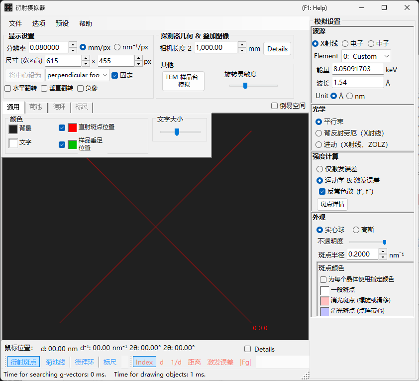
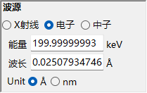
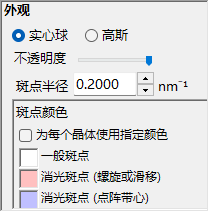
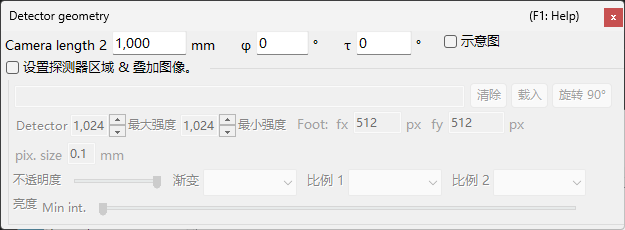

# X 射线 / 中子衍射模拟

**X 射线 / 中子衍射模拟**计算单晶的 X 射线和中子衍射图样。它是[衍射模拟器](index.md)的主要模式之一。

> 本页列出当你选择 **Wave Length = X-ray**（或 Neutron）时在右侧出现的每一项设置。绘制、保存等窗口级操作请参见[概览页](index.md)。

GUI 条件: Wave Length = X-ray / Neutron · Incident beam = Parallel / Precession (X-ray) / Back-Laue · Intensity calculation = Only excitation error / Kinematical

---

## 概览

X 射线的波长比电子长（Cu Kα: 0.15406 nm = 1.5406 Å），因此埃瓦尔德球的曲率更大。结果同时满足衍射条件的倒易点阵点数量比电子少。由于原子散射能力较小且多重散射较弱，运动学衍射理论对衍射强度即可给出足够的精度（动力学计算仅支持电子）。

---

## Wave Length

选择 **X-ray** 作为辐射源。X 射线可以用两种方式指定: 特征 X 射线和同步辐射。

### 特征 X 射线

选择一个**元素**和一个**跃迁**即可确定特征 X 射线的波长。跃迁以 Siegbahn 记号指定（Kα₁ / Kα₂ / Kβ 等）。代表性元素的 Kα₁ 波长:

| 元素 | 谱线 | 波长 (Å) | 能量 (keV) |
|---------|------|-----------------|--------------|
| Cu | Kα₁ | 1.5406 | 8.048 |
| Mo | Kα₁ | 0.7107 | 17.479 |
| Co | Kα₁ | 1.7890 | 6.930 |
| Cr | Kα₁ | 2.2910 | 5.415 |

### 同步辐射

将 **Element** 设为 **0: Custom**，直接输入能量 (keV) 或波长 (Å)。可以使用任意波长。

---

## 入射束模式

选择入射束的几何。X 射线有三种模式可用。

### Parallel

标准平面波。用于 SAED 和单晶 X 射线衍射的平行入射束。

### Precession (X-ray) — 进动相机

模拟 X 射线进动相机。这是一张捕获倒易点阵单一层面的进动照片。

### Back-Laue（背反射劳厄）

用白色（多色）X 射线模拟背反射劳厄图样。在这种背反射几何中，探测器放置在辐射源一侧，并关闭 **Monochrome**。反射几何由 **Detector geometry** 中的 **Tau / Phi** 给定（参见 [Detector geometry](index.md#detector-geometry)）。

> **注记**: 入射束选项随波长而变化。**Precession (electron)** 和 **Convergence (CBED)** 仅在选择电子辐射时出现，而上述 **Precession (X-ray)** 和 **Back-Laue** 选项仅在选择 X 射线辐射时出现。对于中子，只有 **Parallel** 可用。根据截图时的状态，屏幕截图可能未显示 X 射线专用的选项。

---

## 强度计算

选择用于计算斑点强度的方法。X 射线有两种模式可用。

### Only excitation error

强度仅由埃瓦尔德球与倒易点阵点之间的几何距离（偏离矢量 $s_g$）决定。$\lvert s_g \rvert$ 越小强度越高，在 **Radius** 设定的值处达到峰值，当 $\lvert s_g \rvert$ 超过 Radius 时降为零。结构因子被忽略。

### Kinematical & excitation error

除偏离矢量外，运动学结构因子 $\lvert F_{hkl} \rvert^2$ 也被纳入强度。严格遵守消光规则。不包含洛伦兹因子和偏振因子（这是对几何图样的模拟）。

> **注记**: **动力学理论**对 X 射线被禁用（仅在选择电子辐射时可用）。

---

## 斑点外观

控制每个衍射斑点的渲染方式。

- **Solid sphere / Gaussian** : 倒易点阵点的几何模型。**Solid sphere** 使用半径 *R* 的球与埃瓦尔德球的截面（圆的面积对应于衍射强度）；**Gaussian** 使用 σ = *R* 的三维高斯函数与埃瓦尔德球的截面（二维高斯函数的积分对应于衍射强度）。
- **Opacity** : 斑点的透明度（0 = 透明，1 = 不透明）。
- **Radius (R)** : 倒易点阵点的半径。渲染出的斑点尺寸由 **Appearance** 和 **Intensity calculation** 的组合决定。
- **Brightness** : 仅在 **Gaussian** 模式下有效。设定所渲染高斯函数的积分强度。
- **Color scale** : 在 **Gray scale** 和 **Cold-warm** 两种颜色映射之间选择。
- **Log scale** : 以对数刻度显示强度。
- **Spot color** : 当颜色刻度不适用时的默认斑点颜色。
- **Use crystal color** : 勾选后，以分配给每个晶体的颜色绘制斑点。

---

## 德拜环（多晶）

可以显示多晶样品的德拜环。在工具栏上启用 **Debye rings**（参见 [Toolbar](index.md#toolbar)）。

- **Ignore diffraction intensity** : 以相同的颜色和强度绘制所有环（用于忽略结构因子的纯几何比较）。
- **Show index label** : 在每个环附近显示 (*hkl*) 指数。

详细设置位于[选项卡菜单](index.md#drawing-overlay-tabs)的 Debye rings 选项卡。

---

## 中子衍射

在 Wave Length 控件中选择 **Neutron** 即可计算中子衍射图样。输入能量 (meV) 或波长 (nm)。入射束只能为 **Parallel**。强度计算可以是 **Only excitation error** 或 **Kinematical**（不提供 Dynamical）。运动学强度使用中子散射长度代替原子散射因子。

---

## X 射线衍射与电子衍射的区别

| 特征 | X 射线衍射 | 电子衍射 |
|---------|-------------------|----------------------|
| 波长 | 长 (0.5–2.5 Å) | 短 (0.02–0.04 Å) |
| 埃瓦尔德球曲率 | 大 | 小（近乎平坦） |
| 同时反射数 | 少 | 多 |
| 散射因子 | 原子散射因子 $f(s)$ | 电子散射因子 $f_e(s)$ |
| 动力学效应 | 通常较小 | 大 |
| 消光规则 | 严格遵守 | 可能因多重散射而被违反 |

---

## 通用操作

相机长度、探测器几何、保存图样、颜色设置等窗口级操作请参见[概览页](index.md)。详细的探测器几何在下面的几何窗口中配置。

---

## 另请参阅

- [衍射模拟器（概览）](index.md)
- [SAED 模拟](1-saed-simulation.md)
- [进动电子衍射 (PED) 模拟](2-ped-simulation.md)
- [会聚束电子衍射 (CBED) 模拟](3-cbed-simulation.md)
- [坐标系 — 晶体取向](../appendix/a1-coordinate-system/1-orientation.md)
