# Crystal Diffraction (衍射模拟器)

**Crystal Diffraction (衍射模拟器)** 模拟单晶 X 射线、中子和电子衍射图样。

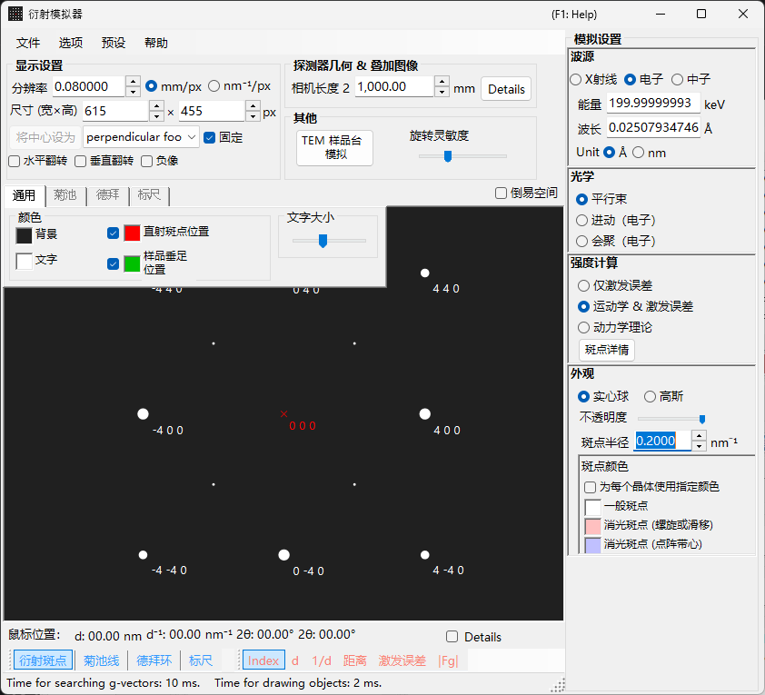

窗口**左侧**为衍射图样的绘制区，**右侧**为衍射斑点属性的设置面板（波长、入射束、强度计算、外观等）。波长与入射束的组合决定采集模式（X 射线衍射、SAED、PED、CBED），右侧面板也随之重新配置。

---

## 本页与各模式页面如何分工

- **本页（枢纽页）**：汇总每个模式共有的操作（快捷键、菜单、工具栏、屏幕/探测器信息、叠加层选项卡、衍射斑点信息、探测器几何、动态压缩）。
- **各模式页面**：涵盖选中该模式时**右侧出现的每一项设置**（波长、入射束、强度计算、外观、布洛赫波设置、进动设置等），因此每个页面都是自包含的（各模式之间存在一些重叠）。

| 模式 | 内容 | 页面 |
|------|----------|------|
| **X 射线（及中子）衍射** | 单晶 X 射线 / 中子衍射图样（平行束、进动 X 射线、Back Laue） | [X 射线衍射模拟](4-x-ray-neutron-diffraction.md) |
| **SAED** | 平行束电子衍射（选区电子衍射） | [SAED 模拟](1-saed-simulation.md) |
| **PED** | 进动电子衍射 | [PED 模拟](2-ped-simulation.md) |
| **CBED** | 会聚束电子衍射 | [CBED 模拟](3-cbed-simulation.md) |

---

## 模式速查

根据**波长（源）**与**入射束**的组合，查找你需要的页面。

| 波长 | 入射束 | 模式 | 页面 |
|------------|--------------------|------|------|
| 电子 | 平行 | SAED | [SAED 模拟](1-saed-simulation.md) |
| 电子 | 进动（电子 = PED） | PED | [PED 模拟](2-ped-simulation.md) |
| 电子 | 会聚（CBED） | CBED | [CBED 模拟](3-cbed-simulation.md) |
| X 射线 | 平行 | X 射线衍射 | [X 射线衍射模拟](4-x-ray-neutron-diffraction.md) |
| X 射线 | 进动（X 射线） | 进动 X 射线（进动相机） | [X 射线衍射模拟](4-x-ray-neutron-diffraction.md) |
| X 射线 | Back Laue | 背反射劳厄 | [X 射线衍射模拟](4-x-ray-neutron-diffraction.md) |
| 中子 | 平行 | 中子衍射 | [X 射线衍射模拟的中子部分](4-x-ray-neutron-diffraction.md) |

> **Note**: 入射束的可选项随波长而变化。对于电子：**平行、进动（电子 = PED）、会聚（CBED）**；对于 X 射线：**平行、进动（X 射线）、Back Laue**；对于中子：仅 **平行**。选择 **进动（电子 = PED）** 或 **会聚（CBED）** 会自动将强度计算切换为 **Dynamical**。

---

## 键盘与鼠标快捷键

这些快捷键适用于 X 射线、SAED 和 PED 模拟共用的衍射图样窗口。在图样上拖动可旋转**晶体**。此处**没有鼠标滚轮缩放**——请用右键单击 / 右键拖动进行缩放。

| 快捷键 | 操作 |
|----------|--------|
| <kbd>F1</kbd> | 打开在线手册的本页 |
| 在中心附近左键拖动 | 倾斜晶体 |
| 在外侧区域左键拖动 | 使晶体绕束轴自旋 |
| 在斑点上左键双击 | 显示反射详情（指数、*d*、结构因子、偏离矢量） |
| 中键拖动 | 平移图样 |
| <kbd>CTRL</kbd> + 中键拖动 | 移动探测器中心（当显示探测器区域时） |
| 右键单击 | 缩小 |
| 右键拖出选框 | 放大到所选区域 |
| 在状态栏右键双击 | 复制当前设置的文本摘要 |
| 在已点亮的图层按钮（衍射斑点 / 菊池线 / 德拜环 / 标尺）上右键双击 | 让该图层闪烁开关 |

从此处打开的辅助窗口还增加了几项：

| 快捷键 | 操作 |
|----------|--------|
| 在极射赤平投影上左键双击 — **TEM 样品台** | 将样品台倾角设为该点 |
| 方向键 — **TEM 样品台** | 逐步改变样品台倾角（先勾选 **Arrow keys**） |
| 拖入 `.prm` 文件或图像 — **探测器几何** | 加载探测器几何 / 叠加图像 |
| 拖入 `.txt` 曲线 — **动态压缩** | 加载压力/时间曲线（拖动图中的红线进行擦动浏览） |

主窗口的全局 <kbd>CTRL</kbd>+<kbd>SHIFT</kbd> 快捷键在本窗口获得焦点时同样有效（见 [主窗口](../0-main-window.md)）。

→ 一览所有窗口的快捷键，请见 **[21. 键盘与鼠标快捷键](../21-shortcuts.md)**。

---

## 按目标快速导航

| 目标 | 从何处开始 | 参考 |
|------|------------|-----------|
| 生成平行束电子衍射（SAED） | 将 **入射束** 设为 **平行**，**波长** 设为电子 | [SAED 模拟](1-saed-simulation.md)、[平行束 SAED 计算](../appendix/a3-bloch-wave/calculation.md) |
| 生成单晶 X 射线衍射 | 将 **波长** 切换为 X 射线 / 同步辐射 | [X 射线衍射模拟](4-x-ray-neutron-diffraction.md) |
| 生成进动电子衍射（PED） | 将 **入射束** 设为 **进动（电子）**，然后设置半角和步长 | [PED 模拟](2-ped-simulation.md) |
| 生成会聚束电子衍射（CBED） | 将 **入射束** 设为 **会聚（CBED，仅限电子）**，并在 CBED 窗口中设置条件 | [CBED 模拟](3-cbed-simulation.md)、[CBED 计算](../appendix/a3-bloch-wave/cbed.md) |
| 查看动力学计算得到的反射列表 | 选择 **动力学理论** 并打开 **斑点详情** 或 **Details** | [动力学计算（共享内核）](../appendix/a3-bloch-wave/calculation.md) |
| 将探测器几何与实验图像对照 | 通过 **Details** 打开探测器几何设置并使用叠加图像 | [探测器坐标系](../appendix/a1-coordinate-system/2-diffraction.md) |

---

## 主区域

衍射图样在屏幕中央进行模拟。

### 鼠标操作

见本页顶部的“键盘与鼠标快捷键”。

### 鼠标位置

与光标位置对应的信息（光标处的 *q*、*d*、2θ、方位角等）显示在图样上方的状态行中。勾选 **Details** 会增加更详细的信息（最近反射的 (*hkl*)、偏离矢量、结构因子等）。

---

## 文件菜单

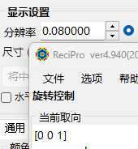

| 菜单项 | 说明 |
|-----------|-------------|
| **保存图像** | 将显示的衍射图样保存到文件。 |
| **保存探测器区域** | 仅保存探测器区域的裁剪。 |
| **复制** | 将显示的图像复制到剪贴板。 |
| **复制探测器区域** | 仅复制探测器区域的裁剪。 |

### 预设 {#toolbar}

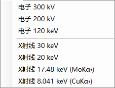

将完整的模拟器配置——波长、探测器几何、选项卡设置、衍射斑点属性等——保存并以预设形式调用。便于在不同仪器 / 采集模式之间快速切换。

---

## 工具栏

| 按钮 | 说明 |
|--------|-------------|
| 衍射斑点 | 显示 / 隐藏衍射斑点图层 |
| 菊池线 | 显示 / 隐藏菊池线图层 |
| 德拜环 | 显示 / 隐藏德拜环图层 |
| 标尺 | 显示 / 隐藏刻度线图层 |
| Index / d / Distance / Excitation error / Structure factor | 选择附加到每个斑点的标签 |

---

## 屏幕与探测器信息

### 屏幕

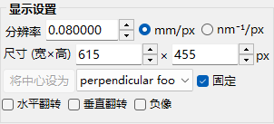

| 项目 | 说明 |
|------|-------------|
| **分辨率** | 一个像素的尺寸（mm）。它不必等于探测器实际的像素尺寸；它被视为显示比例，并在你用鼠标缩放时自动更新。 |
| **尺寸 (宽×高)** | 绘制区的像素宽度和高度。取决于你的显示分辨率，过大的值可能无法设置。 |
| **将中心设为 / 固定** | 将图样中心设为绘制区内任意像素，并在需要时将其固定。固定后，中心无法通过鼠标平移移动。 |
| **水平翻转 / 垂直翻转 / 负像** | 对显示图样进行几何翻转（水平 / 垂直）和对比度反转。用它来匹配实验图像的取向或对比度。 |
| **倒易空间** | 在图样上叠加埃瓦尔德球和倒易点阵矢量，可视化哪些反射被激发。 |

### 探测器（相机长度）

- **Camera length** : 从样品到探测器的距离（mm）。
- **Details** : 打开探测器几何设置窗口（见下文 [探测器几何](#detector-geometry)）。

### 其他

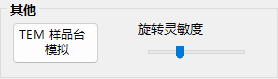

- **旋转灵敏度** : 鼠标每拖动一个像素时晶体旋转的幅度。
- **TEM 样品台模拟** : 打开与样品台联动的模拟窗口（见下文）。

---

## TEM 样品台模拟 {#drawing-overlay-tabs}

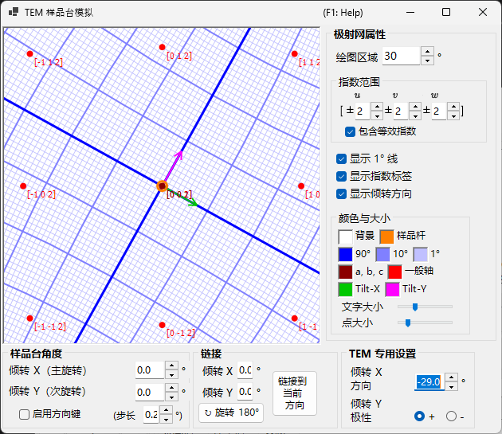

打开一个窗口，将衍射图样与双倾（或旋转）**TEM 样品台**联动。设置样品台倾角会更新图样和晶体取向，可达取向可在极射赤平投影上显示（v4.914 新增）。在极射赤平投影上左键双击会将样品台倾角设为该点，勾选 **Arrow keys** 后可用方向键逐步改变倾角。

---

## 绘制叠加层选项卡

### 通用

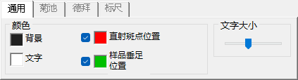

设置斑点、标签、菊池线、德拜环及其他叠加层的颜色。此处的设置适用于所有渲染模式。

### 菊池线

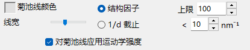

在工具栏启用菊池线时生效。

- **反射选择** : 选择由哪些反射生成菊池线。可选 **结构因子**（按 $\lvert F_{hkl}\rvert$ 排名靠前的 *N* 个反射）或 **1/d 截止**（所有 1/d 低于阈值（nm⁻¹）的反射）。
- **线条外观** : 设置线宽、菊池线颜色以及 **对菊池线应用运动学强度**（按反射的运动学强度缩放线条暗度）。
- **阈值** : 一个遗留参数。仅对 *d* 大于指定值的反射运行菊池线计算（为兼容性而保留）。

### 德拜环

在工具栏启用德拜环时生效。

- **忽略衍射强度** : 若勾选，所有德拜环都以相同的颜色和强度绘制（忽略晶体结构因子）。用于纯几何比较。
- **显示指数标签** : 若勾选，(*hkl*) 会出现在每个环附近。

### 标尺

在工具栏启用刻度线时生效。

- **2θ / 方位角刻度线** : **2θ** 表示等散射角（同心圆），**方位角** 表示等方位角（从中心发出的径向线）。两者颜色可独立配置。
- **线宽** : 刻度线的粗细。
- **分度** : 相邻刻度线之间的角度间隔。
- **显示标尺标签** : 是否在刻度线上绘制数字标签。

### Misc {#diffraction-spot-information}

诸如鼠标旋转灵敏度等杂项设置。

- **Mouse sensitivity** : 鼠标每拖动一个像素时晶体旋转的幅度。

---

## 衍射斑点信息

列出用布洛赫波法（动力学计算）计算的逐反射详情。用 **斑点详情** 按钮（强度计算面板）或 **Details** 复选框打开它。

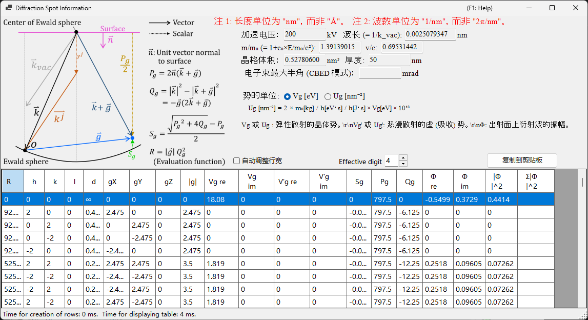

### 示意图与定义

示意图（左上）显示埃瓦尔德球上的矢量，并定义表中所用的量（$\hat{\mathbf{n}}$ 是垂直于样品表面的单位法向矢量，$\mathbf{k}$ 是入射波矢，$\mathbf{g}$ 是倒易点阵矢量）。

- $P_g = 2\,\hat{\mathbf{n}} \cdot (\mathbf{k} + \mathbf{g})$
- $Q_g = |\mathbf{k}|^2 - |\mathbf{k} + \mathbf{g}|^2 = -\mathbf{g} \cdot (2\mathbf{k} + \mathbf{g})$
- **偏离矢量:** $S_g = \dfrac{\sqrt{P_g^2 + 4 Q_g} - P_g}{2}$
- **评价函数:** $R = |\mathbf{g}|\, Q_g^2$ — 按反射被激发的强弱排序（越小 = 越接近埃瓦尔德球 = 激发越强；透射束 $g=0$ 的 $R=0$ 排在最前）。表按 $R$ 升序排序。

### 表格列

| 列 | 含义 |
|--------|---------|
| **R** | 评价函数 $R = \lvert\mathbf{g}\rvert\, Q_g^2$（见上；用于选择 / 排序反射） |
| **h, k, (i,) l** | 米勒指数（*i* 是冗余的六方指数，仅对六方晶体显示） |
| **d** | 晶面间距（nm） |
| **gX, gY, gZ** | 倒易点阵矢量 *g* 的分量（1/nm） |
| **\|g\|** | *g* 的模（1/nm） |
| **Vg re / Vg im** | 弹性散射的晶体势傅里叶系数 $V_g$（实部 / 虚部） |
| **V'g re / V'g im** | 热漫散射（TDS）的虚（吸收）势 $V'_g$（实部 / 虚部） |
| **Sg** | 偏离矢量 $S_g$（见上；1/nm） |
| **Pg** | 辅助量 $P_g = 2\,\hat{\mathbf{n}}\cdot(\mathbf{k}+\mathbf{g})$（见上） |
| **Qg** | 辅助量 $Q_g = -\mathbf{g}\cdot(2\mathbf{k}+\mathbf{g})$（见上） |
| **Φ re / Φ im** | 出射面上动力学衍射波的复振幅 $\Phi$（实部 / 虚部） |
| **\|Φ\|^2** | 该反射的衍射强度 $\lvert\Phi\rvert^2$ |
| **Σ\|Φ\|^2** | $\lvert\Phi\rvert^2$ 的累积和（对所有反射求和；可用作强度守恒检验） |

### 势的单位及其他控件

- **Unit of potential** : 在 **Vg [eV]**（静电势，eV）与 **Ug [nm⁻²]**（进入布洛赫波方程的缩放量 $U_g = (2 m_0/h^2)\, V_g$）之间切换显示的势。列标题也相应地在 *Vg / V'g* 与 *Ug / U'g* 之间变化。
- 表格上方显示加速电压、波长（$\lambda = 1/k_\text{vac}$）、相对论质量比 $m/m_0$、速度比 $v/c$、点阵体积、样品厚度，以及（在 CBED 模式下）电子束的最大半角。
- **Note 1:** 长度单位为 **nm**，而非 Å。**Note 2:** 波数单位为 **1/nm**，而非 2π/nm。
- **Effective digit** : 表中显示的有效数字位数。**Auto resize row width** : 自动适配列宽。**Copy to clipboard** : 将表格导出为可粘贴到电子表格中的文本。（即使在日文界面下，此窗体也以英文显示。）

---

## 探测器几何 {#detector-geometry}

用于详细设置探测器几何（相机长度、倾斜、旋转）并叠加实验图像的窗口。从 **Detector geometry** 面板中的 **Details** 打开它。

### 探测器几何设置

指定反射几何，如相机长度和探测器倾斜（**Tau / Phi**）。对于 Back Laue（背反射劳厄），在此处设置将探测器置于源侧的几何。

### 探测器区域与叠加图像

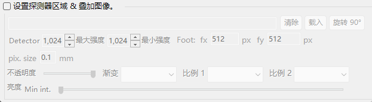

指定探测器的有效区域，并拖入实验图像进行叠加。用它来叠加模拟图样与实验图像，并微调探测器几何。

坐标系定义另见 [探测器坐标系](../appendix/a1-coordinate-system/2-diffraction.md)。

---

## 动态压缩

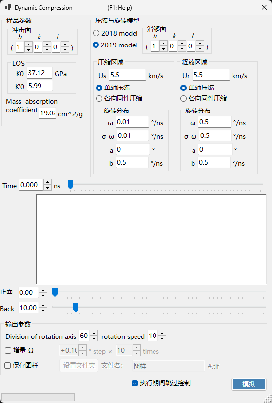

用于擦动浏览高压（动态压缩）实验的压力/时间曲线的窗口。将 `.txt` 压力/时间曲线拖入此窗口以加载它，然后拖动图中的红线，即可连续扫过时间（压力），同时在衍射图样中反映相应状态。

---

## 相关主题

- [X 射线衍射模拟](4-x-ray-neutron-diffraction.md)
- [SAED 模拟](1-saed-simulation.md)
- [PED 模拟](2-ped-simulation.md)
- [CBED 模拟](3-cbed-simulation.md)
- [动力学计算（共享内核）](../appendix/a3-bloch-wave/calculation.md)
- [探测器坐标系](../appendix/a1-coordinate-system/2-diffraction.md)
