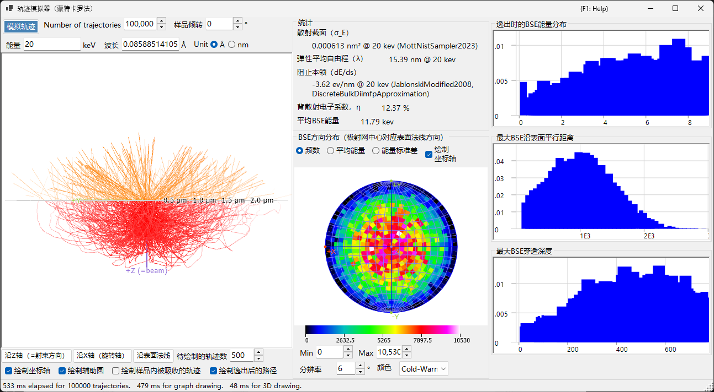
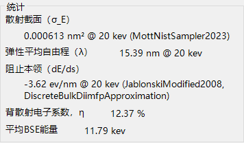
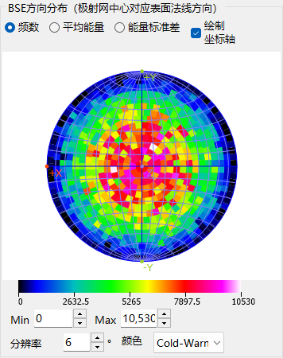
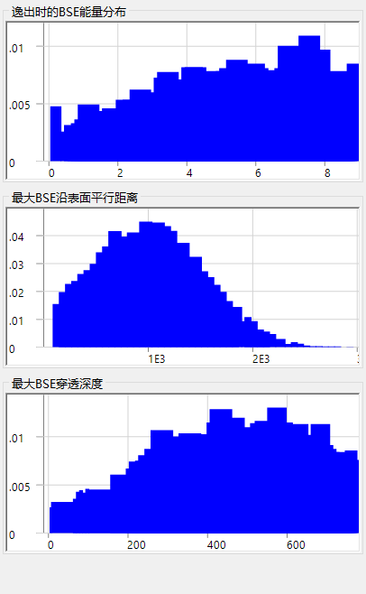

# 电子轨迹

**轨迹模拟器** 使用 **蒙特卡罗法** 计算电子在样品内部的轨迹：入射电子经历弹性和非弹性散射，由此得到的背散射电子分布（方向、能量、穿透深度）被累加统计。这些分布还为 [12. EBSD 模拟](12-ebsd-simulation.md) 所用的方位/能量/深度加权提供数据。

---

## 键盘和鼠标快捷键

轨迹显示在 3D OpenGL 视图中。它采用 ReciPro 的标准 [视图导航](21-shortcuts.md)，但 **平移已被禁用** — 请使用视图预设按钮跳转到标准取向。

| 快捷键 | 操作 |
|----------|--------|
| <kbd>F1</kbd> | 打开本页在线手册 |
| 左键拖动 | 旋转模型 |
| 右键上下拖动，或鼠标滚轮 | 缩放 |
| <kbd>CTRL</kbd> + 右键双击 | 切换正射/透视投影 |

→ 全部窗口一览请参见 **[21. 键盘和鼠标快捷键](21-shortcuts.md)**。

---

## 计算条件

入射束能量、入射电子数、样品/材料以及其他蒙特卡罗参数（参见上方的概览截图）。

### 束流能量

入射电子束的加速电压 (keV)。设定弹性 (Mott) 与非弹性（介电响应）散射模型所共用的动能。

### 入射电子数

要模拟的电子数量。电子越多，统计噪声越小，但运行时间随之线性增加。

### 样品 / 材料

样品的组成和密度。默认采用主窗口中当前选择的晶体，但在仅进行轨迹研究时可以覆盖。

### 样品倾斜

样品倾斜角。当轨迹数据馈入 [EBSD 模拟器](12-ebsd-simulation.md) 时使用（EBSD 通常为 70°）。

### 截面模型

弹性散射截面模型 (Mott / Bethe / NIST)。不同的模型在大倾斜角或接近吸收边时，在速度与精度之间作不同的权衡。

---

## 极射赤平投影选项

绘制在极射赤平投影上的角度分布的显示选项（参见上方的概览截图）。

### 投影法

**Wulff**（等角）或 **Schmidt**（等积）投影。读取统计密度时通常优先选用 Schmidt。

### 半球

绘制上半球（背散射侧）或下半球（透射侧）。

### 分辨率 / 色阶

角度直方图的分箱大小，以及用于密度显示的色彩映射。

---

## 统计信息

运行结果的摘要。

- **背散射产额** — 经入射面射出的入射电子所占比例。
- **平均自由程** — 散射事件之间的平均距离。
- **平均穿透深度** — 电子在射出或被吸收之前所达到的平均最大深度。
- **耗时 / 吞吐量** — 运行的实际时钟开销。

---

## BSE 方向分布

背散射电子的角度分布（极射赤平投影中心对应表面法线方向）。黄色/橙色轮廓（若存在）标示 EBSD 探测器所张成的区域。

---

## 剖面图

模拟电子的深度和能量剖面图。

### 深度剖面图

背散射电子最终射出深度 (nm) 的直方图。EBSD 模拟器用它来对 master pattern 的深度积分进行加权。

### 能量剖面图

背散射电子能量损失 ΔE (keV) 的直方图。EBSD 模拟器用它来对能量积分进行加权。

---

## 另见

- [EBSD 模拟](12-ebsd-simulation.md)
- [EBSD 计算](appendix/a3-bloch-wave/ebsd.md)
- [动力学衍射（布洛赫波）](appendix/a3-bloch-wave/index.md)
- [HRTEM/STEM 模拟器](9-hrtem-stem-simulator/index.md)
- [衍射模拟器](7-diffraction-simulator/index.md)
