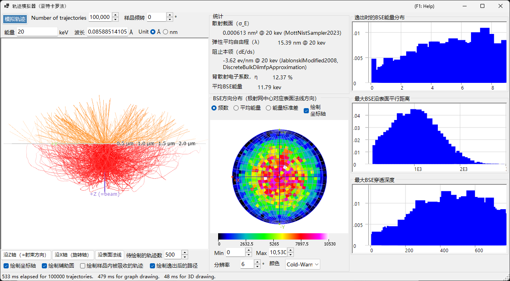
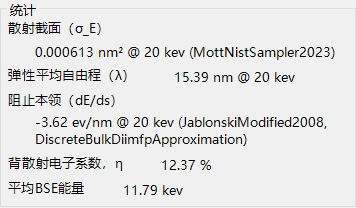
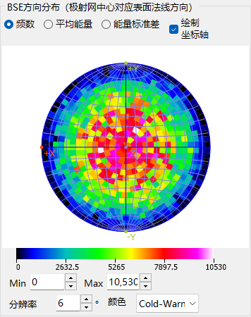
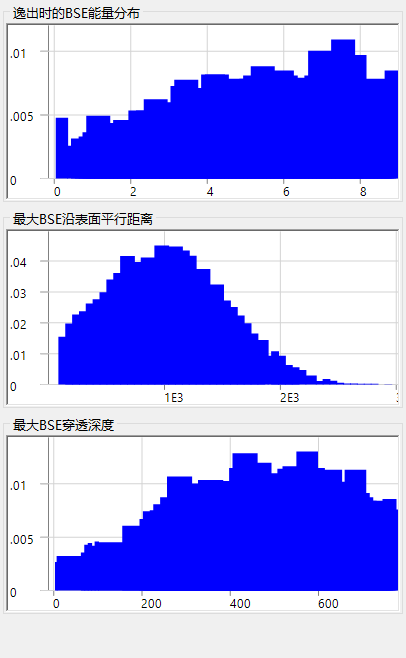

# 电子轨迹

**轨迹模拟器（蒙特卡罗法）** 使用 **蒙特卡罗法** 计算电子在样品内部的轨迹：入射电子经历弹性和非弹性散射，由此累加统计背散射电子 (BSE) 的各种分布——射出方向、逸出时的能量、穿透深度和横向扩展。这些分布还为 [12. EBSD 模拟](12-ebsd-simulation.md) 所用的角度/能量/深度加权提供数据。

窗口分为三列：左侧为 **3D 轨迹视图**，中间为 **统计** 和 **BSE 方向分布** 极射赤平投影，右侧为三个 **直方图**。样品的组成和密度取自主窗口中选中的晶体；此处只需设置束流能量、样品倾转和轨迹数。

---

## 键盘和鼠标快捷键

轨迹显示在 3D OpenGL 视图中。它采用 ReciPro 的标准 [视图导航](21-shortcuts.md)，但 **平移已被禁用** — 请使用视图预设按钮跳转到标准取向。

| 快捷键 | 操作 |
|----------|--------|
| <kbd>F1</kbd> | 打开本页在线手册 |
| 左键拖动 | 旋转模型 |
| 右键上下拖动，或鼠标滚轮 | 缩放 |
| <kbd>CTRL</kbd> + 右键双击 | 切换正射/透视投影 |

→ 全部窗口一览请参见 **[21. 键盘和鼠标快捷键](21-shortcuts.md)**。

---

## 计算条件

窗口顶部的控件用于设置一次运行：

- **模拟轨迹** ：开始蒙特卡罗计算。底部状态栏分别显示轨迹计算、图表绘制和 3D 渲染所耗费的时间。
- **Number of trajectories** ：要追踪的入射电子数。电子越多，下述各分布的统计噪声越小，但运行时间随之线性增加。
- **样品倾转** (°)：样品表面绕 *X* 轴的倾转角。垂直入射时保持为 0；若要重现 [EBSD 模拟器](12-ebsd-simulation.md) 的几何配置，请使用 **−70°**，大倾转角可提高背散射产额。
- **能量** (keV) / **波长** / **Unit** ：入射束的加速电压，以及与之联动的经相对论修正的电子波长。该能量设定了弹性 (NIST Mott) 和非弹性（阻止本领 / IMFP）两种模型所用的动能。

散射模型本身不可由用户选择：弹性散射截面取自内置的 NIST Mott 表（超出其范围时退回到屏蔽 Rutherford 截面），阻止本领采用修正的 Jablonski (2008) 形式。实际使用的模型显示在 **统计** 中各数值的旁边。这些模型的具体内容请参见 [衰减与输运](appendix/a2-beam-interaction/attenuation-transport.md)。

### 3D 轨迹视图

红色轨迹表示在样品内被吸收的电子，橙色轨迹表示作为背散射电子逸出的电子。同心辅助圆以 nm（或 µm）标注，**+X**、**+Y**、**+Z (=beam)** 表示各坐标轴。

- **沿Z轴（=射束方向）** / **沿X轴（旋转轴）** / **沿表面法线** ：将视图切换到标准方向。
- **待绘制的轨迹数** ：在计算得到的轨迹中实际绘制多少条（若把 100,000 条全部画出，既看不清又很慢）。
- **绘制坐标轴** / **绘制辅助圆** ：坐标轴箭头和距离标尺。
- **绘制样品内被吸收的轨迹** ：同时绘制未能逸出的电子。
- **绘制逸出后的路径** ：背散射电子离开表面后继续绘制其路径。

---

## 统计

当前束流能量下的各数值，括号中注明了得出各数值所用的模型。

- **散射截面（σ_E）** (nm²) — 每个原子的总弹性散射截面。
- **弹性平均自由程（λ）** (nm) — 相邻两次弹性散射之间的平均距离。
- **阻止本领（dE/ds）** (eV/nm，负值) — 单位路径长度上损失的能量。
- **背散射电子系数，η** (%) — 入射电子中再次经入射面射出的比例。BSE 像的衬度正是基于这一量。
- **平均BSE能量** (keV) — 背散射电子在逸出时刻的平均能量。

---

## BSE 方向分布

背散射电子的角度分布，绘制在以表面法线方向为中心的极射赤平投影上。

- **频数** / **平均能量** / **能量标准差** ：映射为颜色的量——各方向射出的电子数、其平均能量或该能量的离散程度。
- **绘制坐标轴** ：叠加显示 +X / ±Y / ±Z 方向。
- **Min** / **Max**、**分辨率**、**颜色** ：色阶的上下限、直方图的角度分箱大小以及色彩映射。

---

## 直方图

背散射电子的三种分布，均归一化为单位面积。

### 逸出时的BSE能量分布

背散射电子 **离开样品时仍携带的能量** (keV) 的直方图——而不是其能量损失。EBSD 模拟器用它来对 master pattern 的能量积分进行加权。

### 最大BSE沿表面平行距离

每个背散射电子在逸出之前 **横向**（平行于表面，nm）移动距离的直方图。它表示相互作用体积的横向尺寸，因而也就是 BSE 或 EBSD 测量固有的空间分辨率极限。

### 最大BSE穿透深度

每个背散射电子在逸出之前 **垂直于表面** 所达到的最大深度 (nm) 的直方图。EBSD 模拟器用它来对 master pattern 的深度积分进行加权。

---

## 另见

- [EBSD 模拟](12-ebsd-simulation.md)
- [EBSD 计算](appendix/a3-bloch-wave/ebsd.md)
- [衰减与输运](appendix/a2-beam-interaction/attenuation-transport.md) — 此处使用的弹性散射截面、阻止本领和射程。
- [动力学衍射（布洛赫波）](appendix/a3-bloch-wave/index.md)
- [HRTEM/STEM 模拟器](9-hrtem-stem-simulator/index.md)
- [衍射模拟器](7-diffraction-simulator/index.md)
