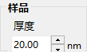
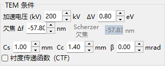
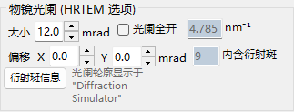
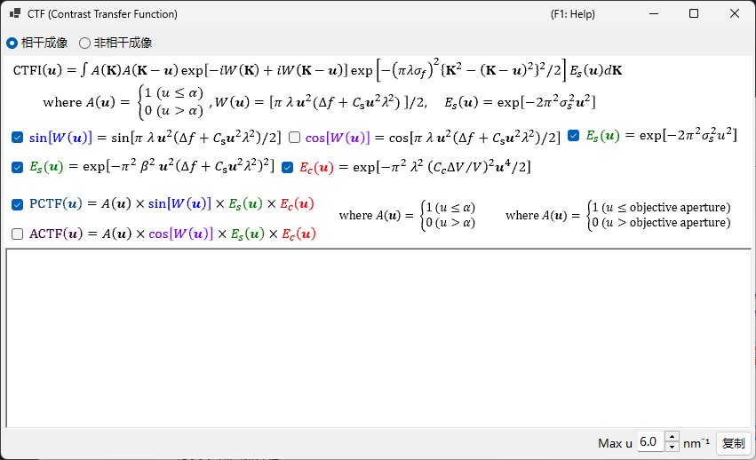
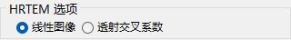
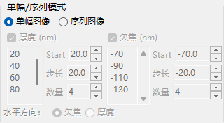
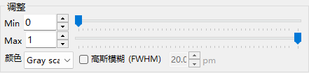

# HRTEM 模拟

模拟高分辨 TEM 晶格条纹像。这是 [HRTEM/STEM 模拟器](index.md) 的主要模式。

---

## 计算流程

1. **布洛赫波法**：计算电子波在晶体势中的传播；得到出射波的振幅与相位
2. **透镜函数**：施加物镜的像差（球差 $C_s$、欠焦 $\Delta f$）
3. **部分相干**：考虑有限的源尺寸（空间相干性）和能量展宽（时间相干性）
4. **成像**：计算强度 $|\psi(\mathbf{r})|^2$

---

## 样品参数

| 参数 | 说明 |
|-----------|-------------|
| **Thickness** | 样品厚度（nm）。HRTEM 像强烈依赖于厚度 |

---

## 光学参数

### TEM 条件

| 参数 | 说明 |
|-----------|-------------|
| **Acc. Vol.** | 加速电压（kV）。旁边显示经相对论修正的波长 |
| **Defocus** | 欠焦值（nm）。以谢尔策欠焦作为参考显示 |

### 固有参数

| 参数 | 说明 | 典型值 |
|-----------|-------------|---------|
| **Cs** | 球差（mm） | 0.5–1.0（常规）；< 0.01（球差校正） |
| **Cc** | 色差（mm） | 1.0–2.0 |
| **β** | 照明半角（mrad） | 0.1–1.0 |
| **ΔE** | 能量展宽 1/*e* 宽度（eV） | 0.5–2.0 |

---

## 相位衬度传递函数（PCTF）

显示于透镜函数选项卡中：

- $\sin\chi(u)$：相位衬度传递函数（$\chi(u)$ 为透镜像差函数）
- $E_\text{s}(u)$：空间相干包络
- $E_\text{c}(u)$：时间相干包络

谢尔策欠焦：$\Delta f = -\sqrt{\tfrac{4}{3}\,C_s \lambda}\ (\approx -1.155\,\sqrt{C_s \lambda})$，该条件给出宽的负 PCTF 带（暗衬度 = 原子位置）。ReciPro 使用此原始谢尔策值——通过将像差相位 $\chi$ 的最小值设为 $-2\pi/3$ 推导得到——GUI 中显示的值遵循此公式；某些文献则改用*扩展谢尔策*值 $-1.2\sqrt{C_s\lambda}$。

---

## 物镜光阑

设置光阑尺寸（mrad）和位置。**Open aperture** 将其移除。所考虑的布洛赫波数目取决于光阑条件。

---

## 部分相干模型

| 模型 | 说明 |
|-------|-------------|
| **Quasi-coherent (linear image)** | 快速。在弱相位近似下有效 |
| **TCC (Transmission Cross Coefficient)** | 更精确；计算时间更长 |

---

## 模拟模式

| 模式 | 说明 |
|------|-------------|
| **Single image** | 在当前厚度和欠焦下生成一幅图像 |
| **Serial image** | 在厚度 × 欠焦范围上生成图像矩阵（Start / Step / Num） |

---

## 图像调整

| 设置 | 说明 |
|---------|-------------|
| **Min / Max** | 显示范围（图像调整滑块） |
| **Colour** | 灰度或 Cold-Warm |
| **Gaussian blur (FWHM)** | 施加高斯滤波 |
| **Unit cell** | 叠加晶胞网格 |
| **Scale** | 显示比例尺 |

---

## 另请参阅

- [HRTEM/STEM 模拟器（概述）](index.md)
- [STEM 模拟](2-stem-simulation.md)
- [势模拟](3-potential-simulation.md)
- [附录 A3.2 — HRTEM 成像](../appendix/a3-bloch-wave/hrtem.md)
