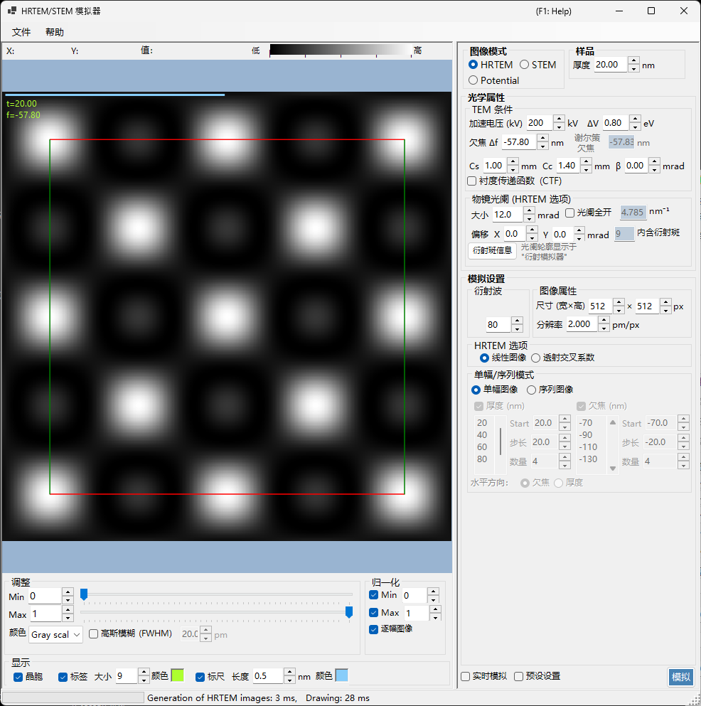
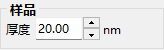
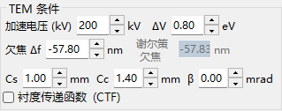
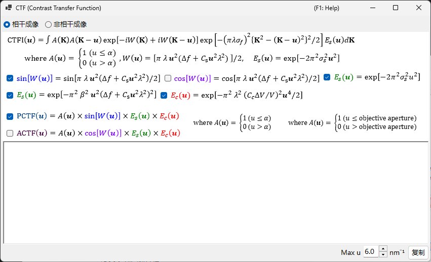
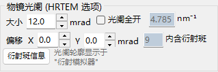
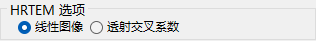
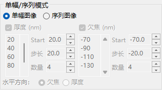
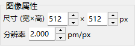
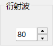

# HRTEM 模拟

**HRTEM（高分辨透射电子显微术）** 模拟用于计算高分辨 TEM 晶格条纹像。这是 [HRTEM/STEM 模拟器](index.md) 的主要模式。

> 本页说明 **图像模式 = HRTEM** 时右侧出现的所有设置。关于左侧的控件（结果的显示及亮度调整），请参见[概述页面](index.md#display-settings)。

---

## 概述

透过样品的电子波在物镜像差的影响下成像，从而形成 HRTEM 像。ReciPro 用布洛赫波法（动力学计算）计算电子波在样品内部的传播，并通过相位衬度传递函数 (PCTF) 生成 HRTEM 像。

### 计算流程

1. **布洛赫波法**：计算电子波在晶体势中的传播，得到出射波的振幅与相位
2. **透镜函数**：施加物镜的像差（球差 $C_s$、欠焦 $\Delta f$）
3. **部分相干**：考虑有限的光源尺寸（空间相干性）和能量涨落（时间相干性）
4. **成像**：计算强度分布 $|\psi(\mathbf{r})|^2$

理论部分请参见[附录 A3.2 — HRTEM 成像](../appendix/a3-bloch-wave/hrtem.md)。

---

## 样品

- **厚度** ：样品厚度 (nm)。HRTEM 像强烈依赖于厚度。在 **序列图像** 模式下，此值被忽略，改用下文所述的厚度列表。

---

## TEM 条件

设置物镜的成像条件。

| 参数 | 说明 | 默认值 / 典型值 |
|-----------|-------------|-------------------|
| **加速电压 (kV)** | 加速电压。右侧显示经相对论修正的电子波长 | 200 kV |
| **欠焦 Δf** | 物镜的欠焦量 (nm)。其下方显示作为参考的 **谢尔策欠焦** 值 | −57.8 nm |
| **Cs** | 球差系数 (mm)。影响 CTF 和谢尔策欠焦 | 0.5–1.0（常规），< 0.01（球差校正） |
| **Cc** | 色差系数 (mm)。决定由能量展宽引起的图像模糊 | 1.0–2.0 mm |
| **β** | 照明半角 (mrad)。表示有限光源尺寸的效应（空间相干性） | 0.1–1.0 mrad |
| **ΔV** | 电子能量展宽的半高全宽 (eV)。与 Cc 一起决定色差引起的焦点展宽 | 0.5–2.0 eV |

> **右键菜单**：在 TEM 条件面板上，可一键执行 **将所有像差设为零** / **将欠焦设为谢尔策值** / **将欠焦设为 0 nm**。条件预设（300kV ARM300F、200kV 2100F 等）可通过左下方的 **预设设置** 调用。

### 谢尔策欠焦

相位衬度接近最佳的欠焦值，根据当前波长和球差 $C_s$ 计算（仅作参考显示）。

$$\Delta f_{\text{Scherzer}} = -\sqrt{\tfrac{4}{3}\,C_s \lambda}\quad\left(\approx -1.155\,\sqrt{C_s \lambda}\right)$$

在此条件下，PCTF 在很宽的空间频率范围内为负，因此原子位置呈现为暗衬度。ReciPro 采用这一原始的谢尔策值（通过将像差相位 $\chi$ 的最小值设为 $-2\pi/3$ 推导得到），GUI 中显示的值也遵循此公式。注意，某些文献改用可进一步拓宽传递频带的*扩展谢尔策*值 $-1.2\sqrt{C_s\lambda}$。

---

## 透镜函数 / 衬度传递函数 (CTF)

勾选 **衬度传递函数 (CTF)** 会打开一个窗口，绘制透镜像差和欠焦在各空间频率上如何传递图像衬度。

- $\sin\chi(u)$ ：相位衬度传递函数（$\chi(u)$ 为透镜的像差函数）
- $E_\text{s}(u)$ ：空间相干包络函数；由有限光源尺寸 ($\beta$) 引起的衰减
- $E_\text{c}(u)$ ：时间相干包络函数；由能量涨落 ($C_c$, $\Delta V$) 引起的衰减

改变横轴 $u$（空间频率）的上限即可改变绘图范围。

---

## 物镜光阑 (HRTEM 选项)

限制通过物镜光阑的衍射波。被光阑截去的衍射波数量也会改变布洛赫波计算中所包含的衍射斑数量（上限为 **衍射波** 中设置的最大布洛赫波数）。

- **大小** ：物镜光阑的半角 (mrad)。值越小，被截去的高角度衍射波越多，高分辨细节越平滑。同时显示对应的倒易空间半径 $\sin\theta/\lambda$ (nm⁻¹)。
- **偏移 X** / **Y** ：物镜光阑中心的偏移量 (mrad)。用于暗场像和倾斜成像。
- **光阑全开** ：将物镜光阑完全打开（无限大），使所有衍射波都参与成像。
- **内含衍射斑** ：落入光阑内的衍射束（衍射斑）数量（只读）。
- **衍射斑信息** ：打开一个表格，列出光阑内的衍射束（强度、复振幅等）。

> 物镜光阑的大小也会显示在 **衍射模拟器** 中。

---

## HRTEM 选项（部分相干模型）

选择在合并所有入射束方向的贡献时所使用的干涉模型。

- **线性图像** ：计算量小。适用于弱相位物体近似成立的薄样品；将 PCTF 乘以空间相干包络和时间相干包络。
- **透射交叉系数** ：计算量大，但更精确。对完整的透射交叉系数进行积分，适用于会激发许多强衍射波的强散射体。

详情请参见[附录 A3.2 — HRTEM 成像](../appendix/a3-bloch-wave/hrtem.md)。

---

## 单幅/序列模式

- **单幅图像** ：在当前厚度和欠焦下计算一幅 HRTEM 像。
- **序列图像** ：生成一组逐步改变厚度和欠焦的图像（厚度序列 / 欠焦序列）。便于寻找与实验图像最匹配的条件。

对于序列图像，需设置以下各项。

| 项目 | 说明 |
|------|-------------|
| **厚度 (nm)** / **欠焦 (nm)** | 要扫描的量（可同时选择两者） |
| **Start / 步长 / 数量** | 起始值、步长和图像数量。这些值会展开到下方的列表框中，也可以直接编辑该列表 |
| **水平方向：** | 同时扫描厚度和欠焦时，沿网格水平方向排列的量（**欠焦** 或 **厚度**） |

同时扫描厚度和欠焦时，会生成行 × 列的图像矩阵。

---

## 图像属性

- **尺寸 (宽×高)** ：模拟图像的像素数（默认为 512×512）。
- **分辨率** ：采样分辨率 (pm/px)。值越小，可分辨的晶格条纹越精细，但 FFT 时间会成比例地增加。

---

## 衍射波

- Bethe 法（动力学计算）中使用的布洛赫波最大数量，默认为 80。数量越大精度越高，但求解本征值问题需要 $O(N^3)$ 的时间。

---

## 另请参阅

- [HRTEM/STEM 模拟器（概述）](index.md)
- [STEM 模拟](2-stem-simulation.md)
- [势模拟](3-potential-simulation.md)
- [附录 A3.2 — HRTEM 成像](../appendix/a3-bloch-wave/hrtem.md)
