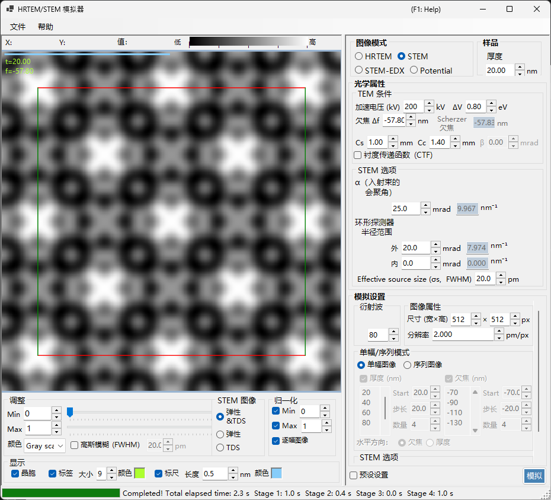
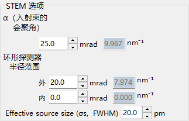
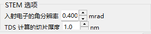
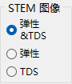

# STEM 模拟

**STEM（扫描透射电子显微术，Scanning Transmission Electron Microscopy）** 模拟使用布洛赫波法计算扫描透射电子显微图像。

> 本页列出当 **Image mode = STEM** 时右侧出现的所有设置。关于左侧的结果显示、亮度和归一化控件，请参阅[概述页面](index.md)。下面仅重复 STEM 特有的**显示对象**。

---

## 概述

会聚电子束在样品上扫描，每个扫描位置处透射和散射的电子由环形探测器收集。ReciPro 使用布洛赫波法（动力学计算）计算 STEM 图像。

### 计算流程

1. 在每个扫描位置，对会聚探针的每个入射方向，用布洛赫波法计算衍射强度。
2. 在探测器的角度范围内对散射强度积分。
3. 弹性散射和热漫散射（TDS）的贡献都可以计算。

理论部分请参阅[附录 A3.4 — STEM 计算](../appendix/a3-bloch-wave/stem.md)。

---

## 探测器类型

| 探测器 | 角度范围 | 主要贡献 | 衬度 |
|----------|-------------|-------------------|----------|
| **BF**（明场） | 0 – 会聚半角 | 弹性 | 相位衬度 |
| **ABF**（环形明场） | 会聚半角内侧部分 | 弹性 | 对轻元素敏感 |
| **LAADF**（低角环形暗场） | 会聚半角外侧附近 | 弹性 + TDS | 对应变敏感 |
| **HAADF**（高角环形暗场） | 远在会聚半角之外 | TDS（非弹性） | Z 衬度（$\propto Z^2$） |

> **典型探测器设置**（每种均可从 STEM 选项的右键菜单中一键调用，全部以会聚半角 α = 25 mrad 为例）：
> BF (0–5 mrad) / ABF (12–24 mrad) / LAADF (26–60 mrad) / HAADF (80–250 mrad)

---

## 样品参数

- **Thickness** ：样品厚度（nm）。在 **Serial image** 模式下此值被忽略。

---

## TEM 条件

| 参数 | 说明 | 默认值 / 典型值 |
|-----------|-------------|-------------------|
| **Acc. Vol. (kV)** | 加速电压。旁边显示经相对论修正的电子波长 | 200 kV |
| **Defocus Δf** | 物镜（探针形成透镜）的欠焦量（nm） | −57.8 nm |
| **Cs** | 球差系数（mm）。影响探针尺寸 | 0.5–1.0 mm |
| **Cc** | 色差系数（mm） | 1.0–2.0 mm |
| **ΔV (FWHM)** | 电子能量分散的半高全宽（eV） | 0.5–2.0 eV |

> **β（照明半角）在 STEM 模式下被禁用**，因为其作用由会聚半角 α 承担。

---

## STEM 选项（光学）

设置会聚探针和环形探测器的几何参数。右侧还会显示每个角度换算为倒空间半径 $\sin\theta/\lambda$（nm⁻¹）后的值。

| 参数 | 说明 | 默认值 / 典型值 |
|-----------|-------------|-------------------|
| **α (convergence angle)** | 会聚探针的半角（mrad）。较大的值得到更细的探针并改变衍射衬度 | 15–25 mrad |
| **(Annular) detector inner angle** | 环形探测器的内侧收集半角（mrad）。此角度以内的信号被排除 | BF: 0, HAADF: 80 |
| **(Annular) detector outer angle** | 环形探测器的外侧收集半角（mrad）。此角度以外的信号被排除 | BF: 5, HAADF: 250 |
| **Effective source size σs (FWHM)** | 有效电子源尺寸。较大的值会使探针模糊并降低细节衬度 | — |

---

## STEM 选项（模拟）

- **Slice thickness for inelastic** ：计算 TDS（热漫、非弹性）强度时所用的样品切片厚度（nm）。较小的值更精确但更慢。
- **Angular resolution** ：入射探针方向的角度采样分辨率（mrad）。较小的值对探针采样更精细但更慢。

---

## 图像模式（single / serial）

- **Single image** ：在当前厚度下计算一张 STEM 图像。
- **Serial image** ：生成一系列图像，厚度 / 欠焦量按阶梯变化（由 **Start / Step / Num** 设置；下方的列表也可直接编辑）。

---

## 图像属性

- **Size (W×H)** ：扫描图像的像素数（默认 512×512）。在 STEM 中这等于扫描点的数量，并使计算时间线性增长。
- **Resolution** ：采样分辨率（pm/px）。

---

## 衍射波

- **Max Bloch waves** ：Bethe 方法中使用的布洛赫波最大数量（默认 80）。本征值问题的计算量按波数的立方增长。

---

## STEM 显示对象（结果侧）

窗口左下角的显示开关用于选择显示已计算 STEM 图像的哪个散射分量（无需重新计算即可切换）。

| 显示对象 | 说明 |
|----------------|-------------|
| **Elastic** | 仅弹性散射的图像 |
| **TDS** | 仅热漫散射的图像 |
| **Elastic & TDS** | 弹性 + TDS 之和 |

---

## 计算开销

STEM 模拟的计算开销很大，因此应适当设置以下参数。

| 因素 | 影响 |
|--------|--------|
| **会聚半角** | 越大 → CBED 盘重叠越多 → 开销越高 |
| **布洛赫波** | 本征值问题的开销按 N³ 增长 |
| **角度分辨率** | 越精细 → 越精确，但开销按 N² 增长 |
| **图像像素（Size）** | 与扫描点数量呈线性关系 |

---

## 温度因子的重要性

对于 HAADF-STEM 模拟，原子必须具有非零的各向同性温度因子（德拜-沃勒因子）。若该值未知，可设为 $B \approx 0.5\ \text{Å}^2$。当温度因子为零时，TDS 强度为零，HAADF 图像将无法正确计算。

| 探测器 | 范围 | 主要贡献 |
|----------|-------|-------------------|
| BF, ABF | 会聚半角以内 | 弹性 |
| LAADF, HAADF | 会聚半角以外 | 非弹性（TDS） |

---

## 与 Dr. Probe 的比较

已确认 ReciPro 的 STEM 模拟与广泛使用的 Dr. Probe GUI（v1.10）高度一致。下图就 BF、ABF、LAADF 和 HAADF 探测器，在一个厚度系列（2.96–60.05 nm）上对二者进行了比较，分别为无像差（左）以及 Cs = 0.2 mm、欠焦 = −25.9 nm（右）。两套程序在所有探测器类型和厚度下都相符。

更详细的报告以 PDF 形式提供：[Dr. Probe GUI (v1.10) 与 ReciPro (v4.854) 的 STEM 模拟比较](https://github.com/seto77/ReciPro/files/10976084/ComparisonSTEMsimulations.pdf)。

---

## 另见

- [HRTEM/STEM 模拟器（概述）](index.md)
- [HRTEM 模拟](1-hrtem-simulation.md)
- [势模拟](3-potential-simulation.md)
- [附录 A3.4 — STEM 计算](../appendix/a3-bloch-wave/stem.md)
- [附录 A3.4 — STEM 计算](../appendix/a3-bloch-wave/stem.md)
