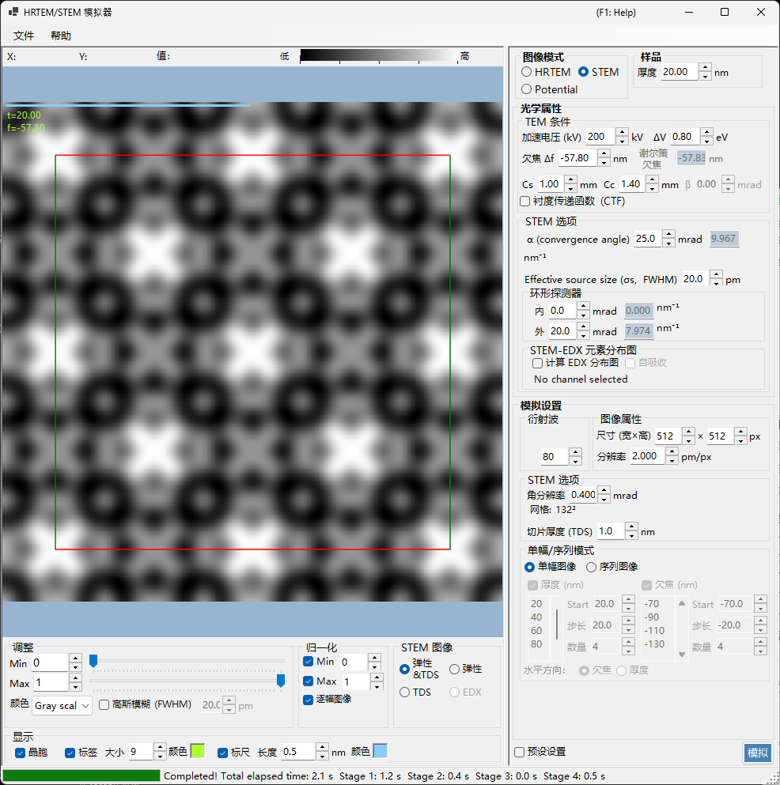
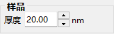
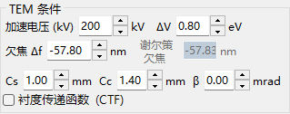
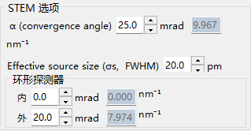
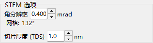
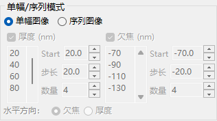
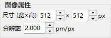
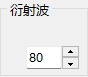
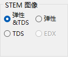
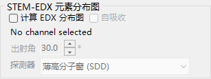

# STEM 模拟

**STEM（扫描透射电子显微术，Scanning Transmission Electron Microscopy）** 模拟使用布洛赫波法计算扫描透射电子显微图像。

> 本页列出当 **Image mode = STEM** 时右侧出现的所有设置。关于左侧的结果显示、亮度和归一化控件，请参阅[概述页面](index.md)。下面仅重复 STEM 特有的**显示对象**。

---

## 概述

会聚电子束在样品上扫描，每个扫描位置处透射和散射的电子由环形探测器收集。ReciPro 使用布洛赫波法（动力学计算）计算 STEM 图像。

### 计算流程

1. 在每个扫描位置，对会聚探针的每个入射方向，用布洛赫波法计算衍射强度。
2. 在探测器的角度范围内对散射强度积分。
3. 弹性散射和热漫散射（TDS）的贡献都可以计算。

理论部分请参阅[附录 A3.4 — STEM 计算](../appendix/a3-bloch-wave/stem.md)。

---

## 探测器类型

| 探测器 | 角度范围 | 主要贡献 | 衬度 |
|----------|-------------|-------------------|----------|
| **BF**（明场） | 0 – 会聚半角 | 弹性 | 相位衬度 |
| **ABF**（环形明场） | 会聚半角内侧部分 | 弹性 | 对轻元素敏感 |
| **LAADF**（低角环形暗场） | 会聚半角外侧附近 | 弹性 + TDS | 对应变敏感 |
| **HAADF**（高角环形暗场） | 远在会聚半角之外 | TDS（非弹性） | Z 衬度（$\propto Z^2$） |

> **典型探测器设置**（每种均可从 STEM 选项的右键菜单中一键调用，全部以会聚半角 α = 25 mrad 为例）：
> BF (0–5 mrad) / ABF (12–24 mrad) / LAADF (26–60 mrad) / HAADF (80–250 mrad)

---

## 样品参数

- **Thickness** ：样品厚度（nm）。在 **Serial image** 模式下此值被忽略。

---

## TEM 条件

| 参数 | 说明 | 默认值 / 典型值 |
|-----------|-------------|-------------------|
| **Acc. Vol. (kV)** | 加速电压。旁边显示经相对论修正的电子波长 | 200 kV |
| **Defocus Δf** | 物镜（探针形成透镜）的欠焦量（nm） | −57.8 nm |
| **Cs** | 球差系数（mm）。影响探针尺寸 | 0.5–1.0 mm |
| **Cc** | 色差系数（mm） | 1.0–2.0 mm |
| **ΔV (FWHM)** | 电子能量分散的半高全宽（eV） | 0.5–2.0 eV |

> **β（照明半角）在 STEM 模式下被禁用**，因为其作用由会聚半角 α 承担。

---

## STEM 选项（光学）

设置会聚探针和环形探测器的几何参数。右侧还会显示每个角度换算为倒空间半径 $\sin\theta/\lambda$（nm⁻¹）后的值。

| 参数 | 说明 | 默认值 / 典型值 |
|-----------|-------------|-------------------|
| **α (convergence angle)** | 会聚探针的半角（mrad）。较大的值得到更细的探针并改变衍射衬度 | 15–25 mrad |
| **(Annular) detector inner angle** | 环形探测器的内侧收集半角（mrad）。此角度以内的信号被排除 | BF: 0, HAADF: 80 |
| **(Annular) detector outer angle** | 环形探测器的外侧收集半角（mrad）。此角度以外的信号被排除 | BF: 5, HAADF: 250 |
| **Effective source size σs (FWHM)** | 有效电子源尺寸。较大的值会使探针模糊并降低细节衬度 | — |

---

## STEM 选项（模拟）

- **Slice thickness for inelastic** ：计算 TDS（热漫、非弹性）强度时所用的样品切片厚度（nm）。较小的值更精确但更慢。
- **Angular resolution** ：入射探针方向的角度采样分辨率（mrad）。较小的值对探针采样更精细但更慢。 方向数按该比值的平方增长，因而是左右计算时间的最主要因素；收敛实测值参见[探针的角度采样](../appendix/a3-bloch-wave/stem.md#angular-sampling)。

---

## 图像模式（single / serial）

- **Single image** ：在当前厚度下计算一张 STEM 图像。
- **Serial image** ：生成一系列图像，厚度 / 欠焦量按阶梯变化（由 **Start / Step / Num** 设置；下方的列表也可直接编辑）。

---

## 图像属性

- **Size (W×H)** ：扫描图像的像素数（默认 512×512）。在 STEM 中这等于扫描点的数量，并使计算时间线性增长。
- **Resolution** ：采样分辨率（pm/px）。

---

## 衍射波

- **Max Bloch waves** ：Bethe 方法中使用的布洛赫波最大数量（默认 80）。本征值问题的计算量按波数的立方增长。

---

## STEM 显示对象（结果侧） {#stem-display-target}

窗口左下角的显示开关用于选择显示已计算 STEM 图像的哪个散射分量（无需重新计算即可切换）。

| 显示对象 | 说明 |
|----------------|-------------|
| **Elastic** | 仅弹性散射的图像 |
| **TDS** | 仅热漫散射的图像 |
| **Elastic & TDS** | 弹性 + TDS 之和 |
| **EDX** | 特征 X 射线分布图。要显示的谱线（例如 `O-K`）在下方的组合框中选择；*归一化*中的 **EDX 共用**将所有通道置于同一显示范围内，因此切换通道时图像不会被重新定标 |

!!! note
    三幅图像均由傅里叶求和的实部重建，因此 **Elastic & TDS** 恰为另外两幅之和。4.944 之前的版本改取模，破坏了这一恒等关系，并使暗像素略微变亮。参见[重建为实数图像](../appendix/a3-bloch-wave/stem.md#real-image-reconstruction)。

---

## STEM-EDX 元素分布图 {#stem-edx}

勾选**计算 EDX 分布图**后，会在计算 ADF 型图像的同时计算特征 X 射线分布图。这并不是一种独立的模式：弹性、TDS 和 EDX 信号都来自同一次 STEM 计算，算完之后可在 [STEM 显示对象](#stem-display-target)中切换显示，无需重新计算。

这里没有元素选择器。勾选该复选框后，**当前晶体在当前加速电压下所有可计算的元素/壳层通道**都会被计算，复选框下方的一行会将它们列出（例如 `3 张图: O-K, Mg-K, Al-K`）。当电离边低于加速电压、且该壳层在内置数据的覆盖范围内（K 线：C–Sn (Z = 6–50)；L 线合计：Ca–Rn (Z = 20–86)）时，通道即为可用。内置数据表为每个通道存储了散射矢量直至 8 Å⁻¹ 的全相对论电离形状因子，因此直到氡为止的重元素 L 线都无需外推即可模拟。若没有任何可用通道，程序会拒绝计算并给出说明信息，而不是生成一张空白分布图。

再下一行报告探针方向网格，例如 `网格: 132²（建议: ≥48²）`。该网格由**角分辨率**和会聚半角决定；参见[探针的角度采样](../appendix/a3-bloch-wave/stem.md#angular-sampling)。当划分低于建议值时，±q 厄米残差可能超出容差并中止计算，因此该数值会变为橙色，并在计算开始前弹出确认对话框。

!!! warning "这些数值的含义"
    分布图给出的是**每个入射电子产生的内壳层空位数**，这是一个模型量，而不是预测的 X 射线计数。荧光产额、样品内的自吸收、探测器立体角和探测器效率均**未**计入。请将这些分布图用于考察空间分布、比较厚度或取向，而不要用于绝对定量。

### 探测器参数（预留）

**自吸收**、**出射角**和**探测器**已布置在面板上但处于禁用状态：它们属于尚未实现的探测器模型，先行显示是为了在该模型实装时面板布局不发生变化。这些因素将来的影响在性质上各不相同：

| 因素 | 单张图内的像素间衬度 | 元素图之间的比值 |
|---|---|---|
| 自吸收（出射角） | **会改变** | **会改变** |
| 探测器窗口 / 死层 / 效率 | 无影响 | **显著改变** |
| 探测器立体角、束流、驻留时间 | 无影响 | 无影响 |

最后一行正是 ReciPro 完全不提供束流和驻留时间设置的原因：它们给每张图的每个像素乘上同一个数，在任何比值中都会消去，经显示归一化后更是完全不可见。

### 精度与开销

STEM-EDX 对波数和切片厚度没有额外限制：它与 ADF 型图像走完全相同的计算路径，因此适用于 STEM 的设置同样适用于 EDX。

与波数或角分辨率一样，精度由使用者自行把握。作为参考，深度积分误差与**切片厚度 (TDS)** 大致成正比：1 nm 时约 2–3 %，2 nm 时约 4–8 %，4 nm 时约 12–23 %（相对峰值，SrTiO₃、厚 39 nm）。切片厚度减半时误差大致减半，深度积分的计算量则大致翻倍。

设置了像差时（例如 Cs = 1 mm 加 Scherzer 欠焦、α = 25 mrad），像差相位会在探针方向网格上快速振荡，即使网格很细，STEM-EDX 也可能以 *non-Hermitian residual* 错误拒绝运行——这一拒绝是为了保护分布图不受百分之几量级的网格伪影影响。请减小 Cs 与欠焦（EDX 分布图的扫描平均完全不依赖像差），或将**角分辨率**设得明显更细并接受更长的计算时间。

---

## 计算开销

STEM 模拟的计算开销很大，因此应适当设置以下参数。

| 因素 | 影响 |
|--------|--------|
| **会聚半角** | 越大 → CBED 盘重叠越多 → 开销越高 |
| **布洛赫波** | 本征值问题的开销按 N³ 增长 |
| **角度分辨率** | 越精细 → 越精确，但开销按 N² 增长 |
| **图像像素（Size）** | 与扫描点数量呈线性关系 |

---

## 温度因子的重要性

对于 HAADF-STEM 模拟，原子必须具有非零的各向同性温度因子（德拜-沃勒因子）。若该值未知，可设为 $B \approx 0.5\ \text{Å}^2$。当温度因子为零时，TDS 强度为零，HAADF 图像将无法正确计算。

| 探测器 | 范围 | 主要贡献 |
|----------|-------|-------------------|
| BF, ABF | 会聚半角以内 | 弹性 |
| LAADF, HAADF | 会聚半角以外 | 非弹性（TDS） |

---

## 与 Dr. Probe 的比较

已确认 ReciPro 的 STEM 模拟与广泛使用的 Dr. Probe GUI（v1.10）高度一致。下图就 BF、ABF、LAADF 和 HAADF 探测器，在一个厚度系列（2.96–60.05 nm）上对二者进行了比较，分别为无像差（左）以及 Cs = 0.2 mm、欠焦 = −25.9 nm（右）。两套程序在所有探测器类型和厚度下都相符。

更详细的报告以 PDF 形式提供：[Dr. Probe GUI (v1.10) 与 ReciPro (v4.854) 的 STEM 模拟比较](https://github.com/seto77/ReciPro/files/10976084/ComparisonSTEMsimulations.pdf)。

---

## 与 py_multislice 的比较

ReciPro 的 STEM-EDX 元素分布图还与独立的多层法 / 冻结声子程序 [py_multislice](https://github.com/HamishGBrown/py_multislice) 进行了对比。下图比较了 SrTiO₃ [001]、200 kV 下 O-K、Ti-K、Sr-L 的分布图，覆盖厚度序列（3.91〜62.48 nm），左侧无像差，右侧 Cs = 0.2 mm、欠焦 −25.9 nm。

在薄样品极限下，归一化后的分布形状对 Ti-K 和 Sr-L 一致到 1〜2 %。**总量**相差 ±10〜17 %，原因是两者的电离截面来自不同来源（ReciPro 用 Bote–Salvat，py_multislice 用 Allen 组的数据表）。ReciPro / py_multislice 之比还随厚度下降，是因为 ReciPro 的吸收势模型会移除热散射电子，而冻结声子中这些电子仍在继续电离——这正是吸收近似用于 EDX 时实际误差的定量结果。

包含定量曲线和空间频率分析的完整报告可参见 PDF：[py_multislice 与 ReciPro (v4.945，电离数据集 v3.0.0) 的 STEM-EDX 模拟比较](../../assets/references/STEM_EDX_pyms_comparison.pdf)。

---

## 另见

- [HRTEM/STEM 模拟器（概述）](index.md)
- [HRTEM 模拟](1-hrtem-simulation.md)
- [势模拟](3-potential-simulation.md)
- [附录 A3.4 — STEM 计算](../appendix/a3-bloch-wave/stem.md)
