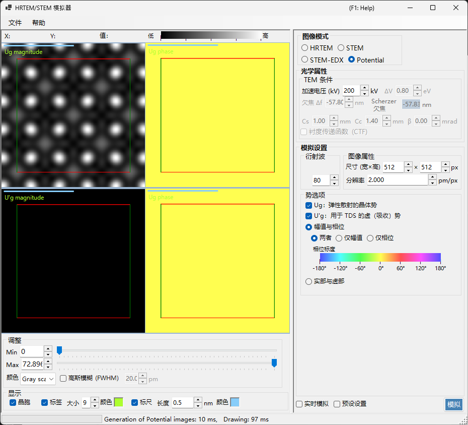
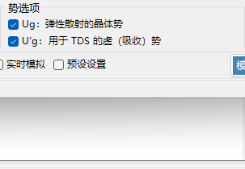
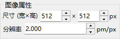
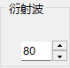

# 势模拟

**势模拟**计算并显示晶体势的二维分布。不施加任何成像传递效应（透镜像差、探测器）：它直接可视化投影晶体势本身。

> 本页介绍当 **Image mode = Potential** 时右侧出现的所有设置。关于结果显示、亮度调整以及左侧的其他控件，请参见[概览页](index.md#display-settings)。

---

## 概览

晶体内部的电子会被晶体势散射。其分布是一切衍射与成像现象的基础，也是理解晶体结构的关键信息。由于该模式既不包含透镜像差，也不包含依赖厚度的动力学效应，因此非常适合用于考察结构本身。

> **在势模式下，样品厚度、强度归一化和图像模式（single / serial）面板不会显示。** 在 TEM 条件中，只有加速电压处于激活状态。

---

## TEM 条件

- **Acc. voltage (kV)** — 加速电压。它确定电子波长，并用于计算势的傅里叶系数 $U_g$。

> **Defocus、Cs、Cc、β、ΔE 和 PCTF 在势模式下不激活**（不施加成像光学），并显示为灰色。

---

## 势选项

选择显示哪种势以及如何显示。

### 目标势

| 类型 | 说明 |
|------|-------------|
| **$U_g$ — elastic scattering potential** | 负责弹性散射的（静电）晶体势。表示散射强度 |
| **$U'_g$ — absorption potential** | 由热漫散射（TDS）产生的虚（吸收）势。表示弹性通道的损耗 |

$U_g$ 与 $U'_g$ 可以同时显示（每勾选一项就会增加一个窗格）。

### 显示方法

| 模式 | 选项 |
|------|---------|
| **Magnitude and phase** | **Both** / **Magnitude only** / **Phase only**（相位以色轮渲染，下方显示相位标尺） |
| **Real and imaginary part** | **Both** / **Real only** / **Imaginary only** |

---

## 图像属性

- **Size (W×H)** — 生成图像的像素尺寸（默认 512×512）。
- **Resolution** — 采样分辨率（pm/px）。

---

## 衍射波

- **Max Bloch waves** — 在势的傅里叶合成中纳入的布洛赫波（傅里叶系数）的最大数量（默认 80）。数值越大，纳入的空间频率越高，越能再现势的细节。

---

## 图像调整（左侧）

亮度（Min / Max）、色阶以及晶胞点阵叠加层在左侧的 **Adjust** 和 **Display** 中设置（参见[概览页](index.md#display-settings)）。

---

## 另请参阅

- [HRTEM/STEM 模拟器（概览）](index.md)
- [HRTEM 模拟](1-hrtem-simulation.md)
- [STEM 模拟](2-stem-simulation.md)
