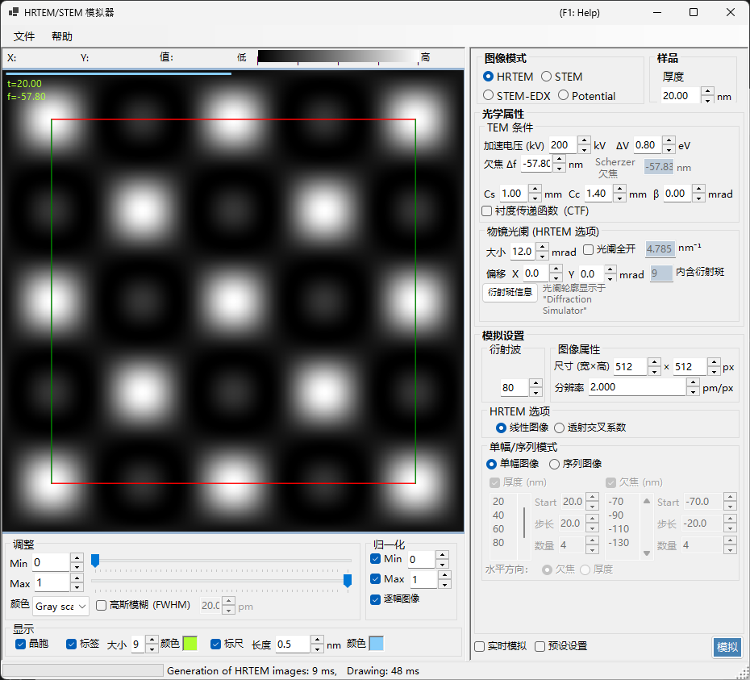
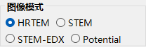
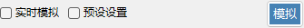
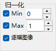
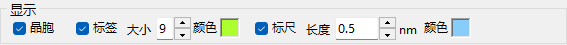

# HRTEM / STEM Simulator

**HRTEM/STEM 模拟器**可模拟 TEM 晶格条纹 (HRTEM) 图像、STEM 图像以及投影势。点击 **Simulate** 即可运行计算。

---

## 键盘和鼠标快捷键

结果以一个或多个图像窗格的形式显示。它们使用 ReciPro 的标准[图像视图导航](../21-shortcuts.md)，所有窗格会一起平移和缩放。

| 快捷键 | 操作 |
|----------|--------|
| <kbd>F1</kbd> | 打开在线手册的此页面 |
| <kbd>CTRL</kbd>+<kbd>C</kbd>（图像网格获得焦点时） | 将图像作为图元文件复制到剪贴板 |
| 左键拖动 / 中键拖动 | 平移图像（所有窗格一起移动） |
| 鼠标滚轮向上 / 向下 | 在光标处放大 (×2) / 缩小 (×0.5) |
| 右键拖出一个矩形框 | 放大到所选区域 |
| 右键单击 / 右键双击 | 缩小 (×0.5) |
| <kbd>CTRL</kbd> + 右键拖出一个矩形框 | 选择一个矩形区域 |
| 在窗格上左键双击 | 最大化该窗格 / 恢复网格（多窗格布局） |
| 移动鼠标（不按键） | 读取光标处的位置 (pm) 和像素值 |

→ 请参阅 **[21. 键盘和鼠标快捷键](../21-shortcuts.md)** 以一览每个窗口。

---

## 按目标快速导航

| 目标 | 起点 | 参考 |
|------|------------|-----------|
| 计算单张 HRTEM 图像 | 将 **Image mode** 设为 **HRTEM**，然后在 **TEM conditions** 中设置加速电压和欠焦 | [HRTEM 模拟](1-hrtem-simulation.md)、[HRTEM 成像](../appendix/a3-bloch-wave/hrtem.md) |
| 计算 STEM 图像 | 将 **Image mode** 设为 **STEM**，然后在 **STEM options** 中设置会聚角和探测器 | [STEM 模拟](2-stem-simulation.md)、[STEM 计算](../appendix/a3-bloch-wave/stem.md) |
| 查看投影势 | 将 **Image mode** 设为 **Potential** | [势模拟](3-potential-simulation.md) |
| 生成厚度 / 欠焦序列 | 在 **HRTEM options** 中配置 **Single / Serial** 和图像条件 | [HRTEM 模拟](1-hrtem-simulation.md) |
| 使用带 TDS 的 HAADF-STEM | 将原子温度因子设为非零值，并使用 LAADF / HAADF 探测器 | [STEM 计算](../appendix/a3-bloch-wave/stem.md) |

---

## 基本工作流程

1. 在主窗口中选择晶体和取向，然后打开此模拟器。
2. 在 **Image mode** 中选择 HRTEM、STEM 或 Potential。
3. 在 **Optical property** 中设置加速电压、欠焦、像差、光阑以及 STEM 会聚设置。
4. 在 **Simulation property** 中设置厚度、图像尺寸、分辨率、布洛赫波数量和部分相干模型。
5. 点击 **Simulate**，然后在 **Display settings** 中调整亮度、归一化、比例尺和标签。

---

## 图像区域

窗口左半部分显示模拟图像。顶部的状态栏报告光标位置 (**X:**、**Y:**) 以及光标下的图像 **Value:**（强度），旁边是一个 **Low → High** 强度刻度，反映当前的颜色映射和亮度范围。

---

## File menu

### Help menu

---

## Image mode / Sample

{align=left}

HRTEM、Potential 或 STEM。

{ align=left style="clear: both" }
设置样品厚度。

## Optical property { style="clear: both" }

### TEM conditions

加速电压、欠焦（显示 Scherzer 值）。

#### Acc. voltage

电子显微镜的加速电压。更改此值会更新经相对论修正的波长（显示在字段旁边），并与 **Cs** 一起更新下方显示的建议 **Scherzer defocus** 值。

#### Defocus

物镜的欠焦值。Scherzer 欠焦（在弱相位物体近似下使相位衬度传递最大化的值）显示在下方作为参考。

### Inherent property (HRTEM optical aberrations)

镜筒特有的像差参数，由透镜函数计算使用。

- **Cs** — 球差系数。
- **Cc** — 色差系数。
- **β** — 照明半角（有限光源效应）。
- **ΔE** — 电子能量涨落的 1/e 宽度。

### Lens function

透镜函数的图。调整 *u* 的上限会改变绘图范围。

- **sin[χ(u)]** — 相位衬度传递函数 (PCTF)。
- **E_s(u)** — 空间相干包络函数。
- **E_c(u)** — 时间相干包络函数。

### Objective aperture (HRTEM option)

Cs、Cc、beta、delta-E、PCTF、空间/时间相干包络、物镜光阑。

#### Size

物镜光阑尺寸，单位 mrad。勾选 **Open aperture** 可移除光阑。纳入布洛赫波计算的衍射斑点数量取决于光阑；其上限由 **Simulation property** 中的 **Max Bloch waves** 值限定。

#### Shift

光阑的水平位移，单位 mrad — 用于模拟 HRTEM 中偏移的物镜光阑。

#### Spot info

打开穿过光阑的反射的详细斑点列表（强度、复振幅等）。当同时打开衍射模拟器进行比较时很方便。

### STEM options (optical)

#### Convergence semi-angle

会聚探针的半角 (mrad)。控制 STEM 探针的尺寸和模拟图像的空间分辨率。

#### Detector geometry

环形探测器的内/外收集角 (mrad)。可在 BF（小内角）、ABF、LAADF、HAADF（大内角）之间选择。

#### Scan area / step

STEM 图像的扫描视场和像素尺寸。

---

## Simulation property

### HRTEM options

Max Bloch waves、图像像素/分辨率、部分相干 (quasi-coherent / TCC)、Single/Serial 模式。

#### Max Bloch waves

动力学计算中使用的布洛赫波最大数量。增大此值可提高精度，但代价是 *O*(*N*³) 的本征值求解时间。

#### Image property (pixels & resolution)

模拟图像的像素尺寸和采样分辨率。更高的分辨率会产生更精细的条纹图样，但每层切片的 FFT 时间会成比例地变长。

#### Partial-coherent model

在合并所有入射束方向的贡献时如何处理波的干涉。

- **Quasi-coherent** — 快速的近似模型，将相位衬度传递函数乘以空间相干包络和时间相干包络。
- **Transmission cross coefficient (TCC)** — 更精确的模型，对完整的透射交叉系数进行积分。较慢，但在线性成像区域内是精确的。

参见[附录 A3.2 — HRTEM 成像](../appendix/a3-bloch-wave/hrtem.md)。

#### Single / Serial mode

- **Single image** — 在 **Sample property** 中设置的厚度和 **Optical property** 中设置的欠焦下模拟单张图像。
- **Serial image** — 根据各自的 **Start / Step / Num** 生成一个厚度 × 欠焦矩阵。便于寻找与实验图像最匹配的条件。

### STEM options (simulation)

- **Bloch wave count** — 与 HRTEM 中的作用相同，按每个探针位置应用。
- **Angular resolution** — 探针方向积分中的采样点数量。
- **TDS treatment** — 是否通过温度因子 *B* 纳入热漫散射。LAADF/HAADF 需要此项。

### Potential options

当 **Image mode = Potential** 时显示。

- **Target potential** — 选择 **U_g**（弹性）或 **U′_g**（吸收 / TDS）。
- **Display method** — **Magnitude and phase** 或 **Real and imaginary part**。

### Image properties

### Diffracted waves

---

## Simulate

---

## Display settings

### Adjust

最小/最大亮度、颜色刻度、高斯模糊。

### Normalization

### Display

标签（厚度/欠焦）、比例尺、晶胞叠加。

### STEM image

---

## STEM 模拟

计算取决于：会聚角、布洛赫波数量、角分辨率。

| 探测器 | 贡献 |
|----------|-------------|
| BF, ABF | 弹性 |
| LAADF, HAADF | 非弹性 (TDS) |

> 对于 TDS，请将温度因子设为非零值（如不确定可用 B = 0.5 Ų）。HAADF 强度 $\propto Z^2$。

更详细的报告以 PDF 形式提供：[Dr. Probe GUI (v1.10) 与 ReciPro (v4.854) 的 STEM 模拟比较](https://github.com/seto77/ReciPro/files/10976084/ComparisonSTEMsimulations.pdf)。详情请参阅 [STEM 模拟](2-stem-simulation.md)。

---

## 另请参阅

- [HRTEM 模拟](1-hrtem-simulation.md)
- [STEM 模拟](2-stem-simulation.md)
- [势模拟](3-potential-simulation.md)
- [动力学衍射（布洛赫波）](../appendix/a3-bloch-wave/index.md)
- [衍射模拟器](../7-diffraction-simulator/index.md)
- [电子轨迹](../8-electron-trajectory.md)
