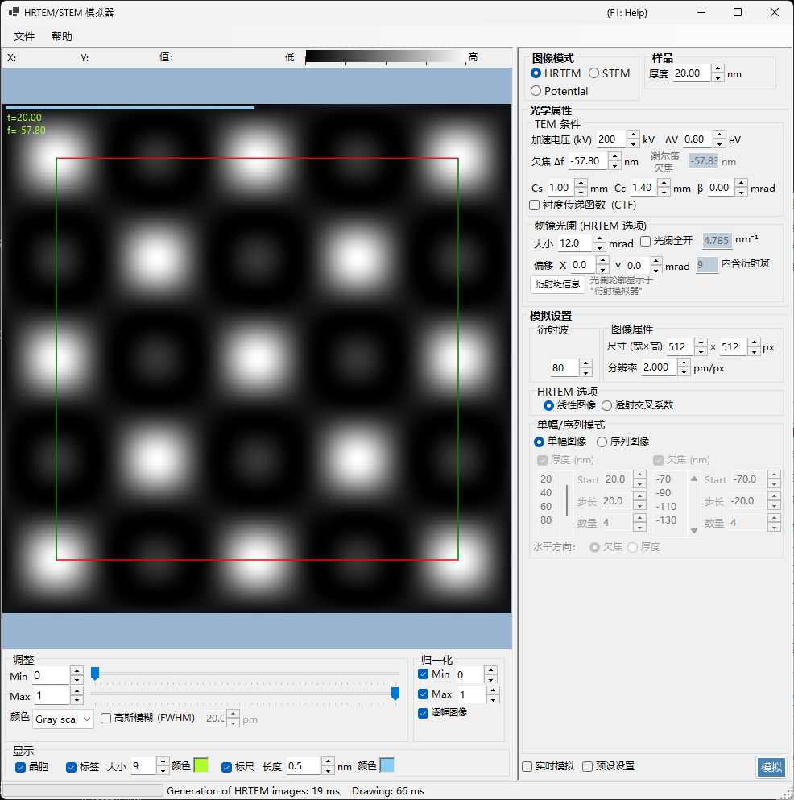
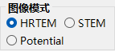
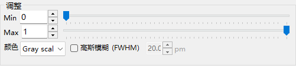
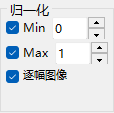
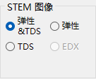
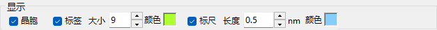
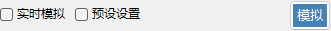
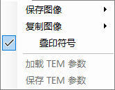
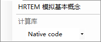

# HRTEM / STEM Simulator

**HRTEM/STEM 模拟器**针对所选晶体及其取向，模拟 TEM 晶格条纹 (HRTEM) 图像、STEM 图像以及投影晶体势。点击 **模拟** 即可运行计算。

窗口分为左右两半。**左侧** 显示模拟结果并控制其外观（图像窗格、亮度、颜色、标尺等）；**右侧** 为计算条件（**光学属性** 和 **模拟设置**）。

---

## 本页与各模式页面

- **本页（概述）**：说明所有模式通用的操作，以及 **左侧的结果显示与调整控件**。
- **各模式页面**：完整说明该模式下 **右侧** 出现的所有设置，使每个页面都能独立阅读（因此部分设置会在多个页面中重复出现）。

| 模式 | 内容 | 页面 |
|------|----------|------|
| **HRTEM** | 高分辨 TEM 晶格条纹像 | [HRTEM 模拟](1-hrtem-simulation.md) |
| **STEM** | 扫描透射电子显微镜像 (BF / ABF / LAADF / HAADF) | [STEM 模拟](2-stem-simulation.md) |
| **Potential** | 投影晶体势 ($U_g$ / $U'_g$) | [势模拟](3-potential-simulation.md) |

---

## 键盘和鼠标快捷键

结果以一个或多个图像窗格的形式显示。它们使用 ReciPro 的标准[图像视图导航](../21-shortcuts.md)，所有窗格会一起平移和缩放。

| 快捷键 | 操作 |
|----------|--------|
| <kbd>F1</kbd> | 打开在线手册的此页面 |
| <kbd>CTRL</kbd>+<kbd>C</kbd>（图像网格获得焦点时） | 将图像作为图元文件复制到剪贴板 |
| 左键拖动 / 中键拖动 | 平移图像（所有窗格一起移动） |
| 鼠标滚轮向上 / 向下 | 在光标处放大 (×2) / 缩小 (×0.5) |
| 右键拖出一个矩形框 | 放大到所选区域 |
| 右键单击 / 右键双击 | 缩小 (×0.5) |
| <kbd>CTRL</kbd> + 右键拖出一个矩形框 | 选择一个矩形区域 |
| 在窗格上左键双击 | 最大化该窗格 / 恢复网格（多窗格布局） |
| 移动鼠标（不按键） | 读取光标处的位置 (pm) 和像素值 |

→ 请参阅 **[21. 键盘和鼠标快捷键](../21-shortcuts.md)** 以一览每个窗口。

---

## 按目标快速导航

| 目标 | 起点 | 参考 |
|------|------------|-----------|
| 计算单张 HRTEM 图像 | 将 **图像模式** 设为 **HRTEM**，然后在 **TEM 条件** 中设置加速电压和欠焦 | [HRTEM 模拟](1-hrtem-simulation.md)、[HRTEM 成像](../appendix/a3-bloch-wave/hrtem.md) |
| 计算 STEM 图像 | 将 **图像模式** 设为 **STEM**，然后在 **STEM 选项** 中设置会聚角和探测器 | [STEM 模拟](2-stem-simulation.md)、[STEM 计算](../appendix/a3-bloch-wave/stem.md) |
| 查看投影势 | 将 **图像模式** 设为 **Potential** | [势模拟](3-potential-simulation.md) |
| 生成厚度 / 欠焦序列 | 在 HRTEM 中配置 **单幅/序列模式** 和图像条件 | [HRTEM 模拟](1-hrtem-simulation.md) |
| 使用带 TDS 的 HAADF-STEM | 将原子温度因子设为非零值，并将 STEM 探测器移至 LAADF / HAADF | [STEM 计算](../appendix/a3-bloch-wave/stem.md) |

---

## 基本工作流程

1. 在主窗口中选择晶体和取向，然后打开此窗口。
2. 在 **图像模式** 中选择 HRTEM、STEM 或 Potential。
3. 在 **光学属性** 中设置加速电压、欠焦、像差、光阑、STEM 会聚角等（参见各模式页面）。
4. 在 **模拟设置** 中设置厚度、图像尺寸、分辨率、布洛赫波数量、部分相干模型等（参见各模式页面）。
5. 点击 **模拟**，然后根据需要在左侧的 **调整**、**归一化** 和 **显示** 中调整外观。

---

## 选择图像模式

{ align=left }

右上方的 **图像模式** 用于选择计算类型。右侧的面板（**光学属性** 和 **模拟设置**）会随所选模式而变化。

- **HRTEM** — 高分辨 TEM 晶格条纹像 → [HRTEM 模拟](1-hrtem-simulation.md)
- **STEM** — 扫描透射电子显微镜像 → [STEM 模拟](2-stem-simulation.md)
- **Potential** — 投影晶体势 → [势模拟](3-potential-simulation.md)

---

## 图像区域（左侧）

窗口左半部分显示模拟图像。顶部的状态栏显示光标位置 (**X:**、**Y:**) 以及光标下的图像 **值:**（强度），旁边是一个 **低 → 高** 强度刻度，反映当前的颜色映射和亮度范围。

当生成多幅图像时（序列图像，或势的幅值/相位），它们会以网格形式平铺显示，所有窗格一起缩放和平移。

---

## 结果的显示与调整（左侧面板） {#display-settings}

左下方的面板用于调整结果的外观——亮度、颜色、归一化和叠加显示。这些设置适用于所有模式，无需重新计算即可生效。

### 调整

- **Min** / **Max** ：显示强度范围的下限（黑）和上限（白）。可用滑块调整衬度。
- **颜色** ：图像的色阶——**Gray scale** 或 **Cold-Warm**（蓝到红）。
- **高斯模糊 (FWHM)** ：勾选后，按右侧给定的半高全宽 (pm) 施加高斯模糊，以近似有限的分辨率（点扩展函数）。

### 归一化

- **逐幅图像** ：勾选后，对每幅图像分别归一化（不勾选时，整个序列共用同一标度）。
- **Min** / **Max** ：将归一化的下限 / 上限固定为右侧给定的值，而不是图像的最小值 / 最大值。

### STEM 图像

仅在 STEM 模式下显示。选择显示计算所得 STEM 图像中的哪种散射成分（**弹性**、**TDS** 或 **弹性 &TDS**）。若同一次计算中还计算了 [STEM-EDX 分布图](2-stem-simulation.md#stem-edx)，则可选择第四项 **EDX**。由于此项为 STEM 专用，[STEM 模拟](2-stem-simulation.md) 页面中也有说明。

### 显示

设置叠加在图像上的项目。

- **晶胞** ：叠加显示投影晶胞的轮廓，便于将图像衬度与晶格对应起来。
- **标签** ：叠加显示厚度、欠焦、指数等标签。可指定 **大小**（字号）和 **颜色**。
- **标尺** ：叠加显示比例尺。可指定 **长度** (nm) 和 **颜色**。

---

## 运行模拟

- **模拟** ：使用当前的晶体、显微镜条件、厚度、欠焦和显示设置运行计算。
- **停止** ：中止正在进行的计算（仅在计算过程中显示）。
- **实时模拟** ：勾选后，旋转晶体时立即重新计算（STEM 模式下隐藏）。
- **预设设置** ：切换预设窗口的显示，该窗口用于保存和调用 TEM 成像条件。

---

## 文件菜单

- **保存图像** ：可选择 **为图像 (PNG 格式)**、**为图像 (TIFF 格式)** 或 **为图元文件 (EMF)** 保存。**序列图像模式下单独保存** 会将序列计算的各幅图像逐一写出。
- **复制图像** ：**为图像** 或 **为图元文件 (EMF)** 复制到剪贴板。
- **叠印符号** ：将晶胞、标签和标尺烧录到保存的图像中。
- **加载 TEM 参数** / **保存 TEM 参数** ：将光学条件（加速电压、像差等）保存到文件并从文件恢复。

## 帮助菜单

- **HRTEM 模拟基本概念** ：打开 HRTEM 成像的说明（[附录 A3.2](../appendix/a3-bloch-wave/hrtem.md)）。
- **计算库** ：选择计算库——**Native code**（快速的 C++/Eigen）或 **Managed code**（.NET）。通常 Native 更快。

---

## 另请参阅

- [HRTEM 模拟](1-hrtem-simulation.md)
- [STEM 模拟](2-stem-simulation.md)
- [势模拟](3-potential-simulation.md)
- [动力学衍射（布洛赫波）](../appendix/a3-bloch-wave/index.md)
- [衍射模拟器](../7-diffraction-simulator/index.md)
- [电子轨迹](../8-electron-trajectory.md)
