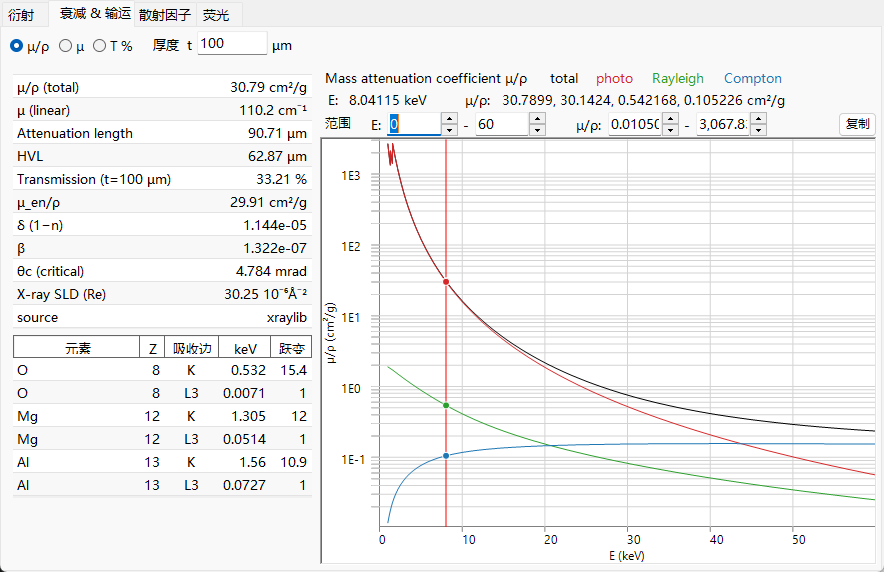
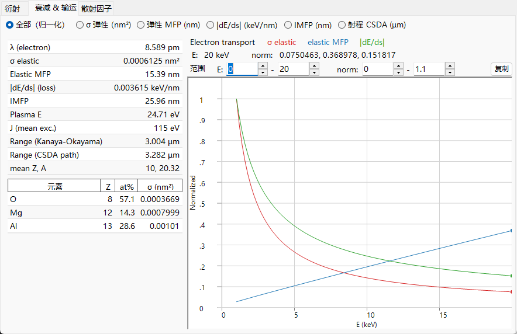
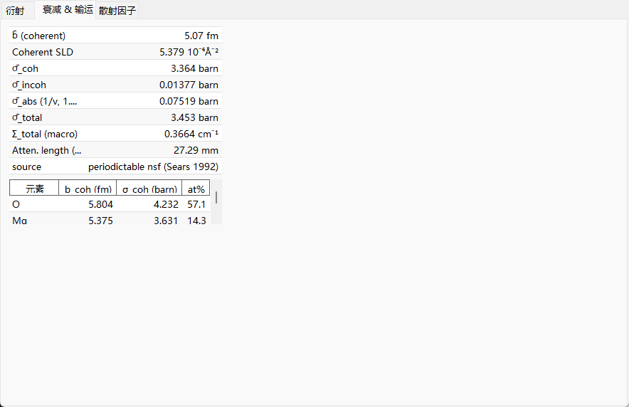

# 衰减与输运

散射因子描述的是单次散射事件；而本页关注的是射束**作为整体**穿过固体时会发生什么——它被移除得有多快、能穿透多深，以及（对于电子而言）它如何减速。这三种射束所涉及的物理过程完全不同，正因如此，**Attenuations & Transport** 选项卡才会随辐射类型如此剧烈地改变其图表和表格。

=== "X-ray"
    

=== "Electron"
    

=== "Neutron"
    

---

## X 射线——吸收与折射

### Beer–Lambert 衰减

单色 X 射线束随路径长度按指数规律被移除：

$$I(t) = I_0\, e^{-\mu t}, \qquad \mu = \rho\,(\mu/\rho).$$

- $\mu/\rho$ : **质量衰减系数**（cm²/g）——已制成表格的、与密度无关的量。
- $\mu$ : 在材料实际密度 $\rho$ 下的**线衰减系数**（cm⁻¹）。
- $1/\mu$ : **衰减长度**（强度降至 $1/e$）。
- $\text{HVL} = \ln 2/\mu$ : **半值层**。
- $T = e^{-\mu t}$ : 厚度为 $t$ 的样品的透射率。

### $\mu/\rho$ 由什么构成

总质量衰减是三个过程之和，它们在选项卡中分别绘出：

$$\left(\frac{\mu}{\rho}\right)_\text{total} = \left(\frac{\tau}{\rho}\right)_\text{photo} + \left(\frac{\mu}{\rho}\right)_\text{Rayleigh} + \left(\frac{\mu}{\rho}\right)_\text{Compton}.$$

对于化合物，质量衰减是各元素值的质量加权和，而线系数则直接将原子截面相加：

$$\left(\frac{\mu}{\rho}\right)_\text{mix} = \sum_i w_i\left(\frac{\mu}{\rho}\right)_i, \qquad \mu = \sum_i n_i\,\sigma_i,$$

其中 $w_i$ 为质量分数，$n_i$ 为数密度。这三个分量为：

- **光电吸收** $\tau$ —— 光子被吸收并击出一个束缚电子。它在低能量时占主导，在吸收边之间大致按 $\tau/\rho \propto Z^{3\!-\!4}/E^{3}$ 下降。正是这一项击出内壳层电子，其弛豫产生[荧光](fluorescence.md)。
- **瑞利（相干）**散射 —— 在束缚电子上的弹性散射，与相干形状因子 $F(q)$ 相关。
- **康普顿（非相干）**散射 —— 在弱束缚电子上的非弹性散射，与非相干函数 $S(q)$ 相关；它在高能量时相对重要性增大。散射光子的波长发生位移

$$\Delta\lambda = \lambda' - \lambda = \frac{h}{m_e c}\,(1-\cos\varphi),$$

  因此一次康普顿事件会把光子从单色束中移除（一种非弹性损失）。

当光子能量越过某壳层（$K$、$L_3$、……）的结合能、开启一个新的电离通道时，**吸收边**就是 $\tau$ 的陡峭跃升。**跃变比**是 $\mu/\rho$ 跨过吸收边时增大的倍数；ReciPro 列出 $K$ 和 $L_3$ 吸收边的能量与跃变。**质量能量吸收系数** $\mu_\text{en}/\rho$ 是 $\mu/\rho$ 中将能量局部沉积的那一部分（不包括被散射光子和荧光光子带走的能量）。

### 折射、临界角与 SLD

固体的 X 射线折射率**略小于 1**，写作

$$n = 1 - \delta + i\beta, \qquad \beta = \frac{\mu_\text{abs}\lambda}{4\pi} = \frac{r_e\lambda^2}{2\pi}\sum_i n_i\,f''_i, \qquad \delta \simeq \frac{r_e\lambda^2}{2\pi}\sum_i n_i\,(Z_i+f'_i),$$

其中 $n_i$ 为元素 $i$ 的数密度，$r_e$ 为经典电子半径。这里 $\mu_\text{abs}$ 是衰减中的吸收部分（与 $f''$ 关联）；它不必等于上文的总 $\mu$，后者还包含瑞利散射和康普顿散射。由于 $n<1$，X 射线在一个小的掠射**临界角**以下会发生**全外反射**

$$\theta_c \simeq \sqrt{2\delta}.$$

这源自折射几何：对于掠射角 $\alpha$，固体内部的竖直波矢为 $k_z^2 \simeq k^2(\alpha^2 - 2\delta)$，它在 $\alpha = \alpha_c = \sqrt{2\delta}$ 处达到零；在此以下波无法传入材料并被全反射。**散射长度密度**的实部 $\text{SLD} = r_e\sum_i n_i (Z_i + f'_i)$ 决定 $\delta$，是反射率测量中所用中子 SLD 的 X 射线类比量。ReciPro 在标量表中给出 $\delta$、$\beta$、$\theta_c$ 以及 X 射线 SLD。

---

## 电子——散射、减速与射程

固体中的快电子既会**散射**（改变方向），又会连续地**损失能量**，因此其输运需要不止一个长度尺度。

### 弹性散射与平均自由程

弹性截面 $\sigma_\text{el}$ 衡量单个原子使电子偏转的难易程度。ReciPro 使用 **NIST Mott** 截面（屏蔽原子势中相对论 Dirac 方程的分波解），大致在 **50 eV – 36.4 keV** 范围内有效；超出该范围，或对于表中没有的元素，则回退到**屏蔽 Rutherford** 近似。两者在边界处不必完美光滑地衔接。总截面是微分截面的角度积分，

$$\sigma_\text{el} = 2\pi\int_0^\pi \frac{d\sigma}{d\Omega}\,\sin\Theta\,d\Theta, \qquad \frac{d\sigma}{d\Omega} \propto \frac{Z^2}{E^2}\,\frac{1}{\big[\sin^2(\Theta/2)+\eta\big]^2},$$

其中屏蔽参数 $\eta$ 抹平了裸 Rutherford 截面的前向发散；Mott 处理还额外包含了屏蔽 Rutherford 所略去的自旋效应与相对论效应。由截面可得

$$\Sigma_\text{el} = \sum_i n_i\,\sigma_{\text{el},i}, \qquad \lambda_\text{el} = \frac{1}{\Sigma_\text{el}},$$

给出宏观散射系数与**弹性平均自由程**——弹性事件之间的平均距离。

### 阻止本领与非弹性损失

能量主要损失于电子激发（电离、等离激元）。**阻止本领**定义为一个正量，

$$S(E) = -\frac{dE}{ds} > 0,$$

其中此处的 $s$ 是沿轨迹的**路径长度**（选项卡 *|dE/ds|* 曲线的变量），而非本附录其他地方所用的散射变量 $\sin\theta/\lambda$。能量梯度 $dE/ds$ 为负，因此选项卡将 $S$ 向上绘出。在 keV 能量下，它在概念上遵循 **Bethe** 形式

$$S(E) \;\propto\; \frac{Z\rho}{A}\,\frac{1}{E}\,\ln\!\frac{E}{J},$$

其中 $J$ 为固体的**平均激发能**。这个非相对论的草图仅展示标度关系；ReciPro 实际计算的是一个经修正/经验的形式（Joy–Luo 类型），它在低能量下仍表现良好。标量表中的**等离激元能量** $E_p$ 是对同一电子激发的一个相关但独立的表征。**非弹性平均自由程**（IMFP）是损失能量的碰撞之间相应的平均距离；ReciPro 可由 **TPP-2M** 预测公式计算它，

$$\lambda_\text{in}(E) = \frac{E}{E_p^2\left[\beta_\text{T}\ln(\gamma_\text{T} E) - C/E + D/E^2\right]},$$

其中 $E$ 以 eV 为单位，$\lambda_\text{in}$ 以 Å 为单位，参数 $\beta_\text{T},\gamma_\text{T},C,D$ 由 $E_p$、密度、带隙和价电子数构建而成。

### 两种射程

- **CSDA 射程** —— 连续减速近似（continuous-slowing-down approximation）对阻止本领积分，给出电子停下之前所走过的总路径长度：

$$R_\text{CSDA} = \int_{E_\text{cut}}^{E_0} \frac{dE}{S(E)}.$$

（实际中积分一直进行到一个低能量截断 $E_\text{cut}$，在此之下上文的 Bethe 草图不再成立。）

- **Kanaya–Okayama 射程** —— 一个广泛使用的**穿透深度**（而非路径长度）经验估计，考虑了曲折、被散射的轨迹：

$$R_\text{KO}\,[\mu\text{m}] = 0.0276\,\frac{A\,E_0^{1.67}}{\rho\,Z^{0.89}}, \qquad (E_0\ \text{in keV}).$$

两者回答的是不同的问题——飞行的总距离与电子进入固体的深度——因此其数值不同，ReciPro 同时给出两者。这些射程决定了[电子轨迹](../../8-electron-trajectory.md)和 EBSD 模拟背后的相互作用体积。

---

## 中子——宏观截面与 1/v 定律

对于中子，不存在依赖于能量的衰减曲线；相互作用由**核截面**确定。射束通过宏观总截面被衰减，而总截面本身是相干、非相干和吸收部分之和：

$$\Sigma_\text{total} = \sum_i n_i\,\sigma_{\text{total},i}, \qquad \sigma_\text{total} = \sigma_\text{coh} + \sigma_\text{inc} + \sigma_\text{abs}(\lambda), \qquad T = e^{-\Sigma_\text{total} t},$$

其衰减长度为 $1/\Sigma_\text{total}$。吸收部分取决于中子速度 $v$（从而取决于波长）：对于大多数核素，在原子核附近停留的时间按 $1/v$ 标度，从而给出 **1/v 定律**

$$\sigma_\text{abs}(\lambda) = \sigma_\text{abs}(\lambda_0)\,\frac{\lambda}{\lambda_0}, \qquad \lambda_0 = 1.798\ \text{Å}\ (\text{thermal}, 2200\ \text{m/s}).$$

少数强吸收体（Cd、Sm、Eu、Gd）具有低能量**共振**，会违反简单的 1/v 标度；ReciPro 会标记这些核素。相干的**散射长度密度** $\text{SLD} = \sum_i n_i\, b_{\text{coh},i}$ 是上述 X 射线 SLD 的中子类比量。

---

## 穿透深度一览

这三种射束探测的深度差异巨大——这正是它们回答不同问题的现实原因：

| 射束 | 典型样品 | 穿透深度（数量级） | 由什么决定 |
|---|---|---|---|
| X 射线（≈8 keV） | 粉末 / 单晶 | 10–100 µm | $\mu = \rho(\mu/\rho)$ |
| 电子（≈200 keV） | TEM 薄膜 | 10–100 nm（可用） | 弹性 MFP + 非弹性损失 |
| 中子（热中子） | 块体，厘米尺度 | 1–10 cm | $\Sigma_\text{total}$ |

同样的长度尺度也解释了为什么电子需要超薄样品和动力学理论，而中子则能在单次散射运动学下观测整个块体样品。

---

## 另见

- [原子散射因子](scattering-factor.md) —— 瑞利/康普顿背后的 $F(q)$/$S(q)$ 划分，以及 Mott 截面。
- [荧光](fluorescence.md) —— 跟随 X 射线光电吸收而来的弛豫。
- [3. 射束相互作用](../../3-beam-interaction.md) —— *Attenuations & Transport* 选项卡。
- [8. 电子轨迹](../../8-electron-trajectory.md) · [12. EBSD 模拟](../../12-ebsd-simulation.md) —— 电子射程被用到的地方。
