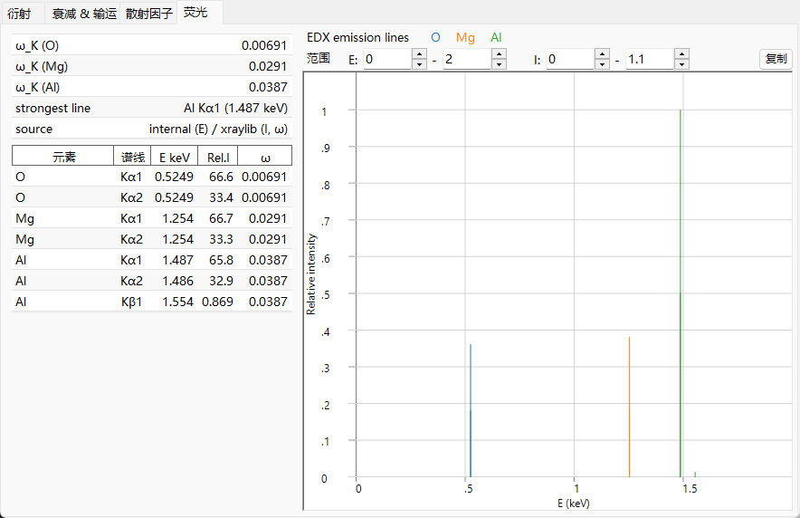

# 荧光

当 X 射线的 **光电吸收** 将一个内壳层电子击出后（参见 [衰减与输运](attenuation-transport.md)），会在深能级上留下一个空位。原子通过将一个外层电子落入该空穴而弛豫，所释放的能量要么以 **特征 X 射线光子**（荧光）的形式发出，要么通过击出第二个电子（**俄歇**过程）而释放。**荧光** 选项卡预览特征光子通道；它仅适用于 X 射线，对电子束和中子束则隐藏。

---

## 特征线

由于壳层能量是尖锐确定的，所发射的光子能量是 **两个结合能之差**，

$$E_\gamma = E_B(\text{inner shell}) - E_B(\text{outer shell}),$$

因此对该元素是特征性的：

- **K 线** — $K$ 壳层的空位由 $L$（$K\alpha$）或 $M$（$K\beta$）填充。
- **L 线** — $L$ 壳层的空位由 $M$/$N$（$L\alpha$, $L\beta$, …）填充。

只有偶极选择定则所允许的跃迁才会出现，这就是为什么谱是几条离散的线（K$\alpha_1$, K$\alpha_2$, K$\beta_1$, L$\alpha_1$, …）而不是连续谱。它们的能量遵循 **莫塞莱定律**；在屏蔽类氢近似下，

$$E_{n_2\to n_1} \approx R_\infty hc\,(Z-\sigma)^2\left(\frac{1}{n_1^2} - \frac{1}{n_2^2}\right), \qquad \text{so}\qquad \sqrt{E} \propto (Z-\sigma),$$

其中 $\sigma$ 是屏蔽常数。对于 $K\alpha$（$n_2{=}2\to n_1{=}1$, $\sigma\approx1$），这化简为 $E_{K\alpha}\approx R_\infty hc\,(Z-1)^2\left(1-\tfrac14\right)$。这种单调的、由电子数驱动的 $Z$ 依赖性，是元素鉴定（EDX/WDX）的基础。

---

## 荧光产额

辐射弛豫与俄歇弛豫之间的竞争由 **荧光产额** 描述

$$\omega = \frac{\Gamma_r}{\Gamma_r + \Gamma_a},$$

即某个给定空位通过发射光子而非俄歇电子衰变的概率（$\Gamma_r$、$\Gamma_a$ 分别为辐射跃迁率和俄歇跃迁率）。

- 对于 **轻元素**，俄歇通道占主导，因此 $\omega_K$ 很小（对 C、N、O 远低于 1%）——轻元素荧光很弱，这就是它们难以用 EDX 检测的原因。
- 对于 **重元素**，辐射通道胜出，$\omega_K \to$ 接近 1。

互补的 **俄歇产额** $a$ 承担其余部分，因此

$$\omega + a = 1 ,$$

而小的 $\omega$ 意味着大多数空位通过俄歇发射而衰变。在辐射通道内，某条特定线 $\ell$（例如 $K\alpha_1$ 相对于 $K\beta_1$）所占的份额即其 **分支比**

$$p_{\ell\mid X} = \frac{\Gamma_\ell}{\sum_{\ell'\in X}\Gamma_{\ell'}},$$

也就是壳层 $X$ 内的相对辐射跃迁率。ReciPro 列出每种元素的 $\omega_K$ 以及谱中最强的线。

---

## 该预览模拟什么、不模拟什么

**EDX 发射线** 图将每条特征线绘制为位于其光子能量处的竖线，高度正比于

$$\text{(atomic fraction)} \times \text{(radiative rate)} \times \omega.$$

这是一个 **定性的** 预览，展示这些线落在何处以及它们大致的相对高度。它有意省略了真实、定量的 EDX/XRF 谱所需要的那些因素：

- 入射能量是否确实 **高于** 产生该空位所需的 **吸收边** —— 即使一条线在当前能量下无法被激发，它仍会被绘制出来；
- **激发截面**（入射束在所选能量下产生空位的效率）；
- 所发射光子在样品内部的 **自吸收**（基体效应）；
- **探测器效率** 与分辨率。

因此该预览用于线的鉴定和相对位置推理，而非用于定量成分分析。

---

## 从预览到定量

真实的 EDX/XRF 分析通过 **基体（ZAF）校正** 将线强度换算为浓度 —— 针对原子序数（$Z$）、所发射光子在离开样品途中的 **吸收**（$A$）以及由其他线激发的二次 **荧光**（$F$）—— 并结合上文提到的激发截面与探测器响应。其完整形式下，来自元素 $i$ 的线 $\ell$ 的测量强度为

$$I_\ell \;\propto\; C_i\,\Phi_0\,\sigma_{\text{ion},X,i}(E_0)\,\omega_{X,i}\,p_{\ell\mid X}\,\epsilon(E_\ell)\,A_\text{matrix}(E_0,E_\ell),$$

其中 $C_i$ 为浓度，$\Phi_0$ 为入射通量，$\sigma_\text{ion}$ 为电离截面，$\omega$ 为荧光产额，$p_{\ell\mid X}$ 为分支比，$\epsilon$ 为探测器效率，$A_\text{matrix}$ 为吸收/二次荧光校正。ReciPro 的预览只保留 $C_i\,p_{\ell\mid X}\,\omega$ 这一部分（原子分数 × 辐射跃迁率 × 产额），舍弃其余，因此它给出这些线的位置及其固有的相对强度，以便能在测得的谱中将它们识别出来。

---

## 另请参阅

- [衰减与输运](attenuation-transport.md) — 光电吸收，即产生空位的吸收边。
- [原子散射因子](scattering-factor.md) — 同样是这些束缚电子，从散射的角度来看。
- [3. 射束相互作用 → 荧光选项卡](../../3-beam-interaction.md#fluorescence-tab)
