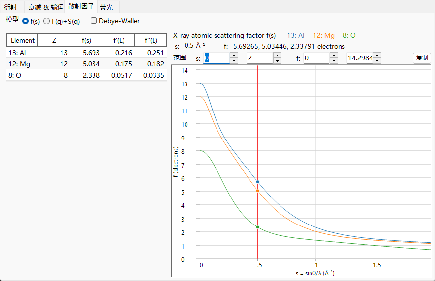
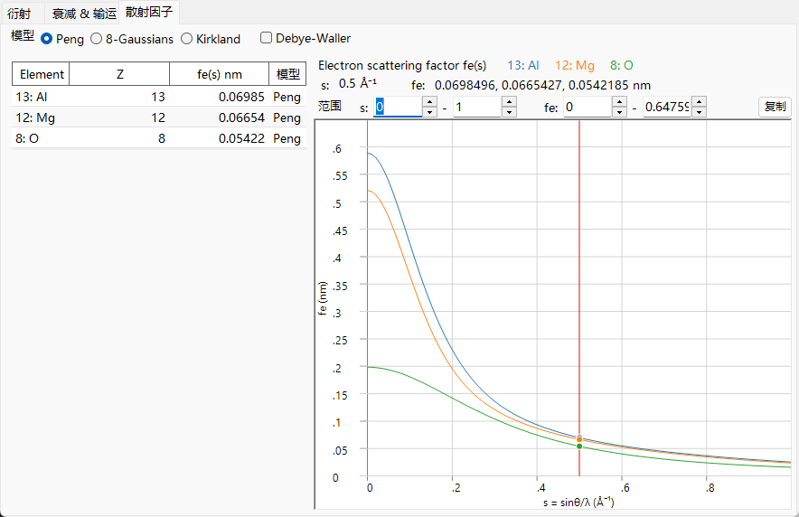
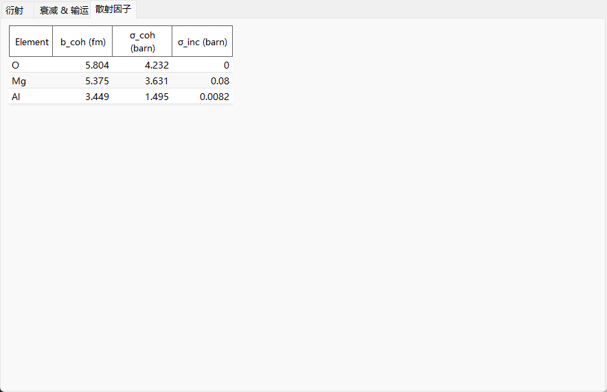

# 原子散射因子

**原子散射因子**（或*形状因子*）衡量单个原子作为散射变量 $s=\sin\theta/\lambda$ 的函数对入射束的散射强度。三种辐射与原子中完全不同的部分发生相互作用，因此它们的散射因子在量级、单位和角度依赖性上各不相同。这正是 **Scattering factors** 选项卡在 X 射线、电子和中子束之间看起来如此不同的最重要原因。

=== "X-ray"
    

=== "Electron"
    

=== "Neutron"
    

---

## X 射线 — 被电子云散射

X 射线被原子的**电子**散射。单个自由电子以经典的 **Thomson** 微分散射截面进行散射，该截面由经典电子半径 $r_e = e^2/(4\pi\varepsilon_0 m_e c^2) \approx 2.82\times10^{-5}\ \text{Å}$ 决定：

$$\left(\frac{d\sigma}{d\Omega}\right)_e = r_e^2\,\frac{1+\cos^2 2\theta}{2}.$$

原子的电子以数密度 $\rho_e(\mathbf r)$ 分布于空间，原子散射因子即为该密度的**傅里叶变换**。原子散射截面则是单电子散射截面按 $|f_0|^2$ 缩放后的结果：

$$f_0(\mathbf Q) = \int \rho_e(\mathbf r)\, e^{\,i\mathbf Q\cdot\mathbf r}\, d^3r ,
\qquad
\left(\frac{d\sigma}{d\Omega}\right)_\text{atom} = r_e^2\,\frac{1+\cos^2 2\theta}{2}\,|f_0(s)|^2 .$$

- 在前向方向（$s\to 0$）每个电子都同相散射，因此 $f_0(0) = Z$，即原子序数。该因子以**电子单位**表示（Thomson 振幅的倍数 —— 上面的第二个方程使这一点变得明确）。
- 随着 $s$ 增大，来自电子云不同部分的散射逐渐失相，$f_0(s)$ 随之衰减。弥散的（外层、价）电子分布会使 $f_0$ 迅速下降；紧束缚的芯电子则在高 $s$ 处仍持续贡献。

实际上 $f_0(s)$ 被列表化为高斯函数之和（ReciPro 所采用的 **Waasmaier–Kirfel** 解析形式，是较旧的 Cromer–Mann 表的扩展），

$$f_0(s) = \sum_{i} a_i\, e^{-b_i s^2} + c ,$$

这就是 ReciPro 用于绘制曲线的表达式。这些系数是针对以 Å⁻¹ 为单位的 $s$ 列表化的，因此每个 $b_i$ 的单位为 Ų；ReciPro 内部以 nm⁻² 携带 $s^2$，并应用 [index](index.md) 中提到的因子 100 的换算。

### 反常（共振）色散

傅里叶变换的图像假定电子如同自由电子那样散射。当光子能量接近**吸收边**时，束缚电子产生共振响应，于是出现两个依赖能量的修正项：

$$f(s,E) = f_0(s) + f'(E) + i\,f''(E) \qquad \text{(textbook, } e^{+i\phi}\ \text{convention).}$$

- $f'(E)$ ：实部色散修正（在吸收边附近降低有效电子数）。
- $f''(E)$ ：虚部，在吸收边正上方处最大。
- 二者通过 **Kramers–Kronig** 关系相联系，因此吸收（$f''$）中的峰会伴随 $f'$ 中的色散摆动。

这些并非自由参数。因果性（Kramers–Kronig）将 $f'$ 与 $f''$ 联系起来，而**光学定理**将 $f''$ 直接与光吸收截面联系起来：

$$f'(E) = \frac{2}{\pi}\,\mathcal{P}\!\!\int_0^\infty \frac{E'\,f''(E')}{E'^2 - E^2}\,dE',
\qquad
f''(E) = \frac{\sigma_\text{abs}(E)}{2\,r_e\,\lambda}.$$

这里 $\sigma_\text{abs}$ 本质上是衰减中的**光吸收**部分（而非 Rayleigh/Compton 项）—— 与 [衰减与输运](attenuation-transport.md) 页面所见的吸收边结构相同。

ReciPro 使用随附的 **xraylib** 库在当前能量下计算 $f'$ 和 $f''$，并将其列入表中（取 $f'' > 0$）。有两个符号问题值得注意。其一，xraylib 返回的 $F_{ii}$ 与晶体学约定符号相反，因此 ReciPro 对其取负，以报告为**正的 $f''$**。其二，在 ReciPro 的 $\exp(-2\pi i\,\mathbf g\cdot\mathbf r)$ 相位约定下，真正进入结构因子的复因子是 $f_0 + f' - i f''$ —— 上面所写的 $+i f''$ 属于相反的（$e^{+2\pi i}$）约定。这就是为什么 `F_inv`（结构因子的虚部）在吸收边附近变为非零 —— 参见 [结构因子](structure-factor.md)。

---

## 电子 — 被静电势散射

快速电子带电，因此它被原子的**静电势** $V(\mathbf r)$ 散射 —— 即带正电的原子核与带负电的电子云的组合。因此电子散射因子 $f_e$ 是该势的傅里叶变换，并通过泊松方程将其与 X 射线因子相联系。其结果就是 **Mott–Bethe 关系**：

$$f_e(s) = C_\text{MB}\,\frac{Z - f_0(s)}{s^2} \;\;\propto\; \frac{Z - f_X(Q)}{Q^2}.$$

前置因子 $C_\text{MB}$ 由基本常数构成，并依赖于单位制以及使用的是 $s$ 还是 $Q$。ReciPro 并不直接计算此关系 —— 它使用下面拟合的 Peng / Kirkland / 8-Gaussian 形式 —— 因此此处给出它是为了物理上的理解，而非用于计算。将常数写出（$s$ 和 $f_e$ 以 Å 为单位），

$$f_e(s)\,[\text{Å}] = \frac{m_e e^2}{8\pi\varepsilon_0 h^2}\,\frac{Z - f_0(s)}{s^2} \simeq 0.023934\,\frac{Z - f_0(s)}{s^2}, \qquad s\ \text{in Å}^{-1},$$

当 ReciPro 以 nm 报告 $f_e$ 时还需额外乘以 $\times 0.1$，并在动力学势中带有额外的相对论 $\gamma$ 因子（见下文）。

物理本质在于分子 $Z - f_0$：电子看到的是核电荷 $Z$ 与起屏蔽作用的电子云 $f_0$ 之间的**差值**，即净原子势。

- **量级。** 由于 $1/s^2$ 因子，$f_e$ 在小角度方向急剧峰化，并且（以其自身单位计）远大于 $f_0$ 且更偏向前向。这就是为什么电子衍射由低指数反射主导，以及为什么动力学（多重）散射重要 —— 参见 [附录 A3](../a3-bloch-wave/index.md)。
- **小角极限。** 对于*中性*原子，$Z-f_0\to 0$ 与 $s^2\to 0$ 同时成立，因此 $f_e(0)$ 是有限的（一个由均方原子半径决定的 $0/0$ 极限）。对于**离子**，电子云不再抵消 $Z$，长程库仑尾使 $f_e$ 在 $s\to 0$ 时发散；列表化的离子电子因子在最小角度处必须谨慎处理。
- **相对论修正。** 在 TEM 能量下，电子质量和波长是相对论性的。波长采用相对论形式 $\lambda = h/\sqrt{2 m_0 e U\,(1 + e U/2 m_0 c^2)}$，相互作用势带有相对论因子 $\gamma = 1 + eU/m_0c^2$。ReciPro 在构建动力学势时应用此修正。

ReciPro 提供 $f_e(s)$ 的三种参数化形式：

- **Peng** ：一种五高斯拟合，$f_e(s)=\sum_i a_i e^{-b_i s^2}$，便捷且广泛用于弹性电子散射。
- **Kirkland** ：一种洛伦兹 + 高斯的混合拟合，$f_e(q)=\sum_i \dfrac{a_i}{q^2+b_i} + \sum_i c_i\,e^{-d_i q^2}$。**其自变量是 $q = 2s = 1/d$，而非 $s$** —— 这是比较各模型时出现因子二误差的常见来源（$q$ 以 Å⁻¹ 为单位，拟合系数 $a_i,b_i,c_i,d_i$ 以相应单位表示）。
- **8-Gaussians** ：一种八项拟合，在更宽的 $s$ 范围内有效。

**如何选择。** 这三者都拟合同一底层的 $f_e(s)$，并在低 $s$ 处高度吻合；它们的差异主要在于适用范围以及原子芯的表示方式。**Peng**（中性原子和常见离子，在 $s\approx2\text{–}6$ Å⁻¹ 范围内准确）是 SAED/CBED 结构因子的常用默认选项；**Kirkland** 通过洛伦兹芯项扩展到更高的 $s$，适用于 HRTEM/STEM（注意 $q=2s$）；**8-Gaussians** 适用于达到非常高 $s$ 的反射。对于轻元素，这三者几乎无法区分；差异在重元素的大角度处才显现。

---

## 中子 — 被原子核散射

热中子不带电，主要通过**强核力**与物质相互作用，其作用程（飞米量级）相比中子波长（埃量级）完全可以忽略。该相互作用由 **Fermi 赝势**表示，它是一个点源，其强度即散射长度 $b$：

$$V(\mathbf r) = \frac{2\pi\hbar^2}{m_n}\,b\,\delta(\mathbf r)
\qquad\Longrightarrow\qquad
\frac{d\sigma}{d\Omega} = |b|^2 .$$

由于散射体是点状的，$b$ **与 $s$ 无关** —— 没有形状因子的衰减，这就是为什么 **Scattering factors** 选项卡对中子不绘制任何曲线，而是改为显示散射长度表。

- $b$ 是**核素**的属性，而非电子组态的属性。它在不同元素之间（以及不同同位素之间）不规则地变化，可以为**负值**（例如 ¹H、Ti、Mn），且与 $Z$ 没有单调关系。这正是中子衬度的基础（重原子附近的轻原子、同位素标记）。
- **相干与非相干。** 真实元素是具有不同 $b$ 的同位素和核自旋态的混合物。将 $b = \langle b\rangle + \delta b$ 分解可得到相干部分（来自平均值）和非相干部分（来自离散度）：

$$\sigma_\text{coh} = 4\pi\,|\langle b\rangle|^2, \qquad \sigma_\text{inc} = 4\pi\big(\langle |b|^2\rangle - |\langle b\rangle|^2\big), \qquad \sigma_s = \sigma_\text{coh} + \sigma_\text{inc}.$$

  相干部分产生布拉格衍射（它即进入结构因子的部分）；非相干部分是平坦的、各向同性的背景（对 ¹H 很大，这正是进行氘代的原因）。

!!! note "列表值"
    ReciPro 从核素表中读取 $b_\text{coh}$ 和散射截面，而非计算它们。对于共振核素，所列的 $\sigma_\text{coh}$ 不必等于朴素的 $4\pi b^2$，因此表中的数值是权威的。磁性中子散射（来自未配对的电子自旋，它*确实*具有依赖 $s$ 的形状因子）在此处未予建模。

---

## 一览

| | X-ray | Electron | Neutron |
|---|---|---|---|
| 散射体 | 电子云 $\rho_e(\mathbf r)$ | 静电势 $V(\mathbf r)$ | 原子核（点） |
| $s$ 依赖性 | 衰减（电子云的 FT） | $\propto (Z-f_0)/s^2$，强烈前向 | 无（$b$ 恒定） |
| 前向值 | $f_0(0)=Z$ | 有限（中性）/ 发散（离子） | $b$ |
| 能量依赖性 | 吸收边附近的 $f',f''$ | 相对论 $\lambda,\gamma$ | $\sigma_\text{abs}\propto 1/v$（非 $b$） |
| 典型量级 | $\propto Z$ | 前向峰化，随 $Z$ 增大 | 不规则，可为 $<0$ |

---

## 另请参阅

- [索引 — 几何与变量 $s$](index.md)
- [结构因子](structure-factor.md) —— 这些因子如何在一个晶胞内组合。
- [3. 射束相互作用 → Scattering factors 选项卡](../../3-beam-interaction.md#scattering-factors-tab)
