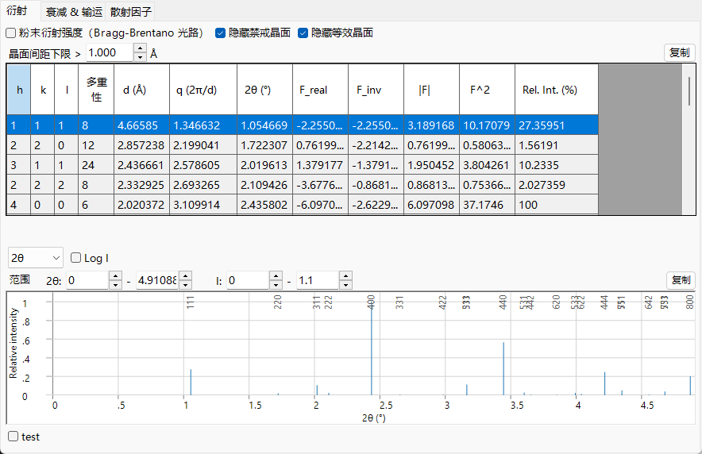
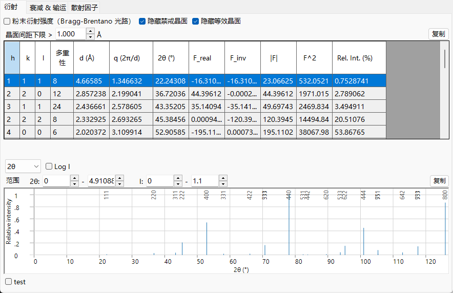

# 结构因子

原子散射因子描述单个原子;而**结构因子**描述晶胞内的所有原子如何*共同*散射。它是 **衍射** 选项卡所列出的量(`F_real`、`F_inv`、$\lvert F\rvert$、$F^2$),并且是连接上一页原子物理与衍射强度之间的桥梁。

=== "X-ray"
    

=== "Electron"
    

=== "Neutron"
    

---

## 晶胞上的干涉

反射 $\mathbf g = (hkl)$ 的结构因子是各原子因子的相干求和,每一项都按原子分数坐标 $\mathbf r_j = (x_j,y_j,z_j)$ 给出的相位加权:

$$F_{\mathbf g} = \sum_{j} o_j\, f_j(s,E)\, T_j(\mathbf g)\, \exp\!\left(-2\pi i\,(h x_j + k y_j + l z_j)\right).$$

- $o_j$ : 位点**占有率**(分数,用于部分占有或混合占有)。
- $f_j(s,E)$ : 当前射束下原子 $j$ 的散射因子 — X 射线在 ReciPro 的[相位约定](index.md#phase-convention)下为 $f_0+f'-if''$,电子为 $f_e$,中子为 $b$。
- $T_j(\mathbf g)$ : 德拜-沃勒因子(见下文)。
- $-2\pi i$ 相位遵循 ReciPro 的[约定](index.md#phase-convention)。

强度是模的平方,

$$I_{\mathbf g} \;\propto\; \lvert F_{\mathbf g}\rvert^2 = F_\text{real}^2 + F_\text{inv}^2 ,$$

即表中的 $F^2$ 列。`F_real` 与 `F_inv` 是复结构因子的实部与虚部。即使原子因子为纯实数,对于非中心对称结构(或原点平移)而言,$F_{\mathbf g}$ 一般也是复数;X 射线反常色散(复数 $f$)和复数中子散射长度还会增添额外的虚部贡献。只有当结构为中心对称、原点取在对称中心上、且所有因子都为实数时,`F_inv` 才会对*每一个*反射都为零。

---

## 德拜-沃勒因子

原子在其平衡位点周围振动,使散射密度弥散并减小高角度处的因子。对于各向同性振动,

$$T_j = \exp\!\left(-B_j\, s^2\right), \qquad B_j = 8\pi^2\langle u_j^2\rangle,$$

其中 $\langle u_j^2\rangle$ 是沿散射方向的均方位移,$B_j$ 是各向同性位移参数(Ų)。各向异性振动将其推广为

$$T_j = \exp\!\left(-2\pi^2\,\mathbf g^{\mathsf T}\!\mathbf U_j\,\mathbf g\right),$$

其中 $\mathbf U_j$ 为位移张量,$\mathbf g$ 为倒易点阵矢量($|\mathbf g|=1/d$,而非 $Q=2\pi\lvert\mathbf g\rvert$)。对于德拜固体,均方位移本身是温度 $T$、原子质量 $M$ 和德拜温度 $\Theta_D$ 的函数,

$$\langle u^2\rangle = \frac{3\hbar^2}{M k_B \Theta_D}\left[\frac14 + \left(\frac{T}{\Theta_D}\right)^2\!\int_0^{\Theta_D/T}\frac{x}{e^x-1}\,dx\right],$$

因此 $B$ 随温度升高而增大,对于重原子则减小。ReciPro 直接使用列表值或输入的 $B_j$,而不计算此式。由于 $T_j$ 与散射因子相乘,**散射因子** 选项卡可以将同样的 $e^{-Bs^2}$ 衰减应用于所绘曲线。该衰减随温度和 $s$ 增大,这正是热漫散射(从相干布拉格束中移除并重新分配到漫散背景中的强度)在动力学理论中给出吸收势的原因([附录 A3](../a3-bloch-wave/index.md))。

---

## 消光:系统性 vs 偶然性

反射可能因两种不同的原因而**缺失**:

- **系统性(空间群)消光。** 点阵心化以及带有平移分量的对称元素(螺旋轴、滑移面)会使整类反射*精确地*消失,对该空间群中的每个晶体都成立,与原子组成无关。这正是 **Hide prohibited planes** 背后的规则。
- **偶然性近消光。** 当原子贡献对某个特定结构恰好相互抵消时,强度很小但并非对称性禁止,若组成或位置发生变化它便会重新出现。这些*不会*被消光规则移除。

系统性消光是晶胞的对称相关副本之间的相位抵消。对于心化平移 $\mathbf t_\alpha$,结构因子带有一个公共因子

$$F_{\mathbf g} \propto \sum_\alpha e^{-2\pi i\,\mathbf g\cdot\mathbf t_\alpha},$$

它对某些 $hkl$ 为零。对于体心($\mathbf t = \tfrac12,\tfrac12,\tfrac12$),

$$1 + e^{-\pi i (h+k+l)} = 0 \quad\Longleftrightarrow\quad h+k+l \ \text{odd}.$$

最常见的系统性消光为:

| 对称元素 | 消光条件 | 受影响的反射 |
|---|---|---|
| $I$(体心) | $h+k+l$ 为奇数 | 所有 $hkl$ |
| $F$(面心) | $h,k,l$ 奇偶混合 | 所有 $hkl$ |
| $C$(C 底心) | $h+k$ 为奇数 | 所有 $hkl$ |
| $2_1$ 螺旋轴 $\parallel b$ | $k$ 为奇数 | $0k0$ |
| $a$ 滑移面 $\perp b$ | $h$ 为奇数 | $h0l$ |
| $c$ 滑移面 $\perp b$ | $l$ 为奇数 | $h0l$ |

心化条件适用于每一个反射;而螺旋轴和滑移面的条件只适用于对应的轴行或晶带,这正是它们能用于判别空间群的原因。

---

## 弗里德尔定律及其失效

对于散射因子为实数(非共振)的结构,对求和取复共轭并翻转 $\mathbf g$ 的符号即可直接表明(为清晰起见略去实数权重 $o_j T_j$)

$$F_{-\mathbf g} = \sum_j f_j\, e^{+2\pi i\,\mathbf g\cdot\mathbf r_j} = \left(\sum_j f_j\, e^{-2\pi i\,\mathbf g\cdot\mathbf r_j}\right)^{*} = F_{\mathbf g}^{*}, \qquad\text{hence}\qquad \lvert F_{hkl}\rvert = \lvert F_{\bar h\bar k\bar l}\rvert \quad\text{(Friedel's law).}$$

于是即使晶体并非中心对称,衍射看起来也是中心对称的。**反常色散可以打破这一点。** 把结构因子写成一个正常部分(可以干净地取共轭)加上一个反常部分,在 ReciPro 的 $f = f_0 + f' - i f''$ 约定下有 $F_{\mathbf g} = A_{\mathbf g} - i B_{\mathbf g}$ 和 $F_{-\mathbf g} = A_{\mathbf g}^{*} - i B_{\mathbf g}^{*}$,则 **Bijvoet 差** 为

$$\lvert F_{\mathbf g}\rvert^2 - \lvert F_{-\mathbf g}\rvert^2 = -4\,\operatorname{Im}\!\left(A_{\mathbf g}\, B_{\mathbf g}^{*}\right),$$

只有当正常部分与反常部分具有不同相位时它才不为零 — 也就是说,当化学上不同的反常散射体占据非中心对称的位点时。(对于中心对称结构、单一元素,或每个原子都带有相同复数因子的任何情形,该差值都为零。)这正是能够确定非中心对称晶体绝对结构(手性)的依据,也是当选取靠近吸收边的 X 射线能量时,ReciPro 会对弗里德尔对报告非零 `F_inv` 和不同 $\lvert F\rvert$ 的物理原因。

---

## 从结构因子到粉末强度

开启 **Powder Diffraction Intensities (Bragg–Brentano)** 会通过纳入随机取向多晶的几何关系,把 $\lvert F\rvert^2$ 转换为相对粉末强度:

$$I_{hkl} \;\propto\; m_{hkl}\, \lvert F_{hkl}\rvert^2\, L p(\theta),$$

- $m_{hkl}$ : **多重度** — 在同一 $2\theta$ 处重叠的对称等价晶面的数目(表中的 *Multi.* 列)。
- $Lp(\theta)$ : 布拉格-布伦塔诺光学的 **洛伦兹-偏振** 因子,$Lp = \dfrac{1+\cos^2 2\theta}{\sin^2\theta\,\cos\theta}$,它会强烈增强低角度处的峰。

由于在此模式下等价晶面被合并为同一条线,ReciPro 还会强制开启 *Hide equivalent planes* 和 *Hide prohibited planes*。

---

## 另请参阅

- [原子散射因子](scattering-factor.md) — 进入求和的 $f_j$。
- [衰减与输运](attenuation-transport.md) — 在散射事件之间射束会发生什么。
- [3. 射束相互作用 → 衍射 选项卡](../../3-beam-interaction.md#reflections-tab)
- [附录 A3. 动力学衍射](../a3-bloch-wave/index.md) — 当 $\lvert F\rvert^2$(运动学)不再足够时。
