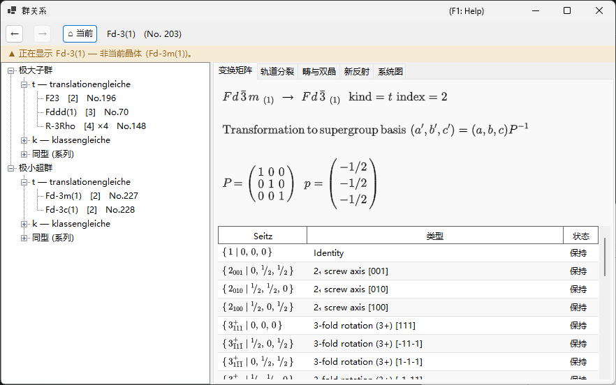
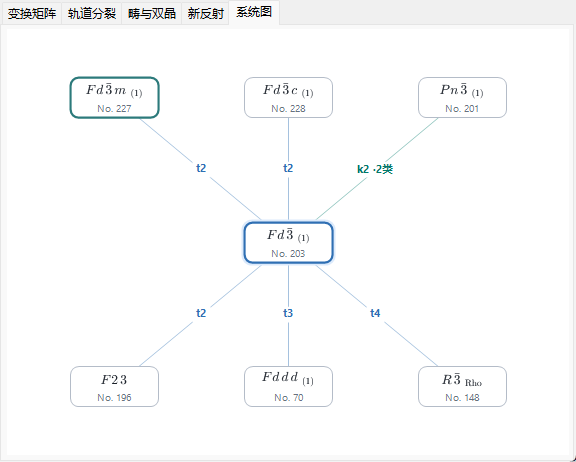
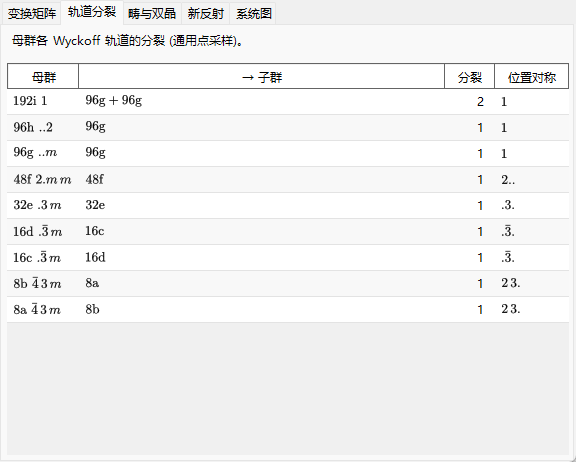
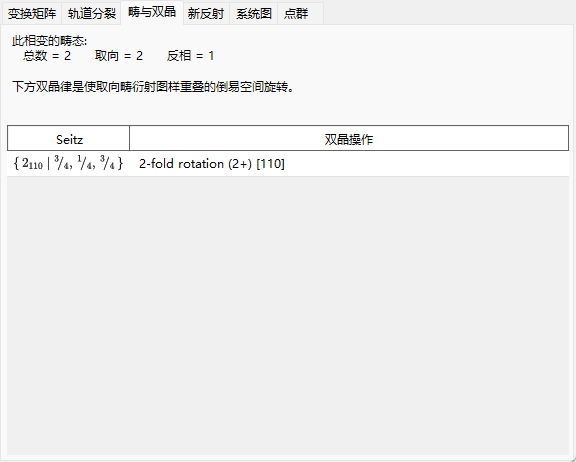
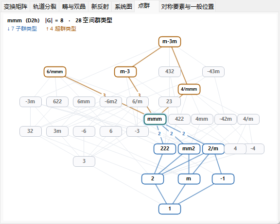
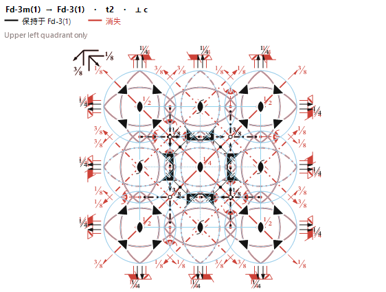

# A4.2. 群-子群关系

**群关系...**（Group Relations...）是浏览 230 种空间群类型的极大子群/极小超群关系的浏览器，从[对称性信息](../../2-symmetry-information.md)的 **选项** 面板打开。与静态表格不同，它显示的每个关系都是在运行时直接由当前空间群自身的对称操作计算出来的（见 [A4.1](symbols-and-diagrams.md#对称操作对称操作选项卡)），因此可以逐个操作地交叉核对，而不必只当作 *International Tables* Vol. A1 的转录来信任。

本页先解释浏览器所用的群论词汇，然后逐一讲解它的各个选项卡。

---

## Hermann 定理：*t*-、*k*- 与同型子群

若 $G$ 的任何子群都不严格位于 $H$ 与 $G$ 之间，则称子群 $H<G$ 是**极大的**。Carl Hermann（1929 年）的一条定理指出：对此处收录的三维空间群，空间群 $G$ 的每个极大子群必为以下两类之一：

- **translationengleiche（*t*-）子群** — “平移相等”：$H$ 保留 $G$ 的*全部*平移（同一点阵、同一晶胞），但点群更小。指数 $[G:H]$（$H$ 在 $G$ 中的陪集个数）等于点群指数 $[P_G:P_H]$。
- **klassengleiche（*k*-）子群** — “晶类相等”：$H$ 保持与 $G$ *相同的几何晶类*（点群类型），但只保留 $G$ 平移的一个子点阵 — 常规晶胞更大，和/或带心矢量更少。指数等于平移点阵指数 $[T_G:T_H]$。

**同型子群**是 *k*-子群中特殊而重要的一类：$H$ 还与 $G$ 自身属于*同一空间群类型*（只是晶胞更大 — 这种关系可以无限重复下去，因此同型子群构成以晶胞尺寸为指标的无限系列，不同于给定 $G$ 只有有限个的 *t*- 与非同型 *k*-子群）。对*极大*同型子群，指数总是素数幂（$p$，在三维中偶尔为 $p^2$ 或 $p^3$）；出现哪个幂，取决于有限的商点阵在点群作用下作为模如何分解。还要注意，通往子点阵的基变换可以带有真正的基矢改变和原点移动，而不只是沿某一轴对晶胞的均匀放大。

由于每个有限指数的子群关系（无论极大与否）都可以通过一串极大步骤到达，只列出极大子群（以及反方向的极小超群）就足以描述有限指数子群关系的完整网络 — 这正是 ITA Vol. A1 和本浏览器都只列表极大/极小关系的原因。

!!! note "只有两类 — 同型是子类，不是第三类"
    人们常把“*t*-、*k*-、同型子群”说成三者并列，本浏览器的树为方便起见也确实组织成三条分支。但从形式上说，Hermann 定理是**二**分法（*t* 对 *k*）；同型子群不过是恰好重现 $G$ 自身空间群类型的那些 *k*-子群。

### 指数即陪集个数

由于空间群是无限群（含有平移），这里的“指数”始终指 **$H$ 在 $G$ 中的陪集个数**，而不是阶数之比 $|G|/|H|$（两个阶都是无穷大） — 对有限群两种概念一致，但对空间群只有数陪集的定义才有意义。树和变换矩阵选项卡都会显示这一指数，例如 `t, index 2` 或 `k, index 3`。

### 共轭子群与共轭类

同一个抽象的子群关系，往往可以在 $G$ 内以不止一种几何上不同的方式实现 — 差别在取向或位置而非类型 — 例如某镜面的镜像，或沿着取向不同但对称等价方向的螺旋轴。若存在 $g\in G$ 使 $H' = gHg^{-1}$，则称这两个实现 $H$ 与 $H'$ **在 $G$ 内**共轭；浏览器把一个关系的所有 $G$-共轭副本归并成一个条目，并把它们的个数报告为*共轭类*的大小。这是比按 $G$ 的欧几里得或仿射正规化子等价来归类（ITA 自身有时改用的较粗分类）严格更细的概念，因此类型和指数相同的子群并不自动属于同一个共轭类；它们可能分属若干类。

---

## 浏览器的操作

- **树**（左窗格）有两个根：**极大子群** 与 **极小超群**，各自分为 **`t — translationengleiche`** 分支、**`k — klassengleiche`** 分支和 **`同型 (系列)`** 分支。共享同一子类型和指数的非共轭类否则会得到相同的标签，因此用 `· 类 n` 后缀加以区分。在极大子群侧的 **同型** 分支中，在 $G$ 的*仿射正规化子*下等价的共轭类会进一步归并到同一个轨道行（*“… — m 个类 (正规化子等价)”*）之下 — 其粒度与 ITA Vol. A1 的 IIc 条目相同；枚举上限由工具栏上的 **同型子群: index ≤** 数值框设定（2 到 27，默认 4；更高的上限在后台计算）。
- **系统图** 选项卡绘制简化的 Bärnighausen 式骨架图：当前群居中（高亮显示），极小超群在其上方、极大子群在其下方 — ***t*-、*k*- 与同型关系一律并列**，因为每个都是一步“极大步”。每条边都标注种类与指数（`t2`、`k3`、`i3`），并以颜色区分：*t* 为蓝色、*k* 为蓝绿色、同型为橙色。节点符号排版为正规的晶体学记号 — 螺旋轴用下标、旋转反演用上划线。共享同一目标类型、种类和指数的非共轭类被合并为一个节点，其边标签带有类数（如 `k2 ·2类`） — 逐类查看仍需回到树。当一行的关系多于窗口宽度所能容纳时，节点缩小一级，仍容纳不下的部分收进一个虚线 `+N` 节点（不可点击 — 完整列表请用树）；只要显示了同型边，角落就会出现小小的 `i: 仅 index ≤ 4` 提醒；*k*-超群反查尚在构建时则显示 `k: 计算中…`。当你以双击方式沿子群一路下行时，你所途经的群链（你的*选定分支*）会以紫色竖列绘制在当前群上方 — 一棵由你自己的转变路径构成的多级 Bärnighausen 树（如 $Pm\bar3m \rightarrow P4/mmm \rightarrow Pmmm \rightarrow \ldots$），每条边都标注你走过的那条关系；向上导航或按下**后退**会相应地修剪该分支，超过三个祖先的链则以变暗的 `⋮ +N` 缩略显示。此图展示的只是群论骨架 — 结构关系意义上完整的 Bärnighausen 树还会在每条边上附带晶胞变换、Wyckoff 分裂和原子坐标的对应关系，这些内容收在下文所述的其他选项卡中，而不在图本身上。
- **单击**（树节点或系统图节点）选中一个关系，并填充下方的详情选项卡。**双击**则是*导航*：它把整个浏览器重新定位到那个空间群，你可以由群到子群再到子群地逐步走下去。
- **后退 / 前进 / 当前** 在导航历史中前后移动；**当前** 总是回到你实际打开浏览器时那块晶体的空间群。
- **面包屑**（顶部）显示当前正在展示的空间群（`HM 符号 (No. n)`）；其下方的**上下文横幅**在与你的晶体一致时变绿（“正在显示当前晶体的空间群。”），在你导航到别处时变为琥珀色（“正在显示 … — 非当前晶体 (…)。”） — 提醒你浏览子群并*不会*改变你的晶体。

---

## 变换矩阵选项卡（Matrix）

显示母群设置与子群设置之间的基变换与原点移动，采用 ITA 约定：新基矢为 $(\mathbf a',\mathbf b',\mathbf c')=(\mathbf a,\mathbf b,\mathbf c)\cdot P$，某点在母群设置下的坐标为 $\mathbf x_{\text{parent}} = P\,\mathbf x_{\text{child}} + \mathbf p$。$3\times3$ 矩阵 $P$ 与原点移动 $\mathbf p$ 以分数形式打印。

- 当你从 **极大子群** 进入该关系时，直接显示 $P$ 与 $\mathbf p$（母群 → 子群方向）。
- 当你从 **极小超群** 进入时，选项卡改为显示 $P^{-1}$（以及相应取逆的原点移动），并注明“由超群自身的子群表推得” — 浏览器始终以较大群的视角存储关系并按需取逆，而不是维护两份独立副本。
- **本类共轭子群数: $n$** 报告上文所述共轭类的大小。
- 生成元表列出每个陪集代表元，标记为 **保持**（仍存在于 $H$ 中）或 **消失**（存在于 $G$ 而不在 $H$ 中 — 正是这些操作造成了对称性破缺），并附 [A4.1](symbols-and-diagrams.md#对称操作对称操作选项卡) 中的 Seitz 符号与几何类型描述。
- 若某候选关系的目标空间群类型无法对照 ReciPro 的目录识别出来，选项卡会坦率说明而不是妄加猜测，并且只显示点群符号。

---

## 轨道分裂选项卡（Orbit splitting）

显示当对称性降到 $H$ 时，*母*群的每个 Wyckoff 位置如何分裂：每行对应母群的一个位置，列出母群的多重度/字母/位置对称性、得到的子群多重度/字母（若轨道分裂成多支则以 `+` 连接）、分成了几支，以及各不相同的子群位置对称性。

其计算方法是把**一个固定的一般（generic）采样点**实际代入两个群的操作并比较所得的轨道 — 这是数值上*采样*的分裂，而非完全符号化的 Wyckoff 分裂形式体系（如 WYCKSPLIT 之类工具所用）；正因如此，它被有意命名为“轨道分裂”（Orbit splitting）而非“Wyckoff 分裂”（Wyckoff splitting） — 完全符号化的处理原则上能追踪每一种特殊参数下的重合，而这种采样做法只报告在一个一般点看到的分裂，无法自行标记只在 $x,y,z$ 取特殊值时才发生的重合。

对 ***k*- 或同型关系**，同样的采样方法作用于变粗的平移点阵：选项卡显示随着点阵平移的失去，母群的每个轨道如何分裂，且子群多重度按**扩大后的子群胞**计数（因此对指数为 $n$ 的晶胞扩大，各分支多重度之和是母群多重度的 $n$ 倍）。

---

## 畴与双晶选项卡（Domains & Twins）

当晶体从 $G$ 转变为子群 $H$ 时，$H$ 在 $G$ 中的 $[G:H]$ 个陪集各对应一个可能的**畴态**：参考态是恒等陪集；其余每个陪集 — 以变换矩阵选项卡中的一个“消失”操作为代表 — 各生成一个借该操作与参考态相联系的畴态。

具体到 ***t*-子群**，平移点阵不变（$T_G=T_H$），因此从群论上说这里不存在**反相（平移）畴** — 每个畴态与参考态的差别都是一个真正的点群操作，绝不是单纯的平移。所以该选项卡总是报告 `反相 = 1`、`取向 = 总数`，即全部 $[G:H]$ 个畴态都是**取向畴**。

对 ***k*- 或同型**转变，情况恰好相反：点群不变，因此**取向态只有一个**，失去的点阵平移生成**反相（平移）畴** — 选项卡报告 `取向 = 1`、`反相 = 总数`。每个失去的平移都以纯平移的 Seitz 符号列出，并附上以子群胞表示的相应反相矢量。由于所有反相畴取向相同，它们的基本反射严格重合；只有超结构反射（见 **新反射** 选项卡）在跨越反相畴界时携带相位差。

一对取向畴的**双晶律**是消失操作的矩阵部分 — 一个作用在正点阵或倒易点阵上的旋转或反映 — 它把一个畴的点阵取向映到另一个畴的点阵取向上。对 *t*-子群转变，此操作按构造就是*母*群 $G$ 点阵的对称操作，因此若低对称结构的实际度量仍保持该点阵对称性，则施加双晶操作后两个畴的倒易点阵严格重合、衍射图样完全重叠 — 这正是本选项卡所描述的理想化情形，即 *merohedral*（缺面）双晶。在真实相变中，低对称相通常出现小的自发应变，只近似保持母群的度量，因此实际的重叠往往也只是近似的（*pseudo-merohedral*，假缺面双晶）；本选项卡报告的是群论上、严格度量下的双晶律，而不是对某块真实晶体接近该理想的程度的测量。

陪集列表为空的退化情形报告为 `(单畴)`（指数 1 从不作为关系显示）。

---

## 新反射选项卡（New reflections）

对 *t*-子群转变，列出在 $G$ 中系统消光、但在 $H$ 中变为对称性允许的反射 — 即被母群的反射条件（见[衍射条件](../../2-symmetry-information.md)选项卡）禁止、而 $H$ 的反射条件并不禁止的反射。搜索范围由选项卡上的 **搜索范围** 数值框设置：默认 $|h|,|k|,|l|\le4$，可在 2 到 8 之间调整（上限越大，列出的反射可能越多）。

由于 *t*-子群从不扩大晶胞，这些**不是**超结构/分数指数反射 — 它们仍是母群晶胞的整数 $(h,k,l)$，只是因为原本迫使它们消光的滑移面或螺旋轴不复存在而变为*允许*。（母群指数为分数的真正超结构反射只有在晶胞本身扩大后才可能出现，而那发生在 *k*-子群、并非 *t*-子群。）此处出现的反射只是对称性上*允许*而已；实际能否观测到，仍取决于真实的低对称结构的结构因子。

对 ***k*- 或同型关系**，选项卡以**扩大后的子群胞指数**列出新反射（同样以搜索范围为限），并在最后一列将每条反射归类：

- **超结构反射**（superlattice reflections）映射为母群的*分数*指数，以括号显示（例如 `(1/2 0 1)`） — 它们纯粹因晶胞扩大而出现；
- **释放反射**（released reflections）在母群晶胞中为整数指数，但曾被子群如今解除的某条母群反射条件所禁止 — 此时改为显示被解除的母群消光条件（这也涵盖带心平移的丧失，例如 $I$ 心母群失去其 $h+k+l$ 为偶数的条件）。

母群与子群中都允许的反射（基本反射）不予列出。若子群的空间群类型无法识别，则子群的反射条件不得而知，选项卡会说明无法给出预测。

---

## 点群选项卡（Point groups）

浏览器的其余部分在各*空间*群之间游走，而本选项卡展示的是承载这些游走的更大地图：**32 种晶体学点群类型（几何晶类）的 Hasse 图** — 即哪种类型作为哪种类型的子群出现的偏序关系。每个节点是一种点群类型；纵轴是群的阶（底部为 1，顶部为 48，取对数刻度），六方/三方晶族构成左侧的塔，立方–四方–正交的塔则位于右侧。每条边代表一个*极大*（覆盖）子群关系 — 不存在第三种类型严格居于两者之间 — 32 种类型之间恰好有 80 条这样的边。该图是一个偏序，但在数学意义上*不是*格（lattice）：它有两个极大元 $m\bar3m$ 与 $6/mmm$，二者不可比较。

- 你正在浏览的空间群的点群带有淡蓝色光晕（如同系统图选项卡的当前节点），并且默认就是*聚焦*的类型。
- **单击**任意节点可改为聚焦该节点：其**子群类型高亮为蓝色**，**超群类型高亮为橙色**，聚焦节点自身各边上的数字是该极大步骤的**指数**（阶数之比）。与焦点无关的类型保持灰色。单击空白处则把焦点返回到当前点群。（单击从不进行导航 — 一种点群类型对应的是许多空间群，而不是某一个。）
- 顶部的说明文字汇总聚焦类型的信息：Hermann–Mauguin 与 Schoenflies 符号、群的阶 $|G|$、230 种空间群类型中有多少属于该类型，以及其子群/超群集合的大小。

此图是 Hermann 定理在点群上的投影：树中的一步 *t*-子群步骤在这里恰好沿一条边向下移动（*t*-步骤的空间群指数等于该边上的点群指数），而 *k*- 步骤与同型步骤则停留在同一节点上。

---

## 对称要素选项卡（Elements）

**变换矩阵**选项卡以表格形式列出保持与消失的操作，而本选项卡则把同样的信息以*几何方式*展示出来，叠加在母群的[对称要素示意图](symbols-and-diagrams.md#symmetry-element-diagram)（即带有轴、面和对称心的 ITA Vol. A 式图）之上。它回答的是“当晶体从 $G$ 转变为子群 $H$ 时，哪些对称要素得以保留、哪些被破坏” — 一目了然，而且就用晶体学家早已熟读的那张图。

- **在 $H$ 中保持的要素以黑色绘制；消失的要素以红色绘制。** 投影方向（⟂ *a*、*b* 或 *c*）根据母群的晶系自动选择，标题栏注明关系与投影方向。
- 某个对称要素退化为较低者会如实画出：例如一根变为二重轴的四重轴，会显示为**一个红色四重轴符号，其上叠画一个黑色二重轴** — 红色表示“四重轴已消失”，黑色表示“此处仍保留一根二重轴”。
- 该叠加图的构建方法是：先画出完整的母群示意图（作为*消失*的基线），再在其上重新绘制直接由 $H$ 自身操作集重构出的对称要素 — 因此保持的要素恰好就是那些在 $H$ 中重新出现者，无需逐个符号地猜测。

本选项卡**仅对 *translationengleiche*（*t*-）子群提供**，此时 $H$ 保留母群的平移点阵（$T_H=T_G$），因此两个群的要素共处同一晶胞。对 *k*- 与同型关系，晶胞会扩大，其图示推迟到后续版本；此时选项卡显示一条简短说明，指向**畴与双晶**选项卡和**新反射**选项卡 — 它们已经为那些情形承载了失去的点阵对称性信息。

---

## 当前限制

浏览器的 *t*- 与 *k*-子群引擎、*t*- 与 *k*-超群反查、以及同型 (IIc) 分类均已完整实现，并已对照空间群操作表独立验证；**轨道分裂**、**畴与双晶** 和 **新反射** 选项卡对所有种类的关系都已启用。剩余的限制会明示出来，而不是被无声地省略：

- **同型子群枚举到数值框设定的上限为止（默认 index ≤ 4，最多 27）。** 同型系列会无限延续到更高指数，因此该分支上灰色的注记始终写明当前上限，而不是佯装列表已经完整。正规化子轨道的归并依赖于对正规化子生成元的有界搜索；对已测试的情形均已对照 ITA A1 验证，但针对每个群的形式化完备性证明仍是未来的工作 — 最坏情况下一个轨道可能被拆成多行显示，但绝不会被错误地合并。
- ***k*-超群** 在首次使用时于后台计算（反查需要同一晶类中每种类型的 *k*-子群表）；就绪之前，树会短暂显示灰色的“计算中…”节点（系统图角落则显示“k: 计算中…”注记）。

---

## 术语表

| 术语 | 含义 |
|---|---|
| 极大子群 / 极小超群 | 与 $G$ 之间不存在其他严格居间的子群关系的子群（超群） |
| 指数 $[G:H]$ | $H$ 在 $G$ 中的陪集个数 |
| *translationengleiche*（*t*-） | 平移点阵相同、点群更小；指数 = 点群指数 |
| *klassengleiche*（*k*-） | 点群类型相同、平移为子点阵（晶胞更大）；指数 = 点阵指数 |
| 同型子群 | 还与 $G$ 自身属于同一空间群类型的 *k*-子群 |
| 共轭类（$G$ 内） | 某一子群关系的所有 $G$-共轭（$gHg^{-1}$）实现的集合 |
| 取向畴 | 通过点群操作与参考态相联系的畴态 |
| 反相（平移）畴 | 仅通过失去的平移与参考态相联系的畴态（*k*- 转变可能，*t*- 不可能） |
| 双晶律 | 消失操作的矩阵部分，把一个取向畴的点阵映到另一个上 |

---

## 另请参阅

- [2. 对称性信息](../../2-symmetry-information.md) — 本附录所解释的 GUI 指南。
- [A4.1. 空间群符号与对称性示意图](symbols-and-diagrams.md) — 变换矩阵与畴与双晶选项卡通篇使用的 Seitz 符号/几何类型词汇。
- [附录 A4. 对称性与空间群](index.md)
