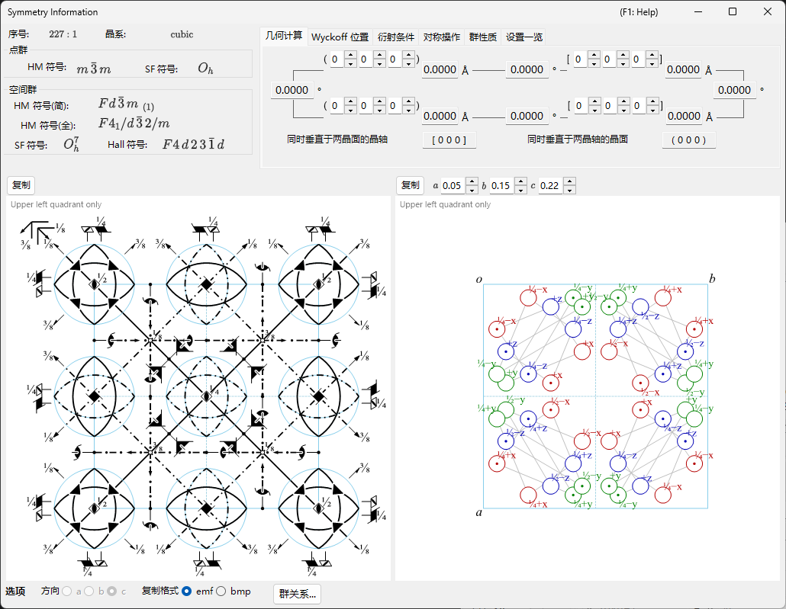

# 附录 A4. 对称性与空间群

主窗口章节 [2. 对称性信息](../../2-symmetry-information.md) 是 GUI 的操作指南：它告诉你哪个选项卡显示什么、哪个按钮复制哪幅示意图。本附录汇集这些表格与图形背后的**晶体学与群论背景** — Hermann–Mauguin 符号究竟编码了什么，如何阅读 *International Tables for Crystallography*（ITA）Vol. A 样式的对称元素与一般位置示意图，以及 **群关系...** 窗口的超群/子群表及其术语（*translationengleiche*、*klassengleiche*、共轭类、畴、双晶律、…）到底是什么含义。

本附录涵盖两个窗口，理论部分按以下顺序阅读最佳：

1. **[A4.1. 空间群符号与对称性示意图](symbols-and-diagrams.md)** — Hermann–Mauguin、Schoenflies 与 Hall 符号；**群性质** 选项卡所示的群论分类（中心对称、Sohncke、简单型、极性、算术晶类、Patterson 对称、…）；**对称操作** 选项卡中每个对称操作的坐标三元组/Seitz/几何类型表述；以及[对称性信息](../../2-symmetry-information.md)窗口底部对称元素与一般位置示意图的图形约定。
2. **[A4.2. 群-子群关系](group-subgroup-relations.md)** — 什么是*极大子群*/*极小超群*，Hermann 的 *t*-/*k*- 之分，以及如何阅读从对称性信息的 **选项** 面板打开的 **群关系...** 浏览器的每个选项卡（系统图、变换矩阵、轨道分裂、畴与双晶、新反射）。

A4.1 之所以放在前面，是因为 A4.2 无时无刻不在回引它：每一个子群/超群关系本身，正是用那里介绍的同一套 Hermann–Mauguin 符号、Seitz 符号和几何类型短语（*"3-fold rotation"*、*"c-glide plane"*、*"screw axis"*、…）来标注的。

---

## 范围与来源

ReciPro 的内置数据库完整收录了 *International Tables for Crystallography* **Volume A**（空间群对称性）与 **Volume A1**（空间群的极大子群）中列出的 230 种空间群类型（含 530 种收录的设置/原点选择）。本附录解释的是 ReciPro 对这些数据的*呈现方式* — 记号、示意图、浏览工具 — 并假定读者已具备关于点阵、点群和对称操作概念的本科水平基础。它不能替代 ITA 本身：收录数据的权威出处仍然是 ITA（出于版权原因，ReciPro 不能逐字复制其表格 — 对于给定空间群类型的备选原点/设置，参见 **设置一览** 选项卡中 ReciPro 自制的一览表）。

!!! note "群关系... 是一项仍在积极开发中的功能"
    **群关系...** 浏览器（A4.2）直接从空间群自身的对称操作计算 *translationengleiche*（t-）与 *klassengleiche*（k-，含*同型*）子群和超群（而不是取自预制表格），因此显示的每个关系都经过独立验证，而非从表格转抄。剩余的限制 — 例如同型系列只枚举到 index ≤ 4 — 已在 A4.2 的 **当前限制** 中写明。

---

## 另请参阅

- [2. 对称性信息](../../2-symmetry-information.md) — 本附录所解释的 GUI 指南。
- [A4.1. 空间群符号与对称性示意图](symbols-and-diagrams.md) · [A4.2. 群-子群关系](group-subgroup-relations.md)
- [附录 A1. 坐标系](../a1-coordinate-system/1-orientation.md)
- [附录 A2. 射束相互作用（固体物理背景）](../a2-beam-interaction/index.md) — 空间群的反射条件（系统消光）在这里进入结构因子。
