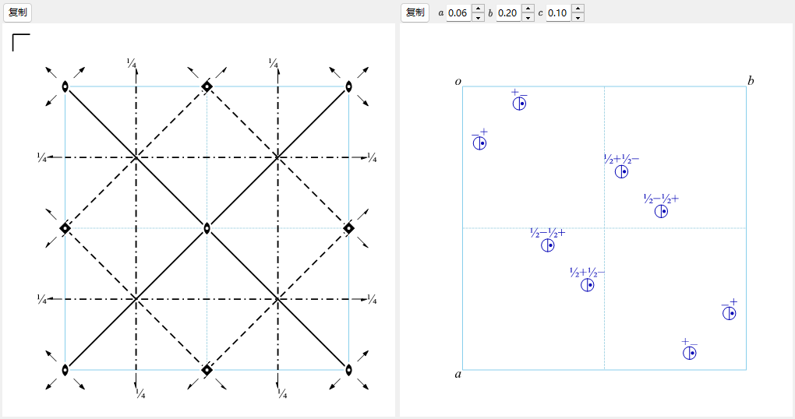

# A4.1. 空间群符号与对称性示意图

本页解释[对称性信息](../../2-symmetry-information.md)上半部分（空间群标识面板，以及 **对称操作**/**群性质**/**设置一览** 选项卡）所显示的全部内容，以及窗口底部的两幅示意图。所有记号均遵循 *International Tables for Crystallography*（ITA）Vol. A。

---

## Hermann–Mauguin（HM）符号

Hermann–Mauguin 符号有两个层次：**点群符号**（上方的框，*点群*）只描述晶体的宏观对称性，而**空间群符号**（下方的框，*空间群*）在其上加入点阵的带心方式以及螺旋/滑移成分。

### 点阵字母

空间群符号以七个标准点阵字母之一开头：

| 字母 | 含义 |
|---|---|
| `P` | 简单（初基）点阵 |
| `A`, `B`, `C` | 单面带心（分别在 *bc*、*ac*、*ab* 面带心） |
| `I` | 体心 |
| `F` | 全面心 |
| `R` | 菱面体（三方晶系特有的点阵；常以*六方轴*描述，此时晶胞内含 3 个阵点） |

### 对称方向

点阵字母之后，符号中其余的每个位置各代表一个**对称方向** — 晶体中旋转/螺旋轴沿其取向、且/或镜面/滑移面与其垂直的方向。这些位置对应哪些实际方向、按什么顺序排列，由晶系决定：

| 晶系 | 第 1 位 | 第 2 位 | 第 3 位 |
|---|---|---|---|
| 三斜 | *（无 — 只有 `1` 或 `-1`）* | | |
| 单斜 | $[010]$（唯一轴 $b$，ReciPro 的约定） | | |
| 正交 | $[100]$ | $[010]$ | $[001]$ |
| 四方 | $[001]$ | $[100],[010]$ | $[110],[1\bar 10]$ |
| 三方 / 六方 | $[001]$ | $[100],[010],[\bar 1\bar 1 0]$ | $[1\bar 10],[120],[\bar 2\bar 1 0]$ |
| 立方 | $[100],[010],[001]$ | $[111]$ *（连同其余 3 条体对角线）* | $[1\bar 10],[110]$ *（连同其余 4 条面对角线）* |

每个位置按以下规则填写：

- 单独的数字 $n$（$n=1,2,3,4,6$） : 沿该方向的 $n$ 重**旋转**轴。
- 螺旋轴 $n_p$（如 $2_1$、$4_2$、$6_3$） : 旋转 $360°/n$ *并*沿轴平移点阵周期的 $p/n$。例如 $2_1$（“二重螺旋”）表示旋转 $180°$ **且**沿轴平移半个晶胞边长；$6_3$ 表示旋转 $60°$ 并沿 $c$ 平移半个晶胞边长。
- 不带旋转数字的单独字母（$m,a,b,c,n,d$） : 垂直于该方向的**镜面或滑移面**（各字母的含义与下文示意图一节相同）。
- $n/m$ 或 $n_p/m$ : 旋转/螺旋轴**及**与之垂直的镜面（两个元素共享同一方向，一个沿轴、一个横截）。
- $-n$（如 $-1,-3,-4,-6$） : **旋转反演**轴（旋转 $360°/n$ 后，再对轴上一点做反演）。单独的 $-1$ 表示纯反演中心；不存在所谓的“$-2$”轴，因为二重旋转反演与镜面反映完全相同，所以总是写作 $m$。

### 短符号与全符号

**短** HM 符号（通常被引用的形式）省略已被写出的元素所隐含的对称元素；**全**符号则把每个方向都写出来。例如 No. 62 空间群的短式是 $Pnma$、全式是 $P\,2_1/n\,2_1/m\,2_1/a$ — 三条 $2_1$ 螺旋轴已由三张滑移/镜面连同空间群的点群 $mmm$ 隐含，故短符号将其省去。ReciPro 的 *HM 符号(简)* 与 *HM 符号(全)* 两栏同时显示两者；对大多数空间群二者是一致的。

### Schoenflies（SF）符号与 Hall 符号

**Schoenflies 符号**（如 $D_{2h}^{16}$）给出点群类型（$D_{2h}$），上标只是枚举“这是该点群家族中的第几个空间群” — 与 HM 符号不同，这个上标本身没有直接的几何含义，必须查表才能知道。ReciPro 对点群和空间群都显示 Schoenflies 符号。

**Hall 符号**是另一套基于生成元的记法，旨在实现无歧义的计算机处理：它列出一组最小的生成操作连同显式的原点，因此程序无需查阅“这个 HM 符号隐含哪种设置/原点选择”的对照表，就能重构出精确的坐标集合。Hall 符号并非编码给定操作集合的*唯一*方式（不同的生成元选择会给出同一个群的不同但同样有效的 Hall 字符串），但每一个 Hall 符号自身都是完全显式且可逆的。ReciPro 显示为当前设置系统生成的一个 Hall 符号；**设置一览** 选项卡（见下文）列出共享当前空间群编号的所有收录原点/设置选择，各附其 HM 与 Hall 符号。

---

## 对称操作（对称操作选项卡）

**对称操作** 选项卡以三种并列记法列出当前设置下一般位置的所有对称操作（点阵带心平移已展开计入）：

| 列 | 示例 | 含义 |
|---|---|---|
| 坐标 | `-y, x-y, z+1/3` | 坐标三元组 $(x,y,z)\mapsto(x',y',z')$，即把仿射映射 $x'=Rx+t$ 按代数写出（ITA/CIF 约定）。 |
| Seitz | `3+ [111]` | 紧凑符号：旋转/螺旋的重数与转向（`3+`）、轴方向（`[111]`），以及（如有）该操作的平移，例如 `2₁ [001] 0,0,1/2`。纯镜面记作 `m`，恒等记作 `1`，反演记作 `-1`。 |
| 类型 | `3-fold rotation (3+) [111]` | 操作的通俗分类：`Identity`（恒等）、`Inversion centre at …`（反演中心）、`n`-fold rotation（$n$ 重旋转）、`nₚ` screw axis（螺旋轴）、`Mirror plane m`（镜面）、`a/b/c/n/d`-`glide plane`（滑移面）或 `n`-fold `rotoinversion`（旋转反演），并各自附有方向（反演中心还附有位置）。 |

**复制 (CIF)** 按钮把完整的操作列表作为 CIF 的 `_space_group_symop_operation_xyz` 循环放入剪贴板。这套词汇 — Seitz 符号与几何类型 — 会在 [A4.2](group-subgroup-relations.md) 中反复出现：那里对子群关系中每个保持/消失的生成元采用完全相同的描述。

---

## 群论分类（群性质选项卡）

**群性质** 选项卡报告当前空间群的一组标准分类。其中一部分 — 中心对称、Sohncke 和极性（以及由它们导出的下方物性允许） — 直接由每个操作的**矩阵部分** $R$（线性的、旋转或反映的部分）决定，对中心对称还需连同平移部分。其余各项 — 简单型、对映体伙伴、晶族/格子系/布拉维型、算术晶类和 Patterson 对称 — 是空间群*类型*整体的性质（其 IT 编号、点阵类型和劳厄类），而非任何单个操作的性质。所有这些都不需要度量（晶胞形状） — 它们只取决于空间群类型抽象的对称内容与分类。

**中心对称（Centrosymmetric）** — 操作集合中含有形如 $\{-I \mid t\}$ 的操作（以点 $t/2$ 为中心的反演，该点不必是原点）。下述 Sohncke 与极性性质与此互斥：反演中心会反转所有方向，故中心对称群绝不可能是极性的；且 $-I$ 的行列式为 $-1$，故中心对称群也绝不可能是 Sohncke 群。

**Sohncke（保持取向的）群** — *每个*操作的矩阵部分都满足 $\det R=+1$：群中只含真旋转与螺旋旋转，绝无镜面、滑移、反演或旋转反演。230 种空间群类型中有 65 种是 Sohncke 群。Sohncke 群是使结构能够容纳具有确定手性的对象（手性分子、蛋白质、石英、…）而不同时包含其镜像的对称性条件。这比“属于一对真正互为镜像的空间群类型之一”更宽泛 — 见下一条**对映体伙伴**。

**对映体伙伴（Enantiomorphic partner）** — 在 65 种 Sohncke 类型中，有 11 对（22 种类型）*只能*通过反转取向的变换相互联系，而不能通过任何真（保持取向的）变换联系：对处于这类空间群之一的晶体施加镜面反映，它就变成这一对中的另一个成员，无论怎样重新标记晶轴都不会变回自身。这 11 对正是建立在旋向相反的螺旋轴之上的那些：

$$P4_1 / P4_3,\ \ P4_122 / P4_322,\ \ P4_12_12 / P4_32_12,\ \ P3_1/P3_2,\ \ P3_112/P3_212,\ \ P3_121/P3_221,$$
$$P6_1/P6_5,\ \ P6_2/P6_4,\ \ P6_122/P6_522,\ \ P6_222/P6_422,\ \ P4_332/P4_132.$$

其余 $65-22=43$ 种 Sohncke 类型是自身的镜像（*作为空间群类型*是非手性的，尽管其中每一个具体结构仍然是有手性的）。

**简单型（Symmorphic）** — 73 种空间群类型之一：可以选取某个原点，使得（模点阵平移之后）*每个*陪集代表元的固有（螺旋/滑移）平移分量都为零 — 等价地说，晶胞内存在某点，其位置对称群与整个点群同构。（当然，带心平移仍然保留；“简单型”针对的是*点群*操作的非初基平移部分，而不是点阵。）简单型空间群在该特定原点下描述时，总能只由其点群和点阵生成，不需要任何螺旋轴或滑移面 — 而这恰好就是 ITA 为简单型类型实际收录的原点，因此其标准短/全符号本来就不含螺旋/滑移字母。（把同一个群的操作改在移动过的原点或差一个带心平移的原点下描述，可能使个别操作看起来带有螺旋/滑移平移，但这并不改变该类型的简单型归类 — 该分类只问是否*存在*一个不带此类平移的原点，而对这 73 种类型答案是肯定的。）

**极性（Polar）** — 是否存在某个方向被*每个*操作的矩阵部分保持不变，即 $Rv=v$（不是 $\pm v$：真正的极性方向必须被严格保持，而不能仅仅被反转或作为二重轴保留）。可能的情形为：**无**（不存在这样的方向）&nbsp;/&nbsp; 单一轴 $[uvw]$ &nbsp;/&nbsp; 整个平面（面内任意方向）&nbsp;/&nbsp; **任意**方向（仅点群 $1$）。极轴是自发电极化在对称性上被允许的方向（见下方物性表）。

**晶族、格子系、布拉维型** — 晶系之上的 IUCr 标准分类层级：共有 6 个**晶族**、7 个**晶系**、7 个**格子系**和 14 种**布拉维点阵型**。微妙之处在于**六方晶族**：作为**晶系**它分成*三方*与*六方*，而作为**格子系**它却按不同方式分成*六方*与*菱面体* — 一个三方空间群，若其点阵为 $P$ 型则属六方格子系，若为 $R$ 带心则属菱面体格子系，与它属于两个晶系中的哪一个无关。

**算术晶类（Arithmetic crystal class）** — （可能按方向区分的）点群符号与布拉维点阵字母的配对，例如 `4mmP`；共有 73 个算术晶类。由于少数点群符号（`3m1` 与 `31m`，表示 $3m$ 点群相对六方点阵的两种不等价放置方式）本身已编码其相对点阵的取向，把带取向的点群符号与点阵字母并列，便足以无歧义地命名该晶类。

**Patterson 对称** — 点阵类型加*劳厄类*（在空间群自身点群上添加 $-1$ 得到的中心对称点群），并剥除所有螺旋/滑移信息，例如 30 个正交 $P$ 点阵空间群无论是否含滑移面一律为 `Pmmm`。这是在运动学近似下由衍射*强度* $|F|^2$ 计算出的 Patterson 函数的对称性，因为 $|F|^2$ 对滑移/螺旋平移引入的相移不敏感（不过它们造成的系统消光、以及 Patterson 图中的 Harker 峰，仍可间接暴露其存在）。对动力学电子衍射，这一运动学图像并不严格成立；见[附录 A3](../a3-bloch-wave/index.md)。

### 物性的对称性允许

群性质选项卡的最后几行报告给定的宏观物性对当前点群是否**为对称性所允许** — 这是必要条件，并不保证该效应在真实晶体中足够大、甚至并不保证存在（Nye《Physical Properties of Crystals》的惯例）：

| 物性 | 对称性条件 | 点群 |
|---|---|---|
| 热电 / 铁电 | 极性（允许 1 阶极性矢量 — 自发极化） | 10 个极性点群 |
| 压电 | 非中心对称 **且** 点群 $\ne 432$ | 21 个非中心对称点群中的 20 个 |
| 二次谐波发生（体电偶极 $\chi^{(2)}$） | 与压电相同的条件（3 阶极性张量） | 同样的 20 个点群 |
| 旋光性（自然旋光） | 仅含真旋转的 11 个点群，外加 4 个并非纯 Sohncke 却仍具旋光性的点群 | $1,2,3,4,6,222,32,422,622,23,432$ 以及 $m,mm2,\bar4,\bar42m$ — 共 15 个点群 |

$432$ 是唯一*没有*压电/SHG 响应的非中心对称点群：它的旋转对称性太高（立方、全部为真旋转），任何 3 阶极性张量分量都无法存留，尽管它并非中心对称。

!!! note "对称性允许，未必实际观测到"
    这些行陈述的是点群*允许*什么。真实晶体是否真的能翻转其极化（真正的铁电性）、是否表现出实用价值的压电或 SHG 响应，取决于对称性之外的化学与结构细节。

### 设置一览选项卡

列出共享当前空间群 IT 编号的所有收录原点/轴设置选择（例如 $Fd\bar 3m$ 的两种原点选择，或某个单斜群的不同晶胞选取），各附其 HM 与 Hall 符号；对应当前显示设置的行会被标记。此选项卡仅供浏览备选项 — 选中某行不会改变晶体。

---

## 对称元素示意图 {#symmetry-element-diagram}

左图沿 **方向**（`a`/`b`/`c`）控件所选的投影轴，重现当前设置的 ITA Vol. A 样式对称示意图。

**垂直于纸面的轴**画作实心的点状符号，其形状编码旋转重数；螺旋轴另加小尾翼（尾翼的数目与排布同时编码螺距 $p$ 及其旋向，因此例如 $3_1$ 与 $3_2$ — 同重数、旋向相反的螺旋 — 画成互为镜像的尾翼图案，而不只是尾翼数目不同）：

| 符号 | 对称元素 |
|---|---|
| 实心凸透镜形（两端尖的椭圆） | 二重旋转轴 |
| 带尾翼的凸透镜形 | $2_1$ 螺旋轴 |
| 实心三角形 | 三重旋转轴 |
| 带尾翼的三角形 | $3_1$ / $3_2$ 螺旋轴 |
| 实心正方形 | 四重旋转轴 |
| 带尾翼的正方形 | $4_1$ / $4_2$ / $4_3$ 螺旋轴 |
| 实心六边形 | 六重旋转轴 |
| 带尾翼的六边形 | $6_1 \ldots 6_5$ 螺旋轴 |
| 小空心圆 | 反演中心（$-1$） |
| 空心/实心组合符号 | 旋转反演轴（$-3,-4,-6$） |

斜穿纸面或位于纸面内的轴（只出现在立方 $\langle 111\rangle$ 体对角线或 $\langle 110\rangle$ 面对角线等特殊方向）画作一支箭头，并在箭尾放置相应的点状符号，遵循同一 ITA 惯例。

**面**画作线条，其线型标明滑移类型 — 字母指明滑移矢量沿哪个点阵方向（或者是对角/四分之一晶胞平移），而该平移恰好位于纸面*内*还是*垂直伸出*纸面，取决于所选的投影轴：

| 线型 | 面 |
|---|---|
| 实线 | 镜面 $m$ |
| 长虚线 | 轴向滑移 $a$ 或 $b$ |
| 点线 | 轴向滑移 $c$（常见情形是其平移垂直伸出纸面） |
| 点划线 | 对角滑移 $n$ |
| 带箭头的点划线 | 金刚石滑移 $d$（四分之一晶胞的平移；仅出现在带心晶胞中） |
| 双线 | “双重滑移” $e$ — 两个独立的滑移矢量共处同一平面（仅出现在带心晶胞中：一个滑移与其经带心平移移动过的伙伴穿过同一平面） |

当某元素不位于高度 0 的平面内时，符号旁的分数高度标签（如 `1/4`）给出它沿投影轴的坐标。

!!! note "F 点阵立方群：只绘制一个卦限"
    对 $F$ 带心的立方空间群，ReciPro 只绘制晶胞八分之一的左上象限（否则图形过密而无法辨读）；完整晶胞由带心平移和图中已绘的对称元素自身重复得到。同样的对称元素也可以直接叠加到[结构查看器](../../5-structure-viewer.md)的三维模型上。

---

## 一般位置示意图

右图绘出一般等效位置 — 一个一般点 $(x,y,z)$ 在空间群全部操作作用下的轨道 — 同样采用 ITA 样式：

- 每个**圆圈**是该点的一个对称等效副本的投影。
- 圆内的**逗号**标记由*第二类*操作（镜面、滑移、反演或旋转反演）生成的副本 — 放在原始点位上的手性试验物在这里手性相反，与 ITA 自身所用的“镜像手/普通手”配对完全一致。
- **分裂圆**（一半无逗号、一半带逗号）标记真操作副本与非真操作副本投影到同一点的位置。
- 圆旁的高度标签（`+`、`−`、`½+`、…）给出该副本沿投影轴*相对于*参考点的坐标 — `+` 表示“在 $z$”，`−` 表示“在 $-z$”，`½+` 表示“在 $z+\tfrac12$”，依此类推；它不是绝对高度。
- （仅立方空间群）细辅助线连接由体对角 $\langle111\rangle$ 三重轴相互关联的三个圆圈。
- 一般情况下，一个圆圈（或分裂圆的一半）对应一个等效位置，因此圆圈数与 [Wyckoff 位置](../../2-symmetry-information.md)选项卡显示的一般位置**多重度**一致 — 读任何一幅图时这都是快捷的自检手段。若所选投影轴恰好使若干同手性副本严格重合，它们会被叠画在同一点（只靠各自的高度标签区分），而不是并排画成多个圆圈，此时可见的圆圈数会少于多重度。

**方向** 下方的 `numericBox` 输入框可以把试验点 $(x,y,z)$ 移离该点群的默认位置；当几个圆圈原本会重合、图形拥挤难读时，这偶尔很有用。

---

## 另请参阅

- [2. 对称性信息](../../2-symmetry-information.md) — 本附录所解释的 GUI 指南。
- [A4.2. 群-子群关系](group-subgroup-relations.md) — 继续使用此处引入的 Seitz 符号/几何类型词汇。
- [附录 A4. 对称性与空间群](index.md)
