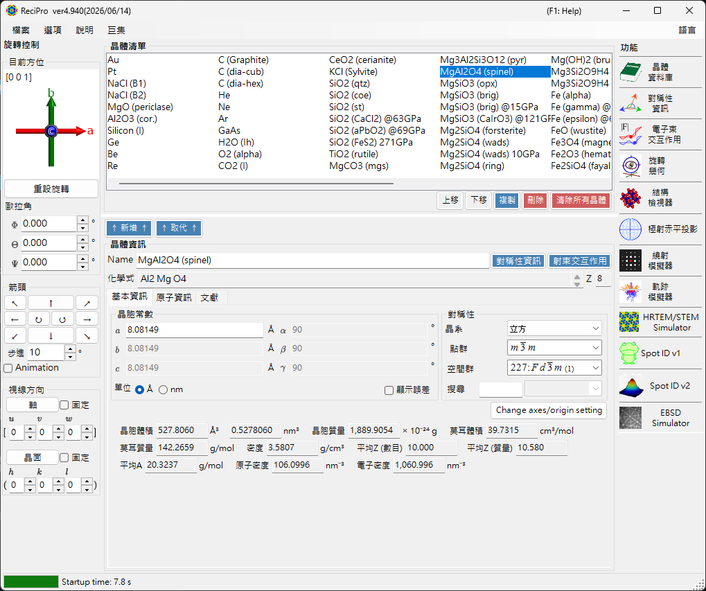
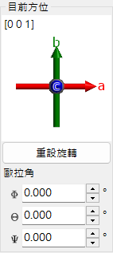
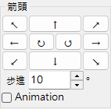
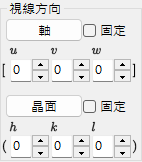
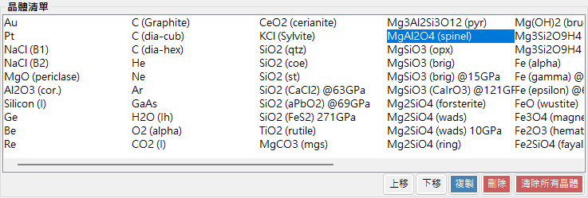
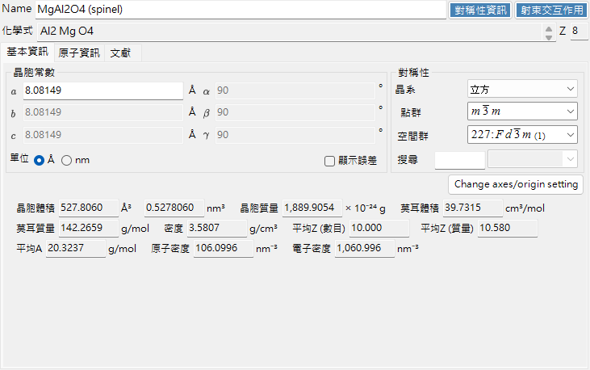
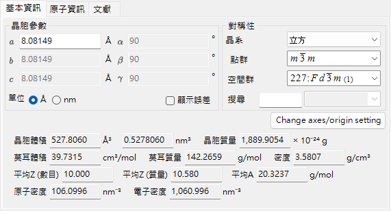
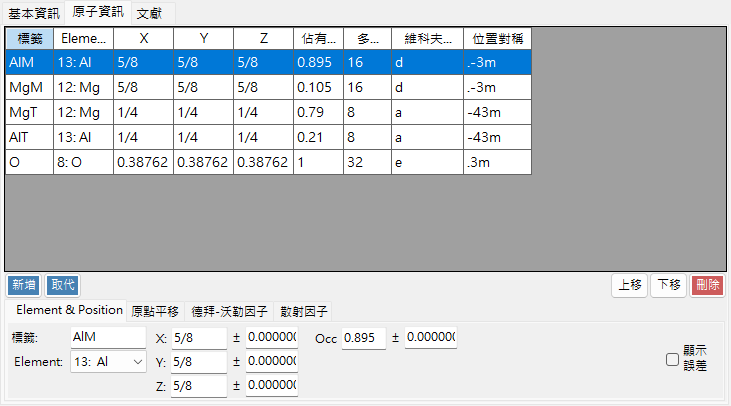
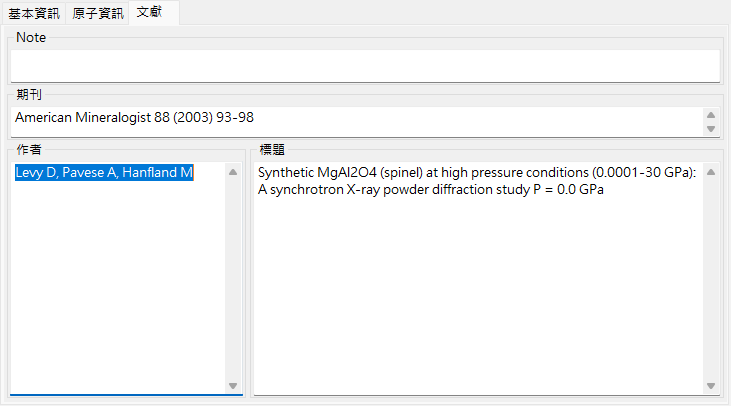
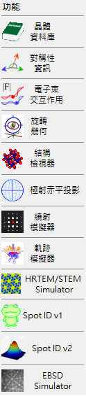

# 主視窗

啟動 ReciPro 時會出現主視窗。您可以從這個視窗選擇晶體、控制其旋轉並呼叫各種功能。

| 區域 | 位置 | 說明 |
|------|----------|-------------|
| **檔案選單** | 上方 | 檔案操作、選項、說明 |
| **旋轉控制** | 左側 | 檢視/設定晶體方位 |
| **晶體清單** | 中央上方 | 選擇與管理晶體 |
| **晶體資訊** | 中央下方 | 編輯點陣參數、對稱性、原子 |
| **功能** | 右側 | 啟動模擬/分析視窗 |

---

## 鍵盤與滑鼠快速鍵 {#keyboard-mouse-shortcuts}

主視窗會安裝數個**應用程式全域**快速鍵。當結構檢視器、極網、繞射模擬器、Spot ID 及計算機視窗取得焦點時，這些快速鍵仍持續有效。

| 快速鍵 | 動作 |
|----------|--------|
| <kbd>F1</kbd> | 開啟線上手冊的本頁 |
| <kbd>CTRL</kbd>+<kbd>SHIFT</kbd>+<kbd>D</kbd> | 開啟 / 關閉**繞射模擬器** |
| <kbd>CTRL</kbd>+<kbd>SHIFT</kbd>+<kbd>V</kbd> | 開啟 / 關閉**結構檢視器** |
| <kbd>CTRL</kbd>+<kbd>SHIFT</kbd>+<kbd>S</kbd> | 開啟 / 關閉**極網** |
| <kbd>CTRL</kbd>+<kbd>SHIFT</kbd>+<kbd>T</kbd> | 開啟 / 關閉 **Spot ID** |
| <kbd>CTRL</kbd>+<kbd>SHIFT</kbd> + 方向鍵 | 將晶體往該方向旋轉一步（同時按住兩個方向鍵可斜向旋轉） |
| 連按兩下 <kbd>CTRL</kbd> | 開啟 / 關閉**計算機** |
| <kbd>CTRL</kbd>+<kbd>SHIFT</kbd>+<kbd>R</kbd> | 切換所選晶體的 **Reserved** 標記 |
| ReciPro 啟動時按住 <kbd>CTRL</kbd> | 以停用 OpenGL 的方式啟動（圖形問題的復原方式） |
| 以左鍵拖曳方位小工具（左下方，*目前方位* 之下） | 旋轉晶體 |
| 在方位小工具上右鍵連按兩下 | 將小工具影像複製到剪貼簿 |
| 單擊功能按鈕 | 開啟 / 關閉該視窗 |
| 雙擊功能按鈕 | 強制顯示該視窗並使其置於最前 |
| 在清單中右鍵點按某晶體 | 內容功能表（重新命名 / 複製 / 刪除 / 匯出 CIF…） |
| 雙擊 **Current Index** 標籤 | 顯示 / 隱藏 max-UVW 方塊 |
| 將檔案拖放到視窗上 | 載入晶體清單（`.xml`、`.cdb2`）或晶體（`.cif`、`.amc`） |

→ 各視窗一覽請參閱 **[21. 鍵盤與滑鼠快速鍵](21-shortcuts.md)**。

---

## 基本工作流程

如果您初次使用 ReciPro，請參考以下步驟：

1. 在**晶體清單**中選擇目標晶體。若要使用 CIF/AMC 檔案，請將其拖放到**晶體資訊**中。
2. 若您編輯了點陣參數或原子位置，請按 **↑ 新增 ↑** 或 **↑ 取代 ↑**，將變更寫回晶體清單。
3. 在**旋轉控制**中，使用晶帶軸、晶面、Euler 角或滑鼠拖曳來設定晶體方位。
4. 從**功能**開啟所需工具。繞射、HRTEM/STEM、EBSD 及其他計算視窗會使用目前所選的晶體與方位。

---

## 檔案選單

### File

| 選單項目 | 說明 |
|-----------|-------------|
| Read crystal list (as new list) | 載入晶體清單檔案（*.xml）並取代目前的清單 |
| Read crystal list (and add) | 附加至目前的清單 |
| Read initial crystal list | 重新載入預設的晶體清單 |
| Save crystal list | 儲存目前的晶體清單 |
| Export selected crystal to CIF | 以 CIF 格式儲存 |
| Clear crystal list | 移除所有晶體 |
| Exit | 關閉應用程式 |

### Option

| 選單項目 | 說明 |
|-----------|-------------|
| Show Tooltips | 切換工具提示的顯示 |
| Use Miller-Bravais (hkil) index | 在整個應用程式中對三方/六方晶系使用 4 指數記法 |
| Reset registry settings on exit (effective after restart) | 在下次重新啟動時重設設定 |
| Disable Crystallography.Native library (requires restart) | 若原生（C++）程式庫載入失敗，則退回使用受控碼 |
| Disable all OpenGL rendering (requires restart) | 適用於較舊的 GPU / 遠端桌面 |
| Disable OpenGL text rendering (requires restart) | 用於某些 GPU 上文字繪製問題的因應措施 |
| Use MKL Library | 使用 Intel MKL 進行數值運算 |
| Dark mode | 在淺色與深色配色佈景主題間切換 |
| Powder diffraction function (under development) | 啟用多晶（粉末）繞射視窗 |
| Capture GUI Components… | 用於儲存 GUI 螢幕擷取的開發者工具 |

### Help

| 選單項目 | 說明 |
|-----------|-------------|
| Program updates | 檢查是否有新版 ReciPro 並安裝 |
| Hint | 顯示使用提示（已淘汰） |
| Version history | 開啟版本歷史對話方塊 |
| License | 顯示 MIT 授權 |
| GitHub page | 在瀏覽器中開啟 ReciPro 儲存庫 |
| Report bugs, requests, or comments | 開啟 GitHub Issues 頁面 |
| Help (Web) | 在 GitHub Pages 上以符合 UI 語言的頁面開啟線上手冊。 |

語言可從另外的 **Language** 選單切換（英文/日文，需重新啟動）。

### Language

在英文與日文之間切換 UI 語言。變更會在重新啟動 ReciPro 後生效。

### Macro

開啟 [巨集](20-macro/index.md) 視窗，以類 Python 指令稿自動化 ReciPro 的操作。對於重複性的工作流程，請參閱[內建函式](20-macro/1-built-in-functions.md)與[巨集範例](20-macro/2-examples.md)。

---

## 晶體方位控制

晶體的旋轉狀態由繞射模擬器、結構檢視器、極網、HRTEM/STEM 模擬器、EBSD 模擬器及其他視窗共用。它不僅是檢視設定——它定義了入射束方向以及模擬所使用的晶體座標關係。[使用方式](appendix/a0-how-to-use.md)頁面提供了簡短的影片教學。

### 目前方位

顯示晶體方位。拖曳以旋轉。軸：紅 = *a*，綠 = *b*，藍 = *c*。

### 重設旋轉
重設為初始狀態：*c* 軸垂直於螢幕，*b* 軸朝上。

### 晶帶軸
顯示最接近螢幕法線的晶帶軸（例如 *u*+*v*+*w* < 30）。

### Euler 角 (Z-X-Z)
使用 **Z–X–Z** Euler 角設定晶體方位：

- \(\Phi\)：繞 Z 軸旋轉
- \(\Theta\)：繞 X 軸旋轉
- \(\Psi\)：繞 Z 軸旋轉

旋轉依 \(\Psi \to \Theta \to \Phi\) 的順序套用。詳情請參閱[旋轉幾何](4-rotation-geometry.md)與[附錄 A1. 座標系](appendix/a1-coordinate-system/1-orientation.md)。

### 箭頭

依角度 Step 旋轉。勾選 Animation 可進行連續旋轉。

### 視線方向

將晶帶軸 [*uvw*] 或晶面 (*hkl*) 對齊為垂直於螢幕。

- **固定**：勾選時，在後續的旋轉操作中將指定的晶帶軸或晶面在空間中保持固定。
- **軸**：將輸入的晶帶軸 \([uvw]\) 置於垂直於螢幕。若同時設定了 **晶面**，則該方向會在螢幕上朝上。
- **晶面**：將輸入晶面 \((hkl)\) 的法線置於垂直於螢幕。若同時設定了 **軸**，則該方向會在螢幕上朝上。

### 設定方位的基本方式

| 方法 | 使用時機 | 位置 |
|--------|----------|-------|
| 滑鼠拖曳 | 您想一邊觀察晶軸一邊自由旋轉。 | **目前方位**面板 |
| 箭頭按鈕 | 您想要小幅且可重複的旋轉。 | **箭頭**面板 |
| 晶帶軸 | 您已知檢視方向，例如 \([001]\) 或 \([110]\)。 | **視線方向** / 晶帶軸輸入 |
| 晶面法線 | 您想讓某晶面 \((hkl)\) 垂直於螢幕。 | **視線方向** / 晶面輸入 |
| Euler 角 | 您需要可重現的數值方位。 | **Euler 角 (Z-X-Z)** |

旋轉矩陣與座標慣例請參閱[旋轉幾何](4-rotation-geometry.md)與[附錄 A1. 座標系](appendix/a1-coordinate-system/1-orientation.md)。

---

## 晶體清單

預設安裝約有 80 個晶體。選擇即可檢視詳細資訊並設定用於計算。在晶體清單中**右鍵點按某晶體**可開啟內容功能表：*重新命名*、*匯出為 CIF*、*複製*、*刪除*。

| 按鈕 | 動作 |
|--------|--------|
| 上移 / 下移 | 重新排序 |
| 複製 | 複製所選晶體 |
| 刪除 / 清除所有晶體 | 移除晶體 |
| ↑ 新增 ↑ / ↑ 取代 ↑ | 加入清單或取代所選項目 |

---

## 晶體資訊

編輯點陣參數、對稱性與原子；將 CIF/AMC 檔案拖放至此以載入結構。此控制項由 ReciPro、PDIndexer 與 CSmanager 共用，但所顯示的索引標籤與功能因應用程式而異。ReciPro 顯示 Basic Info、Atom 與 Reference 索引標籤（EOS、Elasticity 及其他索引標籤屬於其他應用程式，不會在 ReciPro 中顯示）。

> **重要**：請按 **↑ 新增 ↑** 或 **↑ 取代 ↑** 以儲存變更。

面板頂端固定顯示 **Name**（晶體名稱）、**Formula**（化學式，由原子清單計算得出）與 **Reset**（清空所有欄位）。

### 基本資訊 索引標籤

點陣參數、對稱性及由其衍生的量。

| 項目 | 說明 |
|------|------|
| Cell constants | 點陣參數 a、b、c（單位 Å = 10⁻¹⁰ m）與 α、β、γ。選擇某對稱性會自動加以約束（例如立方晶系為 a=b=c、α=β=γ=90°）。 |
| Symmetry | 選擇晶系、點群與空間群。在 **Search** 方塊中輸入即可列出符合的候選項（區分大小寫）。 |
| Cell Volume / Cell Mass | 晶胞的體積與質量。 |
| Molar Volume / Molar Mass / Z / Density | 莫耳體積、莫耳質量、每個晶胞的化學式單位數（Z）與密度。**僅在已輸入原子時**顯示。 |
| Color of Profile | 繪製此晶體繞射輪廓時所使用的顏色。 |

### 原子資訊 索引標籤

設定每個原子的種類、位置、溫度因子與散射因子。以 **Add**、**Replace**（取代所選列）、**Up/Down**（重新排序）與 **Delete** 編輯原子清單。每個原子具有：

| 項目 | 說明 |
|------|------|
| Label | 原子標籤（任意識別碼）。 |
| Element | 元素（含離子價數）。 |
| X, Y, Z | 分數座標（0–1）。可輸入諸如 1/2 或 2/3 之類的分數。 |
| Occ | 佔有率（0–1）。 |

**原點平移**：平移所有原子座標的原點。使用預設按鈕（**+** / **−**）進行標準位移，或使用 **Apply custom shift** 進行任意量的位移。

**德拜-沃勒因子（溫度因子）**：

| 項目 | 說明 |
|------|------|
| Notation | 使用 U 或 B 記法。 |
| Model | 等向性或非等向性。 |
| B##, U## | 非等向性情況下，輸入各分量（B11、…）。 |

**散射因子**：選擇每個原子所使用的散射因子。

| Radiation | 來源 / 設定 |
|-----------|------|
| X-ray | 含離子價數的散射因子（International Tables for Crystallography, Vol. C）。 |
| Electron | 電子散射因子（Peng 1998, Acta Cryst. A54, 481–485）。 |
| Neutron | 中子散射長度。選擇 **Natural isotope abundance** 或 **Custom isotope abundance**（任意同位素組成）。 |

### 文獻 索引標籤

記錄結構的來源：**Note**、**作者**、**期刊** 與 **標題**。

### 內容功能表（右鍵）

在控制項的空白區域右鍵點按可使用這些主要動作：

| 選單項目 | 動作 |
|-----------|------|
| Beam Interaction | 開啟[電子束交互作用](3-beam-interaction.md)視窗。 |
| Symmetry information | 開啟[對稱性資訊](2-symmetry-information.md)視窗。 |
| Import from CIF, AMC | 從 CIF / AMC 檔案載入晶體。 |
| Export to CIF | 將目前的晶體匯出為 CIF。 |
| Revert cell constants | 將晶胞常數還原為最初載入的值。 |
| Convert to P1 spacegroup | 將結構展開為空間群 P1。 |
| Convert to a superstructure | 轉換為 a、b、c 為整數倍的超結構（尺寸對話方塊）。 |
| Convert to an equivalent space group | 轉換為等價的空間群（不同的軸向設定）。 |

---

## 功能面板 {#functions}

右側的垂直按鈕列可啟動分析與模擬視窗（請參閱下方的[功能](#functions)表）。

| 按鈕 | 說明 | 詳細資訊 |
|--------|-------------|---------|
| Crystal Database | 從隨附 / 線上資料庫搜尋並匯入晶體 | [1. 晶體資料庫](1-crystal-database.md) |
| Symmetry Information | 空間群資訊與 ITC Vol. A 對稱性圖 | [2. 對稱性資訊](2-symmetry-information.md) |
| Beam Interaction | 電子束與晶體的交互作用：反射、衰減、散射因子、螢光 | [3. 電子束交互作用](3-beam-interaction.md) |
| Rotation Geometry | 3D 旋轉矩陣 / 測角儀角度 | [4. 旋轉幾何](4-rotation-geometry.md) |
| Structure Viewer | 3D 晶體結構 | [5. 結構檢視器](5-structure-viewer.md) |
| Stereonet | 立體投影 | [6. 極網](6-stereonet.md) |
| Diffraction Simulator | 單晶 X 光 / 電子繞射 | [7. 繞射模擬器](7-diffraction-simulator/index.md) |
| Trajectory Simulator | 蒙地卡羅電子軌跡模擬 | [8. 電子軌跡](8-electron-trajectory.md) |
| HRTEM/STEM Simulator | HRTEM / STEM 影像模擬 | [9. HRTEM/STEM 模擬器](9-hrtem-stem-simulator/index.md) |
| Spot ID v1 | SAED 圖案指標化（舊稱「TEM ID」） | [10. Spot ID v1](10-spot-id.md) |
| Spot ID v2 | 斑點偵測與指標化 | [11. Spot ID v2](11-spot-id-v2.md) |
| EBSD Simulator | EBSD 圖案模擬 | [12. EBSD 模擬](12-ebsd-simulation.md) |
| Powder Diffraction | 多晶（粉末）繞射——透過 **Option ▸ Powder diffraction function** 啟用 | - |

---

## 另請參閱

- [晶體資料庫](1-crystal-database.md)
- [旋轉幾何](4-rotation-geometry.md)
- [結構檢視器](5-structure-viewer.md)
- [繞射模擬器](7-diffraction-simulator/index.md)
- [鍵盤與滑鼠快速鍵](21-shortcuts.md)
- [基本座標系與晶體方位](appendix/a1-coordinate-system/1-orientation.md)
