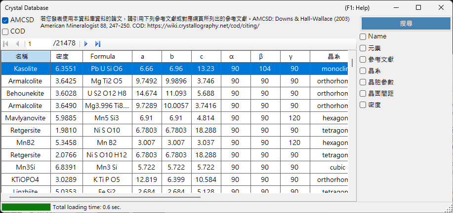
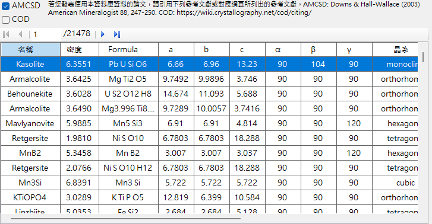
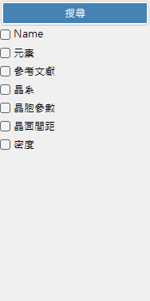
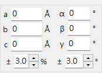

# 晶體資料庫

**晶體資料庫**提供從兩個來源搜尋與匯入晶體結構的功能，可透過 **AMCSD** 與 **COD** 核取方塊選擇：

- **AMCSD**：內建的 [American Mineralogist Crystal Structure Database](https://www.rruff.net/)（超過 20,000 筆結構）。
- **COD**：[Crystallography Open Database](https://www.crystallography.net/cod/)。由於檔案龐大，並未隨安裝程式一併提供；資料庫檔案會在首次使用時自動下載。當伺服器上的檔案更新時，系統會提示您重新下載。

使用這些資料庫時，請引用下列參考文獻。

使用 **AMCSD** 時：

> Downs, R.T. and Hall-Wallace, M. (2003) The American Mineralogist Crystal Structure Database. *American Mineralogist* **88**, 247-250.

使用 **COD** 時：

> Gražulis, S. et al. (2009) Crystallography Open Database – an open-access collection of crystal structures. *Journal of Applied Crystallography* **42**, 726-729.
>
> Gražulis, S. et al. (2012) Crystallography Open Database (COD): an open-access collection of crystal structures and platform for world-wide collaboration. *Nucleic Acids Research* **40**, D420-D427.

---

## 鍵盤與滑鼠快速鍵

此視窗沒有任何修飾鍵組合；它透過一般點按操作。唯一不太直觀的輸入有：

| 快速鍵 | 動作 |
|----------|--------|
| <kbd>F1</kbd> | 開啟線上手冊的此頁 |
| 在任一搜尋欄位中按 <kbd>ENTER</kbd> | 執行資料庫搜尋（與 **搜尋** 按鈕相同） |
| 點按結果表格中的某一列 | 將該晶體載入主視窗 |
| 點按 **週期表** 彈出視窗中的某個元素 | 循環切換其篩選狀態：*ignore* → *must include* → *must exclude* |

→ 請參閱 **[21. 鍵盤與滑鼠快速鍵](21-shortcuts.md)** 以一覽所有視窗。

---

## 表格

顯示符合搜尋條件的晶體。選取一個晶體即可將其轉移至主視窗的晶體資訊。按 **新增** 或 **取代** 將其加入晶體清單。

---

## 搜尋選項

在下方輸入搜尋條件，然後按 **搜尋** 按鈕或 **Enter** 鍵。

| 條件 | 說明 |
|-----------|-------------|
| **Name** | 晶體名稱 |
| **元素** | 週期表選擇器（可包含／必須包含／不得包含） |
| **參考文獻** | 標題、期刊、作者 |
| **晶系** | 選擇晶系 |
| **晶胞參數** | 晶格常數與誤差 |
| **d-spacing** | 最強反射的 d 值與誤差 |
| **密度** | 密度與誤差 |

### Name

對晶體名稱進行自由文字比對。允許部分相符。

### 元素

按 **週期表** 按鈕以開啟元素選擇器。每個元素按鈕在三種狀態間循環：

- **May or may not include**（預設 — 灰色）
- **Must include**（綠色）
- **Must exclude**（紅色）

視窗頂端的三個按鈕可一鍵將每個元素重設為三種狀態之一。

### 參考文獻

對出版資訊進行自由文字比對：論文標題、期刊名稱與作者清單。

### 晶系

將搜尋限制於特定晶系（Cubic、Tetragonal、Orthorhombic、Hexagonal、Trigonal、Monoclinic、Triclinic）。

### 晶胞參數搜尋

輸入目標晶格常數 *a*、*b*、*c*、*α*、*β*、*γ* 及可接受的誤差。空白欄位會被視為萬用字元。

### d-spacing

輸入最強反射（或數個強反射）的 *d* 值（d-spacing）與可接受的誤差。當實驗中僅已知繞射峰位置時相當實用。

### 密度

依質量密度（g/cm³）在可接受的誤差範圍內篩選。

---

## 另請參閱

- [主視窗](0-main-window.md)
- [對稱性資訊](2-symmetry-information.md)
- [電子束交互作用](3-beam-interaction.md)
- [結構檢視器](5-structure-viewer.md)
