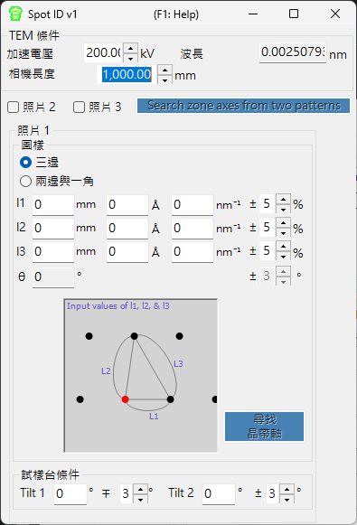

# Spot ID v1

**Spot ID v1** 可從實驗電子繞射影像中偵測、擬合並標定繞射斑點。它也支援以數值輸入的斑點幾何進行手動晶帶軸搜尋（即先前的 **TEM ID**）。

---

## 鍵盤與滑鼠快捷鍵

Spot ID v1 以**數值輸入**的方式接收斑點幾何（即先前的 *TEM ID* 工作流程），而斑點偵測／擬合則透過按鈕操作；繞射影像僅供參考顯示，無法點按互動（滑鼠縮放與手動挑選斑點屬於 [Spot ID v2](11-spot-id-v2.md)）。唯一的快捷鍵位於結果視窗：

| 快捷鍵 | 動作 |
|----------|--------|
| <kbd>F1</kbd> | 開啟線上手冊的本頁 |
| 雙擊結果清單中的某一列 | 選取該晶體並將其旋轉至對應的晶帶軸 |

→ 各視窗一覽請參見 **[21. 鍵盤與滑鼠快捷鍵](21-shortcuts.md)**。

---

## 主區域

顯示繞射影像供參考。可透過拖放或從 **File** 選單載入影像。

### 影像調整

| 設定 | 說明 |
|---------|-------------|
| Min / Max | 亮度範圍（亦可透過軌道桿調整） |
| Gradient | 正向或負向 |
| Scale | 線性或對數 |
| Colour | 灰階或冷暖色 |
| Dust & Scratch | 移除異常的亮／暗像素（設定範圍與閾值） |
| Gaussian blur | 套用模糊（範圍以像素計） |

---

## Optics

輸入入射源、能量／波長、相機長度與偵測器像素尺寸。

> 若載入 dm3/dm4 檔案（Gatan Digital Micrograph），這些數值會自動設定。

---

## 斑點偵測與擬合

按下 **Detect & fit spots** 即可自動偵測繞射斑點，並以 2D Pseudo-Voigt 函式進行擬合。結果會顯示於表格中。

### 偵測選項

| 參數 | 說明 |
|-----------|-------------|
| Number | 要偵測的斑點最大數量 |
| Nearest neighbour | 已偵測斑點之間的最小距離 |
| Fitting range | 每個斑點周圍用於擬合的半徑（像素） |

### 表格控制項

| 按鈕 | 動作 |
|--------|--------|
| Reset range | 重設所有斑點的擬合範圍 |
| Show label/symbol | 在影像上疊加標籤／符號 |
| Clear all spots | 移除所有斑點 |
| Save / Copy | 以定位字元分隔（Excel）格式匯出表格 |
| Re-fit all | 重新擬合所有斑點 |

### 斑點詳細資訊視窗

勾選核取方塊可開啟詳細資訊視窗，顯示所選斑點（左）與四個方向的剖面（右）。藍色 = 觀測資料，紅色 = 擬合。

---

## Index

按下 **Identify spots** 即可將已偵測的斑點對主視窗中所選的晶體進行標定。

| 設定 | 說明 |
|---------|-------------|
| Acceptable error | 標定的容許誤差 |
| Single grain / Multi grains | 以單晶或多晶粒標定（設定最大晶粒數） |
| Show label/symbol | 在影像上疊加已標定的標籤 |
| Refine thickness and direction | 套用動力學理論（Bethe 法）以精修最符合所偵測強度的試樣厚度與晶體取向 |

---

## 由斑點幾何進行晶帶軸搜尋（先前的 TEM ID）

當您沒有可載入的影像時，仍可手動輸入選區電子繞射（SAED）圖樣的幾何，以搜尋候選晶帶軸。輸入 TEM 觀測條件與斑點幾何，然後按下 **Search zone axes** 以找出候選晶體取向。

### TEM condition

輸入 TEM 觀測條件（加速電壓、相機長度等）。

### Photo 1, 2, 3

輸入繞射斑點的幾何。

- 若要輸入偵測器上斑點之間的距離，請使用 **mm** 欄位。
- 若您已知 *d* 值，請以 **Å** 或 **nm⁻¹** 單位輸入。

**Three sides mode** : 輸入以 direct spot 為其中一個頂點的三角形三邊長度。

**Two sides and an angle mode** : 輸入兩邊的長度（含 direct spot）以及兩邊之間的夾角。

---

## 另請參閱

- [Spot ID v2](11-spot-id-v2.md)
- [繞射模擬器](7-diffraction-simulator/index.md)
- [主視窗](0-main-window.md)
- [晶體資料庫](1-crystal-database.md)
- [EBSD 模擬](12-ebsd-simulation.md)
