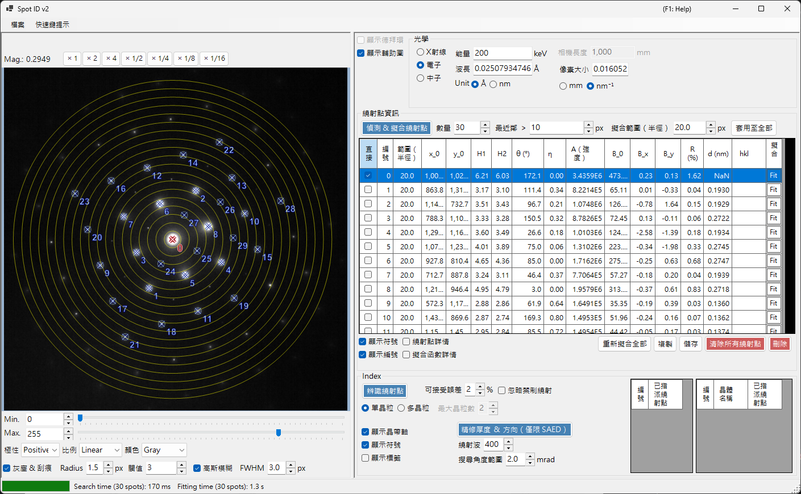
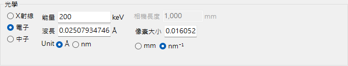
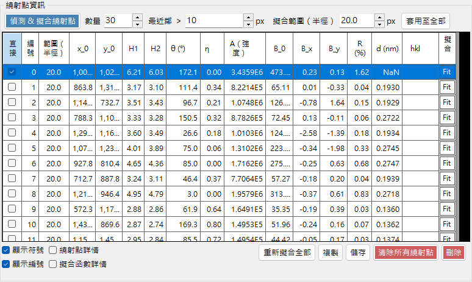
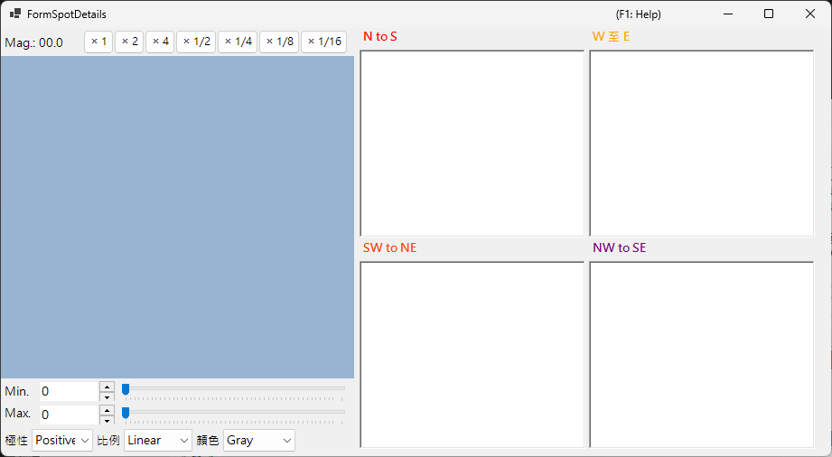
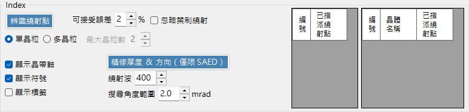

# Spot ID v2

**Spot ID v2** 是 [Spot ID](10-spot-id.md) 的增強版本，具備更佳的繞射點偵測、擬合演算法，以及更強大的標定引擎。

---

## 鍵盤與滑鼠快速鍵

您可直接在載入的影像上建立繞射點清單。影像窗格使用 ReciPro 標準的[影像檢視導覽](21-shortcuts.md)進行平移／縮放；繞射點編輯則新增下列組合鍵。

| 快速鍵 | 動作 |
|----------|--------|
| <kbd>F1</kbd> | 開啟線上手冊的本頁 |
| 在影像上左鍵雙擊 | 在該點新增一個繞射點（峰值擬合） |
| <kbd>CTRL</kbd> + 左鍵雙擊 | 新增一個繞射點並標記為直射（000）束 |
| 左鍵點按某繞射點 | 選取最接近的繞射點 |
| <kbd>CTRL</kbd> + 右鍵點按某繞射點 | 刪除最接近的繞射點 |
| <kbd>CTRL</kbd> + 方向鍵 | 將所選繞射點移動一個像素 |
| 左鍵拖曳／中鍵拖曳（空白區域） | 平移影像 |
| 滑鼠滾輪 | 在游標處放大／縮小 |
| 右鍵拖曳出方框 | 放大至所選區域 |
| 右鍵雙擊 | 縮小 |
| 雙擊某繞射點的列首（表格） | 縮放至該繞射點（×2） |

在主視窗中以 <kbd>CTRL</kbd>+<kbd>SHIFT</kbd>+<kbd>T</kbd> 可開啟／關閉此視窗。

→ 請參閱 **[21. 鍵盤與滑鼠快速鍵](21-shortcuts.md)**，一覽各視窗的對應操作。

---

## 檔案選單

開啟／儲存繞射影像。支援與 [Spot ID v1](10-spot-id.md) 相同的拖放載入方式，並會自動採用 Gatan DM3/DM4 中繼資料（相機長度、波長、像素大小）。

---

## 光學

### 入射源

選擇輻射類型（X 射線／電子／中子）並設定能量或波長。

### 相機長度／像素大小

相機長度（mm）與偵測器像素大小（mm 或 nm⁻¹）。載入 Gatan DM 檔案時，這些數值會自檔案標頭填入。

---

## 繞射點資訊

- **Detect & Fit Spots**：使用局部極大值與背景扣除的自動繞射點偵測。
- **Number**：要偵測的繞射點最大數量。
- **Nearest neighbour**：所偵測繞射點之間允許的最小間距（px）。比此距離更接近的峰會被合併，以避免重複偵測同一繞射點。
- **Fitting range (radius)**：用以擬合每個繞射點峰值的圓形區域半徑（px）。此圓內的像素以 pseudo-Voigt 函式擬合。
- **Apply to All**：將每個繞射點的擬合半徑設為目前的 **Fitting range (radius)** 值。
- **Delete spot / Clear spots**：移除個別或全部已偵測的繞射點。
- **Copy to clipboard**：將繞射點位置與強度複製至剪貼簿。
- **Details of the spot**：勾選後會開啟一個視窗，顯示目前所選繞射點的詳細資訊。

---

## 標定

- **Identify Spots**：執行標定演算法，找出最相符的晶體與晶帶軸。
- **Acceptable error**：設定相符判定可接受的晶面間距與角度偏差。
- **Ignore prohibited reflections**：勾選後，在搜尋晶帶軸時，將螺旋軸與滑移面所禁止的反射視為不必然滿足。
- **Single Grain / Multiple Grains**：搜尋單一取向（單晶），或搜尋多個取向（多晶／多晶粒區域）。對於多晶粒，**Max. num. of grains** 設定要搜尋的晶粒數量上限。
- **Results**：最佳相符結果會以晶體名稱、晶帶軸 [uvw] 及各繞射點指數 (hkl) 顯示。

---

## 相較於 v1 的改進

- 繞射點偵測中更佳的雜訊處理。
- 具多種輪廓形狀、更穩健的擬合演算法。
- 採用最佳化搜尋演算法，標定更快速。
- 支援重疊繞射點與衛星反射。

---

## 另請參閱

- [Spot ID v1](10-spot-id.md)
- [繞射模擬器](7-diffraction-simulator/index.md)
- [主視窗](0-main-window.md)
- [鍵盤與滑鼠快速鍵](21-shortcuts.md)
