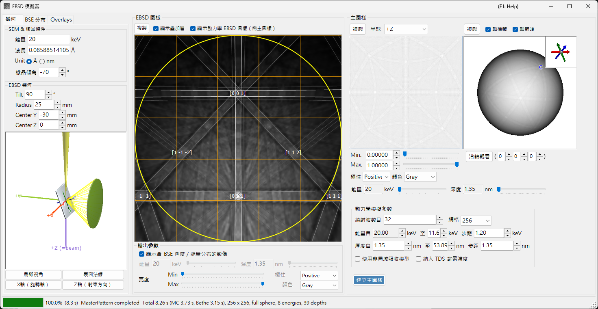
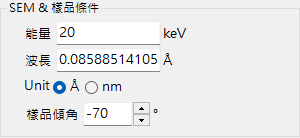
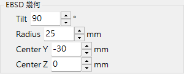
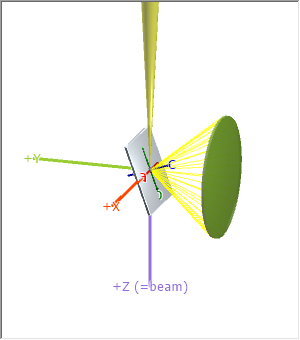
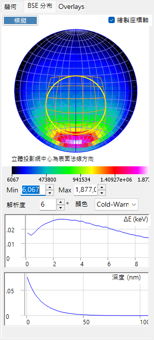
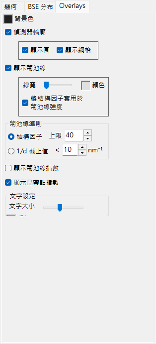
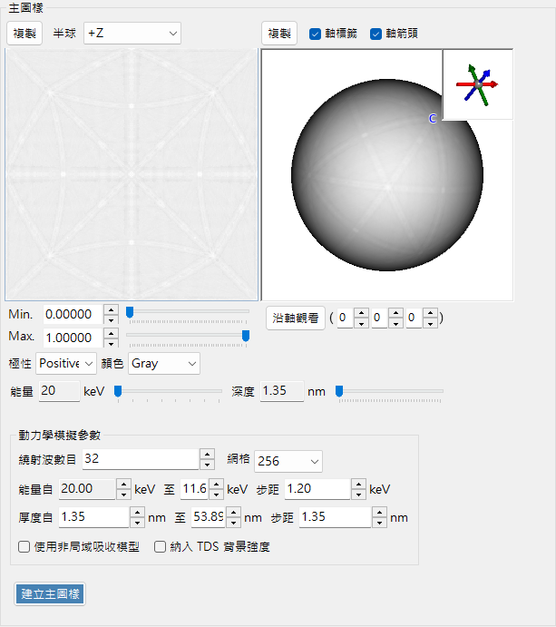
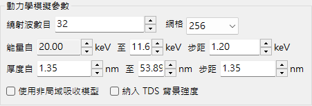
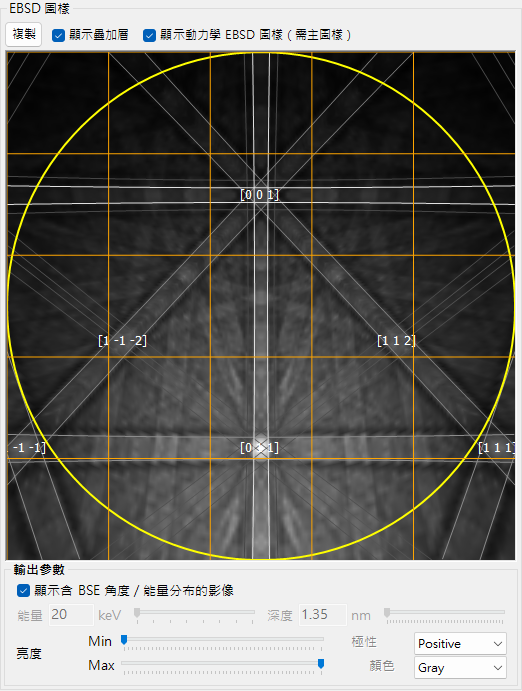

# EBSD 模擬

**EBSD 模擬器** 使用動力學理論計算，模擬在掃描式電子顯微鏡 (SEM) 中取得的電子背向散射繞射 (EBSD) 圖樣——菊池圖樣 (Kikuchi pattern)。它以蒙地卡羅 (Monte-Carlo) 模擬計算背向散射電子 (BSE) 的角度／能量／深度分布，建立晶體的動力學 (布洛赫波) **master pattern**，並依當前晶體取向將其投影到偵測器上。

此視窗有三欄。

- **左欄**：模擬條件。各索引標籤可選擇 **Geometry**（試樣／偵測器幾何與 3D 檢視）、**BSE Distribution**（背向散射電子分布）以及 **Overlays**（菊池線與其他標註）。
- **中欄**：當前晶體取向的 EBSD (菊池) 圖樣。
- **右欄**：與取向無關的 master pattern（2D 投影與 3D 球面）。

---

## 鍵盤與滑鼠快捷鍵

中央的 EBSD (菊池) 圖樣與右側的 master pattern 檢視會對不同的滑鼠操作做出反應。

| Shortcut | Action |
|----------|--------|
| <kbd>F1</kbd> | 開啟線上手冊的此頁 |
| 在圖樣中央附近左鍵拖曳 | 傾斜晶體 |
| 在圖樣外側區域左鍵拖曳 | 旋轉晶體 |
| 雙擊圖樣 | 選取游標下的偵測器子格並顯示其統計資料 |
| 在 3D 檢視（幾何／master 球面）左鍵拖曳 | 旋轉 |
| 在 3D 檢視上右鍵拖曳或滾動滑鼠滾輪 | 縮放 |
| <kbd>CTRL</kbd> + 在 3D 檢視上右鍵雙擊 | 切換正交／透視投影 |
| 在 2D master pattern 上拖曳／滾輪 | 平移／縮放影像 |

3D 檢視使用 ReciPro 的標準 [檢視導覽](21-shortcuts.md)（已停用平移）。

→ 請參閱 **[21. 鍵盤與滑鼠快捷鍵](21-shortcuts.md)** 以一覽所有視窗。

---

## 工作流程

按下 **Build Master Pattern** 會依序執行下列步驟。

1. **蒙地卡羅 BSE 模擬**：使用當前晶體組成、密度、加速電壓與試樣傾斜，追蹤試樣內部約 250 萬個電子（彈性散射：Mott/NIST 截面；非彈性散射：介電響應模型）。這會得到背向散射電子的 *穿透深度 × 出射方向 × 出射能量* 之聯合分布。
2. **自動範圍選擇**：從該分布自動設定動力學計算所使用的能量範圍（從入射能量往下至約能量損失的第 80 百分位數）與深度範圍（至約穿透深度的第 99 百分位數）。
3. **建立 master pattern**：對於每個能量與深度，求解動力學繞射 (布洛赫波) 問題並在方向球面上積分，以蒙地卡羅分布加權，得到每個方向的背向散射繞射強度。結果儲存於等面積 (Rosca–Lambert) 網格上。
4. **投影到偵測器並加權**：對於當前晶體取向，在 master pattern 中查出每個偵測器像素所對應方向的強度，並繪製為菊池圖樣，可選擇以 BSE 角度／能量分布加權。

能量與深度範圍在步驟 1–2 中自動設定，但在建立前可手動調整。

---

## SEM-EBSD 設定

### SEM 與試樣條件

- **Energy**：入射束的加速電壓 (keV)。
- **Wavelength**：電子波長 (Å)，與 Energy 連動。
- **Sample tilt**：試樣傾斜角（通常為 70°）。EBSD 中的大傾角可增加背向散射電子的產率。

### EBSD 幾何

- **Detector tilt**：偵測器（螢光屏）的傾斜。
- **Detector radius**：偵測器的半徑 (mm)；設定所繪圖樣的角度視場。
- **Detector center**：偵測器中心相對於束流撞擊點的位置 (Y, Z) (mm)。

幾何可在 **Geometry** 索引標籤的 3D 檢視中檢視。

灰色平板為試樣，綠色圓柱／圓錐為偵測器，紫色的 **+Z (=beam)** 為入射束。同時也顯示晶體的 **a / b / c** 軸（固定於試樣）。**Bird's-Eye View**、**Surface Normal**、**X Axis (Rotation Axis)** 與 **Z Axis (Beam Direction)** 等按鈕可將檢視對齊至標準方向。座標系的定義請參閱 [附錄 A1. 座標系](appendix/a1-coordinate-system/2-diffraction.md)。

---

## BSE 分布

**BSE Distribution** 索引標籤顯示蒙地卡羅背向散射電子分布。使用 **Simulate** 重新計算它們。

- **Stereonet**：背向散射電子的角度分布（出射方向的直方圖）。中心為表面法線方向，黃／橙色輪廓標示偵測器所涵蓋的區域。**Draw axes** 會疊加晶體軸，且色階（Min/Max、解析度、顏色）可調整。
- **ΔE (keV)**：背向散射電子的能量損失分布。
- **Depth (nm)**：背向散射電子最終出射深度的分布。

這些分布由與 [電子軌跡](8-electron-trajectory.md) 相同的蒙地卡羅引擎計算，並用於對 master pattern 加權。

---

## Overlays

**Overlays** 索引標籤設定繪製於 EBSD 圖樣上的標註。

- **Background color**：背景顏色。
- **Detector outline**：偵測器輪廓。**Show circle**（外緣）／**Show mesh**（網格）。
- **Show Kikuchi lines**：繪製菊池線。**Line Width** / **Color**，以及 **Apply structure factors to Kikuchi line intensity**。
- **Show Kikuchi line indices**：顯示菊池線（帶）的指數。
- **Show zone axis indices**：顯示晶帶軸指數。
- **Kikuchi line criteria**：要繪製哪些菊池線：**Structure factor**（依結構因子取前 *N* 個）或 **1/d Cutoff**（1/d 低於閾值者）。
- **Text settings**：指數標籤的 **Text Size** / **Color**。

---

## Master pattern

master pattern 是所有方向上的背向散射繞射強度，事先以動力學理論透過 **Build Master Pattern** 計算而得。

- **2D 檢視**（左）：半球的等面積投影。**Hemisphere** 選擇所投影的半球 (+Z / −Z)。
- **3D 檢視**（右）：將強度映射其上的球面。可用滑鼠旋轉，右上角的嵌入圖顯示同步的晶體軸 (a/b/c)。**Axis Labels** / **Axis Arrows** 切換標籤／箭頭，而 **View Along** 沿著選定的晶帶軸 [u v w] 俯視。
- **Min / Max, Polarity, Color**：所顯示的強度範圍、極性與色階。
- **Energy / Depth** 滑桿：選擇要顯示的能量／深度切片。
- 任一檢視皆可透過 **Copy** 送至剪貼簿。

### 動力學模擬參數

- **Number of diffracted waves**：布洛赫波計算中所納入的繞射束（波）數目。波數越多越精確但越慢。
- **Grid**：master pattern 網格的解析度（預設 256）。
- **Energy from … to … with step of …**：所積分的能量範圍與步進 (keV)；由蒙地卡羅結果自動設定。
- **Thickness from … to … with step of …**：所積分的深度範圍與步進 (nm)；同樣自動設定。
- **Use non-local absorption model**：使用非局域吸收形式。
- **Include TDS background intensities**：納入熱漫散射 (TDS) 背景。

---

## EBSD 圖樣

中央面板顯示當前晶體取向的 EBSD (菊池帶) 圖樣。

- **Show Dynamical EBSD Pattern (Master Pattern Required)**：將建立好的 master pattern 投影到偵測器上。
- **Show overlays**：繪製疊加層（如下），例如菊池線與指數。
- **Output parameters**
  - **Show image with BSE angular/energy distributions**：勾選時，圖樣會以 BSE 分布（能量、深度、方向）加權合成，而非使用單一切片。
  - **Energy / Depth**：當上述選項關閉時，選擇要顯示的能量／深度切片。
  - **Brightness (Min/Max), Polarity, Color**：亮度範圍、極性與色階。
- **Copy**：將圖樣複製到剪貼簿。

---

## 另請參閱

- [電子軌跡](8-electron-trajectory.md) — 用於角度／能量／深度加權的蒙地卡羅電子軌跡／BSE 模擬。
- [繞射模擬器](7-diffraction-simulator/index.md) — 動力學 (布洛赫波) 電子繞射。
- [附錄 A1. 座標系](appendix/a1-coordinate-system/2-diffraction.md) — 試樣／偵測器座標系的定義。
