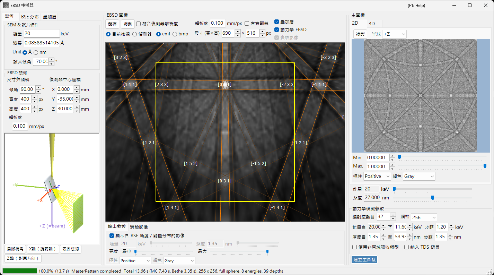
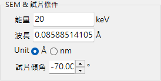
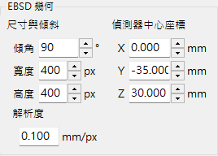
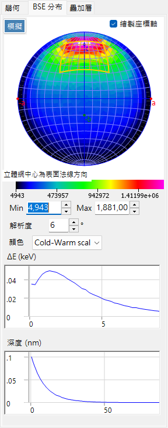
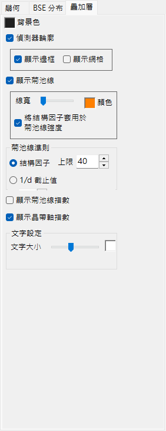
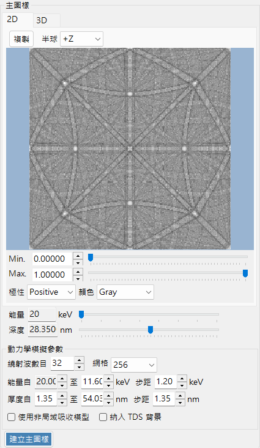
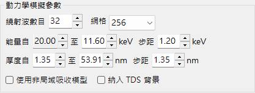
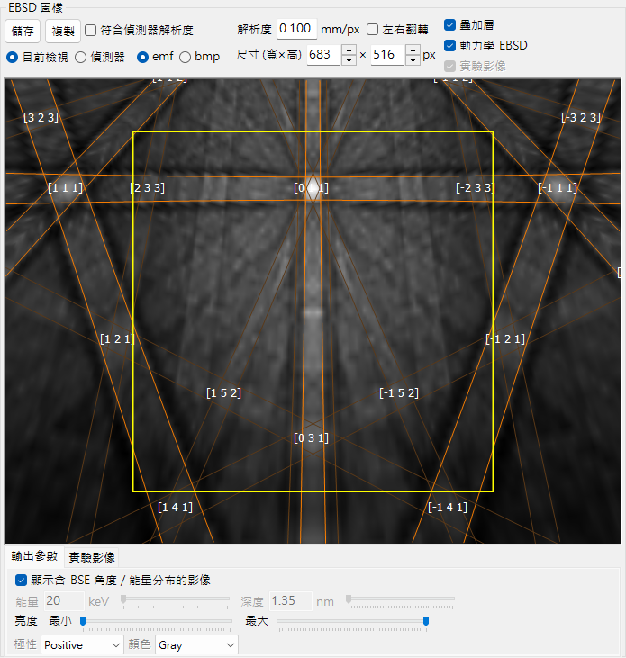
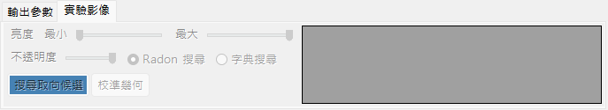

# EBSD 模擬

**EBSD 模擬器** 使用動力學理論計算，模擬在掃描式電子顯微鏡 (SEM) 中取得的電子背向散射繞射 (EBSD) 圖樣——菊池圖樣 (Kikuchi pattern)。它以蒙地卡羅 (Monte-Carlo) 模擬計算背向散射電子 (BSE) 的角度／能量／深度分布，建立晶體的動力學 (布洛赫波) **master pattern**，並依當前晶體取向將其投影到偵測器上。也可以載入實驗 EBSD 影像並進行**指標化**：自動搜尋最能解釋該影像的取向（[實驗影像](#實驗影像)）。

此視窗有三欄。

- **左欄**：模擬條件。各索引標籤可選擇 **幾何**（試樣／偵測器幾何與 3D 檢視）、**BSE 分布**（背向散射電子分布）以及 **疊加層**（菊池線與其他標註）。
- **中欄**：當前晶體取向的 EBSD (菊池) 圖樣。其下方的索引標籤可選擇 **輸出參數** 與 **實驗影像**。
- **右欄**：與取向無關的 master pattern，位於 **2D** 與 **3D** 索引標籤中。

底部的狀態列會顯示執行中計算的進度及其結果摘要。

---

## 鍵盤與滑鼠快捷鍵

中央的 EBSD (菊池) 圖樣與右側的 master pattern 檢視會對不同的滑鼠操作做出反應。

| Shortcut | Action |
|----------|--------|
| <kbd>F1</kbd> | 開啟線上手冊的此頁 |
| 在圖樣中央附近左鍵拖曳 | 傾斜晶體 |
| 在圖樣外側區域左鍵拖曳 | 旋轉晶體 |
| 雙擊圖樣 | 選取游標下的偵測器子格並顯示其統計資料 |
| 將影像檔拖放至視窗 | 載入為實驗 EBSD 影像 |
| 在 3D 檢視（幾何／master 球面）左鍵拖曳 | 旋轉 |
| 在 3D 檢視上右鍵拖曳或滾動滑鼠滾輪 | 縮放 |
| <kbd>CTRL</kbd> + 在 3D 檢視上右鍵雙擊 | 切換正交／透視投影 |
| 在 2D master pattern 上拖曳／滾輪 | 平移／縮放影像 |

3D 檢視使用 ReciPro 的標準 [檢視導覽](21-shortcuts.md)（已停用平移）。

→ 請參閱 **[21. 鍵盤與滑鼠快捷鍵](21-shortcuts.md)** 以一覽所有視窗。

---

## 工作流程

按下 **建立主圖樣** 會依序執行下列步驟。

1. **蒙地卡羅 BSE 模擬**：使用當前晶體組成、密度、加速電壓與試樣傾斜，追蹤試樣內部約 250 萬個電子（彈性散射：Mott/NIST 截面；非彈性散射：介電響應模型）。這會得到背向散射電子的 *穿透深度 × 出射方向 × 出射能量* 之聯合分布。
2. **自動範圍選擇**：從該分布自動設定動力學計算所使用的能量範圍（從入射能量往下至約能量損失的第 80 百分位數）與深度範圍（至約穿透深度的第 99 百分位數）。
3. **建立 master pattern**：對於每個能量與深度，求解動力學繞射 (布洛赫波) 問題並在方向球面上積分，以蒙地卡羅分布加權，得到每個方向的背向散射繞射強度。結果儲存於等面積 (Rosca–Lambert) 網格上。
4. **投影到偵測器並加權**：對於當前晶體取向，在 master pattern 中查出每個偵測器像素所對應方向的強度，並繪製為菊池圖樣，可選擇以 BSE 角度／能量分布加權。

能量與深度範圍在步驟 1–2 中自動設定，但在建立前可手動調整。

---

## 幾何

### SEM & 試片條件

- **Energy**：入射束的加速電壓 (keV)。
- **Wavelength**：電子波長，與 Energy 連動。**Unit** 可選擇 Å 或 nm。
- **Sample tilt**：試樣傾斜角（通常為 −70°）。EBSD 中的大傾角可增加背向散射電子的產率。

### EBSD 幾何

偵測器（螢光屏）是由像素數與像素尺寸所定義的矩形。

- **尺寸與傾斜**：**Tilt** 為偵測器平面的傾斜角 (°)；**Width** 與 **Height** 為偵測器的像素數。
- **解析度**：偵測器單一像素的實體尺寸 (mm/px)。因此偵測器的實體尺寸為 Width × 解析度 乘以 Height × 解析度。
- **偵測器中心座標**：偵測器中心相對於束流撞擊點的位置 **X**、**Y**、**Z** (mm)。Y 與 Z 連同傾斜決定相機長度；X 為左右方向的偏移。

載入實驗影像時，**Width** 與 **Height** 會設為影像尺寸，使偵測器的一個像素對應影像的一個像素（**解析度** 維持不變）。

幾何可在 **幾何** 索引標籤的 3D 檢視中檢視。

灰色平板為試樣，綠色矩形平板為偵測器，紫色的 **+Z (=beam)** 為入射束。同時也顯示晶體的 **a / b / c** 軸（固定於試樣）。**鳥瞰視角**、**表面法線**、**X軸（旋轉軸）** 與 **Z軸（射束方向）** 等按鈕可將檢視對齊至標準方向。座標系的定義請參閱 [附錄 A1. 座標系](appendix/a1-coordinate-system/2-diffraction.md)。

---

## BSE 分布

**BSE 分布** 索引標籤顯示蒙地卡羅背向散射電子分布。使用 **模擬** 重新計算它們。

- **Stereonet**：背向散射電子的角度分布（出射方向的直方圖）。中心為表面法線方向，黃色輪廓標示偵測器所涵蓋的矩形區域。**繪製座標軸** 會疊加晶體軸，且色階（**Min** / **Max**、**Resolution**、**顏色**）可調整。
- **ΔE (keV)**：背向散射電子的能量損失分布。
- **深度 (nm)**：被偵測到的背向散射電子最後一次發生非彈性散射的深度分布——與對 master pattern 加權時所用的深度定義相同。

這些分布由與 [電子軌跡](8-electron-trajectory.md) 相同的蒙地卡羅引擎計算，並用於對 master pattern 加權。

---

## 疊加層

**疊加層** 索引標籤設定繪製於 EBSD 圖樣上的標註。

- **Background color**：背景顏色。
- **偵測器輪廓**：偵測器輪廓。**顯示邊框**（偵測器邊緣的黃色矩形）／**顯示網格**（分割網格）。
- **顯示菊池線**：繪製菊池線。**線寬** / **顏色**，以及 **將結構因子套用於菊池線強度**（各條線會依其結構因子比例向背景色淡出）。
- **菊池線準則**：要繪製哪些菊池線：**結構因子**（依結構因子取 **Top** *N* 個）或 **1/d 截止值**（1/d 低於閾值者，nm⁻¹）。
- **顯示菊池線指數**：顯示菊池線（帶）的指數。
- **顯示晶帶軸指數**：顯示晶帶軸指數。
- **文字設定**：指數標籤的 **文字大小** / **顏色**。

---

## Master pattern

master pattern 是所有方向上的背向散射繞射強度，事先以動力學理論透過 **建立主圖樣** 計算而得（**停止** 可中斷執行中的計算）。

- **2D** 索引標籤：半球的等面積 (Lambert) 投影。**半球** 選擇所投影的半球 (+Z / −Z)。
- **3D** 索引標籤：將強度映射其上的球面。可用滑鼠旋轉，右上角的嵌入圖顯示同步的晶體軸 (a/b/c)。**軸標籤** / **軸箭頭** 切換標籤／箭頭，而 **沿軸觀看** 會沿著旁邊輸入的晶帶軸 [u v w] 俯視。
- **Energy / Depth** 滑桿：選擇要預覽的能量／深度切片。
- 任一檢視皆可透過 **複製** 送至剪貼簿。

### 動力學模擬參數

- **Number of diffracted waves**：布洛赫波計算中所納入的繞射束（波）數目。波數越多越精確但越慢。
- **網格**：master pattern 網格的解析度（預設 256）。
- **Energy from … to … with step of …**：所積分的能量範圍與步進 (keV)；由蒙地卡羅結果自動設定。
- **Thickness from … to … with step of …**：所積分的深度範圍與步進 (nm)；同樣自動設定。
- **使用非局域吸收模型**：使用非局域吸收形式。
- **納入 TDS 背景**：納入熱漫散射 (TDS) 背景。

---

## EBSD 圖樣

中央面板顯示當前晶體取向的 EBSD (菊池帶) 圖樣。圖樣上方的工具列控制繪製內容與複製方式。

- **動力學 EBSD**：將建立好的 master pattern 投影到偵測器上；取消勾選時僅保留背景。
- **疊加層**：繪製於 **疊加層** 索引標籤中設定的菊池線、指數與偵測器輪廓。
- **實驗影像**：疊加已載入的實驗影像（見下文）。
- **左右翻轉**：將圖樣及其所有疊加層左右鏡像。取消勾選（預設）時為從偵測器看向試樣的方向，也就是 EBSD 相機所記錄的影像；僅當您的實驗影像左右相反時才勾選。
- **Resolution**（mm/px）與 **Size (W×H)**（px）：所顯示檢視的解析度與尺寸。
- **複製**：依旁邊選定的範圍與格式，將圖樣複製到剪貼簿。
  - **目前檢視** 會複製目前顯示的範圍（維持平移與縮放）；**偵測器** 僅複製偵測器區域，此時不含黃色外框，影像剛好在偵測器邊緣結束。
  - **emf** 會複製為增強型中繼檔，菊池線與指數標籤維持向量；**bmp** 則將全部內容點陣化。
  - **符合偵測器解析度** 以影像 1 像素 = 偵測器 1 像素複製（長邊限制為 4096 px）。取消勾選時使用螢幕解析度。

### 輸出參數

- **顯示含 BSE 角度／能量分布的影像**：勾選時，圖樣會以 BSE 分布（能量、深度、方向）加權合成，而非使用單一切片。
- **Energy / Depth**：當上述選項關閉時，選擇要顯示的能量／深度切片。
- **亮度**（**最小** / **最大**）、**極性**、**顏色**：亮度範圍、極性與色階。

### 實驗影像

將 EBSD 影像檔（TIFF、PNG、BMP 或 JPEG；16 位元 TIFF 會以完整位元深度讀取）拖放到視窗的任意位置，即可載入為實驗圖樣。影像會繪製在偵測器區域上——位於模擬圖樣之上、菊池線疊加層之下——因此可直接比較模擬與實測。載入時也會把偵測器的 **Width** 與 **Height** 設為影像尺寸。

- **亮度**（**最小** / **最大**）：所疊加實驗影像的黑點與白點，以其自身強度範圍的比例給定（滑桿為對數）。僅作用於實驗影像，不影響模擬圖樣。
- **不透明度**：所疊加實驗影像的不透明度，從 0（不可見）到 100 %（不透明）。調低即可看見下方的模擬圖樣。

接著可用兩種引擎之一搜尋能解釋該影像的取向。

- **Radon 搜尋**：將運動學菊池帶樣板與實驗影像的 Radon（直線偵測）圖進行比對。無需 master pattern 即可運作；若已有 master pattern，則以與模擬圖樣之間的 robust ZNCC（零均值正規化互相關）重新排序候選。
- **字典搜尋**：由動力學 master pattern 產生所有取向的字典圖樣，並全部以 robust ZNCC 比較。需要 master pattern 且耗時數秒，但比 Radon 搜尋更可靠。

**搜尋取向候選** 會執行所選引擎，依優劣順序列出最多 10 個候選；若有 master pattern，最佳候選會精修至 ±0.25°。各欄意義如下：

| 欄 | 意義 |
|----|------|
| **#** | 排名（0 為最佳） |
| **Score** | Radon 帶證據的 *z* 值 |
| **Bands** | 相符的帶數 / 視場內預測的帶數 |
| **ZNCC** | 與模擬圖樣的相關性 |
| **Strong bands (hkl)** | 相符帶的指數（僅 Radon 搜尋） |

**點按某一列即可將該取向套用到整個程式**，模擬圖樣會重新繪製在實驗影像之上，其他視窗的晶體取向也隨之改變。

**校準幾何** 會將偵測器幾何（圖樣中心 PC 與偵測器距離 DD）與取向交替最佳化，使模擬圖樣與實驗圖樣的 ZNCC 最大化。此功能需要 master pattern，偵測器傾斜維持固定，結果會寫回 **偵測器中心座標** 的 X/Y/Z 欄位。由於 SEM 的束流掃描只會使圖樣中心移動不到 1 mm，通常在實驗開始時校準一次即可用於整個影像序列。

---

## 另請參閱

- [電子軌跡](8-electron-trajectory.md) — 用於角度／能量／深度加權的蒙地卡羅電子軌跡／BSE 模擬。
- [繞射模擬器](7-diffraction-simulator/index.md) — 動力學 (布洛赫波) 電子繞射。
- [附錄 A1. 座標系](appendix/a1-coordinate-system/2-diffraction.md) — 試樣／偵測器座標系的定義。
