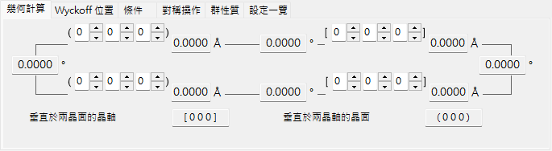
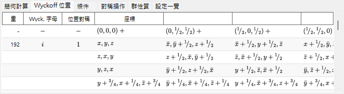
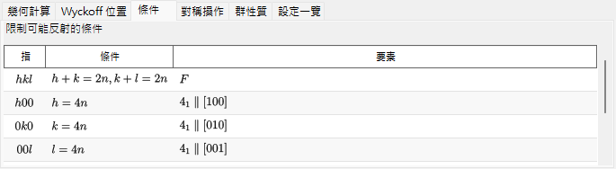
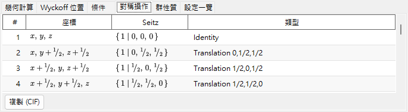
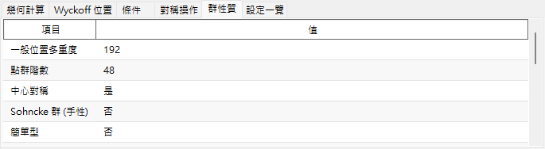
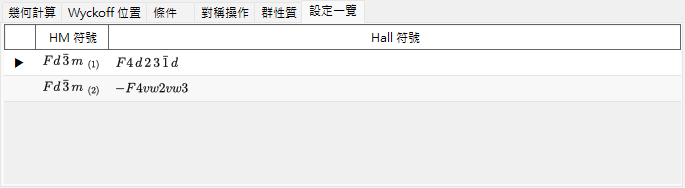

# 對稱性資訊

**對稱性資訊**（Symmetry Information）顯示所選晶體之空間群對稱性的詳細資訊，並額外以 *International Tables for Crystallography* Vol. A 的樣式繪製對稱元素與一般位置的示意圖。

視窗分為空間群識別區（左上）、附索引標籤的計算／表格區（右上），以及兩個示意圖（下方）。

!!! tip "對稱性理論（附錄 A4）"
    Hermann–Mauguin／Hall／Schoenflies 符號實際上編碼了什麼、**群性質** 索引標籤上的群論分類（中心對稱、Sohncke、簡單型、極性、…）、下方對稱元素／一般位置示意圖的意義，以及 **群關係...** 所顯示的群與子群關係，皆在 **[附錄 A4. 對稱性與空間群](appendix/a4-symmetry-space-groups/index.md)** 中說明。

---

## 鍵盤與滑鼠快速鍵

此視窗沒有特殊的按鍵或滑鼠組合。<kbd>F1</kbd> 會開啟本手冊頁面；兩個 **複製** 按鈕會將對稱元素圖與一般位置圖放入剪貼簿（依 **複製格式** 的選擇，以向量 **emf** 或點陣 **bmp** 形式）。

→ 全部視窗的快速鍵一覽請參閱 **[21. 鍵盤與滑鼠快速鍵](21-shortcuts.md)**。

---

## 空間群識別

左上面板針對目前的空間群列出：

- **編號**（1–230）與設定索引
- **晶系**
- **點群** : Hermann–Mauguin（HM）與 Schoenflies（SF）符號
- **空間群** : HM 符號（簡式）、HM 符號（全式）、SF 符號，以及 **Hall 符號**

---

## 幾何計算

輸入兩個晶面 \((h_1, k_1, l_1)\)、\((h_2, k_2, l_2)\) 或兩個方向指數 \([u_1, v_1, w_1]\)、\([u_2, v_2, w_2]\)，即可得到：

- 每個晶面的面間距／每個軸的長度，
- 兩個晶面（或兩個軸）之間的夾角，
- **垂直於兩晶面的方向指數** 與 **垂直於兩晶軸的晶面指數**。

這些計算會遵循目前晶胞的度量。

---

## Wyckoff 位置

列出每個 Wyckoff 位置及其多重度、Wyckoff 字母、位置對稱性，以及其為一般位置或特殊位置。對於有心點陣，點陣平移向量會顯示於標題列中。

---

## 條件

由點陣心化以及滑移／螺旋對稱操作所產生的反射條件。

---

## 對稱操作

以座標三元組、Seitz 符號與淺白的幾何類型（例如 *「3-fold rotation」*、*「c-glide plane」*、*「screw axis」*）列出一般位置的每一個對稱操作（點陣心化平移已展開計入）。**複製 (CIF)** 會將完整清單以 CIF 的 `_space_group_symop_operation_xyz` 迴圈形式複製到剪貼簿。

→ 這三種表示法的讀法請參閱 **[附錄 A4.1](appendix/a4-symmetry-space-groups/symbols-and-diagrams.md#對稱操作對稱操作索引標籤)**。

---

## 群性質

報告目前空間群的群論分類（一般位置多重度、點群階數、中心對稱、Sohncke、簡單型、極性方向、對映體夥伴、晶族／格子系／布拉維型、算術晶類、Patterson 對稱），以及該對稱性允許哪些巨觀物理性質（熱電／鐵電、壓電、二次諧波產生、旋光性）。

→ 各項術語的意義請參閱 **[附錄 A4.1](appendix/a4-symmetry-space-groups/symbols-and-diagrams.md#群論分類群性質索引標籤)**。

---

## 設定一覽

列出與目前空間群共用同一 IT 編號的所有收錄原點／軸設定選擇，並附各自的 HM 與 Hall 符號以供參考；目前顯示中的設定會加上標記。選取某一列並不會變更晶體。

---

## 對稱元素圖與一般位置圖

下方的兩個面板以 *International Tables for Crystallography* Vol. A 的記號重現該空間群的對稱性示意圖。

- **對稱元素（左）**：旋轉／螺旋軸、鏡面／滑移面，以及反演中心／旋轉反演點皆以慣用的圖形符號繪製。
  - 對於立方晶系的 \(F\) 點陣，僅顯示晶胞的八分之一（僅左上象限）。
  - 這些對稱元素也可以直接繪製到 [結構檢視器](5-structure-viewer.md) 中的 3D 模型上。
- **一般位置（右）**：一般等價位置以圓圈繪製（逗號表示鏡像），並標註其分數座標。
  - 僅對於立方晶系，輔助線會連接由三重旋轉軸所關聯的三個圓圈。

圖下方的控制項：

- **方向**（`a` / `b` / `c`） : 選擇要沿其投影的晶軸。
- **複製** : 將每個圖以 **複製格式** 所選的形式（向量 **emf**／點陣 **bmp**）複製到剪貼簿；emf 可在 PowerPoint 中取消群組後編輯。
- **群關係...** 會開啟瀏覽目前空間群之極大子群／極小超群關係的瀏覽器。讀法請參閱 [附錄 A4.2](appendix/a4-symmetry-space-groups/group-subgroup-relations.md)。

---

## 另請參閱

- [晶體資料庫](1-crystal-database.md)
- [結構檢視器](5-structure-viewer.md)
- [極網](6-stereonet.md)
- [旋轉幾何](4-rotation-geometry.md)
- [主視窗](0-main-window.md)
- [附錄 A4. 對稱性與空間群](appendix/a4-symmetry-space-groups/index.md) — 本頁每個索引標籤與示意圖背後的結晶學與群論背景。
