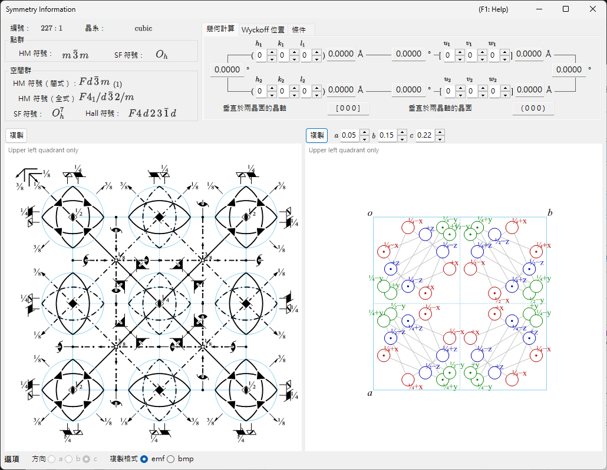
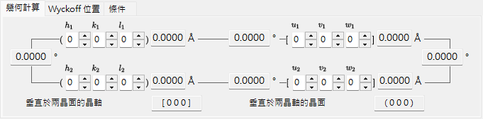
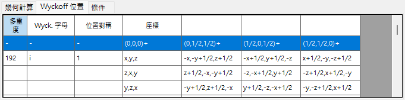
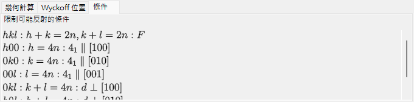
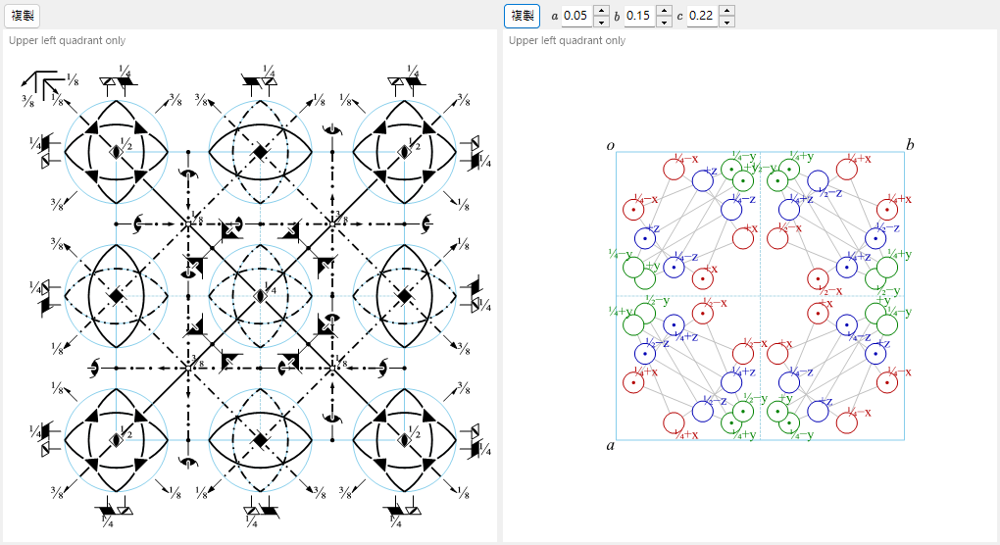

# 對稱性資訊

**對稱性資訊** 顯示所選晶體之空間群對稱性的詳細資訊，並額外以 *International Tables for Crystallography* Vol. A 的樣式繪製對稱元素與一般位置的示意圖。

視窗分為空間群識別區（左上）、附索引標籤的計算／表格區（右上），以及兩個示意圖（下方）。

---

## 鍵盤與滑鼠快速鍵

此視窗沒有特殊的按鍵或滑鼠組合。<kbd>F1</kbd> 會開啟本手冊頁面，而兩個 **Copy** 按鈕會將對稱元素圖與一般位置圖放入剪貼簿（以點陣圖形式，或在勾選 **EMF** 時以向量 EMF 形式）。

→ 請參閱 **[21. 鍵盤與滑鼠快速鍵](21-shortcuts.md)** 一覽每個視窗的相關內容。

---

## 空間群識別

左上面板針對目前的空間群列出：

- **Number**（1–230）與設定索引
- **Crystal System**
- **Point Group** : Hermann–Mauguin（HM）與 Schoenflies（SF）符號
- **Space Group** : HM 短符號、HM 完整符號、SF 符號，以及 **Hall symbol**

---

## 幾何計算

輸入兩個晶面 \((h_1, k_1, l_1)\)、\((h_2, k_2, l_2)\) 或兩個方向指數 \([u_1, v_1, w_1]\)、\([u_2, v_2, w_2]\)，即可得到：

- 每個晶面的面間距／每個軸的長度，
- 兩個晶面（或兩個軸）之間的夾角，
- **與兩個晶面皆垂直的方向指數** 以及 **與兩個軸皆垂直的晶面指數**。

這些計算會遵循目前晶胞的度量。

---

## 維科夫位置

列出每個維科夫位置及其多重度、維科夫字母、座位對稱性，以及其為一般位置或特殊位置。對於有心點陣，點陣平移向量會顯示於標題列中。

---

## 消光條件

由點陣心化以及滑移／螺旋對稱操作所產生的反射條件。

---

## 對稱元素圖與一般位置圖

下方的兩個面板以 *International Tables for Crystallography* Vol. A 的記號重現該空間群的示意對稱圖。

- **對稱元素（左）**：旋轉／螺旋軸、鏡面／滑移面，以及反演中心／旋轉反演點皆以慣用的圖形符號繪製。
  - 對於立方晶系的 \(F\) 點陣，僅顯示晶胞的八分之一（僅左上象限）。
  - 這些對稱元素也可以直接繪製到 [結構檢視器](5-structure-viewer.md) 中的 3D 模型上。
- **一般位置（右）**：一般等價位置以圓圈繪製（逗號表示鏡像），並標註其分數座標。
  - 僅對於立方晶系，輔助線會連接由三重旋轉軸所關聯的三個圓圈。

圖下方的控制項：

- **Direction**（`a` / `b` / `c`）：選擇要沿其投影的晶軸。
- **Copy** 將每個圖以向量影像（**EMF**）或點陣影像（**BMP**）複製到剪貼簿；EMF 可在 PowerPoint 中取消群組並編輯。

---

## 另請參閱

- [晶體資料庫](1-crystal-database.md)
- [結構檢視器](5-structure-viewer.md)
- [極網](6-stereonet.md)
- [旋轉幾何](4-rotation-geometry.md)
- [主視窗](0-main-window.md)
