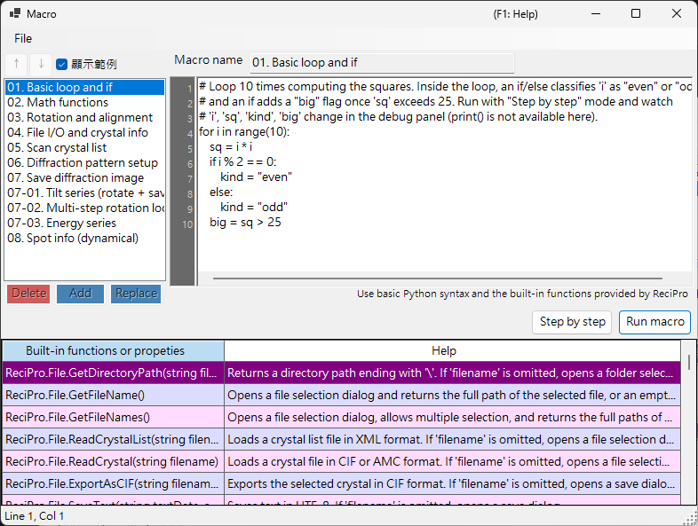

# 巨集

ReciPro 內建以 **IronPython** 為基礎的巨集系統，可透過指令稿自動執行晶體操作、繞射模擬與影像模擬。



上方的螢幕擷圖已開啟 **顯示範例**，顯示內建的範例巨集。巨集清單在左側、程式碼編輯器在右側，底部則是內建函式的說明表。

---

## 鍵盤與滑鼠快捷鍵

| 快捷鍵 | 動作 |
|----------|--------|
| <kbd>F1</kbd> | 開啟線上手冊的本頁 |
| <kbd>CTRL</kbd>+<kbd>S</kbd> | 將編輯器文字儲存回所選的巨集清單項目 |
| <kbd>F10</kbd> | 前進一步（逐步執行期間） |
| 雙擊函式說明清單中的某一列 | 在插入點插入該函式的簽章 |
| 將 `.mcr` 檔拖放到視窗上 | 載入到編輯器中 |

**Run**、**Step** 與 **Stop** 為按鈕（無鍵盤快捷鍵）。

→ 一覽所有視窗請參閱 **[21. 鍵盤與滑鼠快捷鍵](../21-shortcuts.md)**。

---

## 概觀

巨集以 Python 語法撰寫。使用 ReciPro 的內建類別與函式，您可以透過程式化方式執行與 GUI 相同的操作。

- **語言**：Python 3（IronPython 3.4）
- **儲存**：以壓縮二進位格式儲存於 Windows 登錄檔（可跨工作階段保留）
- **存取**：在主視窗按一下 Macro 按鈕即可開啟巨集編輯器

---

## 編輯器視窗

巨集編輯器有四個主要區域：

| 區域 | 用途 |
|------|---------|
| **巨集清單**（左側） | 已儲存的巨集。`Add` 會附加一個新巨集，`Replace` 會覆寫所選的巨集，`Delete` 會移除它。Up/Down 可重新排序。 |
| **名稱欄位**（上方） | 目前正在編輯的巨集識別碼。 |
| **程式碼區**（右側） | Python 程式碼編輯器，附行號邊欄、自動縮排與語法說明彈出視窗。 |
| **內建函式表**（下方） | ReciPro 所提供之內建函式/屬性的清單，每項皆附 Help 說明。撰寫程式碼時的參考。 |
| **狀態列**（最下方） | 以 `Line N, Col M` 顯示目前插入點的位置。 |
| **偵錯面板**（於 Step 執行期間顯示） | 列出目前行的區域變數。 |

當有未儲存的編輯時，標題列會顯示 **`Macro*`**（含星號）；在 Add / Replace / <kbd>CTRL</kbd>+<kbd>S</kbd> 之後則回復為 **`Macro`**。

### 範例巨集

開啟 **顯示範例**（左上角）會以內建的範例巨集暫時取代您的巨集清單（基本迴圈與條件式、數學函式、旋轉/對齊、掃描晶體清單、繞射/影像模擬、傾斜/能量序列、繞射點資訊等等）。這些範例為唯讀，並以目前的 UI 語言顯示；可用於學習，或作為複製的起點。將其關閉即會還原您自己的巨集。

---

## 編輯功能

- **自動縮排**：按下 <kbd>ENTER</kbd> 時，下一行會沿用目前行的前導空白。若該行以 `:` 結尾（位於 `def`/`if`/`for`/等之後），則會自動加入一個額外的縮排層級（4 個空格）。
- **智慧型 Backspace**：在前導空白內，<kbd>BACKSPACE</kbd> 會移除整個縮排層級（4 個空格），而非單一字元。
- **<kbd>TAB</kbd> / <kbd>SHIFT</kbd>+<kbd>TAB</kbd>**：
  - 未選取時：在插入點插入／移除一個縮排層級。
  - 多行選取時：一次縮排／取消縮排所有選取的行。
- **自動完成**：輸入時，彈出視窗會列出相符的函式名稱與語言關鍵字。方向鍵可導覽，<kbd>ENTER</kbd> 或 <kbd>TAB</kbd> 接受，<kbd>ESC</kbd> 取消。
- **工具提示說明**：將游標停在所選的自動完成項目上時，會顯示其說明文件。

### 鍵盤快捷鍵

| 快捷鍵 | 動作 |
|----------|--------|
| <kbd>CTRL</kbd>+<kbd>S</kbd> | 將目前的程式碼儲存到所選的巨集項目（原地） |
| <kbd>F10</kbd> | 跳至下一行（於 Step 執行期間） |
| <kbd>ENTER</kbd> | 插入換行並自動縮排 |
| <kbd>TAB</kbd> / <kbd>SHIFT</kbd>+<kbd>TAB</kbd> | 縮排／取消縮排 |
| <kbd>BACKSPACE</kbd> | 若位於前導空白內，刪除一個縮排層級 |
| <kbd>CTRL</kbd>+<kbd>↑</kbd> / <kbd>CTRL</kbd>+<kbd>↓</kbd> | 不適用 — 請使用 Up/Down 按鈕重新排序巨集 |

---

## 執行巨集

兩種執行模式：

- **Run macro**：執行程式碼直到結束。發生錯誤時會彈出對話方塊顯示 Python traceback，並在編輯器中標示出問題行。
- **Step by step**：在每一行之前暫停。偵錯面板會顯示區域變數。使用 <kbd>F10</kbd>（或 **Next step (F10)** 按鈕）前進，或以 **Stop** 中止。

**Stop** 僅在 Step 模式下有效（標準的 Run macro 執行無法中斷，因為 IronPython 不遵循 `CancellationToken`，且所有作業皆在 UI 執行緒上執行）。

---

## Python 語言支援

此巨集環境為 **IronPython 3.4**。並非所有 Python 功能在此都有意義。

### 已預先匯入

- 啟動時會匯入 **`math`**。可直接使用 `math.sqrt(x)`、`math.sin(x)`、`math.pi`、`math.radians(deg)` 等。

### 可使用

- 控制流程：`if`/`elif`/`else`、`for`、`while`、`def`、`class`、`return`、`try`/`except`/`finally`、`pass`、`break`、`continue`、`lambda`
- 字面值：`True`、`False`、`None`
- 內建函式：`len`、`range`、`abs`、`min`、`max`、`sum`、`sorted`、`enumerate`、`zip`、`int`、`float`、`str`、`list`、`dict`、`tuple`、`type`、`isinstance`
- 純 Python 的標準函式庫模組：`random`、`datetime`、`time`、`re`、`json`、`itertools`、`functools`、`collections`

這些基礎項目已預先註冊於自動完成彈出視窗，因此您可以輸入前幾個字母來探索它們。

### 不可使用

- **`print()`**：沒有主控台視窗；輸出無處可去。請使用 **Step by step** 並查看偵錯面板來檢視值。
- **`input()`**：沒有 stdin。
- **檔案 I/O**（`open`、`with open`）：不適用於巨集。請改用 `ReciPro.File.*` 輔助函式。
- **C 擴充套件**：`numpy`、`scipy`、`pandas`、`matplotlib` — 與 IronPython 不相容。

---

## API 存取

ReciPro 巨集 API 公開於頂層名稱 **`ReciPro`** 之下。每個內建類別都是 `ReciPro` 的一個欄位：

```python
ReciPro.File.*         # File I/O helpers
ReciPro.Crystal.*      # Currently selected crystal
ReciPro.CrystalList.*  # Manage the crystal list
ReciPro.Dir.*          # Crystal orientation (Euler, zone-axis, rotation)
ReciPro.DifSim.*       # Diffraction simulator
ReciPro.HRTEM.*        # HRTEM simulation
ReciPro.STEM.*         # STEM simulation
ReciPro.Potential.*    # Potential simulation
ReciPro.Sleep(ms)      # Pause execution (milliseconds)
```

自動完成彈出視窗一律顯示完整的 `ReciPro.Class.Member` 形式並逐字插入，因此您很少需要手動輸入前綴。

完整的 API 參考請參閱 [20.1. 內建函式](1-built-in-functions.md)。

---

## 錯誤訊息

當巨集失敗時，對話方塊會以標準格式顯示 Python traceback：

```
Traceback (most recent call last):
  File "<string>", line 5, in <module>
NameError: name 'abc' is not defined
```

編輯器會自動選取 traceback 中所報告的行（最內層的框架），讓您可以立即修正問題。語法錯誤也會在執行開始前以行號回報。

---

## 另請參閱

- [20.1. 內建函式](1-built-in-functions.md)
- [20.2. 範例](2-examples.md)
