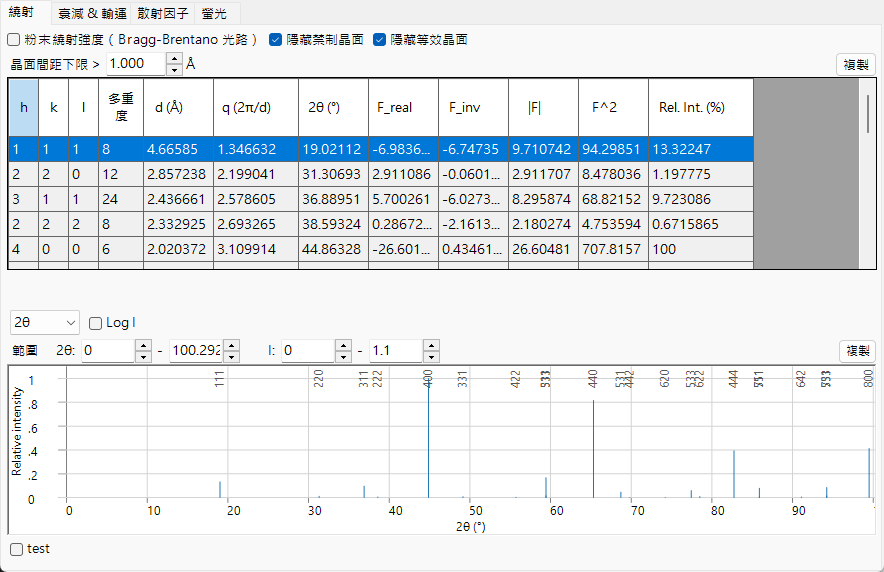
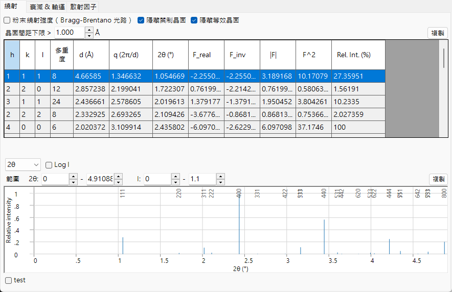
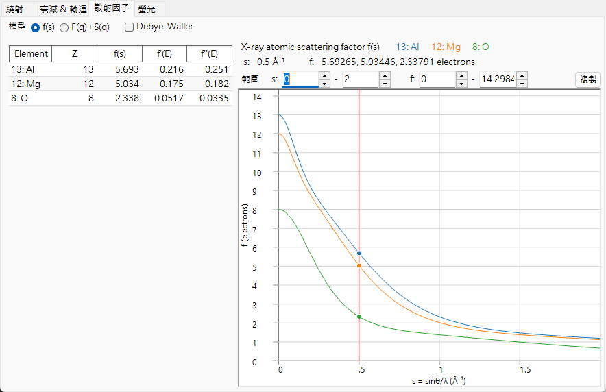
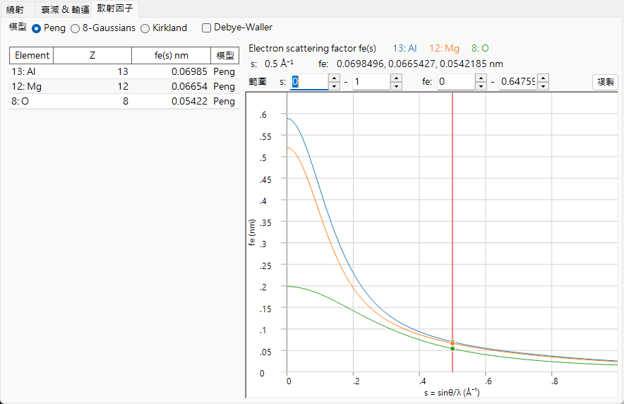
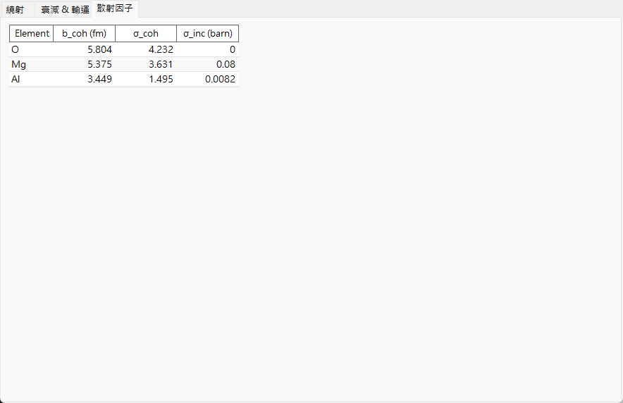

# 電子束交互作用

**電子束交互作用 (Beam Interaction)** 描述所選晶體如何與入射的 **X 射線、電子或中子** 束相互作用。對於選定的一種輻射，它會計算允許的反射及其結構因子、電子束穿過材料時的衰減與傳輸、各元素的原子散射因子，以及 (對 X 射線而言) 特徵螢光譜線。在頂端切換輻射類型會重新計算所有內容，因此可將同一晶體在繞射與光譜技術之間進行比較。

入射束在視窗頂端的條帶中選取；下方的四個索引標籤 — **Reflections**、**Attenuations & Transport**、**Scattering factors** 與 **Fluorescence** — 顯示交互作用的不同面向。下方每個索引標籤小節都在 **X-ray / Electron / Neutron** 束下顯示該索引標籤 (請使用各圖中的索引標籤)；內容會隨電子束而有顯著變化。

!!! tip "固體物理背景 (附錄 A2)"
    這四個索引標籤背後的散射與固體物理 — 原子散射因子、結構因子、電子束衰減與傳輸，以及螢光 — 在 **[附錄 A2. 電子束交互作用 (固體物理背景)](appendix/a2-beam-interaction/index.md)** 中說明。

!!! note "X 射線資料與隨附的 xraylib 函式庫"
    許多 X 射線量 (異常色散 $f'/f''$、$F(q)+S(q)$ 散射分解、質量衰減的光電 / Rayleigh / Compton 分解、吸收邊跳躍以及螢光產率) 都是以隨附的 **[xraylib](https://github.com/tschoonj/xraylib)** 函式庫評估的。若 xraylib 無法使用，ReciPro 會退回其內部資料表 (僅光電吸收衰減、僅特徵譜線能量)，受影響的儲存格會顯示 **N/A**。每個表格的 **source** 列說明使用了哪一組資料。

---

## 鍵盤與滑鼠快捷鍵

此視窗沒有特殊的按鍵組合。<kbd>F1</kbd> 會開啟此手冊頁面。在 **Scattering factors** 索引標籤上，可**拖曳**垂直游標線以讀取各元素在該位置的散射因子，而且每個索引標籤都有一個 **Copy** 按鈕，可將其表格匯出為可貼入試算表的文字。

→ 請參閱 **[21. 鍵盤與滑鼠快捷鍵](21-shortcuts.md)** 以一覽各視窗。

---

## 電子束與波長 {#reflections-tab}

頂端的條帶是一個與其他模擬器共用的 **Wave Length Control**。

- **X-ray / Electron / Neutron** : 原子散射因子與交互作用物理會因入射束的類型而異，因此在此處切換。
- 對於 **X-ray**，選擇 **Element** (陽極材料) 與特徵譜線 (Kα 等) 會自動設定該特徵 X 射線的波長。
- **Energy (keV)** 與 **Wavelength (Å)** 互相連動；設定其中一者會更新另一者，且兩者都會驅動 **Reflections** 表中使用的 2θ。
- **Unit (Å / nm)** 會切換用於 d 間距及類似量的長度單位。

所選電子束也決定了哪些索引標籤與曲線有意義：

| 電子束 | Reflections | Attenuations & Transport | Scattering factors | Fluorescence |
|------|------|------|------|------|
| **X-ray** | 含異常色散的結構因子 | µ/ρ、µ、透射率 + 吸收邊 (對能量) | $f(s)$ 或 $F(q)+S(q)$ | 特徵譜線 + EDX 棒狀圖 |
| **Electron** | 電子結構因子 | σ、MFP、\|dE/ds\|、IMFP、射程 (對能量) | Peng / Kirkland / 8-Gaussians | —(隱藏) |
| **Neutron** | 核結構因子 | 散射長度與截面 (無能量曲線) | 散射長度 (無 *s* 相依性) | —(隱藏) |

**Fluorescence** 索引標籤僅適用於 X 射線，並在電子束與中子束下消失。對於中子，**Attenuations & Transport** 與 **Scattering factors** 中與能量相依的圖會替換為元素表，因為核散射長度不依賴於散射角或能量。

---

## Reflections 索引標籤

列出晶體允許的晶面 (反射)，以及每個反射的**結構因子**與繞射強度。對於 X 射線，結構因子現在包含當前能量下的**異常色散**項 $f'/f''$，因此 `F_inv` (虛部) 在吸收邊附近一般不為零。每種電子束的版面配置相同；只有結構因子值與各反射的 2θ 會改變。

=== "X-ray"
    

=== "Electron"
    

=== "Neutron"
    

**Options**

- **Powder Diffraction Intensities (Bragg-Brentano Optics)** : 將相對強度計算為粉末繞射 (Bragg–Brentano) 強度，包含多重度與 Lorentz–偏振因子。關閉時，顯示結構因子強度。開啟它也會強制開啟 *Hide equivalent planes* 與 *Hide prohibited planes*。
- **Hide equivalent planes** : 將晶體學上等價的晶面合併為單一項目。
- **Hide prohibited planes** : 排除其強度依消光規則為零的晶面。
- **d-Spacing Cutoff >** : 排除 d 間距小於此值的反射 (長度單位依 **Unit** 選擇)。

每一列是一個反射 (或一組對稱等價晶面)：

| 欄 | 意義 |
|------|------|
| **h, k, l** | 米勒指數 |
| **Multi.** | 多重度 (對稱等價晶面的數量) |
| **d (Å)** | 晶面間距 |
| **q (2π/d)** | 散射向量的大小 |
| **2θ (°)** | 所選波長的繞射角 |
| **F_real** | 結構因子的實部 |
| **F_inv** | 結構因子的虛部 (在 X 射線異常色散下不為零) |
| **\|F\|** | 結構因子振幅 ($= \sqrt{F_\text{real}^2 + F_\text{inv}^2}$) |
| **F^2** | 結構因子強度 ($\lvert F\rvert^2$) |
| **Rel. Int. (%)** | 相對強度，最強的反射設為 100 |

**繞射峰圖。**在表格下方，相同的反射被繪製為棒狀圖，其中最強的峰以其 *hkl* 標示。

- 水平軸選擇器在 **2θ** (以度為單位的散射角)、**d** (晶面間距) 與 **Q** ($= 4\pi\sin\theta/\lambda$，散射向量 / 動量轉移) 之間選擇。這三個選項描述相同的反射；只有水平刻度改變。
- **Log I** 在線性與對數之間切換強度軸。繞射強度跨越多個數量級，因此對數刻度會拉伸底部，以揭示在線性刻度下被壓平至基線的弱峰。
- **Range** 方塊設定所繪製的水平範圍與強度範圍。

---

## Attenuations & Transport 索引標籤

電子束穿透材料的深度，以及它如何損失能量。內容取決於電子束。

=== "X-ray"
    

=== "Electron"
    

=== "Neutron"
    

### X-ray

選項按鈕選擇對光子能量繪製的係數 (1–60 keV，對數軸)：

- **µ/ρ** — **質量**衰減係數 (cm²/g)：材料每克移除 X 射線的強度，與堆積緊密程度無關 (這是參考表中所列的值)。圖中顯示 **total** 以及其 **photo**、**Rayleigh** 與 **Compton** 分量。
- **µ** — **線性**衰減係數 $\mu = (\mu/\rho)\cdot\rho$ (cm⁻¹)：實際材料在其真實密度下每公分的衰減。透射強度遵循 $I = I_0\,e^{-\mu t}$，而 $1/\mu$ 是強度衰減至約 37 % (1/e) 的距離。
- **T %** — 對於在 **Thickness t** 方塊 (µm) 中設定的試樣厚度 **t**，以百分比表示的**透射率** $T = e^{-\mu t}$。100 % = 透明，0 % = 完全阻擋；用此判斷在當前能量下合理的試樣厚度。

垂直線標示當前能量與各元素的**吸收邊**。左側的純量表列出當前能量下：**µ/ρ (total)**、**µ (linear)**、**Attenuation length** ($1/\mu$)、**HVL** (半值層，$\ln 2/\mu$)、厚度 *t* 下的 **Transmission**、**µ_en/ρ** (質量能量吸收係數)、X 射線折射率減量 **δ** 與 **β** ($n = 1-\delta+i\beta$)、全外反射的 **θc (critical)** 角，以及實部 **X-ray SLD** (散射長度密度)。下方的表格列出各元素的 **K** 與 **L3** 吸收**邊**能量及其 **Jump** 比。

### Electron

量選擇器選擇對電子束能量 (1–30 keV) 繪製的內容：

- **All (normalized)** — 疊加下方三條曲線，各自重新縮放至其自身的最大值，使形狀可在一張圖上比較 (絕對值請從表格讀取)。
- **σ elastic (nm²)** — 彈性散射截面：單個原子偏轉電子的可能性。
- **Elastic MFP (nm)** — 平均自由程：電子在彈性散射事件之間行進的平均距離。
- **|dE/ds| (keV/nm)** — 阻止本領的大小：電子每奈米行程損失的能量。
- **IMFP (nm)** — 非彈性平均自由程：損失能量的碰撞之間的平均距離。
- **Range CSDA (µm)** — 電子停止前行進的總路徑長度。

純量表列出電子**wavelength**、**σ elastic**、**Elastic MFP**、**|dE/ds|**、**IMFP**、**Plasma E** 與平均激發能 **J**、兩個電子**ranges** (Kanaya–Okayama 穿透估計值與 CSDA 積分路徑長度)，以及平均 **Z, A**。逐元素表格給出各元素的原子分數與彈性截面 σ。彈性截面使用 **NIST Mott** 資料 (50 eV–36 keV)，並在 36 keV 以上退回**screened Rutherford**。

### Neutron {#scattering-factors-tab}

中子交互作用由核截面而非能量相依曲線決定，因此此索引標籤僅顯示表格。純量表列出平均同調散射長度 **b̄**、**Coherent SLD**、平均的同調 / 非同調 / 吸收 / 總截面 (**σ̄_coh**、**σ̄_incoh**、**σ̄_abs**、**σ̄_total**)、巨觀總截面 **Σ_total** 與對應的**attenuation length**。吸收截面以 1/v 定律在當前波長下評估；此定律無效的核種 (Cd、Sm、Eu、Gd 共振吸收體) 會被標記。逐元素表格列出 **b_coh**、**σ_coh** 與原子分數。

---

## Scattering factors 索引標籤 {#fluorescence-tab}

各組成元素的原子散射因子，對 $s = \sin\theta/\lambda$ (Å⁻¹) 繪製。每個元素以其自身的顏色繪製，而且可拖曳**垂直游標線**以將每個元素在該位置的散射因子讀入左側的表格中。

=== "X-ray"
    

=== "Electron"
    

=== "Neutron"
    

- **X-ray** 提供兩種 **Model** 模式：**f(s)** 繪製傳統的 X 射線原子散射因子 (以電子單位)；**F(q)+S(q)** 繪製 Rayleigh **同調**形狀因子 $F(q)$ 連同 Compton **非同調**散射函數 $S(q)$ (來自 xraylib)。表格還列出當前能量下的異常色散項 **f'(E)** 與 **f''(E)**。
- **Electron** 提供電子散射因子的三種參數化：**Peng**、**Kirkland** 與 **8-Gaussians**。表格顯示 $f_e(s)$ (nm) 及產生它的 **model**。
- **Neutron** 散射長度不依賴 $s$，因此不繪製曲線；表格列出各元素的同調散射長度 **b_coh** 及其同調 / 非同調截面。
- **Debye-Waller** 使用各原子的等向位移參數，以熱阻尼 $e^{-B s^2}$ 乘以每個因子。

---

## Fluorescence 索引標籤

對於 X 射線束，試樣的特徵**螢光**發射。(此索引標籤在電子束與中子束下隱藏。)

**EDX emission lines** 圖將每個元素的特徵譜線 (Kα1、Kα2、Kβ1、Lα1、Lα2、Lβ1) 繪製為位於其光子能量處的棒狀圖，高度與原子分數 × 輻射率 × 螢光產率成正比 (一種定性的 EDX 式預覽；激發截面與偵測器效率未建模)。下方的表格逐譜線列出元素、譜線名稱、能量 **E keV**、相對強度 **Rel.I** 與螢光產率 **ω**。純量表報告各元素的 K 殼層產率 **ω_K** 與光譜中的**strongest line**。

---

## 複製到剪貼簿

每個索引標籤都有一個 **Copy** 按鈕，可將其表格以文字形式複製到剪貼簿，能貼入諸如 Excel 的試算表。

---

## 參見

- [晶體資料庫](1-crystal-database.md) — 定義要計算交互作用的晶體。
- [繞射模擬器](7-diffraction-simulator/index.md) — 使用結構因子模擬繞射圖樣。
- [附錄 A2. 電子束交互作用 (固體物理背景)](appendix/a2-beam-interaction/index.md) — 每個索引標籤背後的散射與固體物理。
</content>
</invoke>
