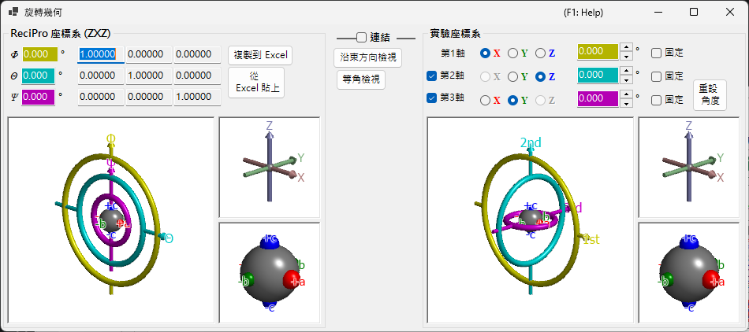

# 旋轉幾何

此視窗以 3×3 矩陣表示晶體的旋轉狀態，並在不同的歐拉座標系之間進行轉換。

ReciPro 使用三個歐拉角 — **Ψ**、**θ** 與 **Φ** — 並依 **Z–X–Z** 順序套用。然而，此慣例不一定與您實際儀器的測角儀軸相符。**旋轉幾何**視窗可讓您將 ReciPro 的歐拉角轉換到任意定義的座標系，從而支援實驗室中的測角儀調整。

---

## 鍵盤與滑鼠快速鍵

全部六個 3D 檢視（ReciPro 與實驗測角儀 / 軸 / 物件等面板）皆已**連動** — 旋轉其中任一個，六者便會一同旋轉。它們共用 ReciPro 的標準 [OpenGL 檢視導覽](21-shortcuts.md)。

| 快速鍵 | 動作 |
|----------|--------|
| <kbd>F1</kbd> | 開啟線上手冊的本頁 |
| 在檢視中左鍵拖曳 | 旋轉模型（六個檢視一同旋轉） |
| 滑鼠滾輪，或右鍵向上/向下拖曳 | 縮放（大型測角儀檢視） |
| 中鍵拖曳 | 平移（大型測角儀檢視） |
| <kbd>CTRL</kbd> + 右鍵向上/向下拖曳 | 變更相機距離（僅限透視模式） |
| <kbd>CTRL</kbd> + 右鍵雙擊 | 切換正交 / 透視投影 |

小型 *Axes* 與 *Objects* 檢視已停用縮放與平移。除 <kbd>F1</kbd> 外沒有其他鍵盤快速鍵。

---

## ReciPro 座標系 (ZXZ)

視窗的上半部以「ReciPro 座標系」顯示旋轉狀態。

- **Φ, θ, Ψ** 值與主視窗中設定的歐拉角同步。
- **Rotation matrix** 顯示對應於目前旋轉狀態的 3×3 矩陣。

### Φ, θ, Ψ (Z–X–Z 歐拉角)

晶體取向由依此順序套用的三個旋轉參數化：

1. **Φ** — 繞 **Z** 軸的第一次旋轉。
2. **θ** — 繞一次旋轉後參考系之 **X** 軸的旋轉。
3. **Ψ** — 繞兩次旋轉後參考系之 **Z** 軸的第二次旋轉。

每個數值方塊皆可編輯；在此變更某個值會更新主視窗以及每個連動的模擬器。

### Rotation matrix

由目前的 (Φ, θ, Ψ) 產生的 3 × 3 矩陣。使用 **Copy to Excel** / **Paste from Excel** 透過試算表來回傳遞矩陣。

### OpenGL 視窗

3D 檢視以三個彩色圓環（甜甜圈）顯示目前的旋轉：

| 顏色 | 歐拉角 | 測角儀層級 |
|--------|------------|-----------------|
| **黃色** | Φ | 第 1（上）軸 |
| **淺藍色** | θ | 第 2（中）軸 |
| **粉紅色** | Ψ | 第 3（下）軸 |

**紅**、**綠**、**藍**箭頭表示實空間笛卡兒座標中的 X、Y、Z 軸。這些*並非*主視窗中所示的晶軸。

中央的灰色球體表示試樣；紅/綠/藍球體顯示物件相對於其初始取向已如何旋轉（當 Φ = θ = Ψ = 0 時，它們分別對齊 +X、+Y、+Z）。

> **Note**: 在 OpenGL 視窗中拖曳僅會變更此檢視的*投影方向*，而非晶體取向本身。若要旋轉晶體，請使用主視窗。

### 按鈕

| 按鈕 | 動作 |
|--------|--------|
| Copy to Excel | 以定位字元分隔格式複製 3×3 旋轉矩陣 |
| Paste from Excel | 從剪貼簿設定旋轉矩陣（定位字元分隔的 3×3） |
| View along beam | 與主視窗投影對齊（Z 軸垂直於螢幕） |
| Isometric | 切換為等角投影 |

---

## 實驗座標系

下半部在任意一組旋轉軸上定義歐拉角，並讀取/設定測角儀狀態。此即所謂的**實驗座標系**。

### 第 1、第 2、第 3 軸

為每個層級（上、中、下）從 **±X**、**±Y** 與 **±Z** 中選擇測角儀的旋轉軸。圖形會隨之更新。

各軸的歐拉角會顯示在對應的彩色文字方塊（黃色、淺藍色、粉紅色）中。您也可以直接輸入數值。

---

## Link

當勾選 **Link** 時，ReciPro 座標系與實驗座標系即耦合：兩者的歐拉角會經過調整，使物件取向在兩個系統之間保持一致。

### 範例工作流程

1. 在實驗室中，設定測角儀使晶體的 *a* 軸與 X 射線入射方向對齊，且 *b* 軸保持水平。
2. 在實驗座標系中輸入實驗室測角儀的歐拉角。
3. 在主視窗中旋轉晶體，使 *a* 軸朝向螢幕法線，*b* 軸朝向水平。
4. 勾選 **Link** — 此後，每當您在主視窗中將晶體指向不同取向時，便會自動顯示所需的測角儀角度。

---

## 另見

- [主視窗](0-main-window.md)
- [極網](6-stereonet.md)
- [基本座標系與晶體取向](appendix/a1-coordinate-system/1-orientation.md)
- [鍵盤與滑鼠快速鍵](21-shortcuts.md)
