# 結構檢視器

**結構檢視器**使用 OpenGL 將選取晶體的結構繪製為三維影像。

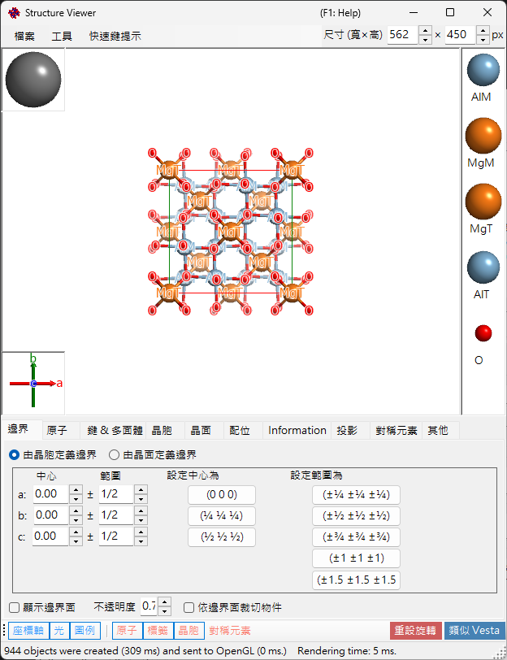

---

## 鍵盤與滑鼠快速鍵

此視窗包含一個主要的 3D 檢視，以及兩個小型操作器 — **晶軸**方塊（左下角）和**光源方向**方塊（左上角）— 各自對左鍵拖曳有不同的反應。主檢視使用 ReciPro 標準的 [OpenGL 檢視導覽](21-shortcuts.md)。

| 快速鍵 | 動作 |
|----------|--------|
| <kbd>F1</kbd> | 開啟線上手冊的本頁 |
| <kbd>CTRL</kbd>+<kbd>SHIFT</kbd>+<kbd>C</kbd> | 將算繪後的影像複製到剪貼簿 |
| 在主檢視中左鍵拖曳 | 旋轉模型 |
| 在原子上左鍵雙擊 | 顯示其座標、最近鄰距離與鍵角 |
| 右鍵向上/向下拖曳，或滑鼠滾輪 | 縮放 |
| 中鍵拖曳 | 平移 |
| <kbd>CTRL</kbd> + 右鍵向上/向下拖曳 | 變更相機距離（僅透視模式） |
| <kbd>CTRL</kbd> + 右鍵雙擊 | 切換正交／透視投影 |
| 在**晶軸**操作器上左鍵拖曳 | 旋轉模型（無平面內自旋） |
| 在**光源**操作器上左鍵拖曳 | 變更照明方向 |

當此視窗取得焦點時，來自[主視窗](0-main-window.md#keyboard-mouse-shortcuts)的應用程式全域 <kbd>CTRL</kbd>+<kbd>SHIFT</kbd> 快速鍵同樣有效。

→ 請參閱 **[21. 鍵盤與滑鼠快速鍵](21-shortcuts.md)**，一覽所有視窗。

---

## 主區域

帶有光源、晶軸與原子圖例的 3D 晶體結構。
> 視窗右上角的 **Size (W×H)** 方塊設定儲存或複製算繪影像時所使用的像素尺寸。
> 其旁的 **ProjWidth** 方塊顯示投影檢視的寬度（nm）。編輯此值即可以數值方式縮放 — 它會與檢視上的右鍵拖曳／滾輪縮放保持同步。

---

## 選單列

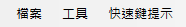

### 檔案選單

儲存影像、複製到剪貼簿（Ctrl+Shift+C）、儲存影片（MP4）。

**儲存影片**會開啟下方的影片設定對話框。影片可以旋轉檢視、平移投影中心，或同時進行兩者 — 請勾選 **Rotation** 和／或 **Translation**：

- **Rotation**：以 **Speed**（°/s；負值反轉方向）繞下方所選的軸旋轉檢視 — **目前投影**（以箭頭按鈕選取的傾斜方向）、**方向指數** [uvw]，或 **晶面** (hkl) 的法線。
- **Translation**：沿方向指數 [uvw] 以 **Speed**（晶格週期/秒）移動投影中心。此選項僅在從結構檢視器開啟對話框時顯示，且啟用期間 **方向指數** 是唯一可用的方向模式。

設定影片長度（**Duration**）、影格率（**FPS**，1–120）與編碼品質（**Quality**，1–100；數值越高位元率越高、檔案也越大），選擇編解碼器（**H264** / **H265**），然後按 **OK** 以產生 MP4 檔案。**Include final frame** 會在 t = Duration 處附加一個額外影格，使影片恰好結束於最終的方位／位置。（編碼速度清單現在僅用於標示進度顯示，不再影響實際編碼。）

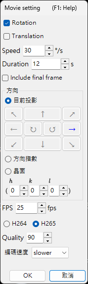

### 工具選單

---

## 索引標籤選單

### 由晶胞定義的邊界

指定晶體的繪製範圍。有兩種模式，以上方的選項按鈕切換。

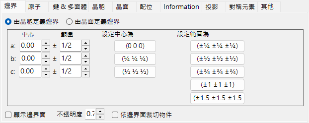

在此模式中，晶胞的 *a*、*b*、*c* 軸是繪製範圍的單位。

- **中心**：繪製體積的中心分數座標。
- **範圍**：*a*、*b*、*c* 各軸的上限／下限。
- 右側的**預設按鈕**提供常用值（例如 1×1×1 晶胞、2×2×2 晶胞）。

### 由晶面定義的邊界

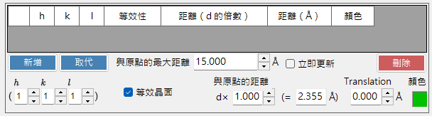

在此模式中，繪製區域由一組晶面所限定。若這些平面未定義出空間上封閉的區域，ReciPro 會自動回退為單一晶胞的邊界。

#### 邊界清單

為目前晶體所登錄的全部邊界平面。使用 **Add / Replace / Delete** 操作此清單；最左側的核取方塊可暫時停用某個平面而不刪除它。

> 若要永久儲存變更，您還必須在**主視窗**中按 **Add** 或 **Replace**。否則，下次您在主晶體清單中變更選取時，變更將會遺失。

#### H k l 指數

以米勒指數設定邊界平面。核取方塊會納入由選取的 (*hkl*) 所產生的晶體學等效平面。

#### 距原點的距離

從晶體中心到邊界平面的距離。單位可在 **d** 與 **Å** 之間選擇。使用 **d** 時，距離為輸入值乘以所選 (*hkl*) 的 *d* 間距。使用 **Å** 時，數值為絕對距離。變更其一會自動更新另一個。

#### 顯示邊界平面 / 不透明度

顯示或隱藏邊界平面本身。顯示時，**不透明度** 設定透明度（0 = 透明，1 = 不透明）。

#### 以邊界平面裁剪物件

若勾選，則僅算繪由邊界定義的內部區域；與邊界相交的原子、鍵與多面體會被裁剪。

#### 隱藏原子

若勾選，則所有原子、鍵與多面體都會被隱藏 — 當只需呈現晶胞或晶面時很有用。

### 原子

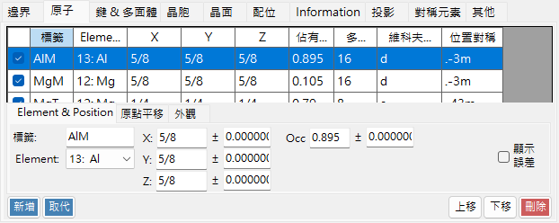

座標、元素、佔有率、半徑、顏色、材質。**套用至相同元素**。

#### 原子清單

晶體中的原子清單。使用 **Add / Replace / Delete** 操作此清單；最左側的核取方塊可暫時隱藏某個原子。

> 若要永久儲存變更，也請在**主視窗**中按一下 **Add** 或 **Replace**。

#### 元素與位置

- **標籤**：原子的自由文字標籤（用於圖例與工具提示）。
- **Element**：化學元素／離子化狀態。
- **X, Y, Z**：分數座標。0–1 之間的實數，或如 `1/2` 或 `2/3` 之類的分數。
- **Occ**：佔有率，0–1 之間的實數。

#### 原點平移

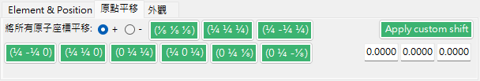

將每個原子平移相同的分數偏移量。按下一個預設按鈕（例如，為同一空間群在原點選擇 1 / 2 之間切換），或輸入自訂的 (Δx, Δy, Δz) 並按 **Apply custom shift**。

#### 外觀

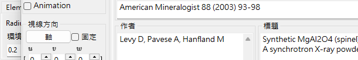

每個原子的半徑、顏色與材質。

- **Radius**：繪製的原子半徑。
- **顏色**：表面顏色。
- **Material**：OpenGL 著色器所使用的紋理／材質屬性。
- **套用至相同元素**：將目前的半徑與顏色套用至同一元素種類的每個原子。

### 鍵與多面體

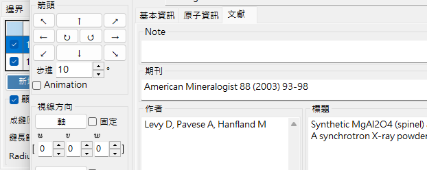

鍵長閾值、多面體顯示、邊。

#### 鍵清單

為晶體登錄的全部鍵／多面體規則。使用 **Add / Replace / Delete**；最左側的核取方塊可暫時停用某個項目。如同原子與邊界，需在**主視窗**中按 **Add** / **Replace** 才能使變更永久生效。

#### 鍵屬性

- **成鍵原子（中心）**：用作鍵／多面體中心原子的元素種類。
- **成鍵原子（頂點）**：用作頂點（另一端）的元素種類。
- **鍵長範圍**：下限與上限距離閾值。超出此範圍的原子對不會被繪製。
- **Bond Radius**：繪製的鍵粗細（圓柱半徑）。
- **不透明度**：鍵的透明度（0 = 透明，1 = 不透明）。

#### 多面體屬性

- **顯示多面體**：勾選時，繪製由目前的鍵所定義的多面體（僅在中心／頂點集合幾何上有效時）。
- **顯示內部鍵**：顯示／隱藏多面體內部的鍵。
- **顯示中心原子**：顯示／隱藏中心原子。
- **顯示頂點原子**：顯示／隱藏頂點原子。
- **Color** / **不透明度**：面的顏色與透明度。
- **顯示稜邊**：繪製連接頂點的邊。
- **Edge Color** / **寬度**：邊的顏色與線寬。

### 晶胞

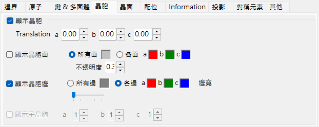

平移、晶胞平面、邊。

#### 平移

每個空間群都有一個預設原點。若要將繪製的晶胞中心移離該原點，請沿 *a*、*b*、*c* 設定平移。

#### 顯示晶胞平面

是否繪製界定晶胞的六個面。啟用時，您可以設定面的顏色與透明度。

#### 顯示邊

是否繪製晶胞的邊。邊的顏色可設定。

### 晶面

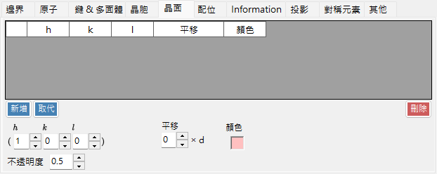

帶有晶體學等效項的米勒指數指定。

#### H k l 指數

以米勒指數指定晶面。核取方塊可選擇性地納入由 (*hkl*) 所產生的晶體學等效平面。

#### 平移

將繪製的晶面平移其 *d* 間距的整數倍 — 在呈現同一族中連續的平面時很有用。

### 配位

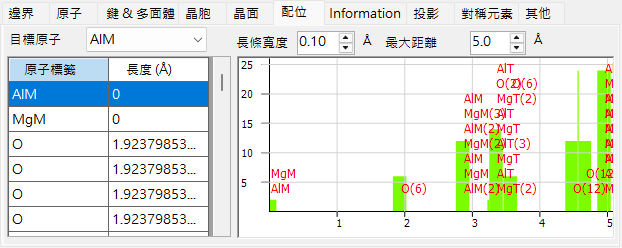

目標原子周圍的配位表與圖。

#### 表（左側）

列出哪些原子環繞所選的目標原子，以及在何種距離。目標原子由表上方的下拉式選單選取。

#### 圖（右側）

鄰原子數對距離的長條圖，由與表相同的資料導出。調整 **Bar Width**，直到長條清楚地分離出各配位殼層 — 這提供了配位數的視覺估計。

### 資訊

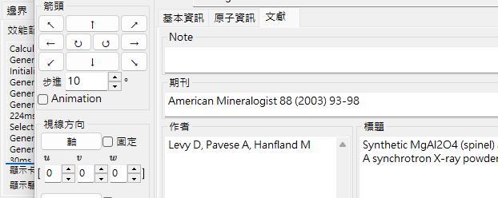

算繪記錄（影格時間、GPU 資訊）以及所選原子的基本資訊。建構中 — 欄位可能會隨時間增加。

### 投影

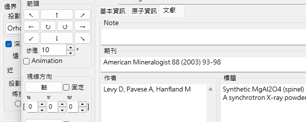

投影模式（正交／透視）、深度淡出、算繪品質、透明度模式。

#### 投影

- **Orthographic**：完美的平行投影（視點位於無限遠處）。
- **Perspective**：從滑桿所設定的視點距離進行透視投影。

#### 深度淡出

在深度方向淡出遠處的物件。比 **Far** 更遠的物件完全透明；比 **Near** 更近的物件完全不透明；中間的物件以線性內插。

#### 投影中心

將投影中心設定至指定的座標。開啟 **自訂** 以輸入任意座標。每個座標都會被折疊到 −0.5 到 +0.5 的範圍內（1 個晶格週期）。**Translation** 影片（參見[檔案選單](#檔案選單)）會自動驅動這些數值。

#### 算繪品質

繪製品質（網格細分、反鋸齒）。品質越高越慢 — 請選擇符合您 GPU 的設定。

#### 透明度模式

用於半透明原子與多面體的演算法。

- **Approximate**：快速，但當許多半透明物件重疊時可能不準確。
- **Perfect**：與順序無關的透明度 — 準確但非常慢，實際上需要獨立 GPU。

### 對稱元素

**Symmetry Elements** 索引標籤將空間群的對稱運算子直接繪製到 3D 模型上（以工具列的 **Symmetry Elements** 按鈕切換）。每一類元素可獨立顯示／隱藏：

- **旋轉軸**與**螺旋軸**
- **鏡面**與**滑移面**
- **反轉中心**與**旋轉反轉軸**

對於每一類，您可以調整符號大小、線寬與顏色。

### 其他

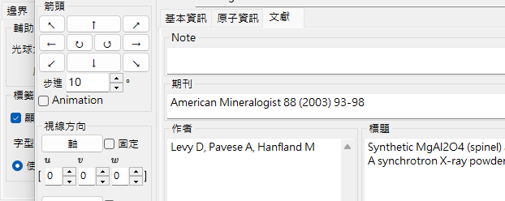

- **輔助元件**：設定顯示尺寸（光球、軸、圖例）。**依元素分組** 切換圖例顯示。
- **成鍵原子**：**顯示成鍵原子，即使位於邊界之外** 會持續繪製與繪製範圍內原子成鍵的原子，即使它們落在範圍之外。
- **標籤**：設定原子標籤的字型大小、顏色與其他屬性。

---

## 工具列

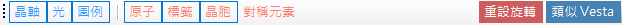

| 按鈕 | 說明 |
|--------|-------------|
| Axes | 顯示軸方向（大小 = 晶格常數） |
| Light | 設定光源方向 |
| Legend | 原子圖例 |
| Atoms | 切換原子物件 |
| Labels | 切換原子標籤 |
| Unit Cell | 切換晶胞邊 |
| Sym. Elems. | 切換對稱元素疊加（見上文） |
| Reset Rotation | 回到初始方位 |
| Like Vesta | Vesta 風格外觀 |

---

## 另請參閱

- [主視窗](0-main-window.md)
- [晶體資料庫](1-crystal-database.md)
- [對稱性資訊](2-symmetry-information.md)
- [繞射模擬器](7-diffraction-simulator/index.md)
- [鍵盤與滑鼠快速鍵](21-shortcuts.md)
