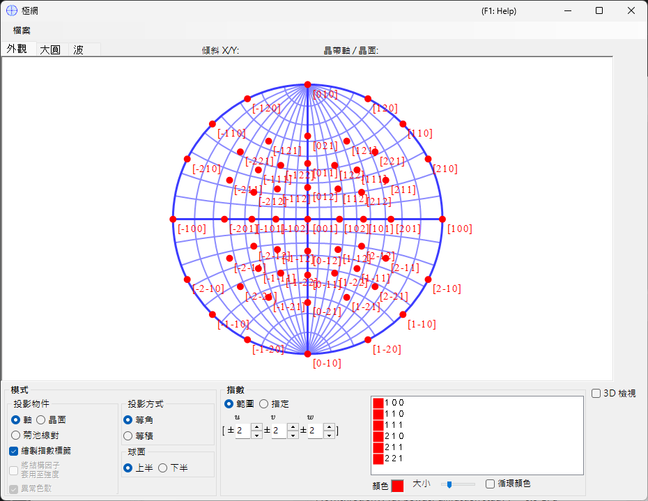
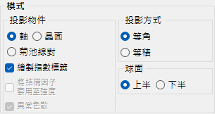
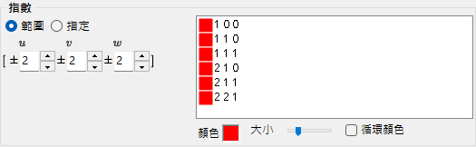
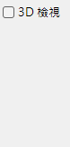
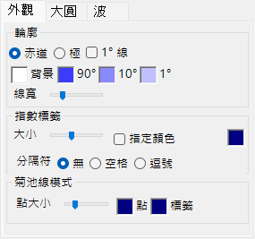
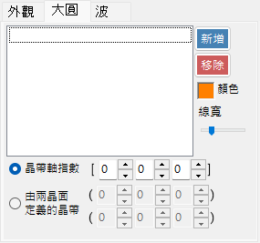
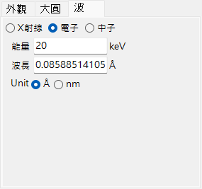

# 極網

**極網**使用立體投影顯示晶面與軸方向。

---

## 鍵盤與滑鼠快捷鍵

極網本身是 2-D 投影；可透過 **3D display** 顯示選用的 3-D 球面。

| 快捷鍵 | 動作 |
|----------|--------|
| <kbd>F1</kbd> | 開啟線上手冊的本頁 |
| 在中心附近左鍵拖曳 | 傾斜晶體 |
| 在外圍區域左鍵拖曳 | 使晶體繞視軸自旋 |
| 左鍵雙擊 | 在 **Plane** 與 **Axis** 投影之間切換 |
| 右鍵點按 | 縮小 |
| 右鍵拖曳框選 | 放大至選取的區域 |
| 中鍵拖曳 | 平移 |
| 移動滑鼠（不按任何鍵） | 讀取游標下的 (hkl)/[uvw] — 對量測斑點的指標化很有用 |

在網上拖曳會旋轉**晶體**；旋轉狀態會在所有視窗間共用。

3-D 算繪使用 ReciPro 的標準 [OpenGL 視圖導覽](21-shortcuts.md)（左鍵拖曳旋轉、右鍵拖曳／滾輪縮放、<kbd>CTRL</kbd> + 右鍵雙擊切換投影），且僅旋轉 3-D 視圖，而非晶體本身。

當此視窗取得焦點時，來自[主視窗](0-main-window.md#keyboard-mouse-shortcuts)的應用程式全域 <kbd>CTRL</kbd>+<kbd>SHIFT</kbd> 快捷鍵也可使用。

→ 請參閱 **[21. 鍵盤與滑鼠快捷鍵](21-shortcuts.md)**，一覽每個視窗。

---

## 主區域

此處顯示所選晶體的晶面、方向指數與菊池線的極網投影。

---

## 檔案選單

以點陣（光柵）或向量格式儲存或複製。向量格式可在 PowerPoint 或其他向量編輯器中編輯字型／線寬。

---

## Mode

### 投影目標

選擇要投影到網上的內容。

- **Axes** — 投影方向指數 \([uvw]\)。
- **Planes** — 投影晶面法線 \((hkl)\)。
- **Kikuchi line pairs** — 投影菊池線對。

### 投影方法

| 方法 | 說明 |
|--------|-------------|
| **Wulff**（等角／立體投影） | 保留投影特徵之間的角度關係，但不保留立體角。古典結晶學家在讀取軸間或面間角度時使用。 |
| **Schmidt**（等積／蘭伯特） | 保留各區域的立體角（面積），但會扭曲角度。在相對密度具有意義的統計極圖中較受偏好。 |

### 半球

選擇 **Upper** 或 **Lower** 半球作為投影來源 — 切換球面可見的一面是最靠近觀察者或離觀察者最遠的那一面。

### 顯示選項

- 顯示指數標籤。
- 當選取 **Planes** 或 **Kikuchi line pairs** 時，依結構因子 \(|F_{hkl}|\) 為各點或各線加權（在 [Wave 索引標籤](#wave) 中設定波源與波長）。

> 對於三方／六方晶體，可在主視窗中透過 **Option ▸ Use Miller-Bravais (hkil) index** 啟用米勒-布拉維（4 指數）標記法。

---

## Indices

設定要繪製哪些晶面／軸。

### 範圍模式

指定 \([uvw]\) 或 \((hkl)\) 指數的範圍。ReciPro 會列舉限制範圍內的每一個指數並逐一投影。

### 指定模式

逐一指定特定的軸或面。輸入一個指數，按 **Add** 將其登錄，或按 **Remove** 將其刪除。當勾選 **include equivalent indices** 時，所有結晶學上等價的指數也會被繪製。

### Colour / Size

設定所繪點的 **colour** 與 **size**。勾選 **Change colour automatically**，可為每一組等價軸／面以不同顏色編碼 — 對於在多指數圖上區分各族系很有用。

---

## 3D Options

控制 3D 網（球面）疊加 — 球面的不透明度、軸指示器等。

---

## 索引標籤選單

### Appearance

#### Outline

極網外框的繪製方式 — 邊界圓以及選用的大圓緯度／經度格線。選擇 **Equator** 或 **Pole**，切換 **1° Lines** 與 **Background** 填色，設定 **90° / 10° / 1°** 格線顏色，並以軌道列調整 **Line width**。

#### Index labels

- **Size** — 指數標籤的大小。
- **Specify color** — 為所有指數標籤使用單一固定顏色，取代各斑點各自的顏色；當各點已以顏色編碼，但您希望所有標籤採用同一種顏色以利閱讀時很有用。
- **Delimiter** — 置於各標籤指數之間的字元：**None**（例如 100）、**Space**（1 0 0）或 **Comma**（1,0,0）。

#### Kikuchi line mode

- **Point size** — 所繪點的大小。
- **Point** / **Label** — 點與其標籤的顏色。

### Great and Small Circle

繪製大圓與小圓。可透過 **zone-axis index** \([uvw]\)（由該軸的晶帶所形成的大圓）指定，或透過共用該晶帶軸的 **two crystal-plane indices** 指定。圓的線寬同樣可透過軌道列設定。

### Wave {#wave}

僅在選取 **Planes** 或 **Kikuchi line pairs** 作為投影目標時可用。設定波源（X-ray / electron / neutron）以及計算晶體結構因子所需的波長或能量，這些結構因子用於 [Mode](#mode) 中的 **structure-factor weighting** 選項。

---

## 另請參閱

- [主視窗](0-main-window.md)
- [旋轉幾何](4-rotation-geometry.md)
- [結構檢視器](5-structure-viewer.md)
- [繞射模擬器](7-diffraction-simulator/index.md)
- [基本座標系與晶體取向](appendix/a1-coordinate-system/1-orientation.md)
