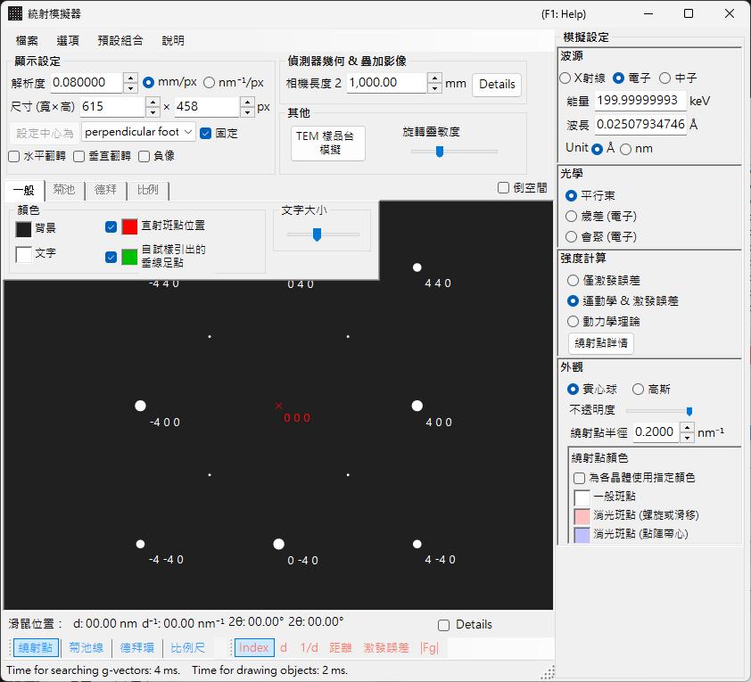
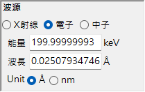
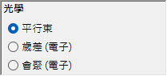
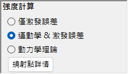
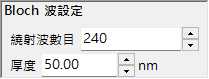
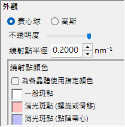

# SAED（選區電子繞射）模擬

**SAED（選區電子繞射）** 模擬計算由平行電子束所產生的單晶電子繞射圖樣。這是 [繞射模擬器](index.md) 的預設模式。

> 本頁列出當您選擇 **Wave Length = Electron** 與 **Incident beam mode = Parallel** 時，於右側 **Spot property** 面板中出現的每一項設定。關於繪圖、儲存等視窗層級的操作，請參閱 [概覽頁](index.md)。

GUI 條件：Wave Length = Electron、Incident beam mode = Parallel、Intensity calculation = Only excitation error / Kinematical / Dynamical。

---

## 概覽

模擬平行電子束通過薄試樣時所產生的繞射圖樣。光點位置由厄瓦爾德球與倒易點陣點之間的幾何關係所固定，而每個光點的亮度則依所選的強度計算模式計算。

---

## Wave Length

將輻射源設為 **Electron**。輸入能量（keV）或波長（nm），即可計算經相對論修正後的波長。關於 X 光與中子源，請參閱 [X 光繞射模擬](4-x-ray-neutron-diffraction.md)。

---

## Incident beam mode

將入射束幾何設為 **Parallel**。這是 SAED 與 X 光繞射所使用的標準平面波幾何。

> **Note**：對於電子，您可以選擇 **Parallel / Precession (electron = PED) / Convergence (CBED)**。選擇 **Precession** 會得到 [PED 模擬](2-ped-simulation.md)，選擇 **Convergence** 會得到 [CBED 模擬](3-cbed-simulation.md)；在這兩種情形下，強度計算都會自動切換為 Dynamical。

---

## Intensity calculation

選擇光點強度的計算方式。

### 僅偏離向量

強度僅由厄瓦爾德球與倒易點陣點之間的幾何距離（即偏離向量 $s_g$）決定。$\lvert s_g \rvert$ 越小，強度越高；當其等於 **Radius** 所設定的值時達到最大，當 $\lvert s_g \rvert$ 超過 Radius 時則降為零。由於忽略了晶體結構因子，這是最快的模式，適合用於檢查繞射光點位置。

### 運動學

除了偏離向量之外，還將運動學結構因子 $\lvert F_{hkl} \rvert^2$ 納入強度。消光規則能被正確反映，使此模式適合用於薄試樣或弱繞射。

### 動力學（布洛赫波法，僅限電子）

以布洛赫波法（Bethe 法）進行嚴謹的動力學計算。它能重現多重散射以及強度隨厚度的變化，對於厚試樣或強繞射為必要。僅在選擇 Electron 時可用。關於理論，請參閱 [附錄 A3. 布洛赫波法](../appendix/a3-bloch-wave/calculation.md)。

> **Note**：當選擇 **Dynamical** 時，下方會出現一個 **Bloch wave settings** 面板。

---

## Bloch wave settings（動力學理論）

僅在 **Intensity calculation = Dynamical** 時作用。

| Parameter | 說明 |
|-----------|-------------|
| **Number of diffracted waves** | 本徵值問題中所納入的布洛赫波數目。值越大，強度越精確，但計算時間以 $O(N^3)$ 增加 |
| **Thickness** | 動力學計算中所使用的試樣厚度（nm） |

---

## Spot appearance

控制每個繞射光點的繪製方式。

- **Solid sphere / Gaussian**：倒易點陣點的幾何模型。**Solid sphere** 繪製半徑為 $R$ 的球與厄瓦爾德球之間的截面（一個圓），圓面積對應於繞射強度；**Gaussian** 繪製 $\sigma = R$ 的 3 維高斯函數的截面（一個 2 維高斯函數），其積分對應於繞射強度。
- **Opacity**：光點的透明度（0 = 透明，1 = 不透明）。
- **Radius (R)**：倒易點陣點的虛擬半徑。光點大小由 **Appearance** 模式與 **Intensity calculation** 的組合所固定（例如 Solid sphere + Dynamical 會得到與 $I_\text{dyn}^{1/2}$ 成正比的半徑）。
- **Brightness**：僅在 **Gaussian** 模式中作用。所繪高斯函數的積分強度。
- **Color scale**：**Gray scale** 或 **Cold-warm**。
- **Log scale**：以對數刻度顯示強度。對於強度對比很大的圖樣很有用。
- **Spot color**：未使用色彩刻度時所用的光點色彩。
- **Use crystal color**：勾選時，光點以指派給各晶體的色彩繪製。

---

## Spot labels

疊加在光點上的標籤可從 [工具列](index.md#toolbar) 中選擇。

| Label | 內容 |
|-------|---------|
| **Index** | 米勒指數 $(hkl)$ |
| **d** | 晶面間距 $d$ |
| **Distance** | 偵測器上光點與光點之間的距離 |
| **Excit. Err.** | 偏離向量 $s_g$ |
| **\|Fg\|** | 結構因子的絕對值 $\lvert F_{hkl} \rvert$ |

---

## 共通操作

偵測器資訊、翻轉、倒易空間顯示、菊池線、德拜環、刻度線、色彩設定、儲存等等，為所有模式所共通。請參閱 [概覽頁](index.md)。從動力學計算所得到的每個反射的詳細資料，可在 [繞射光點資訊](index.md#diffraction-spot-information) 中瀏覽。

---

## 另請參閱

- [繞射模擬器（概覽）](index.md)
- [平行束 SAED 計算](../appendix/a3-bloch-wave/calculation.md#parallel-beam-saed)
- [X 光繞射模擬](4-x-ray-neutron-diffraction.md)
- [進動電子繞射（PED）模擬](2-ped-simulation.md)
- [座標系的定義](../appendix/a1-coordinate-system/1-orientation.md)
