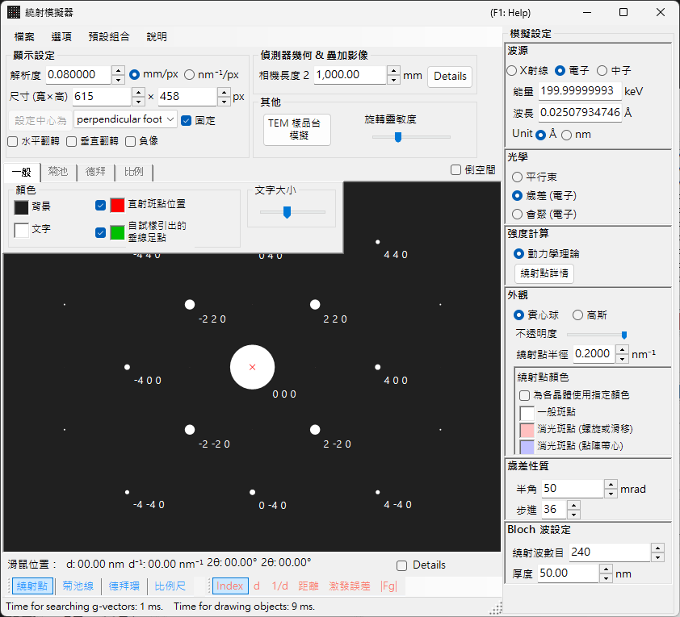
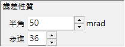

# 進動電子繞射 (PED) 模擬

**PED (Precession Electron Diffraction)** 模擬會計算將入射束在繞光軸的錐面上進動時所得到的電子繞射圖樣。

> 本頁列出當您選擇 **Wave = Electron beam, Incident beam = Precession (electron), Intensity = Dynamical (automatic)** 時，右側出現的所有設定。請注意，**為入射束選擇 Precession (electron) 會自動將強度計算切換為 Dynamical**。關於繪製與儲存等視窗整體操作，請參閱[總覽頁](index.md)。

GUI 條件：**Wave = Electron beam, Incident beam = Precession (electron), Intensity = Dynamical (automatic)**

---

## 總覽

在 PED 中，電子束會在繞光軸的錐面上進動，並將進動錐面上每個束方向所得到的繞射圖樣加以積分。與傳統的 SAED 相比，這提供了以下優點：

- 動力學效應被平均掉，產生接近運動學強度比的強度資料
- 較清楚地觀察到高階勞厄區 (HOLZ) 反射
- 可獲得適用於結構分析的強度資料

---

## 波長設定

由於 PED 屬於電子繞射，請選擇 **Electron beam** 作為波源。輸入電子能量 (keV) 或波長 (nm) 即可計算經相對論修正的波長。

---

## 入射束

關於入射束幾何，請選擇 **Precession (electron)**（僅在選擇電子束時可用）。

> **注意** ：選擇 **Precession (electron)** 會**自動將強度計算切換為 Dynamical**，並出現布洛赫波法設定面板與進動設定面板。**Only excitation error** / **Kinematical** 將無法再選取。

---

## 進動設定

設定進動錐面的形狀與取樣。

| 參數 | 說明 | 建議值 |
|-----------|-------------|-------------|
| **Semi-angle** | 進動錐面的半頂角 (mrad) | 10–40 mrad |
| **Step** | 在進動錐面上取樣的平行束方向數目。較大的值可得到較平滑的積分，但會使計算時間線性增加 | 36–72 |

---

## 強度計算與布洛赫波法設定

一旦選擇 **Precession (electron)**，**Intensity = Dynamical (automatic)** 即被固定。對於每個進動方向的平行束，會以布洛赫波法（動力學計算）計算繞射強度，並對所有方向積分以得到 PED 圖樣。

| 參數 | 說明 | 建議值 |
|-----------|-------------|-------------|
| **No. of diffracted waves** | 本徵值問題中所納入的布洛赫波數目。較大的值可得到較準確的強度，但計算時間會以 $O(N^3)$ 成長 | 50–200 |
| **Thickness** | 動力學計算中所用的試樣厚度 (nm) | — |

計算成本大致為「步數 × 每個方向的布洛赫波計算」。關於動力學計算的細節，請參閱[動力學計算（布洛赫波法）](../appendix/a3-bloch-wave/calculation.md)。

---

## 繞射點外觀

控制每個繞射點的繪製方式。

- **Solid sphere / Gaussian** ：倒易點陣點的幾何模型。**Solid sphere** 繪製半徑為 $R$ 的球面與厄瓦爾德球的截面，而 **Gaussian** 繪製 $\sigma = R$ 的 3D 高斯函數與厄瓦爾德球的截面（一個 2D 高斯函數）。
- **Opacity** ：繞射點的透明度（0 = 透明，1 = 不透明）。
- **Radius (R)** ：倒易點陣點的半徑。對於動力學強度，高斯積分 $=$ Brightness $\times I_\text{dyn}$，而 Solid sphere 使用半徑 $R \times I_\text{dyn}^{1/2}$（使面積與動力學強度成正比）。
- **Brightness** ：僅在 **Gaussian** 模式下可用。所繪製高斯函數的積分強度。
- **Colour scale** ：**Gray scale** 或 **Cold-warm** 色彩對應。
- **Log scale** ：以對數刻度顯示強度。
- **Spot colour** ：未套用色階時所用的繞射點顏色。
- **Use crystal colour** ：以指派給每個晶體的顏色繪製繞射點。

---

## 與 SAED 的比較

| 特徵 | SAED | PED |
|---------|------|-----|
| 束 | 平行、固定 | 進動（錐面掃描） |
| 動力學效應 | 大 | 平均化、較小 |
| HOLZ 反射 | 弱 | 強烈出現 |
| 強度可靠度 | 對結構分析可能不足 | 適用於結構分析 |
| 計算時間 | 短 | 長 |

---

## 另請參閱

- [繞射模擬器（總覽）](index.md)
- [X 光繞射模擬](4-x-ray-neutron-diffraction.md)
- [SAED 模擬](1-saed-simulation.md)
- [動力學計算（布洛赫波法）](../appendix/a3-bloch-wave/calculation.md)
