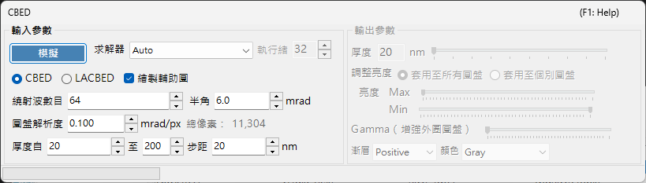
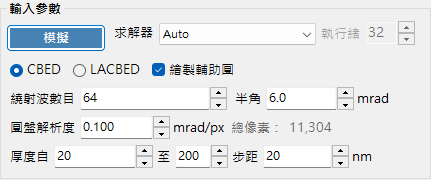
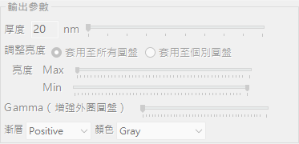

# CBED 模擬

**CBED（會聚束電子繞射，Convergent-Beam Electron Diffraction）模擬** 使用布洛赫波法（Bethe）計算並顯示會聚束繞射圖樣。CBED 圖樣顯示的是繞射盤而非繞射斑點，並含有關於晶體對稱性、厚度與結構的豐富資訊。

> 本頁列出在 [繞射模擬器](index.md) 中選擇 **Wavelength = Electron** 與 **Incident beam = Convergence (CBED, electron only)** 時所開啟之專用視窗的所有設定。將入射束切換為會聚時，**Intensity calculation** 會自動設為 **Dynamical**，並開啟此 CBED 設定視窗。關於繞射圖樣的繪製與儲存，以及繞射模擬器共通的其他操作，請參閱 [總覽頁面](index.md)。

GUI 條件：Wave Length = Electron · Incident beam = Convergence (CBED, electron only) · Intensity calculation = Dynamical（自動）

---

## 輸入參數

| 參數 | 說明 | 預設 / 典型值 |
|-----------|-------------|-------------------|
| **Mode** | **CBED**：標準的會聚束圖樣，每個盤對應一個反射，透射盤（000）位於中央。**LACBED**（Large-Angle CBED）：大角度會聚束圖樣，不同反射的盤會彼此重疊。適合用於觀察高階勞厄區（HOLZ）線與對稱性 | CBED |
| **Convergence semi-angle (mrad)** | 會聚束圓錐的半角。決定每個繞射盤的大小（盤在倒易空間中的直徑對應於 $2\alpha$） | 5–30 mrad |
| **Disk resolution (mrad/px)** | 每個盤內的角度解析度。數值越小解析度越高，但所計算的束方向數（像素數）會以平方成長，因此計算時間也以平方增加。最終得到的總像素數（= 束方向總數）顯示於右側 | — |
| **No. of Bloch waves** | 在每個入射束方向下，納入布洛赫波計算的最大束數。束數越多精度越高，但本徵值問題的成本以 $O(N^3)$ 成長 | 100–500 |
| **Thickness range** | 試樣厚度（nm）的起始值、結束值與步進值。會一併計算多個厚度，並以輸出側的厚度滑桿切換 | — |
| **Solver** | 本徵值問題的計算引擎。**Auto**：自動選擇最佳的求解器。**Eigenproblem (MKL)**：以 Intel MKL 為基礎（最快）。**Eigenproblem (Eigen)**：Eigen C++ 函式庫。**Managed**：純 .NET 受控（最慢但始終可用） | Auto |
| **Thread count** | 計算所用的並行執行緒數 | — |
| **Draw disk outlines** | 勾選時，會繪製一個圓以標示每個繞射盤的邊界 | — |

---

## 執行 / 停止

- **Start**：以目前的輸入參數開始 CBED 模擬。
- **Stop**：取消執行中的計算。

---

## 輸出參數

計算完成後，輸出參數即可使用。所有這些參數都只改變顯示，而不會重新計算。

| 參數 | 說明 |
|-----------|-------------|
| **Sample thickness** | 以滑桿在輸入參數的厚度範圍內，選擇要顯示的試樣厚度 |
| **Brightness adjustment** | **Common to all disks**：在所有盤之間使用共通的亮度尺度，以顯示完整的 CBED 圖樣。**Per disk**：以全解析度顯示單一選定的盤，並在該盤內進行正規化 |
| **Brightness (Max / Min)** | 所顯示強度的上限與下限。當您想強調微弱特徵時可加以調整 |
| **γ (emphasis of outer disks)** | 伽瑪校正。用於使大角度的暗外側盤相對於中央透射盤更易觀察 |
| **Scale** | 從 **Positive** / **Negative**（黑白反轉）中選擇強度漸層 |
| **Color** | 顯示所用的色彩對映。可從 **Gray** 等選項中選擇 |

---

## 物理背景

在 CBED 中，入射束被視為由不同方向的平面波所構成的圓錐。對每個方向（會聚光闌內的每一點 = 一個部分入射平面波），布洛赫波法在晶體內部求解電子薛丁格方程式，並將結果重新排列為繞射盤。HOLZ（高階勞厄區）線在盤內呈現為細緻的暗/亮線，源自高階勞厄區中的反射。它們對沿 $c$ 軸的點陣參數十分敏感，可用於三維結構分析。

關於理論細節，請參閱 [CBED 計算](../appendix/a3-bloch-wave/cbed.md)。

---

## 另請參閱

- [繞射模擬器（總覽）](index.md)
- [SAED 模擬](1-saed-simulation.md)
- [PED 模擬](2-ped-simulation.md)
- [CBED 計算](../appendix/a3-bloch-wave/cbed.md)
