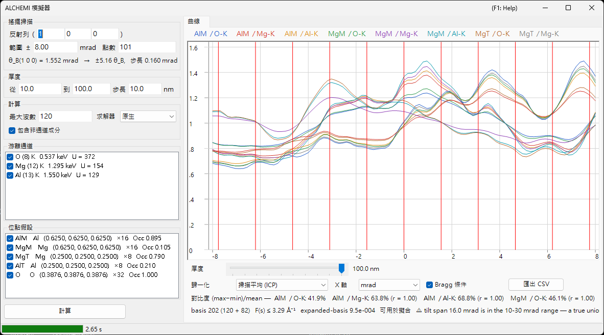

# ALCHEMI 模擬

**ALCHEMI（Atom Location by CHannelling-Enhanced MIcroanalysis，通道增強微分析定位法）** 藉由在沿系統反射列傾轉晶體的同時量測特徵 X 光產率，並讀取其取向相依性，來判定**摻雜原子占據哪個位點**。ReciPro 的 ALCHEMI 模擬器由晶體結構與一組位點假設**正向計算搖擺曲線（游離產率隨取向的變化）**。

> **這是 Preview 功能。** v1 **僅進行一維正向計算**；對實驗資料的擬合與 2D 圖（2D-HARECXS）尚未實作（相關頁籤已隱藏）。**就作者所知，目前沒有其他公開可用的 ALCHEMI 正向模擬器。** 由於沒有可交叉核對的實作，請先閱讀[適用範圍與已知限制](#適用範圍與已知限制)，再將結果用於定量分析。

開啟方式：[繞射模擬器](index.md) 的 **選項** 功能表 → **ALCHEMI 模擬器...**

GUI 條件：Wave Length = Electron（晶體、加速電壓與取向取自上層繞射模擬器）



視窗**左側為設定**（掃描、厚度、計算、游離通道、位點假設），**右側為結果**（曲線頁籤）。

---

## 計算的內容

對每個入射取向，以布洛赫波法求解晶體內部的波場；對每一組位點 $s$ 與游離通道 $c$，將游離產率解析地積分至厚度 $t$。

$$
Y_\text{dyn} = \mathrm{Re} \sum_{jj'} \alpha_j^{*}\,\bigl(C^{\dagger} \mu_{s,c} C\bigr)_{jj'}\, \alpha_{j'}\, F_{jj'}(t),
\qquad F_{jj'}(t) = \frac{e^{\lambda t} - 1}{\lambda}
$$

游離矩陣 $\mu$ 僅取決於兩個反射之差 $G = \mathbf{g}_h - \mathbf{g}_g$。

$$
\mu_{hg} = \sum_a \mathrm{Occ}_a\, e^{-M_a(G)}\, \sigma_c\, F_c(|G|/2)\, e^{-2\pi i\,G \cdot \mathbf{r}_a}
$$

- $\sigma_c$：游離總截面，採用 **Bote–Salvat** 模型
- $F_c(s)$：正規化游離形狀因子，來自自建 **DHFS** 表（與[束流交互作用](../3-beam-interaction.md)及 [STEM-EDX](../9-hrtem-stem-simulator/2-stem-simulation.md) 相同的資料基礎）
- $e^{-M_a(G)}$：德拜–沃勒因子（支援非等向性 ADP）

這相當於 ICSC（Oxley & Allen 2003）的**局域形狀因子近似**。未使用雙動量 MDFF。

### 非通道成分

因熱漫散射吸收而脫離同調布洛赫場的電子，會以方向隨機化的電子形式走完剩餘厚度，並在該處同樣造成游離。

$$
Y_\text{dech} = \frac{\mu_{00}}{V_c}\,\bigl(t - L_\text{coh}(t)\bigr),
\qquad L_\text{coh}(t) = \int_0^t \sum_g |\psi_g(z)|^2\,dz
$$

在**計算**框中取消勾選**包含非通道成分**會移除此項。在典型厚度下它占總產率的數十個百分點，省略後位點對比度會顯得比實際更強。

### 輸出量

一次量是**每個入射電子所產生的內殼空孔數**。**尚未套用轉換為 X 光光子（螢光產率與譜線分支）、試樣內的 X 光自吸收，以及偵測器效率與立體角。**

⚠ **空孔數不是計數值。** 與實測 EDX 強度之間還隔著 ReciPro 不執行的三個環節——原子過程、試樣與儀器。

1. **空孔 → 光子**：殼層的螢光產率與譜線分支
2. **光子 → 離開試樣的光子**：X 光自吸收，取決於**光子產生的深度**與取出角
3. **光子 → 計數值**：偵測器效率、立體角與能譜的處理

其中第 2 項尤其無法事後靠對成品曲線乘上一個吸收因子補回來——必須先將產率依深度分解。因此，要把這些曲線與實測強度、k 因子或成分比較，上述各環節必須在 ReciPro 之外完成。

請注意其中哪些能在歸一化後留存。第 1 與第 3 項，以及可當作常數處理的吸收，都是**與取向無關的乘性因子**，因此即使兩條譜線能量相差很大，也會在 ICP（掃描平均）歸一化中消去。**自吸收一般不會**：通道效應會改變空孔產生的深度分布，於是被吸收的比例本身沿掃描變化，因而在歸一化後仍然留存。選擇能量相近的譜線，正是針對這部分殘餘。

---

## 左側面板：設定

### 搖擺掃描

| 項目 | 說明 | 預設值 |
|------|------|--------|
| **反射列 ( h k l )** | 要掃描的系統反射列，以反射指數給定。傾轉軸取為同時垂直於束流與此 $\mathbf{g}$，因此掃描會帶著該反射列通過其 Bragg 條件 | (1 0 0) |
| **範圍 ±** | 傾轉掃描的半寬（mrad）。超過約 10 mrad 後固定聯集基組不再受保證，超過 30 mrad 則在 v1 的保證範圍之外 | 8 mrad |
| **點數** | 掃描點數（3–1001） | 101 |

下一行顯示所選反射列的 Bragg 角 $\theta_B$、掃描寬度相當於多少個 $\theta_B$，以及傾轉步長——執行前即可得知掃描實際涵蓋多遠。

⚠ **預設的 ±8 mrad 只是便於起步的取值，並非文獻上的最佳值。** Jones (2002) 的綜述並未給出以 mrad 表示的搖擺掃描寬度數值；上表所列的上限也是 v1 數值計算的界限，而非建議值。請改以 $\theta_B$ 為單位判斷掃描範圍（表下那一列即顯示此值），並使想要比較的動力學特徵落在掃描範圍之內。

⚠ 文獻中「照明可放寬到**約 Bragg 角**」的說法——Jones 針對最佳化後的系統反射列條件給出——指的是**入射錐的會聚半角**，即下方**計算**欄中的**角展寬**。它**不是**建議的搖擺掃描半寬。兩者是不同的量，不可混為一談。

### 厚度

給定起點、終點與步長（nm）。**所有厚度在一次執行中一併算出**，結果以曲線下方的滑桿切換。

位點對比度在薄試樣與厚試樣之間變化劇烈，甚至可能反號，因此在下結論前請檢查多個厚度。厚度選擇器就置於曲線正下方正是基於此。

### 計算

| 項目 | 說明 | 預設值 |
|------|------|--------|
| **最大波數** | 每個取向的布洛赫波數上限（1–1600）。整個掃描的聯集會更大 | 120 |
| **求解器** | 特徵值問題的計算引擎：**原生**（Eigen C++）或**託管**（.NET）。在原生求解器不可用的環境中，選擇會固定為託管 | 原生 |
| **包含非通道成分** | 是否加上上述 $Y_\text{dech}$ | 開 |
| **角展寬** | 將曲線與入射束的角展寬做摺積：**無** 或 **Gaussian**（半高全寬，mrad）。這是取向軸上的後處理，於顯示歸一化**之前**套用 | 無 |

**1600 波的上限與游離形狀因子的收錄範圍 $s \le 16\ \text{Å}^{-1}$ 是成對的。** 實測顯示即使 1600 波，基組所需的 $s$ 也僅約 10.5 Å⁻¹，因此只要遵守此上限就不會用盡收錄範圍。實際達到的數值顯示於圖下方的[基組診斷](#基組診斷)列。

### 游離通道

待游離的元素與殼層清單。每列讀作 `元素 (Z) 殼層   吸收邊能量   U = 過電壓`，需留意的情形會在末尾以括號標註。

- **無法激發**（入射能量低於吸收邊）或**超出收錄範圍**的通道會連同原因一併列出，且無法勾選
- 過電壓 $U = E_0/E_\text{邊}$ 低於 1.2 的通道帶有注意標記，因為該處截面的可靠性較低

### 位點假設

分別計算產率的原子位點清單，顯示為 `標籤 元素 (x, y, z) ×多重度 Occ 占有率`。

⚠ **在示蹤近似下，通道與位點的組合是自由的。** 將摻雜元素的游離通道與主體位點的幾何（位置、ADP、占有率）配對，正是本功能預期的用法；若僅限元素相同的組合反而是錯的。程式會計算所勾選通道與位點的**全部組合**。

### 計算 / 停止

**計算**開始掃描。進度在狀態列分五個階段顯示（正在解析游離資料 → 正在建構聯集基組 → 正在建構游離矩陣 → 正在計算取向 → 正在檢驗擴展基組），**停止**可隨時中斷。

---

## 右側面板：曲線頁籤

計算完成後，每個「位點 × 通道」組合各繪製一條曲線。圖例為 `位點標籤 / 通道`。

| 項目 | 說明 |
|------|------|
| **厚度** | 以滑桿選擇顯示的厚度（不會重新計算） |
| **歸一化** | **掃描平均 (ICP)** = 除以整個掃描的平均值（ALCHEMI 通常使用的量）/ **最大值 = 1** / **原始值 (每電子)** |
| **X 軸** | 在 **mrad** 與 **θ_B**（以所掃反射列的 Bragg 角為單位）之間切換 |
| **Bragg 條件** | 於 $\theta = n\,\theta_B$ 處畫垂直線 |
| **匯出 CSV** | 將全部取向、厚度、位點與通道的原始曲線寫入 CSV 檔（[見下](#csv-匯出)） |

⚠ **歸一化只是顯示上的變換。** 儲存的量始終是每個入射電子產生的空孔數，而**最大值 = 1 僅供顯示**，不可作為 ICP 的基準。

### 對比度與相關

曲線下方第一列依系列給出**對比度** $(\max-\min)/\text{mean}$ 以及相對於首個系列的**相關係數** $r$。這是一眼判斷哪個位點在起作用的摘要：$r$ 接近 $+1$ 的兩個系列取向相依性相同，也就是說這組資料無法區分這兩個位點。

### 基組診斷

第二列給出基組的狀態。

```text
basis 347 (184 + 163)   F(s) ≤ 6.20 Å⁻¹   expanded-basis 6.7e-3   ⚠ 擬合適用性未評估   ⚠ Experimental：僅對 beta-AlCo [001] 250 keV 做過定量驗證
```

- **basis N（僅中心 + 聯集追加）**：掃描全部取向上反射的真實聯集條數
- **F(s) ≤ … Å⁻¹**：基組實際要求的形狀因子引數最大值
- **expanded-basis**：以 1.25 倍基組重解掃描中心與兩端時的最大相對差。它是**收斂誤差的代理量**
- **擬合適用性**：v1 一律回報**未評估**。該診斷有三個已知缺陷——分母是整個張量的最大值、分子是絕對產率，
  以及當 1.25 倍基組實際上並未增大時會輕易通過——因此把結果判為「可用」會朝著危險的方向出錯
- **Experimental**：由於只對 β-AlCo 做過定量核對，每次執行都會帶上此標記並註明已驗證範圍

⚠ **v1 不保證定量的占有率擬合。** 原始診斷值仍會顯示，且越小越好，但請把它當作參考而非合格標記。另請注意，它是針對**絕對產率**定義的，因此只看 ICP（除以掃描平均）時它偏保守。

在下列情形還會追加警告。

- **加速電壓低於 80 kV**：該電壓下形狀因子表無法保證 $s$ 至 $16\ \text{Å}^{-1}$。只要基組所需的 $s$ 仍在保證範圍內，計算本身依然正確，因此這是**告知而非拒絕**
- **形狀因子截斷**：當保證範圍之外的 $F(s)$ 被截斷為零時，**會以數值給出對應的誤差上界 $|F| \le \varepsilon$**。不會靜默外推

---

## CSV 匯出 {#csv-匯出}

**匯出 CSV** 會寫出長格式表格，並在其前加上 `# key: value` 形式的表頭（以下為節錄）。表頭的設計使得僅憑該檔即可說明重現所需的條件。

```text
# generator: ReciPro ALCHEMI, ver 4.947 (2026-08-09)
# model: LocalFormFactor (local form-factor approximation; NOT the two-momentum MDFF)
# quantity: IonizationVacanciesGenerated (PerIncidentElectron)
# crystal: MgAl2O4 (spinel) / F d -3 m
# cell_nm: a 0.808000 b 0.808000 c 0.808000 alpha 90.0000 beta 90.0000 gamma 90.0000 deg
# accelerating_voltage_kV: 200.000
# scan_row_hkl: 1 0 0
# theta_B_mrad: 1.552030
# thicknesses_nm: 10.0000 20.0000 ... 100.0000
# angular_spread: Gaussian1D FWHM 1.0000 mrad (kernel renormalized at the scan ends)
# processing_order: forward yield -> angular spread convolution -> (display normalization, NOT applied to these columns)
# basis: 202 beams (120 centre-only + 82 added by the union), hash 1F3A...
# expanded_basis_max_rel_diff: 9.500e-004
# fit_eligibility: NotEvaluated (v1 does not certify quantitative occupancy fits; raw diagnostic AcceptedForFit=True at tolerance 3e-3)
# occupancy_coupling: Tracer (dilute limit; site responses may be combined linearly). VCA is not implemented
# verification: Experimental. Quantitatively verified only for beta-AlCo [001] at 250 keV (Al-K / Co-K / Co-L). ...
# not_modelled: X-ray self-absorption, detector efficiency and solid angle, fluorescence yield and line branching, background, specimen thickness distribution, specimen bending
# channel[Al-K]: edge 1.5596 keV, sigma 1.95e-007 nm2, sigma_source ... , F(s)_source ... (tabulated to s = 16.0 A^-1), not truncated
# site[AlM]: atom indices 0, occupancy from the crystal
# conventions: tilt is the signed rotation about the axis perpendicular to both the beam and g(scan_row_hkl), positive toward +g; angles in mrad; lengths in nm; ...
tilt_mrad,thickness_nm,site,channel,dynamic,dechannelled,total,dynamic_conv,dechannelled_conv,total_conv
```

`dynamic` / `dechannelled` / `total` 分開儲存，因此**可事後評估非通道成分的貢獻**。`*_conv` 欄僅在啟用角展寬時出現，內含摺積後的曲線；如此同一個檔案既有可重現的原始結果，也有用於與實驗比較的結果。數值為原始值（每入射電子），不經過顯示歸一化；小數點一律為句點。

---

## 適用範圍與已知限制

「可以計算」與「已定量驗證」是兩回事。本節說明後者。

### 不提供籠統的 ±% 精度——需要分開的三件事

ReciPro **有意**不給出「位點占有率可定到 ±N %」這類籠統精度。Jones (2002) 的綜述同樣沒有報告普適的占有率誤差；以這種形式發表的數值屬於某個體系在某種流程下的量測結果，既不是方法的屬性，更不是本模擬器的性能指標。

判斷結果時，請把下面三件事分開。

**精密度 (precision)**：數值的可重現程度——計數統計、迴歸回傳的誤差、重複之間的離散。擬合殘差小或相關係數接近 1，本身並不能說明模型正確。在 Jones 討論的例子中，為擬合加入一個自由常數改善了 precision，但並未證明 accuracy 變好。

**模型偏差 (model bias)**：正向計算本身的系統誤差——非通道項不含位點相關性、局域形狀因子近似、未計入厚度分布與彎曲（均見下文）。這類「缺失的物理」不會因為增加計數或增加掃描點數而減小。（增大基組是另一回事：那減小的是**數值**截斷誤差，[基組診斷](#基組診斷)會另行顯示。）

**獨立核對 (independent checks)**：與不共享同一前提的對象取得一致，這有兩個層次。與獨立表述的**實作**相比較（程式對程式）檢驗的是表述與編碼，這裡所做的正是這一層（針對一個體系）。與**實驗**的比較——即以現實檢驗物理本身——尚未進行。

### 已定量驗證的範圍

**僅 β-AlCo [001]、250 keV 的 Al-K / Co-K / Co-L 通道。** 與動力學表述完全獨立的多層法 + 凍結聲子計算（py_multislice）比較：

- **Al 位點（輕原子柱）**：相對於 ICP 調變的 RMS 殘差在所有厚度下 ≤3.2 %，$t \ge 10$ nm 時 ≤0.6 %
- **Co 位點（重原子柱）**：$t \le 4$ nm 時 ≤3 %，但 **$t \gtrsim 10$ nm 時為 6–17 %**

其他任何體系、元素、殼層或電壓都屬於「可以計算」，而非「已定量驗證」。

**尚未與實驗數據進行比對。** 上述比較是程式之間的比較，厚度範圍為 $t$ = 2–30 nm。下一節中 10–19 個百分點這一數值是用於分離差異原因的**診斷量**，並非模擬器所施加的修正；套用該修正後得到的一致性也不作為驗證結果。

### 已知系統誤差——非通道項不含位點相關性

v1 的非通道項是與取向無關的常數，因此它對 ICP 的唯一作用是把曲線拉向 1。實際上，部分熱散射電子會重新進入通道，且由於是強散射體，會**優先返回重原子柱**。在上述比較中，該貢獻的有效量在重原子柱上被**低估了 10–19 個百分點**。

→ **對於輕的或弱散射的位點，或 $t \lesssim 5$ nm 的情形，與獨立實作的一致性為 1–3 %。對於 $t \gtrsim 10$ nm 的重原子柱，存在相當於 ICP 調變 6–17 % 的系統誤差。** 具有位點相關性的再注入模型延後至 v1.1 之後。

### 正向模型中未包含的內容

**僅靠角展寬摺積並不能重現實驗。** 以下各項均未包含。

- 試樣的**厚度分布**與**彎曲**
- X 光**自吸收**
- **偵測器效率與立體角**
- **背景**（制動輻射、重疊譜線）

**入射束的角展寬**（會聚半角、漂移）*已經*建模——見「計算」框中的**角展寬**——但與之摺積並不能替代上述任何一項。

### 低能譜線——局域近似最弱之處 {#local-approximation}

v1 的游離矩陣僅是單一向量 $G = \mathbf{g}_h - \mathbf{g}_g$ 的函數（局域形狀因子近似）。ICSC 指出，該近似適用於特徵輻射能量**高於約 3–4 keV** 的強束縛內殼層（Oxley & Allen 2003, p. 941）。

⚠ **這個數值是經驗性、依賴模型的參考線，而非硬性 cutoff；ReciPro 不會據此拒絕計算。** 低於該值的譜線照常計算，而且往往正是關心的對象：Al-K 為 1.49 keV、Co-L 為 0.79 keV，兩者都在上文程式間比較所用的 β-AlCo 組中。

該數值標示的是：把問題約化到**單一**向量 $G$ 開始變得不夠用的位置。游離並非發生在原子核上：其機率在離核有限距離處取極大，且所需能量越低該距離越大。請注意這一近似保留了什麼、捨棄了什麼——$F_c(|G|/2)$ 依賴於動量，因此**有限的交互作用範圍仍被保留**；被捨棄的是對兩個動量轉移各自的依賴，也就是完整 MDFF 所具有的非局域結構。隨著非局域性增大，正是這一被捨棄的結構開始起作用。

僅憑譜線能量無法保證結果：殼層的空間尺度、取向、厚度以及基組實際要求的倒易向量都會起作用。請把 3–4 keV 當作「需要更仔細審視」的提示，而不是合格標記。若可以選擇，比較**能量相近**的譜線會使兩者的非局域性偏差更接近；Jones (2002) 正是把這一點列為實務上的第一步，第二步則是相對晶帶軸優先選用系統反射列——後者正是 v1 所計算的幾何（晶帶軸通道效應更強，但所需的非局域性修正更大）。

⚠ 發射能量低的譜線還最容易受到 **X 光自吸收**的影響——不過影響多大取決於試樣的組成及其吸收邊、路徑長度與取出角，並非只由發射能量決定。這是**另一個**誤差來源，模型中完全沒有包含（見上文[輸出量](#輸出量)），並且與局域近似是否成立無關地擾亂與實驗的比較。

### 模型前提

- **僅限示蹤近似**：位點響應的線性疊加只在摻雜原子不擾動彈性波場的稀薄極限下成立。有限濃度的 VCA 不在 v1 範圍內
- **局域形狀因子近似**：$\mu$ 僅是 $G = \mathbf{g}_h - \mathbf{g}_g$ 的函數，而非雙動量 MDFF（OAR 1999 的 Model A）。對輕元素 K 殼層與低能吸收邊，該近似最弱（[見上](#local-approximation)）
- **是空孔而非 X 光光子**：未乘以螢光產率與譜線分支
- **加速電壓下限為 80 kV**：這是能保證 $s = 16\ \text{Å}^{-1}$ 的最低電壓，並非拒絕門檻

---

## 另請參閱

- [繞射模擬器（總覽）](index.md)
- [CBED 模擬](3-cbed-simulation.md)
- [動力學計算（共用核心）](../appendix/a3-bloch-wave/calculation.md)
- [STEM 模擬](../9-hrtem-stem-simulator/2-stem-simulation.md) — 使用同一游離資料基礎的 STEM-EDX
- [束流交互作用](../3-beam-interaction.md) — 截面與吸收邊資料
