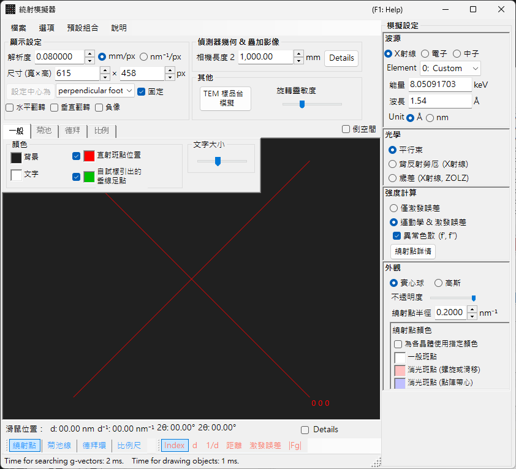

# X 光／中子繞射模擬

**X 光／中子繞射模擬**會計算單晶 X 光與中子繞射圖樣。它是[繞射模擬器](index.md)的主要模式之一。

> 本頁列出當您選擇 **Wave Length = X-ray**（或 Neutron）時，畫面右側出現的每一項設定。關於繪圖與儲存等視窗整體的操作，請參閱[總覽頁面](index.md)。

GUI 條件：Wave Length = X-ray / Neutron · Incident beam = Parallel / Precession (X-ray) / Back-Laue · Intensity calculation = Only excitation error / Kinematical

---

## 總覽

X 光的波長比電子長（Cu Kα：0.15406 nm = 1.5406 Å），因此厄瓦爾德球的曲率較大。其結果是，同時滿足繞射條件的倒易點陣點比電子的情形要少。由於原子的散射能力小、多重散射微弱，因此運動學繞射理論對於強度便能給出足夠的精度（動力學計算僅支援電子）。

---

## Wave Length

選擇 **X-ray** 作為輻射源。X 光可以兩種方式指定：特性 X 光與同步輻射。

### 特性 X 光

選擇一個**元素**與一種**躍遷**即可確定特性 X 光的波長。躍遷以西格班記法（Siegbahn notation）指定（Kα₁ / Kα₂ / Kβ 等）。代表性元素的 Kα₁ 波長：

| 元素 | 譜線 | 波長 (Å) | 能量 (keV) |
|---------|------|-----------------|--------------|
| Cu | Kα₁ | 1.5406 | 8.048 |
| Mo | Kα₁ | 0.7107 | 17.479 |
| Co | Kα₁ | 1.7890 | 6.930 |
| Cr | Kα₁ | 2.2910 | 5.415 |

### 同步輻射

將 **Element** 設為 **0: Custom**，並直接輸入能量 (keV) 或波長 (Å)。可使用任意波長。

---

## 入射束模式

選擇入射束的幾何。對於 X 光，有三種模式可用。

### Parallel

標準的平面波。用於 SAED 與單晶 X 光繞射的平行入射束。

### Precession (X-ray) — 進動相機

模擬 X 光進動相機。這是一種擷取倒易點陣單一層面的進動照片。

### Back-Laue（背向反射勞厄）

以白色（多色）X 光模擬背向反射勞厄圖樣。在此背向反射幾何中，偵測器置於光源側，且 **Monochrome** 會關閉。反射幾何由 **Detector geometry** 中的 **Tau / Phi** 給定（參閱 [Detector geometry](index.md#detector-geometry)）。

> **Note**：入射束選項會隨波長而定。**Precession (electron)** 與 **Convergence (CBED)** 僅在選擇電子輻射時出現，而上述的 **Precession (X-ray)** 與 **Back-Laue** 選項則僅在選擇 X 光輻射時出現。對於中子，僅有 **Parallel** 可用。視擷取時的狀態而定，螢幕截圖可能不會顯示 X 光專屬的選項。

---

## 強度計算

選擇用於計算斑點強度的方法。對於 X 光，有兩種模式可用。

### Only excitation error

強度僅由厄瓦爾德球與倒易點陣點之間的幾何距離（偏離向量 $s_g$）決定。較小的 $\lvert s_g \rvert$ 會給出較高的強度，並在 **Radius** 所設的值處達到峰值，而當 $\lvert s_g \rvert$ 超過 Radius 時則降為零。結構因子被忽略。

### Kinematical & excitation error

除了偏離向量之外，運動學結構因子 $\lvert F_{hkl} \rvert^2$ 也會併入強度。消光規則被嚴格遵守。不包含勞侖茲因子與偏振因子（這是一種幾何圖樣的模擬）。

> **Note**：對於 X 光，**動力學理論**被停用（僅在選擇電子輻射時可用）。

---

## 斑點外觀

控制每個繞射斑點的繪製方式。

- **Solid sphere / Gaussian**：倒易點陣點的幾何模型。**Solid sphere** 使用半徑 *R* 的球與厄瓦爾德球之間的截面（圓的面積對應於繞射強度）；**Gaussian** 使用 σ = *R* 的三維高斯函數與厄瓦爾德球之間的截面（二維高斯函數的積分對應於繞射強度）。
- **Opacity**：斑點的透明度（0 = 透明，1 = 不透明）。
- **Radius (R)**：倒易點陣點的半徑。所繪製的斑點大小由 **Appearance** 與 **Intensity calculation** 的組合決定。
- **Brightness**：僅在 **Gaussian** 模式下有效。設定所繪製高斯函數的積分強度。
- **Color scale**：在 **Gray scale** 與 **Cold-warm** 兩種色彩對應之間選擇。
- **Log scale**：以對數刻度顯示強度。
- **Spot color**：當色彩刻度不適用時的預設斑點顏色。
- **Use crystal color**：勾選時，以指派給各晶體的顏色繪製斑點。

---

## 德拜環（多晶）

可顯示多晶試樣的德拜環。請在工具列上啟用 **Debye rings**（參閱 [Toolbar](index.md#toolbar)）。

- **Ignore diffraction intensity**：以相同的顏色與強度繪製所有環（用於忽略結構因子的純幾何比較）。
- **Show index label**：在各環附近顯示 (*hkl*) 指數。

詳細設定位於[索引標籤選單](index.md#drawing-overlay-tabs)的 Debye rings 索引標籤中。

---

## 中子繞射

在 Wave Length 控制項中選擇 **Neutron** 會計算中子繞射圖樣。輸入能量 (meV) 或波長 (nm)。入射束只能為 **Parallel**。強度計算可為 **Only excitation error** 或 **Kinematical**（Dynamical 不可用）。運動學強度使用中子散射長度，而非原子散射因子。

---

## X 光繞射與電子繞射的差異

| 特徵 | X 光繞射 | 電子繞射 |
|---------|-------------------|----------------------|
| 波長 | 長（0.5–2.5 Å） | 短（0.02–0.04 Å） |
| 厄瓦爾德球曲率 | 大 | 小（近乎平坦） |
| 同時出現的反射 | 少 | 多 |
| 散射因子 | 原子散射因子 $f(s)$ | 電子散射因子 $f_e(s)$ |
| 動力學效應 | 通常小 | 大 |
| 消光規則 | 嚴格遵守 | 可能因多重散射而被破壞 |

---

## 共通操作

關於相機長度、偵測器幾何、儲存圖樣與色彩設定等視窗整體的操作，請參閱[總覽頁面](index.md)。詳細的偵測器幾何在下方的幾何視窗中設定。

---

## 另請參閱

- [繞射模擬器（總覽）](index.md)
- [SAED 模擬](1-saed-simulation.md)
- [進動電子繞射 (PED) 模擬](2-ped-simulation.md)
- [會聚束電子繞射 (CBED) 模擬](3-cbed-simulation.md)
- [座標系 — 晶體取向](../appendix/a1-coordinate-system/1-orientation.md)
