# Crystal Diffraction (繞射模擬器)

**Crystal Diffraction (繞射模擬器)** 可模擬單晶 X 光、中子與電子繞射圖樣。

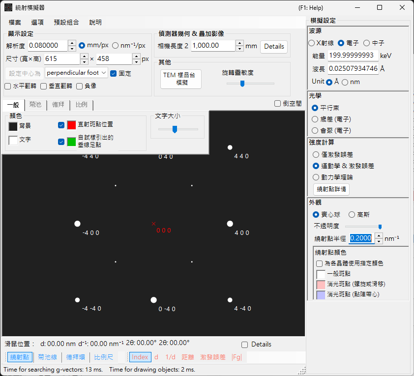

此視窗**左側**為繞射圖樣的繪圖區，**右側**為各反射性質的設定面板（波長、入射束、強度計算、外觀等）。波長與入射束的組合決定擷取模式（X 光繞射、SAED、PED、CBED），而右側面板會隨之重新配置。

---

## 本頁與各模式頁面如何分工

- **本頁（樞紐頁）**：彙整每個模式共通的操作（快速鍵、選單、工具列、螢幕/偵測器資訊、疊加層索引標籤、反射資訊、偵測器幾何、動態壓縮）。
- **各模式頁面**：涵蓋選取該模式時**右側出現的所有設定**（波長、入射束、強度計算、外觀、布洛赫波設定、進動設定等），因此每一頁皆能獨立閱讀（模式之間有部分重疊）。

| 模式 | 內容 | 頁面 |
|------|----------|------|
| **X 光（與中子）繞射** | 單晶 X 光 / 中子繞射圖樣（平行、進動 X 光、Back Laue） | [X 光繞射模擬](4-x-ray-neutron-diffraction.md) |
| **SAED** | 平行束電子繞射（選區電子繞射） | [SAED 模擬](1-saed-simulation.md) |
| **PED** | 進動電子繞射 | [PED 模擬](2-ped-simulation.md) |
| **CBED** | 會聚束電子繞射 | [CBED 模擬](3-cbed-simulation.md) |

---

## 模式快速對照

依**波長（射源）**與**入射束**的組合，查找您所需的頁面。

| 波長 | 入射束 | 模式 | 頁面 |
|------------|--------------------|------|------|
| 電子 | 平行 | SAED | [SAED 模擬](1-saed-simulation.md) |
| 電子 | 進動（電子 = PED） | PED | [PED 模擬](2-ped-simulation.md) |
| 電子 | 會聚（CBED） | CBED | [CBED 模擬](3-cbed-simulation.md) |
| X 光 | 平行 | X 光繞射 | [X 光繞射模擬](4-x-ray-neutron-diffraction.md) |
| X 光 | 進動（X 光） | 進動 X 光（進動相機） | [X 光繞射模擬](4-x-ray-neutron-diffraction.md) |
| X 光 | Back Laue | 背反射勞厄 | [X 光繞射模擬](4-x-ray-neutron-diffraction.md) |
| 中子 | 平行 | 中子繞射 | [X 光繞射模擬的中子章節](4-x-ray-neutron-diffraction.md) |

> **Note**：入射束的選項會隨波長而變。電子：**平行、進動（電子 = PED）、會聚（CBED）**；X 光：**平行、進動（X 光）、Back Laue**；中子：僅**平行**。選取**進動（電子 = PED）**或**會聚（CBED）**時，強度計算會自動切換為 **Dynamical**。

---

## 鍵盤與滑鼠快速鍵

下列適用於 X 光、SAED 與 PED 模擬共用的繞射圖樣視窗。在圖樣上拖曳會旋轉**晶體**。此處**沒有滑鼠滾輪縮放**——請以右鍵點按 / 右鍵拖曳進行縮放。

| 快速鍵 | 動作 |
|----------|--------|
| <kbd>F1</kbd> | 開啟線上手冊的本頁 |
| 在中心附近左鍵拖曳 | 傾斜晶體 |
| 在外圍區域左鍵拖曳 | 繞束軸旋轉晶體 |
| 左鍵雙擊某一反射 | 顯示反射詳細資訊（指數、*d*、結構因子、偏離向量） |
| 中鍵拖曳 | 平移圖樣 |
| <kbd>CTRL</kbd> + 中鍵拖曳 | 移動偵測器中心（顯示偵測器區域時） |
| 右鍵點按 | 縮小 |
| 右鍵拖曳出方框 | 放大至所選區域 |
| 右鍵雙擊狀態列 | 複製目前設定的文字摘要 |
| 右鍵雙擊已點亮的圖層按鈕（Spots / Kikuchi / Debye / Scale） | 使該圖層閃爍開關 |

從此處開啟的輔助視窗另外增加了幾項：

| 快速鍵 | 動作 |
|----------|--------|
| 左鍵雙擊極網 — **TEM holder** | 將試樣台傾斜設為該點 |
| 方向鍵 — **TEM holder** | 逐步調整試樣台傾斜（先勾選 **Arrow keys**） |
| 拖放 `.prm` 檔或影像 — **Detector geometry** | 載入偵測器幾何 / 疊加影像 |
| 拖放 `.txt` 曲線 — **Dynamic compression** | 載入壓力/時間曲線（拖曳圖中的紅線以掃描） |

主視窗的應用程式層級 <kbd>CTRL</kbd>+<kbd>SHIFT</kbd> 快速鍵在此視窗取得焦點時也同樣有效（見[主視窗](../0-main-window.md)）。

→ 各視窗一覽請見 **[21. 鍵盤與滑鼠快速鍵](../21-shortcuts.md)**。

---

## 依目標的快速路徑

| 目標 | 從何處開始 | 參考 |
|------|------------|-----------|
| 產生平行束電子繞射（SAED） | 將 **Incident beam** 設為 **Parallel**，**Wavelength** 設為電子 | [SAED 模擬](1-saed-simulation.md)、[平行束 SAED 計算](../appendix/a3-bloch-wave/calculation.md) |
| 產生單晶 X 光繞射 | 將 **Wavelength** 切換為 X 光 / 同步輻射 | [X 光繞射模擬](4-x-ray-neutron-diffraction.md) |
| 產生進動電子繞射（PED） | 將 **Incident beam** 設為 **Precession (electron)**，再設定半角與步階 | [PED 模擬](2-ped-simulation.md) |
| 產生會聚束電子繞射（CBED） | 將 **Incident beam** 設為 **Convergence (CBED, electron only)**，並在 CBED 視窗中設定條件 | [CBED 模擬](3-cbed-simulation.md)、[CBED 計算](../appendix/a3-bloch-wave/cbed.md) |
| 檢視動力學計算所得的反射清單 | 選取 **Dynamical** 並開啟 **Spot Details** 或 **Details** | [動力學計算（共用核心）](../appendix/a3-bloch-wave/calculation.md) |
| 將偵測器幾何與實驗影像比對 | 從 **Details** 開啟偵測器幾何設定，並使用疊加影像 | [偵測器座標系](../appendix/a1-coordinate-system/2-diffraction.md) |

---

## 主區域

繞射圖樣於畫面中央進行模擬。

### 滑鼠操作

見本頁開頭的「鍵盤與滑鼠快速鍵」。

### 滑鼠位置

對應游標位置的資訊（游標 *q*、*d*、2θ、方位角等）會顯示於圖樣上方的狀態列。勾選 **Details** 可加入更詳細的資訊（最近反射的 (*hkl*)、偏離向量、結構因子等）。

---

## File 選單

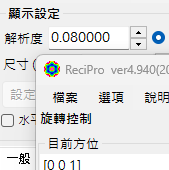

| 選單項目 | 說明 |
|-----------|-------------|
| **Save** | 將顯示的繞射圖樣存成檔案。 |
| **Save detector area** | 僅儲存偵測器區域的裁切。 |
| **Copy** | 將顯示的影像複製到剪貼簿。 |
| **Copy detector area** | 僅複製偵測器區域的裁切。 |

### Preset {#toolbar}

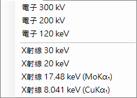

將完整的模擬器組態——波長、偵測器幾何、索引標籤設定、反射性質等——存成預設集並隨時叫回。可用於在不同儀器 / 擷取模式之間快速切換。

---

## 工具列

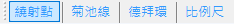

| 按鈕 | 說明 |
|--------|-------------|
| Spots | 顯示 / 隱藏繞射斑點圖層 |
| Kikuchi | 顯示 / 隱藏菊池線圖層 |
| Debye | 顯示 / 隱藏德拜環圖層 |
| Scale | 顯示 / 隱藏刻度線圖層 |
| Index / d / Distance / Excitation error / Structure factor | 選擇附加於每個斑點的標籤 |

---

## 螢幕與偵測器資訊

### 螢幕

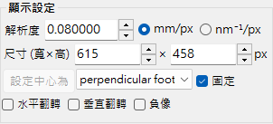

| 項目 | 說明 |
|------|-------------|
| **Resolution** | 單一像素的大小（mm）。它不必是實際的偵測器像素大小；它被視為顯示比例，並在以滑鼠縮放時自動更新。 |
| **Size (W×H)** | 繪圖區的像素寬度與高度。視您的顯示器解析度而定，過大的數值可能無法設定。 |
| **Set centre / Fix centre** | 將圖樣中心設為繪圖區中的任一像素，並於需要時將其固定。固定後，中心無法以滑鼠平移移動。 |
| **Horizontal flip / Vertical flip / Negative image** | 對顯示圖樣進行幾何翻轉（水平 / 垂直）與對比反轉。用以匹配實驗影像的方向或對比。 |
| **Reciprocal space** | 在圖樣上疊加厄瓦爾德球與倒易點陣向量，可視化哪些反射被激發。 |

### 偵測器（相機長度）

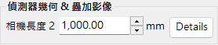

- **Camera length** ：試樣到偵測器的距離（mm）。
- **Details** ：開啟偵測器幾何設定視窗（見下方[偵測器幾何](#detector-geometry)）。

### Misc

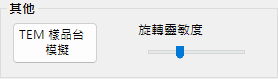

- **Rotation sensitivity** ：滑鼠每拖曳一像素的晶體旋轉量。
- **TEM holder simulation** ：開啟與試樣台連動的模擬視窗（見下文）。

---

## TEM holder 模擬 {#drawing-overlay-tabs}

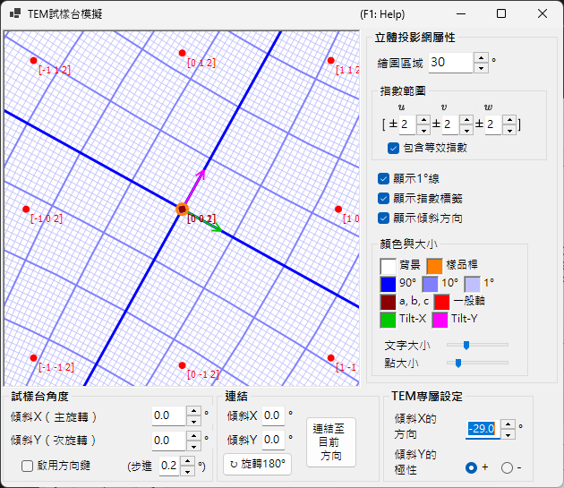

開啟一個將繞射圖樣與雙傾（或旋轉）**TEM holder** 連動的視窗。設定試樣台傾斜角會更新圖樣與晶體取向，且可達的取向可在極網上顯示（v4.914 新增）。在極網上左鍵雙擊會將試樣台傾斜設為該點，而勾選 **Arrow keys** 可讓方向鍵逐步調整傾斜。

---

## 繪圖疊加層索引標籤

### General

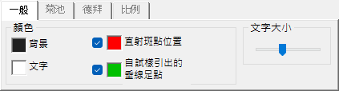

設定斑點、標籤、菊池線、德拜環及其他疊加層的顏色。此處的設定適用於所有繪製模式。

### 菊池線

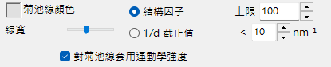

於工具列啟用菊池線時生效。

- **Reflection selection** ：選擇由哪些反射產生菊池線。可選 **structure factor**（依 $\lvert F_{hkl}\rvert$ 排序的前 *N* 個反射）或 **1/d cutoff**（所有 1/d 低於門檻 (nm⁻¹) 的反射）。
- **Line appearance** ：設定線寬、菊池線顏色，以及 **Draw with kinematical intensity**（依反射的運動學強度縮放線條深淺）。
- **Threshold** ：舊版參數。僅對 *d* 大於指定值的反射執行菊池線計算（為相容性而保留）。

### 德拜環

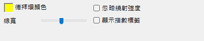

於工具列啟用德拜環時生效。

- **Ignore diffraction intensity** ：若勾選，所有德拜環以相同顏色與強度繪製（忽略晶體結構因子）。可用於純幾何比較。
- **Show index label** ：若勾選，(*hkl*) 會出現在每個環附近。

### Scale

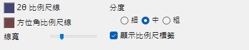

於工具列啟用刻度線時生效。

- **2θ / Azimuth scale lines** ：**2θ** 代表固定散射角（同心圓），**Azimuth** 代表固定方位角（自中心放射的徑向線）。兩者顏色可獨立設定。
- **Line width** ：刻度線的粗細。
- **Division** ：相鄰刻度線之間的角度間隔。
- **Show scale labels** ：是否在刻度線上繪製數值標籤。

### Misc {#diffraction-spot-information}

雜項設定，例如滑鼠旋轉靈敏度。

- **Mouse sensitivity** ：滑鼠每拖曳一像素的晶體旋轉量。

---

## 繞射斑點資訊

列出以布洛赫波法（Dynamical 計算）所算得的逐反射詳細資訊。以 **Spot Details** 按鈕（強度計算面板）或 **Details** 核取方塊開啟。

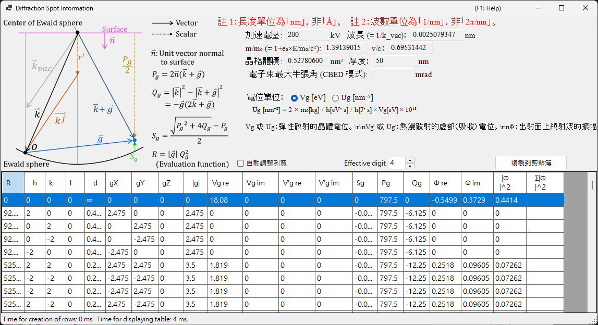

### 示意圖與定義

示意圖（左上）顯示厄瓦爾德球上的向量，並定義表中所用的量（$\hat{\mathbf{n}}$ 為試樣表面的單位法向量，$\mathbf{k}$ 為入射波向量，$\mathbf{g}$ 為倒易點陣向量）。

- $P_g = 2\,\hat{\mathbf{n}} \cdot (\mathbf{k} + \mathbf{g})$
- $Q_g = |\mathbf{k}|^2 - |\mathbf{k} + \mathbf{g}|^2 = -\mathbf{g} \cdot (2\mathbf{k} + \mathbf{g})$
- **偏離向量：** $S_g = \dfrac{\sqrt{P_g^2 + 4 Q_g} - P_g}{2}$
- **評估函式：** $R = |\mathbf{g}|\, Q_g^2$ ——依反射被激發的強弱排序（越小 = 越靠近厄瓦爾德球 = 激發越強；穿透束 $g=0$ 的 $R=0$ 並排在最前）。表格按 $R$ 遞增排序。

### 表格欄位

| 欄位 | 意義 |
|--------|---------|
| **R** | 評估函式 $R = \lvert\mathbf{g}\rvert\, Q_g^2$（如上；用於選取 / 排序反射） |
| **h, k, (i,) l** | 米勒指數（*i* 為冗餘的六方指數，僅對六方晶體顯示） |
| **d** | 晶面間距（nm） |
| **gX, gY, gZ** | 倒易點陣向量 *g* 的分量（1/nm） |
| **\|g\|** | *g* 的大小（1/nm） |
| **Vg re / Vg im** | 彈性散射的晶體位能傅立葉係數，$V_g$（實部 / 虛部） |
| **V'g re / V'g im** | 熱漫散射 (TDS) 的虛部（吸收）位能，$V'_g$（實部 / 虛部） |
| **Sg** | 偏離向量 $S_g$（如上；1/nm） |
| **Pg** | 輔助量 $P_g = 2\,\hat{\mathbf{n}}\cdot(\mathbf{k}+\mathbf{g})$（如上） |
| **Qg** | 輔助量 $Q_g = -\mathbf{g}\cdot(2\mathbf{k}+\mathbf{g})$（如上） |
| **Φ re / Φ im** | 出射面上動力學繞射波的複數振幅 $\Phi$（實部 / 虛部） |
| **\|Φ\|^2** | 該反射的繞射強度 $\lvert\Phi\rvert^2$ |
| **Σ\|Φ\|^2** | $\lvert\Phi\rvert^2$ 的累計和（對所有反射的總和；可作為強度守恆檢查） |

### 位能單位與其他控制項

- **Unit of potential** ：在 **Vg [eV]**（靜電位能，eV）與 **Ug [nm⁻²]**（進入布洛赫波方程式的縮放量 $U_g = (2 m_0/h^2)\, V_g$）之間切換所顯示的位能。欄位標題會隨之在 *Vg / V'g* 與 *Ug / U'g* 之間變換。
- 表格上方顯示加速電壓、波長（$\lambda = 1/k_\text{vac}$）、相對論質量比 $m/m_0$、速度比 $v/c$、點陣體積、試樣厚度，以及（在 CBED 模式下）電子束的最大半角。
- **Note 1：** 長度單位為 **nm**，非 Å。**Note 2：** 波數單位為 **1/nm**，非 2π/nm。
- **Effective digit** ：表格中顯示的有效位數。**Auto resize row width** ：自動調整欄寬。**Copy to clipboard** ：將表格匯出為可貼入試算表的文字。（即使在日文介面下，此表單仍以英文顯示。）

---

## 偵測器幾何 {#detector-geometry}

用於詳細設定偵測器幾何（相機長度、傾斜、旋轉）及疊加實驗影像的視窗。從 **Detector geometry** 面板中的 **Details** 開啟。

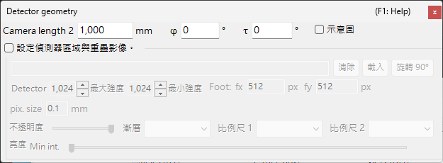

### 偵測器幾何設定

指定反射幾何，例如相機長度與偵測器傾斜（**Tau / Phi**）。對於 Back Laue（背反射勞厄），請在此設定將偵測器置於射源側的幾何。

### 偵測器區域與疊加影像

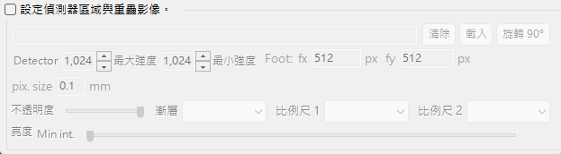

指定偵測器的有效區域，並拖放實驗影像以將其疊加。可用此將模擬圖樣與實驗影像疊加，並微調偵測器幾何。

座標系的定義另見[偵測器座標系](../appendix/a1-coordinate-system/2-diffraction.md)。

---

## 動態壓縮

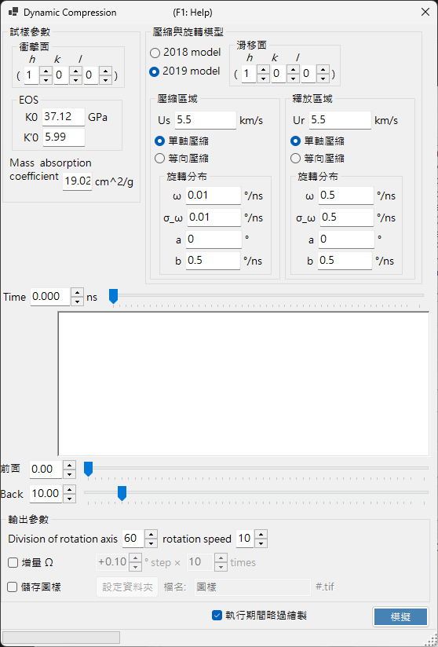

用於掃描高壓（動態壓縮）實驗壓力/時間曲線的視窗。將 `.txt` 壓力/時間曲線拖放到此視窗以載入，再拖曳圖中的紅線即可連續掃描時間（壓力），同時在繞射圖樣中反映對應的狀態。

---

## 相關主題

- [X 光繞射模擬](4-x-ray-neutron-diffraction.md)
- [SAED 模擬](1-saed-simulation.md)
- [PED 模擬](2-ped-simulation.md)
- [CBED 模擬](3-cbed-simulation.md)
- [動力學計算（共用核心）](../appendix/a3-bloch-wave/calculation.md)
- [偵測器座標系](../appendix/a1-coordinate-system/2-diffraction.md)
