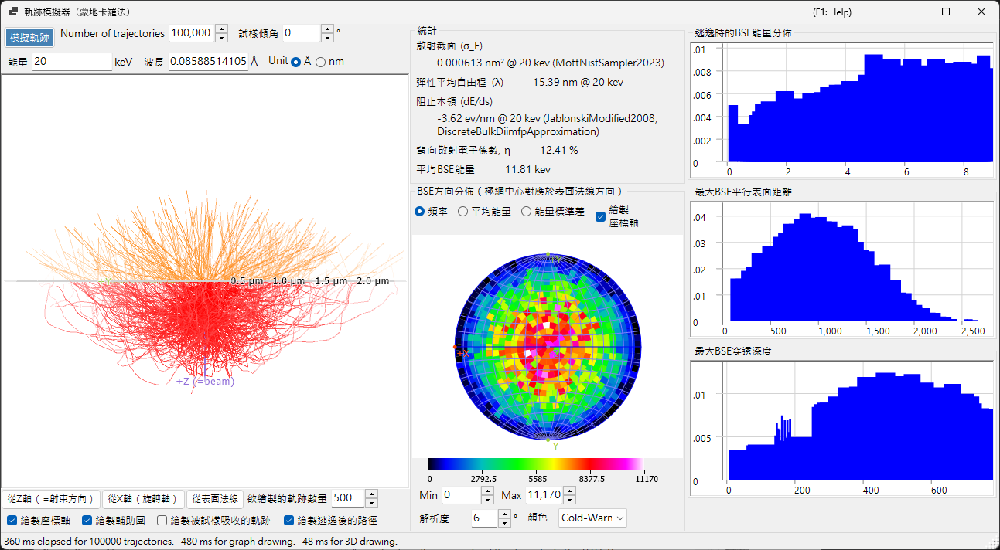
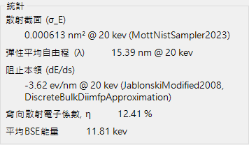
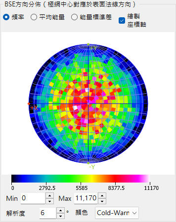
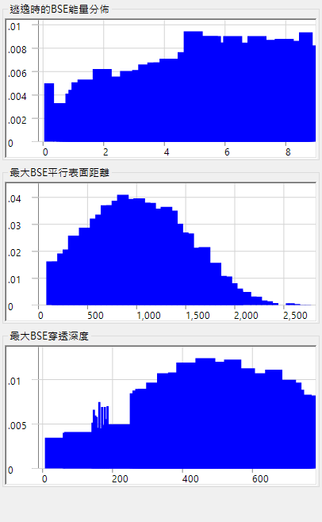

# 電子軌跡

**Trajectory Simulator** 以**蒙地卡羅法**計算試樣內部的電子軌跡：入射電子會發生彈性與非彈性散射，並累積由此產生的背向散射電子分布（方向、能量、穿透深度）。這些分布也提供 [12. EBSD 模擬](12-ebsd-simulation.md)所使用的角度／能量／深度加權。

---

## 鍵盤與滑鼠快速鍵

軌跡顯示於 3-D OpenGL 檢視中。它使用 ReciPro 標準的[檢視導覽](21-shortcuts.md)，但**平移已停用** — 請使用檢視預設按鈕跳至標準方位。

| 快速鍵 | 動作 |
|----------|--------|
| <kbd>F1</kbd> | 開啟線上手冊的本頁 |
| 左鍵拖曳 | 旋轉模型 |
| 右鍵向上／向下拖曳，或滑鼠滾輪 | 縮放 |
| <kbd>CTRL</kbd> + 右鍵雙擊 | 切換正交／透視投影 |

→ 請參閱 **[21. 鍵盤與滑鼠快速鍵](21-shortcuts.md)**，一覽所有視窗。

---

## 計算條件

電子束能量、入射電子數、試樣／材料，以及其他蒙地卡羅參數（請見上方的概覽截圖）。

### 電子束能量

入射電子束的加速電壓（keV）。設定彈性（Mott）與非彈性（介電響應）散射模型所使用的動能。

### 入射電子數

要模擬的電子數量。電子數越多可降低統計雜訊，但會使執行時間呈線性增加。

### 試樣／材料

試樣的組成與密度。預設為主視窗中目前所選的晶體，但可針對純軌跡研究加以覆寫。

### 試樣傾斜

試樣傾斜角。當軌跡資料提供給 [EBSD 模擬器](12-ebsd-simulation.md)時使用（EBSD 通常為 70°）。

### 截面模型

彈性散射截面模型（Mott / Bethe / NIST）。不同模型在大傾斜角或接近吸收邊時，以速度換取準確度。

---

## 極網選項

繪製於立體投影上之角度分布的顯示選項（請見上方的概覽截圖）。

### 投影方法

**Wulff**（等角）或 **Schmidt**（等面積）投影。讀取統計密度時通常偏好使用 Schmidt。

### 半球

繪製上方（背向散射）或下方（穿透）半球。

### 解析度／色階

角度直方圖的分組寬度，以及密度顯示所使用的色彩對應。

---

## 統計

執行結果的摘要。

- **背向散射產率** — 由入射面射出的入射電子比例。
- **平均自由程** — 散射事件之間的平均距離。
- **平均穿透深度** — 電子在射出或被吸收之前所達到的平均最大深度。
- **經過時間／處理量** — 該次執行的實際時間成本。

---

## BSE 方向分布

背向散射電子的角度分布（極網中心對應於表面法線方向）。黃色／橙色輪廓（若存在）標示 EBSD 偵測器所涵蓋的區域。

---

## 剖面圖

所模擬電子的深度與能量剖面圖。

### 深度剖面圖

背向散射電子最終射出深度（nm）的直方圖。EBSD 模擬器用此對 master pattern 的深度積分加權。

### 能量剖面圖

背向散射電子能量損失 ΔE（keV）的直方圖。EBSD 模擬器用此對能量積分加權。

---

## 另請參閱

- [EBSD 模擬](12-ebsd-simulation.md)
- [EBSD 計算](appendix/a3-bloch-wave/ebsd.md)
- [動力學繞射（布洛赫波）](appendix/a3-bloch-wave/index.md)
- [HRTEM/STEM 模擬器](9-hrtem-stem-simulator/index.md)
- [繞射模擬器](7-diffraction-simulator/index.md)
