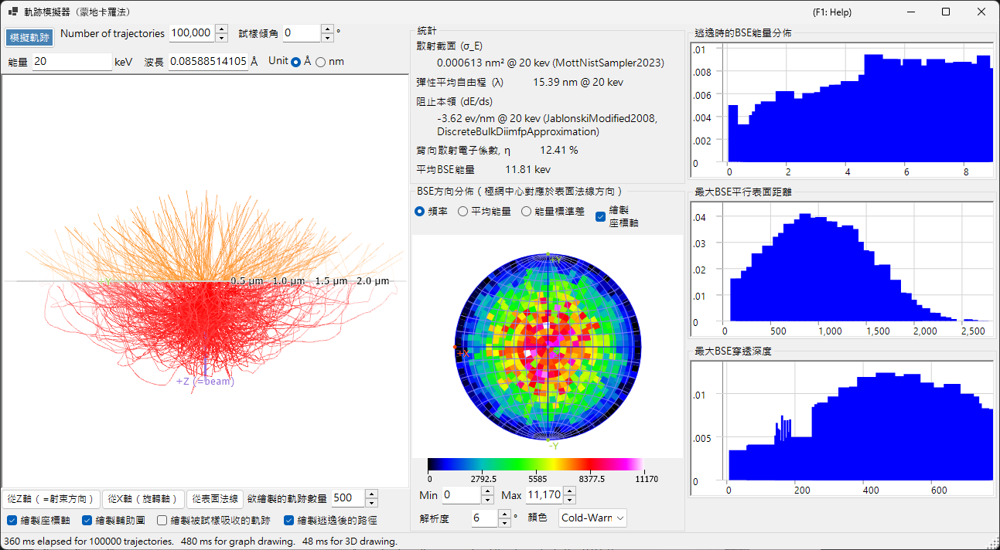
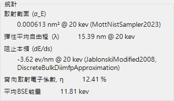
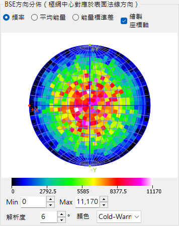
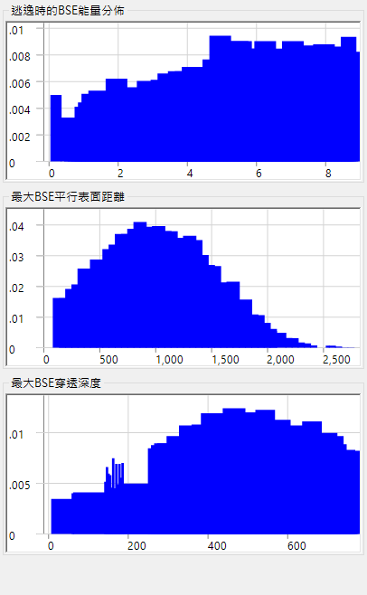

# 電子軌跡

**軌跡模擬器（蒙地卡羅法）** 以**蒙地卡羅法**計算試樣內部的電子軌跡：入射電子會發生彈性與非彈性散射，並累積由此產生的背向散射電子（BSE）分布——方向、逃逸時的能量、穿透深度與側向擴展。這些分布也提供 [12. EBSD 模擬](12-ebsd-simulation.md)所使用的角度／能量／深度加權。

視窗分為三欄：左側為 **3-D 軌跡檢視**，中間為 **統計** 與 **BSE 方向分佈** 極網，右側為三個 **直方圖**。試樣的組成與密度取自主視窗中所選的晶體；此處只需設定電子束能量、試樣傾角與軌跡數量。

---

## 鍵盤與滑鼠快速鍵

軌跡顯示於 3-D OpenGL 檢視中。它使用 ReciPro 標準的[檢視導覽](21-shortcuts.md)，但**平移已停用** — 請使用檢視預設按鈕跳至標準方位。

| 快速鍵 | 動作 |
|----------|--------|
| <kbd>F1</kbd> | 開啟線上手冊的本頁 |
| 左鍵拖曳 | 旋轉模型 |
| 右鍵向上／向下拖曳，或滑鼠滾輪 | 縮放 |
| <kbd>CTRL</kbd> + 右鍵雙擊 | 切換正交／透視投影 |

→ 請參閱 **[21. 鍵盤與滑鼠快速鍵](21-shortcuts.md)**，一覽所有視窗。

---

## 計算條件

視窗上方的控制項用來設定計算：

- **模擬軌跡** ：開始蒙地卡羅計算。下方的狀態列會分別顯示軌跡計算、圖表繪製與 3-D 繪製所花費的時間。
- **Number of trajectories** ：要追蹤的入射電子數量。電子數越多，下列各分布的統計雜訊越低，但執行時間會隨之線性增加。
- **試樣傾角** (°) ：試樣表面繞 *X* 軸的傾斜角。垂直入射時保持為 0；若要重現 [EBSD 模擬器](12-ebsd-simulation.md)的幾何配置，請設為 **−70°**，大傾角可提高背向散射產率。
- **Energy** (keV) / **Wavelength** / **Unit** ：入射電子束的加速電壓，以及與之連動、經相對論修正的電子波長。此能量即彈性（NIST Mott）與非彈性（阻止本領／IMFP）兩種模型所使用的動能。

散射模型本身無法由使用者選擇：彈性散射截面取自內建的 NIST Mott 表（超出其適用範圍時退回屏蔽 Rutherford 模型），阻止本領則採用修正的 Jablonski (2008) 形式。實際使用的模型會標示在 **統計** 中各數值的旁邊。這些模型的內容請參閱[衰減與傳輸](appendix/a2-beam-interaction/attenuation-transport.md)。

### 3-D 軌跡檢視

紅色軌跡為在試樣內被吸收的電子，橙色軌跡為以背向散射電子形式逃逸的電子。同心輔助圓以 nm（或 µm）標示，**+X**、**+Y**、**+Z (=beam)** 標示座標軸。

- **從Z軸（=射束方向）** / **從X軸（旋轉軸）** / **從表面法線** ：將檢視切換至標準方向。
- **欲繪製的軌跡數量** ：要繪製多少條已計算的軌跡（若將 100,000 條全部繪出，既難以辨識又緩慢）。
- **繪製座標軸** / **繪製輔助圓** ：座標軸箭頭與距離刻度。
- **繪製被試樣吸收的軌跡** ：一併繪製始終未逃逸的電子。
- **繪製逃逸後的路徑** ：背向散射電子離開表面後，繼續繪製其路徑。

---

## 統計

目前電子束能量下的數值，括號內標示產生各數值的模型。

- **散射截面 (σ_E)** (nm²) — 每個原子的總彈性散射截面。
- **彈性平均自由程 (λ)** (nm) — 彈性散射事件之間的平均距離。
- **阻止本領 (dE/ds)** (eV/nm，負值) — 每單位路徑長度損失的能量。
- **背向散射電子係數, η** (%) — 入射電子中再次由入射面離開的比例。BSE 影像的對比即以此量為基礎。
- **平均BSE能量** (keV) — 背向散射電子在逃逸瞬間的平均能量。

---

## BSE 方向分佈

背向散射電子的角度分布，繪製於以表面法線方向為中心的極網上。

- **頻率** / **平均能量** / **能量標準差** ：以顏色表示的量——各方向逃逸的電子數量、其平均能量，或該能量的離散程度。
- **繪製** ：疊加顯示 +X / ±Y / ±Z 方向。
- **Min** / **Max**、**Resolution**、**Color** ：色階的上下限、直方圖的角度分組寬度，以及色彩對應。

---

## 直方圖

背向散射電子的三種分布，皆已正規化為單位面積。

### 逃逸時的BSE能量分佈

背向散射電子**離開試樣時仍保有的能量**（keV）的直方圖——而非其能量損失。EBSD 模擬器用此對 master pattern 的能量積分加權。

### 最大BSE平行表面距離

各背向散射電子在逃逸前**側向**（平行於表面，nm）移動距離的直方圖。它代表交互作用體積的側向尺寸，因此也是 BSE 或 EBSD 量測本質上的空間解析度極限。

### 最大BSE穿透深度

各背向散射電子在逃逸前於**垂直表面方向**所達到的最大深度（nm）的直方圖。EBSD 模擬器用此對 master pattern 的深度積分加權。

---

## 另請參閱

- [EBSD 模擬](12-ebsd-simulation.md)
- [EBSD 計算](appendix/a3-bloch-wave/ebsd.md)
- [衰減與傳輸](appendix/a2-beam-interaction/attenuation-transport.md) — 本頁所用的彈性散射截面、阻止本領與射程。
- [動力學繞射（布洛赫波）](appendix/a3-bloch-wave/index.md)
- [HRTEM/STEM 模擬器](9-hrtem-stem-simulator/index.md)
- [繞射模擬器](7-diffraction-simulator/index.md)
