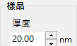
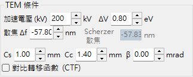
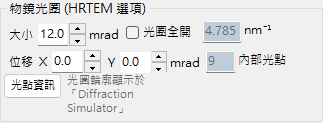
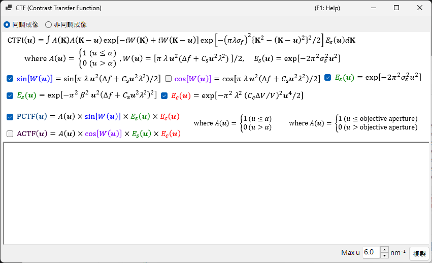
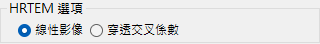
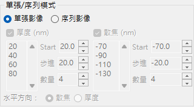
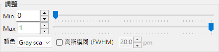

# HRTEM 模擬

模擬高解析度 TEM 晶格條紋影像。這是 [HRTEM/STEM 模擬器](index.md) 的主要模式。

---

## 計算流程

1. **布洛赫波法**：計算電子波在晶體位能中的傳播；求得出射波的振幅與相位
2. **透鏡函式**：套用物鏡像差（球面像差 $C_s$、欠焦 $\Delta f$）
3. **部分同調**：考量有限的光源尺寸（空間同調）與能量寬度（時間同調）
4. **成像**：計算強度 $|\psi(\mathbf{r})|^2$

---

## 試樣參數

| 參數 | 說明 |
|-----------|-------------|
| **Thickness** | 試樣厚度（nm）。HRTEM 影像強烈依賴於試樣厚度 |

---

## 光學參數

### TEM 條件

| 參數 | 說明 |
|-----------|-------------|
| **Acc. Vol.** | 加速電壓（kV）。相對論修正後的波長顯示於旁 |
| **Defocus** | 欠焦值（nm）。Scherzer 欠焦顯示為參考值 |

### 固有參數

| 參數 | 說明 | 典型值 |
|-----------|-------------|---------|
| **Cs** | 球面像差（mm） | 0.5–1.0（傳統）；< 0.01（Cs 校正） |
| **Cc** | 色像差（mm） | 1.0–2.0 |
| **β** | 照明半角（mrad） | 0.1–1.0 |
| **ΔE** | 能量寬度 1/*e* 寬度（eV） | 0.5–2.0 |

---

## 相位對比轉移函式 (PCTF)

顯示於透鏡函式索引標籤中：

- $\sin\chi(u)$：相位對比轉移函式（$\chi(u)$ 為透鏡像差函式）
- $E_\text{s}(u)$：空間同調包絡
- $E_\text{c}(u)$：時間同調包絡

Scherzer 欠焦：$\Delta f = -\sqrt{\tfrac{4}{3}\,C_s \lambda}\ (\approx -1.155\,\sqrt{C_s \lambda})$，此條件給出寬闊的負 PCTF 帶（暗對比 = 原子位置）。ReciPro 採用此原始 Scherzer 值——透過將像差相位 $\chi$ 的最小值設為 $-2\pi/3$ 推導而得——GUI 中顯示的值即遵循此公式；某些文獻則改用 *延伸 Scherzer* 值 $-1.2\sqrt{C_s\lambda}$。

---

## 物鏡光闌

設定光闌尺寸（mrad）與位置。**Open aperture** 會將其移除。所考量的布洛赫波數目取決於光闌條件。

---

## 部分同調模型

| 模型 | 說明 |
|-------|-------------|
| **Quasi-coherent (linear image)** | 快速。在弱相位近似下有效 |
| **TCC (Transmission Cross Coefficient)** | 較準確；計算時間較長 |

---

## 模擬模式

| 模式 | 說明 |
|------|-------------|
| **Single image** | 在目前厚度與欠焦下產生單張影像 |
| **Serial image** | 在厚度 × 欠焦範圍上的影像矩陣（Start / Step / Num） |

---

## 影像調整

| 設定 | 說明 |
|---------|-------------|
| **Min / Max** | 顯示範圍（影像調整滑桿） |
| **Colour** | 灰階或 Cold-Warm |
| **Gaussian blur (FWHM)** | 套用高斯濾波 |
| **Unit cell** | 疊加晶胞格線 |
| **Scale** | 顯示比例尺 |

---

## 另請參閱

- [HRTEM/STEM 模擬器（概觀）](index.md)
- [STEM 模擬](2-stem-simulation.md)
- [位能模擬](3-potential-simulation.md)
- [附錄 A3.2 — HRTEM 成像](../appendix/a3-bloch-wave/hrtem.md)
